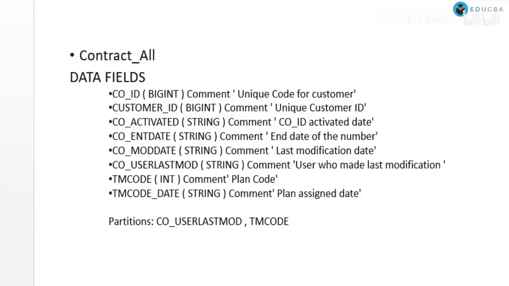
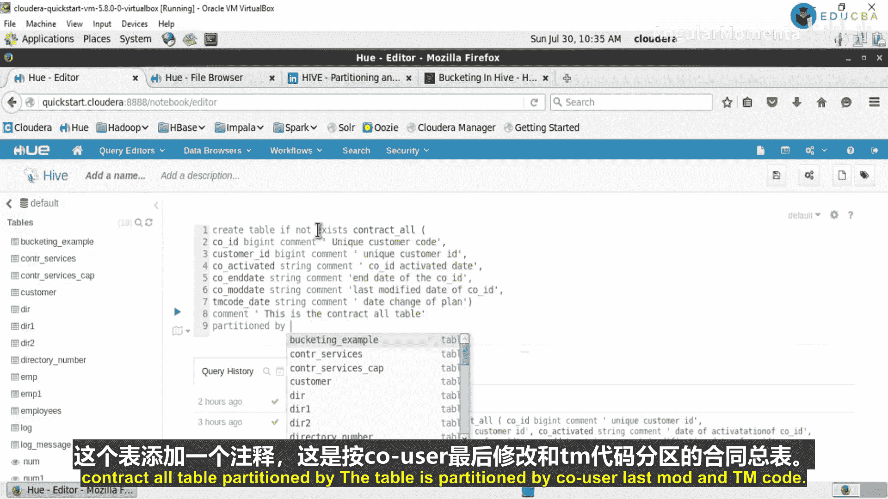
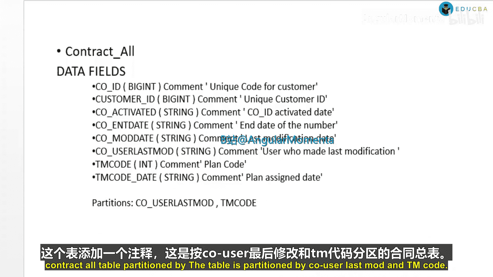
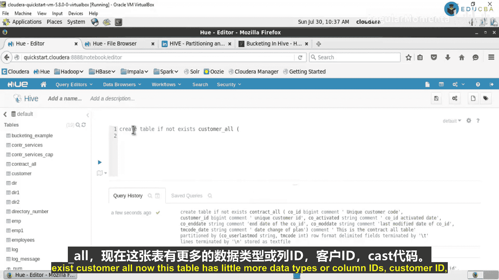
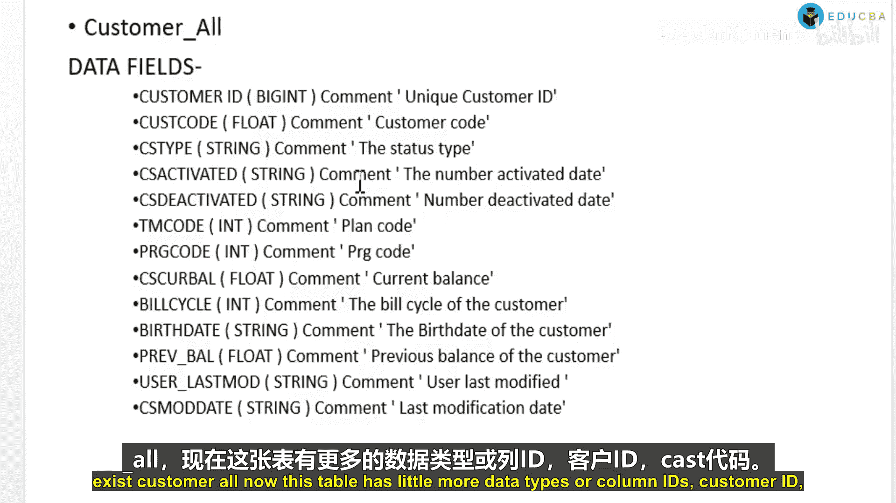
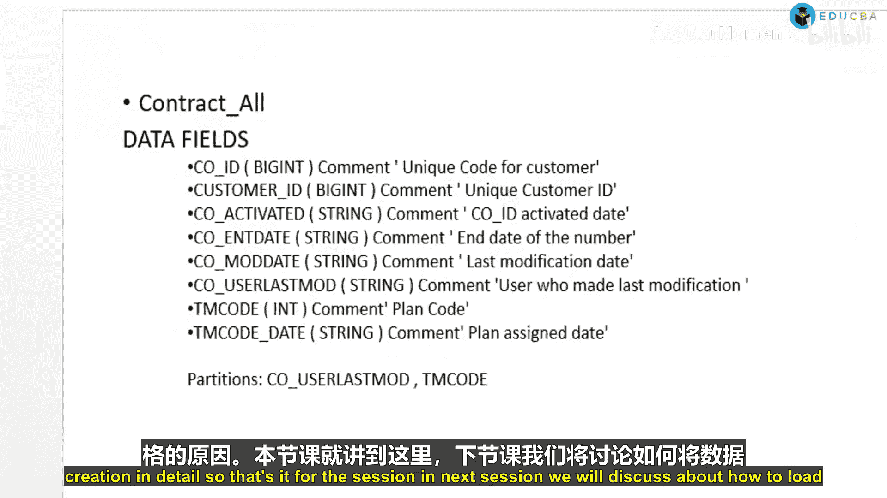
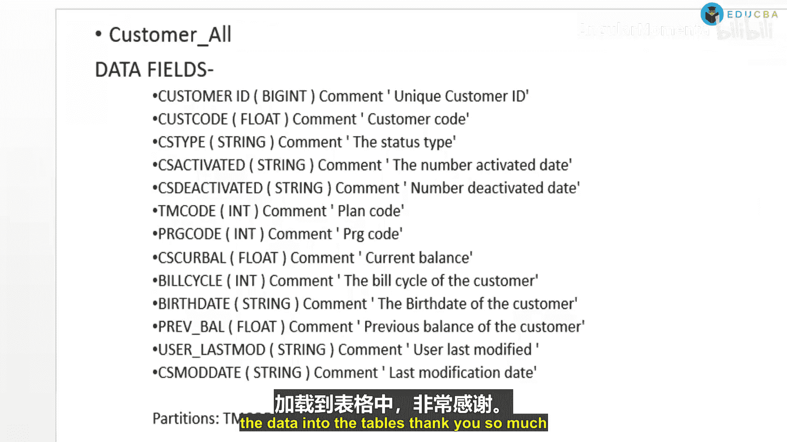

# 005：创建合同全表与客户角色表 📊



在本节课中，我们将学习如何在Hive中创建两个核心数据表：`contract_all`（合同全表）和`customer_role`（客户角色表）。我们将详细讲解每个表的列定义、数据类型、注释以及分区策略。

---

## 创建合同全表 (contract_all)

首先，我们来创建 `contract_all` 表。该表用于存储所有合同的核心信息。





以下是创建该表的完整HiveQL语句：

```sql
CREATE TABLE IF NOT EXISTS contract_all (
    Kaiude BIGINT COMMENT '唯一的客户报价标识',
    Customer_ID BIGINT COMMENT '唯一的客户标识',
    Coactivated STRING COMMENT '合同激活日期',
    Dead STRING COMMENT '合同失效日期',
    Mad STRING COMMENT '合同最后修改日期',
    team_code_date STRING COMMENT '团队代码变更日期'
)
COMMENT '合同总表'
PARTITIONED BY (Co_user_last_mo STRING, TM_code INT)
ROW FORMAT DELIMITED
FIELDS TERMINATED BY '\t'
LINES TERMINATED BY '\n'
STORED AS TEXTFILE;
```



**核心概念解析：**
*   **`PARTITIONED BY`**: 此语句用于对表进行分区。分区可以将表数据按指定列（如 `Co_user_last_mo` 和 `TM_code`）的值物理分割到不同的目录中，能显著提升针对分区列的查询效率。
*   **`ROW FORMAT`**: 定义了数据文件中行和字段的格式。这里指定字段由制表符(`\t`)分隔，行由换行符(`\n`)终止。
*   **`STORED AS TEXTFILE`**: 指定表的数据以纯文本格式存储。



---

## 创建客户角色表 (customer_role)

上一节我们创建了合同总表，本节中我们来看看如何创建 `customer_role` 表。此表用于存储客户级别的详细信息。

以下是创建该表的HiveQL语句：

```sql
CREATE TABLE IF NOT EXISTS customer_role (
    Customer_ID BIGINT COMMENT '唯一的客户标识',
    Cast_code FLOAT COMMENT '客户等级代码',
    Css_activated STRING COMMENT '客户代码激活日期',
    Sius_D_active STRING COMMENT '客户代码失效日期',
    Ss_girl_bell FLOAT COMMENT '客户当前余额',
    Bill_Cy INT COMMENT '客户账单周期编号',
    birth_date STRING COMMENT '客户出生日期',
    Previous_balance FLOAT COMMENT '客户先前余额',
    User_last_mode STRING COMMENT '用户最后模式',
    C_is_more_date STRING COMMENT '最后修改日期'
)
COMMENT '客户角色信息表'
PARTITIONED BY (Tm_code INT, PRG_code INT)
ROW FORMAT DELIMITED
FIELDS TERMINATED BY '\t'
LINES TERMINATED BY '\n'
STORED AS TEXTFILE;
```

**表结构说明：**
以下是该表各列及其含义的详细列表：

*   **`Customer_ID`**: 客户唯一标识。
*   **`Cast_code`**: 表示客户等级或类型的代码。
*   **`Css_activated`**: 记录客户代码激活的日期。
*   **`Sius_D_active`**: 记录客户代码失效的日期。
*   **`Ss_girl_bell`**: 显示客户账户的当前余额。
*   **`Bill_Cy`**: 指示客户的账单周期编号。
*   **`birth_date`**: 客户的出生日期。
*   **`Previous_balance`**: 客户先前的账户余额。
*   **`User_last_mode`**: 用户最后使用的模式或状态。
*   **`C_is_more_date`**: 该条记录的最后修改日期。

---

## 总结与回顾 ✅


本节课中，我们一起学习了在Hive中创建数据表的详细过程。我们成功创建了两个表：`contract_all` 和 `customer_role`。关键点包括：
1.  使用 `CREATE TABLE` 语句定义表结构，并为每个列指定了合适的数据类型（如 `BIGINT`, `STRING`, `FLOAT`, `INT`）和描述性注释。
2.  理解了 **分区(`PARTITIONED BY`)** 的概念及其在优化查询性能中的作用。
3.  掌握了如何通过 `ROW FORMAT` 和 `STORED AS` 子句指定数据的存储格式。





详细了解每个列的含义对于后续在表上高效、准确地执行查询至关重要。在下一节课中，我们将讨论如何将数据加载到这些已创建的表中。