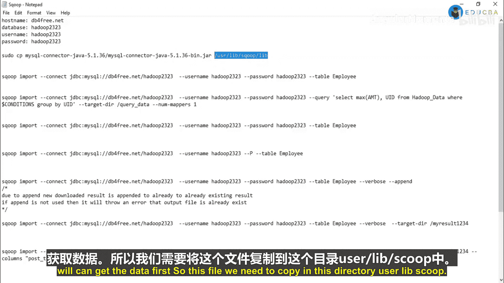
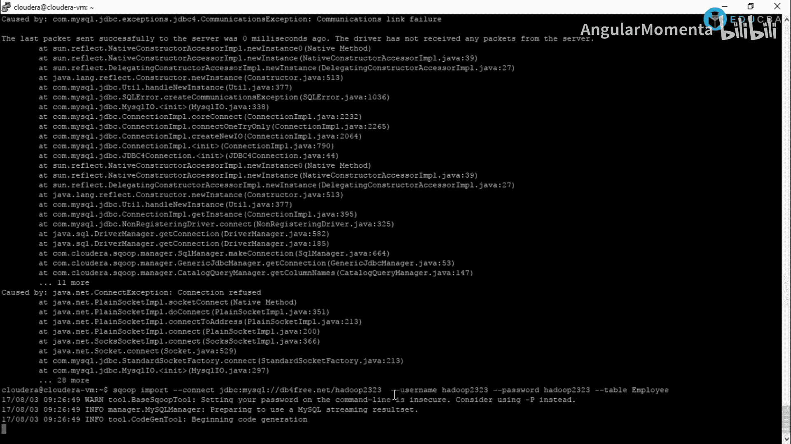
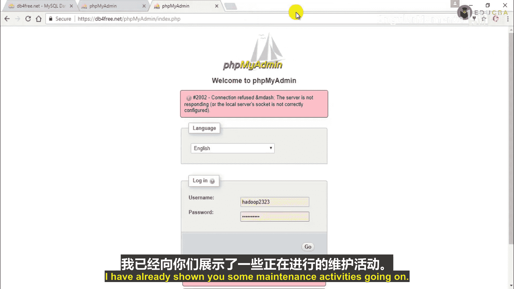
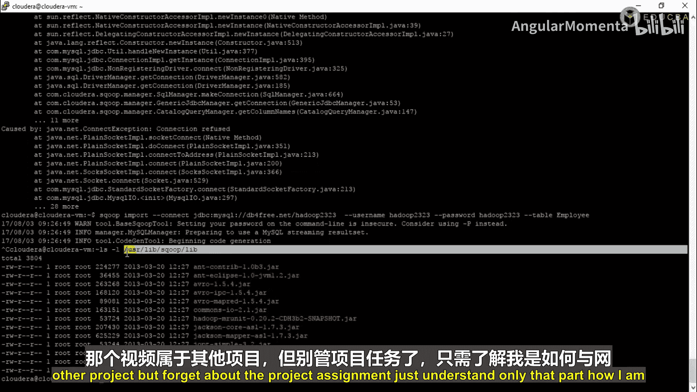
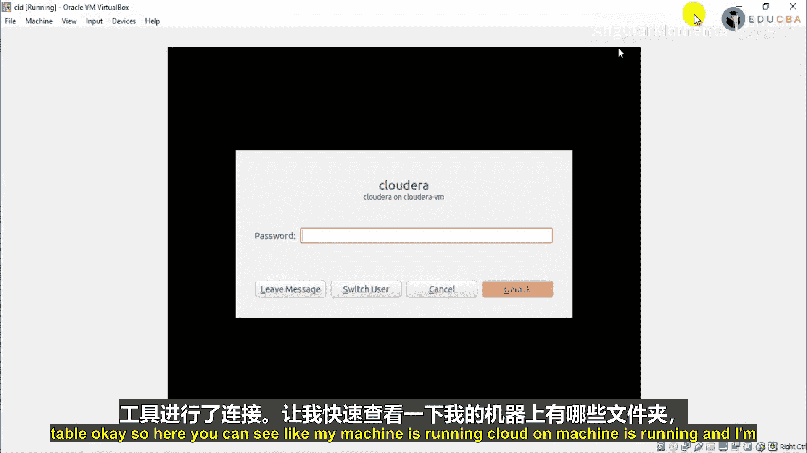
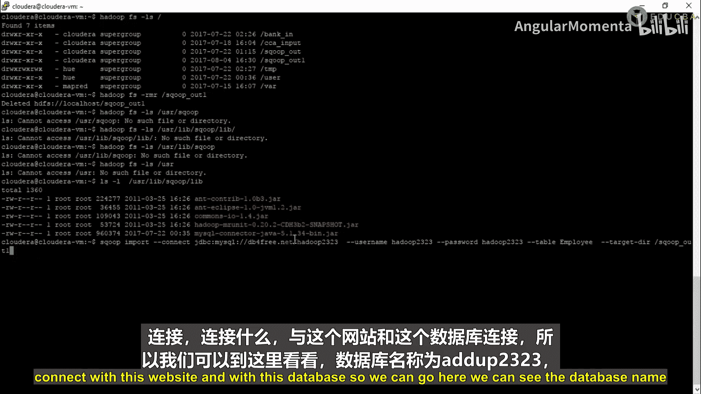
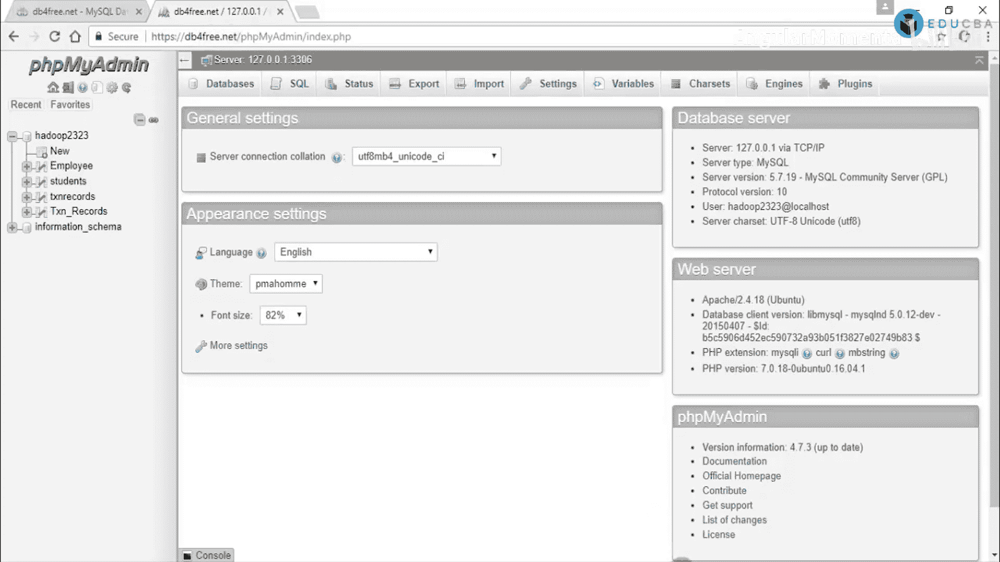
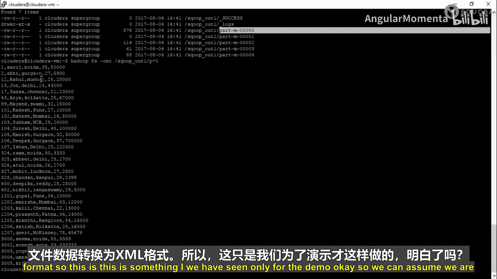
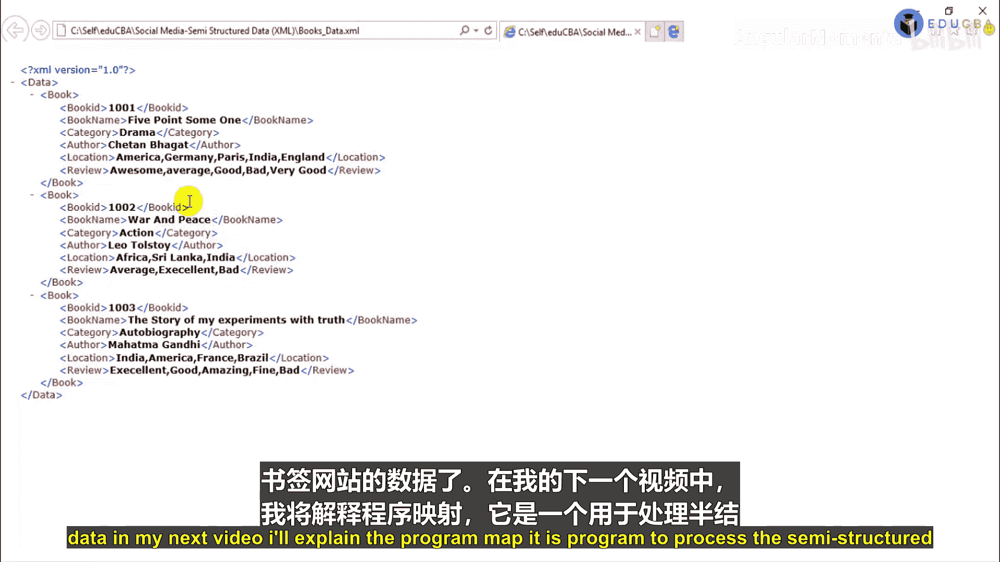

# 006：社交媒体产业导论 🎯

在本节课中，我们将学习如何分析社交媒体产业中的书签网站数据。我们将使用Hadoop生态系统中的工具（如Sqoop、MapReduce、Pig和Hive）来处理和分析半结构化的XML数据，以评估书籍在市场上的表现。

---

## 场景与数据介绍

上一节我们介绍了课程的整体目标，本节中我们来看看具体的业务场景和数据格式。

我们面临一个业务场景：一个第三方公司收集了书签网站的数据，并将其存储在关系型数据库管理系统（RDBMS）中。这些数据包含书籍ID、名称、评论、链接、评论内容等信息。

我们的任务是分析这些书签网站的数据。通过分析用户对书籍的评论（如“优秀”、“一般”、“差”），我们可以评估某本书在市场上的表现，例如销量、用户喜好程度以及正面/负面评论的比例。

输入数据最初通过Sqoop从RDBMS导入到Hadoop分布式文件系统（HDFS）。但为了本课程演示，我们假设数据已被某个第三方ETL工具或Java程序转换为XML格式。因此，我们的起点是一个XML文件。

以下是输入XML文件的结构示例：
```xml
<data>
    <book>
        <bookid>1001</bookid>
        <bookname>Five Point Someone</bookname>
        <category>Drama</category>
        <author>Chetan Bhagat</author>
        <location>America</location>
        <reviewcomment>Awesome</reviewcomment>
    </book>
    <book>
        <bookid>1002</bookid>
        <bookname>War and Peace</bookname>
        <category>Action</category>
        <author>Leo Tolstoy</author>
        <location>Africa</location>
        <reviewcomment>Average</reviewcomment>
    </book>
</data>
```
数据包含多个字段，如书籍ID、名称、类别、作者、用户所在地和评论。我们的目标是处理这个XML文件，并根据评论内容（如“Awesome”视为正面，“Bad”视为负面）进行情感分析。

---

## 技术栈概览

在深入处理数据之前，我们先简要了解一下本课程将要用到的核心大数据工具。

*   **Sqoop**：这是一个在HDFS和关系型数据库（如MySQL、Oracle）之间传输数据的工具。它就像一个桥梁。在本课程中，我们将首先使用Sqoop将数据从RDBMS导入HDFS。
*   **MapReduce**：这是Hadoop的核心编程模型，用于大规模数据集的并行处理。一个MapReduce程序通常包含三个类：
    *   `Mapper`类：读取并处理输入数据。
    *   `Reducer`类：对`Mapper`的输出进行聚合（如求和、计数）。
    *   `Driver`类：主类，用于配置和提交作业。
*   **Pig**：这是一个基于MapReduce的高级数据流语言。它提供了更简单的脚本来表达复杂的数据转换，而无需编写冗长的Java代码。Pig适用于数据清洗和转换。
*   **Hive**：这是一个构建在Hadoop之上的数据仓库工具，它提供了类似SQL的查询语言（HiveQL）。Hive适用于数据分析和报告生成，但不适合频繁的更新/删除操作。

简单来说，**Sqoop**用于数据迁移，**MapReduce**和**Pig**用于数据处理，而**Hive**用于数据分析。

---

## 第一步：使用Sqoop导入数据

了解了工具后，我们开始第一步：将数据从数据库导入HDFS。虽然我们的最终输入是XML文件，但这一步演示了数据如何从传统系统进入Hadoop环境。

我们将使用一个在线的MySQL数据库（db4free.net）进行演示。您也可以使用本地安装的数据库。

以下是使用Sqoop从MySQL数据库导入`employee`表数据到HDFS的步骤：



1.  **准备JDBC驱动**：将MySQL的JDBC驱动JAR包（例如 `mysql-connector-java-8.0.23.jar`）复制到Sqoop的`lib`目录下。
2.  **执行Sqoop导入命令**：在终端中运行以下命令。
```bash
sqoop import \
--connect jdbc:mysql://db4free.net/hadoop2323 \
--username hadoop2323 \
--password hadoop2323 \
--table employee \
--target-dir /user/scoopout1 \
-m 1
```
**命令参数解释**：
*   `--connect`：指定数据库连接字符串。
*   `--username` 和 `--password`：数据库登录凭据。
*   `--table`：要导入的表名。
*   `--target-dir`：HDFS上的目标目录，用于存储导入的数据。
*   `-m 1`：使用1个Map任务来执行导入。





3.  **验证结果**：命令执行成功后，您可以在HDFS的`/user/scoopout1`目录下找到导入的数据文件，文件内容为纯文本格式。



**重要提示**：在本课程的实际案例中，我们假设这个从数据库导出的纯文本文件，随后被一个第三方流程转换成了我们即将处理的XML格式。因此，Sqoop步骤是数据流水线的起点。



---





## 课程总结与下一步

本节课中我们一起学习了社交媒体数据分析项目的背景、目标数据（XML格式）以及我们将要使用的核心大数据工具（Sqoop, MapReduce, Pig, Hive）。

我们特别演示了如何使用**Sqoop**将数据从关系型数据库（MySQL）迁移到HDFS中，这是大数据处理流程中常见的初始步骤。





在接下来的课程中，我们将直接面对核心挑战：**处理半结构化的XML输入文件**。我们将编写一个自定义的MapReduce程序，将这个XML文件解析并转换为结构化的纯文本格式，为后续使用Pig或Hive进行书籍评论分析做好准备。