# 007：执行MapReduce程序处理XML文件 📊

在本节课中，我们将学习如何将编写好的MapReduce程序打包成JAR文件，并在Hadoop集群上执行，以处理XML格式的数据。我们将从导出JAR文件开始，逐步完成在Hadoop环境中的部署、执行和结果验证。

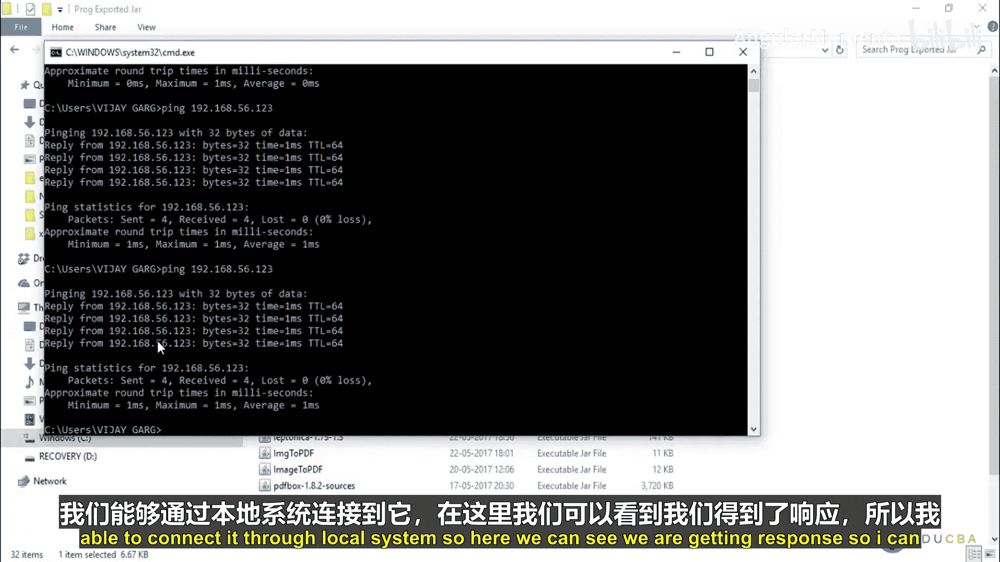

## 概述

在之前的课程中，我们编写了用于处理XML数据的自定义输入格式和MapReduce程序。本节我们将实际操作，完成以下步骤：
1.  将项目导出为JAR文件。
2.  将JAR文件和输入数据上传到Hadoop集群。
3.  在Hadoop上执行MapReduce作业。
4.  检查并获取输出结果。

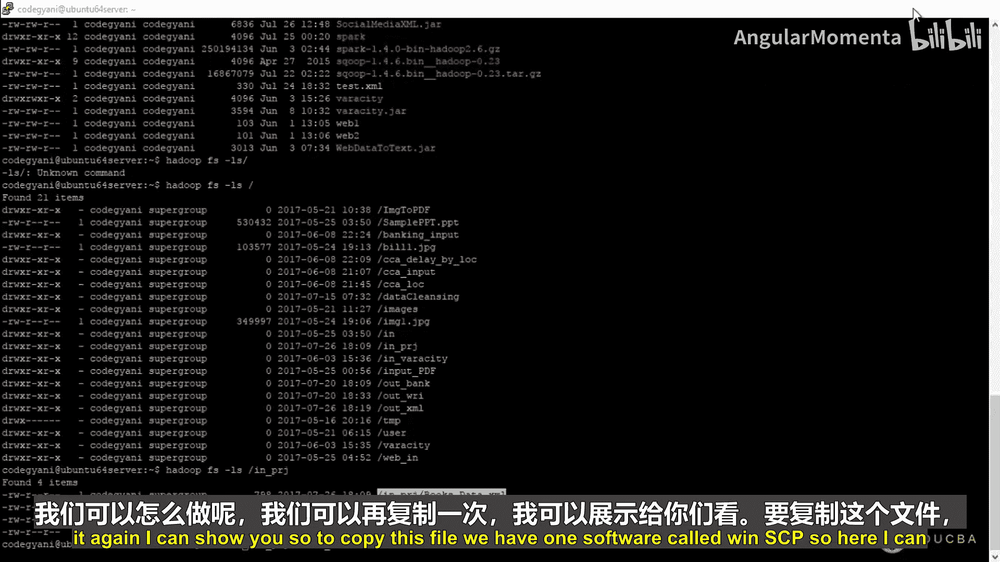

---

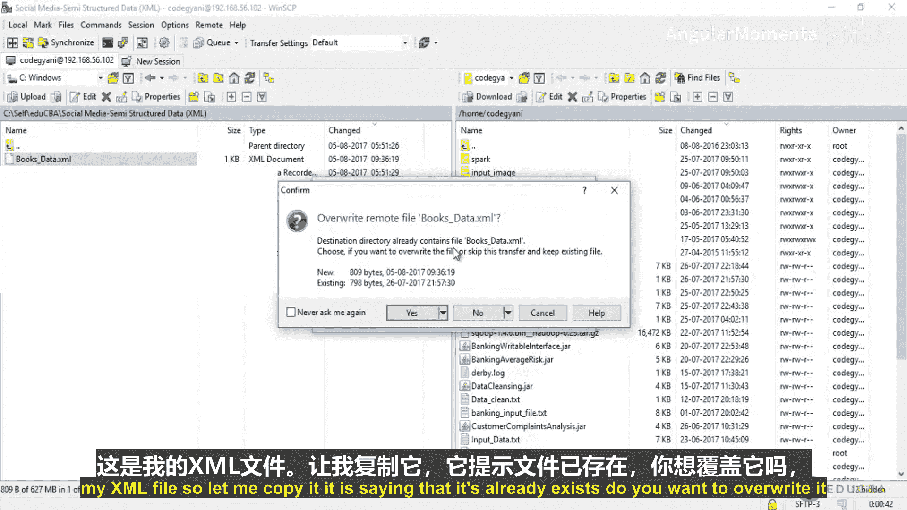

## 导出JAR文件

上一节我们介绍了自定义输入格式的代码，本节中我们来看看如何将其打包以便在Hadoop上运行。

首先，需要将Eclipse中的项目导出为可执行的JAR文件。

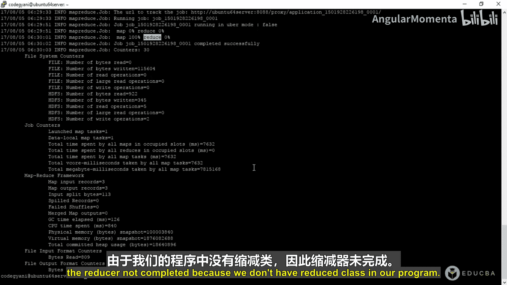

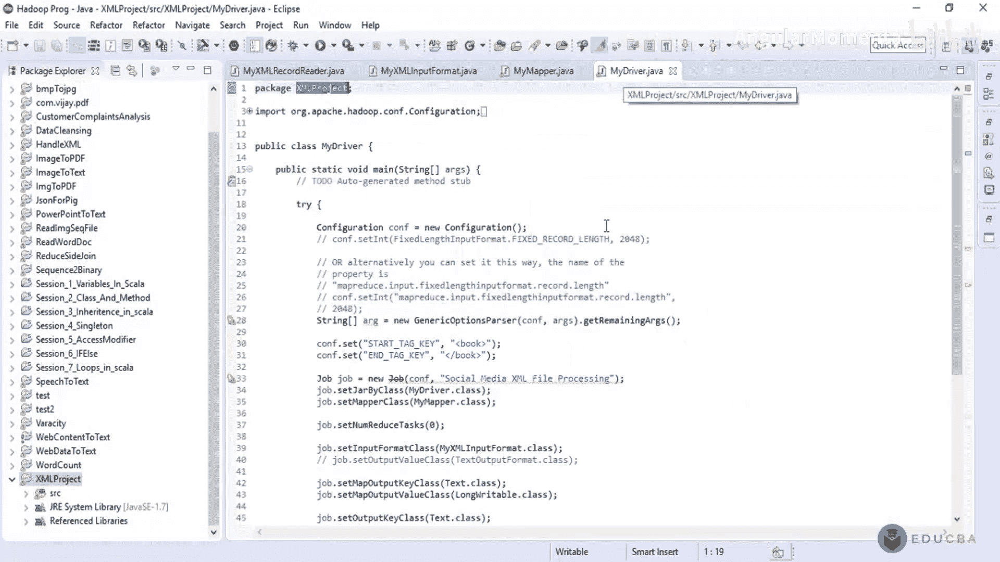

以下是导出JAR文件的步骤：
1.  在Eclipse中，右键点击项目名称。
2.  选择 `Export` 选项。
3.  在导出窗口中，选择 `Java` -> `JAR file`，然后点击 `Next`。
4.  为JAR文件命名，例如 `social_media_xml.jar`。
5.  点击 `Finish` 完成导出。

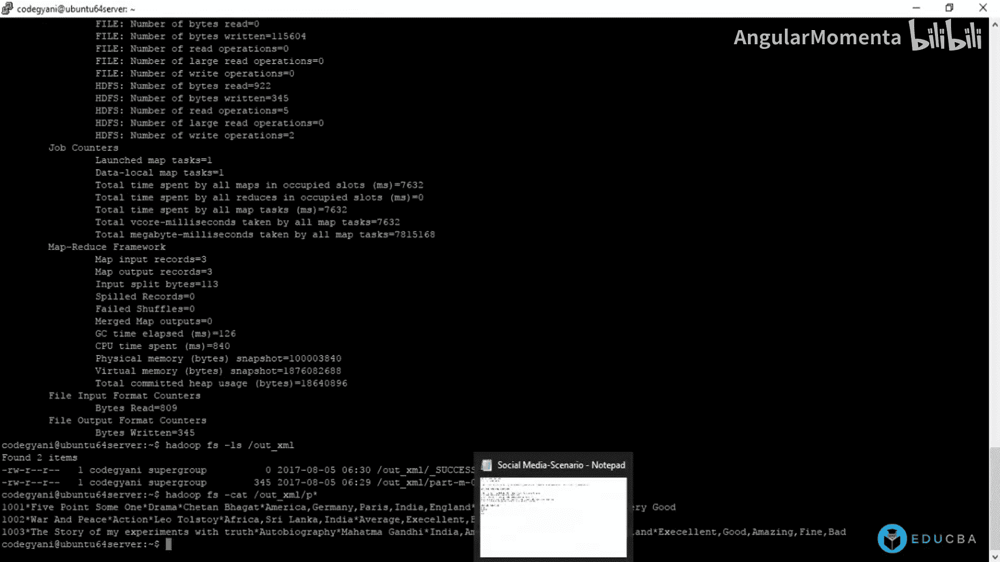

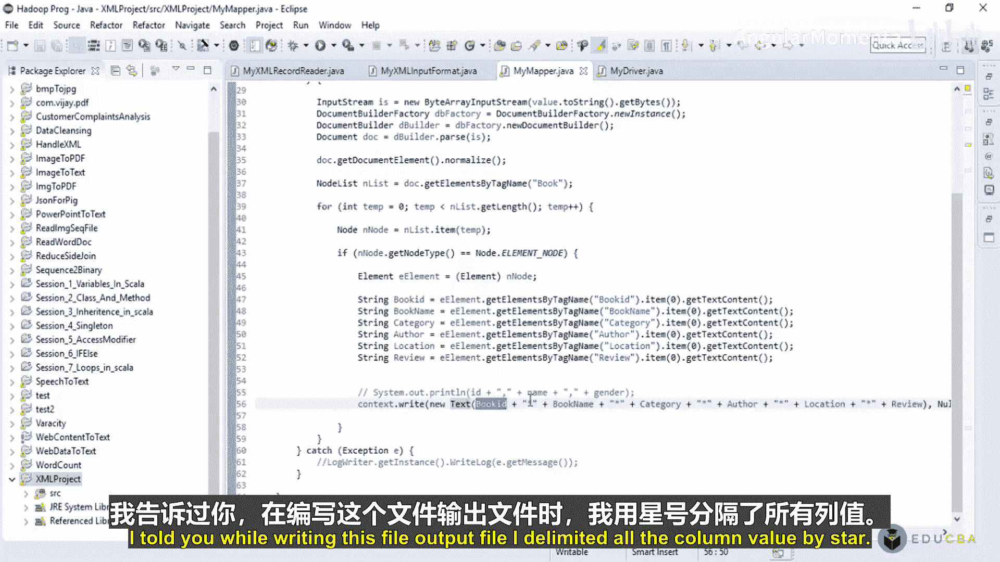

导出后，JAR文件将保存在本地机器上。

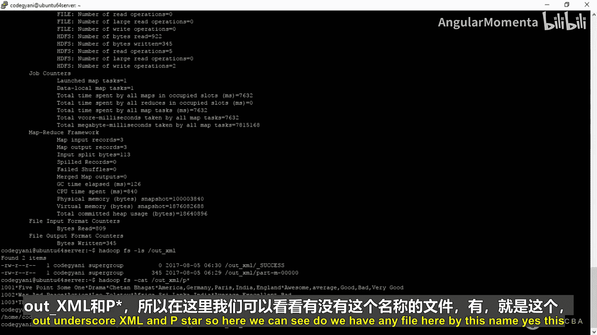

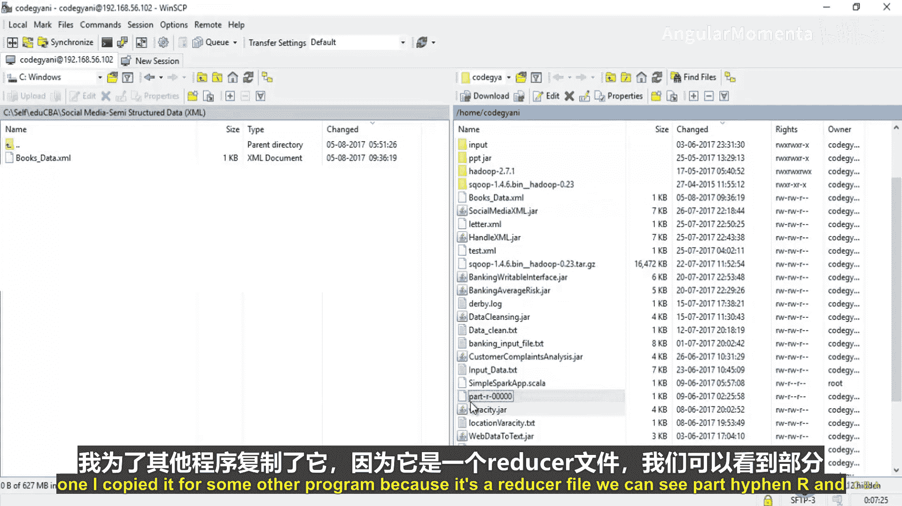

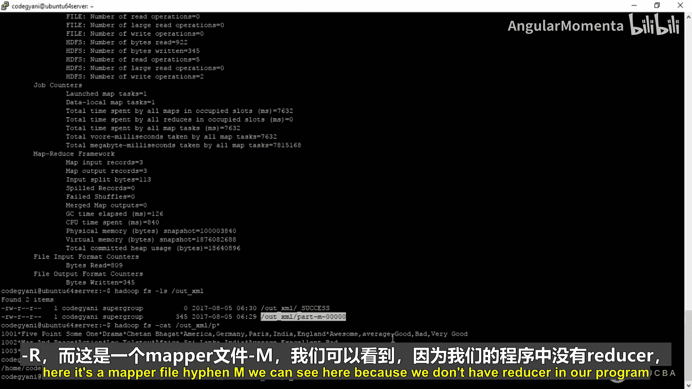

## 准备Hadoop环境

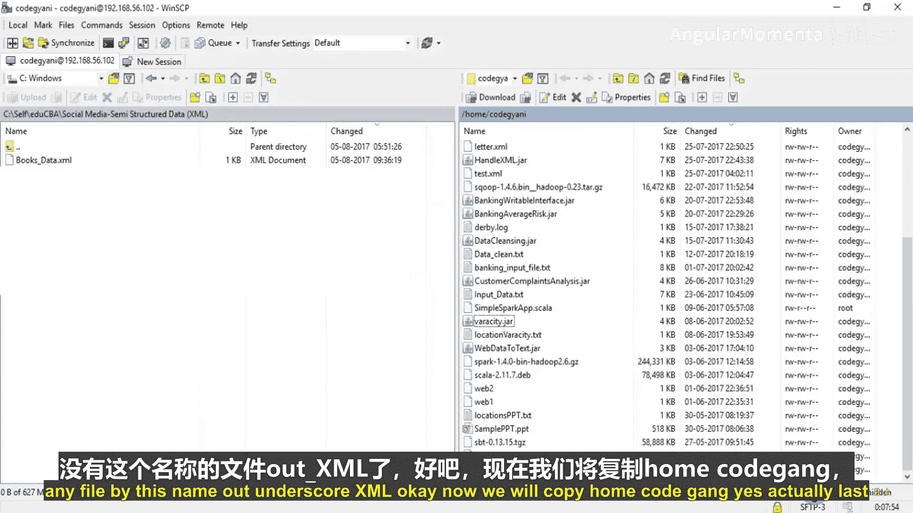

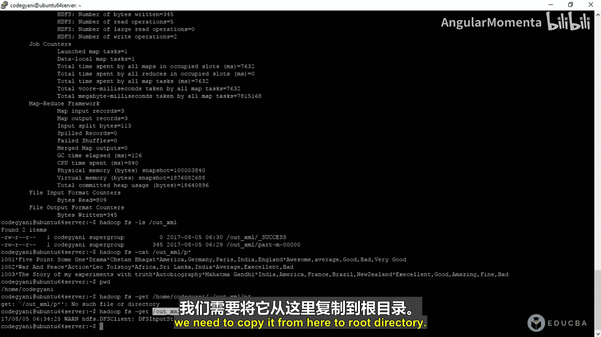

在运行程序之前，必须确保Hadoop集群的所有必要服务都在运行。

以下是需要检查的Hadoop服务：
*   **ResourceManager**： 资源管理器。
*   **NodeManager**： 节点管理器。
*   **NameNode**： 名称节点。
*   **DataNode**： 数据节点。

可以通过在Hadoop主节点上执行 `jps` 命令来验证这些服务是否已启动。只有所有服务都正常运行，才能提交MapReduce作业。

## 上传文件到Hadoop

接下来，需要将导出的JAR文件和输入数据文件上传到Hadoop集群的根目录。

可以使用 `scp` 命令或图形化工具（如WinSCP）进行文件传输。确保JAR文件（如 `social_media_xml.jar`）和XML输入文件（如 `books_data.xml`）都位于Hadoop用户的主目录下。

## 执行MapReduce作业

文件准备就绪后，就可以在Hadoop上执行MapReduce程序了。

使用以下命令格式提交作业：
```bash
hadoop jar <jar文件名> <主类名> <输入路径> <输出路径>
```
在我们的例子中，命令如下：
```bash
hadoop jar social_media_xml.jar /user/hadoop/in_project/books_data.xml /user/hadoop/out_xml
```
执行此命令后，Hadoop的ResourceManager会为作业分配一个唯一的Job ID。控制台将显示Map和Reduce任务的执行进度。由于我们的程序只包含Mapper，因此只会看到Map任务完成。

## 验证输出结果

作业成功完成后，可以在指定的输出目录中查看结果。

使用以下命令检查输出目录：
```bash
hdfs dfs -ls /user/hadoop/out_xml
```
要查看输出文件的内容，可以使用 `cat` 或 `get` 命令将其下载到本地查看：
```bash
hdfs dfs -get /user/hadoop/out_xml/part-m-00000 ./output.txt
cat output.txt
```
输出文件的内容将是转换后的扁平格式数据，各字段由星号（*）分隔。

## 后续数据处理

我们得到的输出文件是一个扁平化的文本文件，可以作为另一个MapReduce作业的输入，以进行进一步分析，例如统计每本书的好评、中评和差评数量。

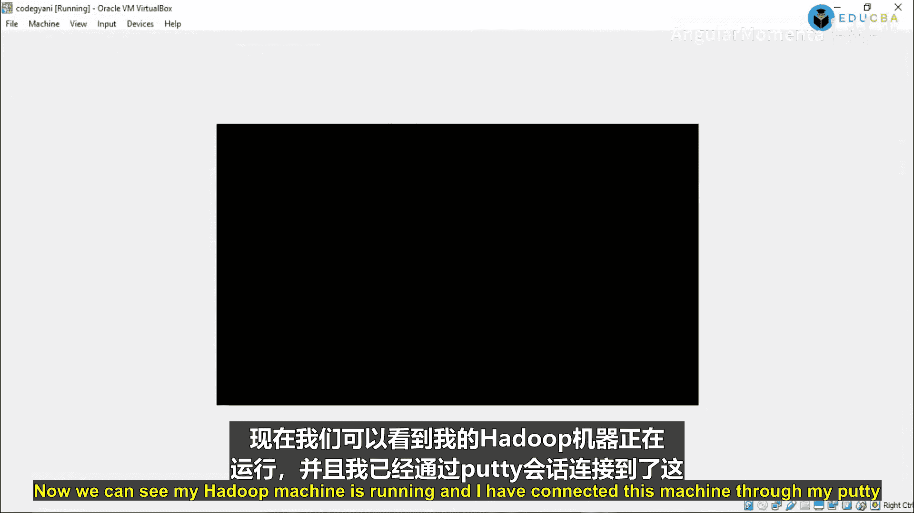

在下一个程序中，我们将：
1.  读取上一作业的输出文件。
2.  在Mapper中解析每条记录，分离出“评论”字段。
3.  根据预定义的规则（如“awesome”为好评，“bad”为差评）对评论进行分类计数。
4.  输出每本书的ID、名称、类别以及对应的好评、差评、中评数量。

第二个作业的执行方式与第一个类似，只需指定新的输入路径和输出路径即可。

---

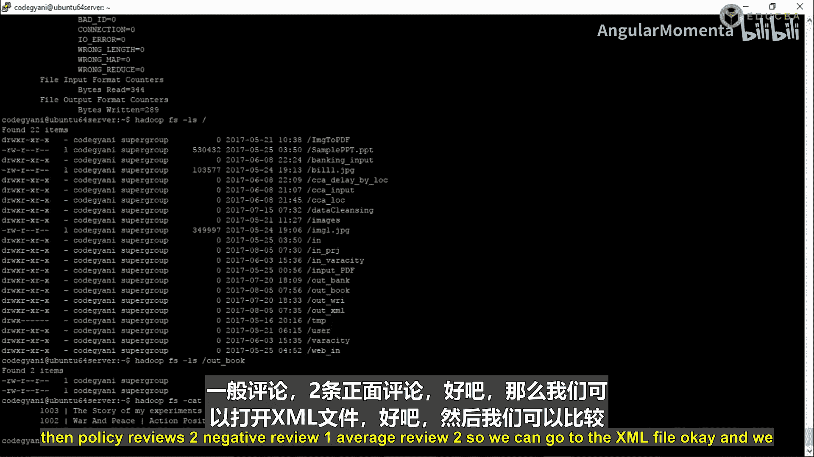

## 总结

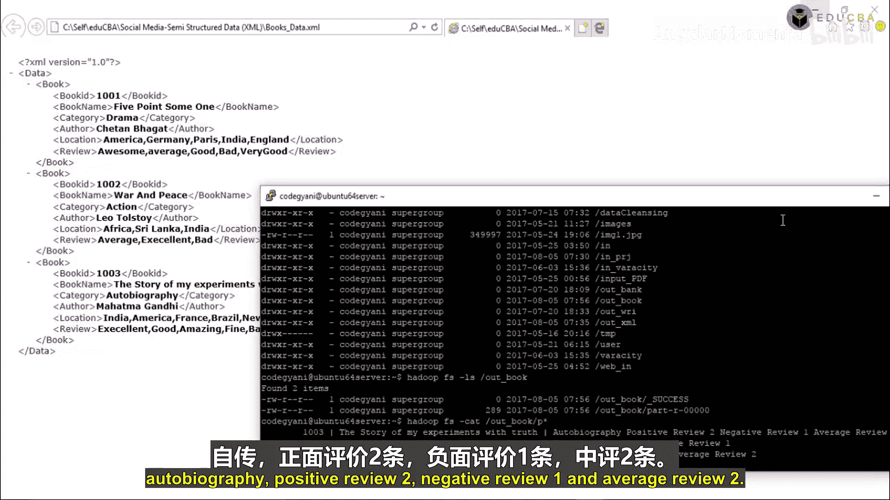

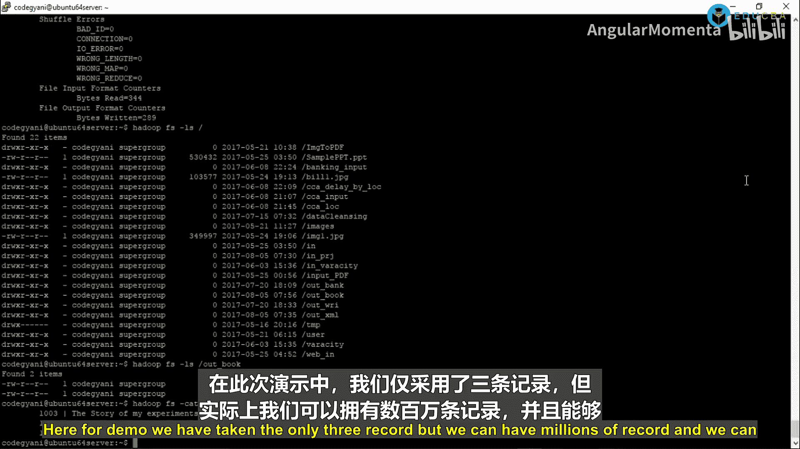


本节课中我们一起学习了MapReduce程序从打包到执行的完整流程。我们掌握了如何将Java项目导出为JAR文件，如何检查Hadoop服务状态，如何上传文件到HDFS，以及如何使用 `hadoop jar` 命令提交作业。最后，我们还查看了作业的输出结果，并了解了如何将本次作业的输出作为下一次数据分析的输入。这个过程是进行大规模数据处理的基础。