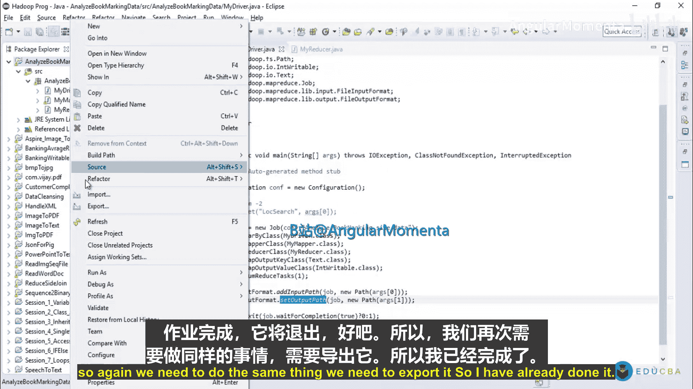
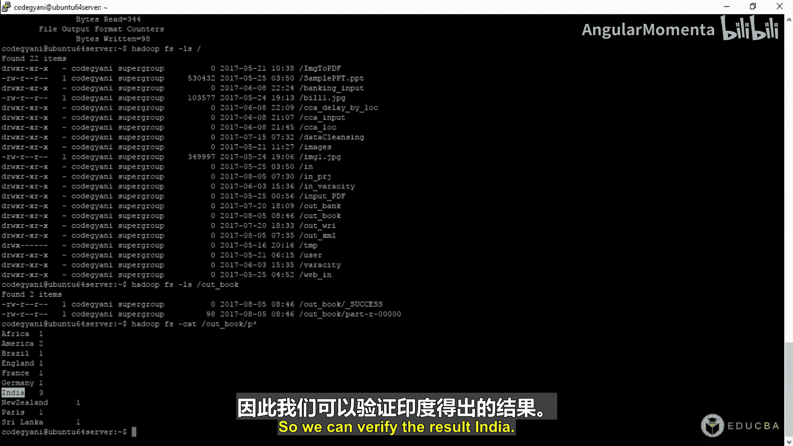
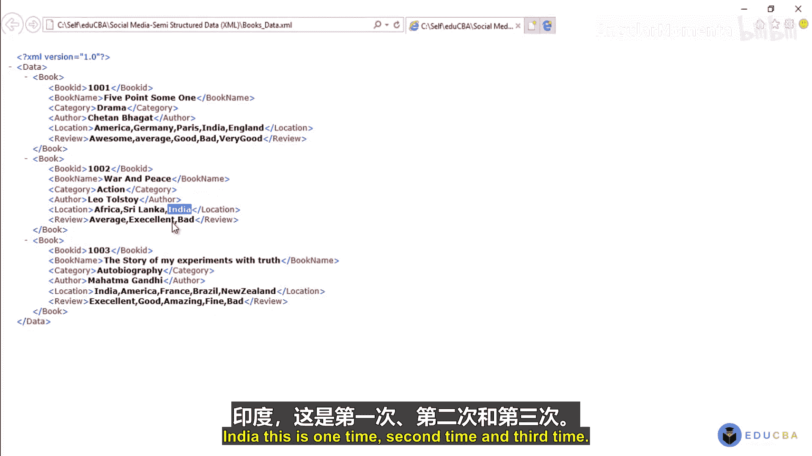
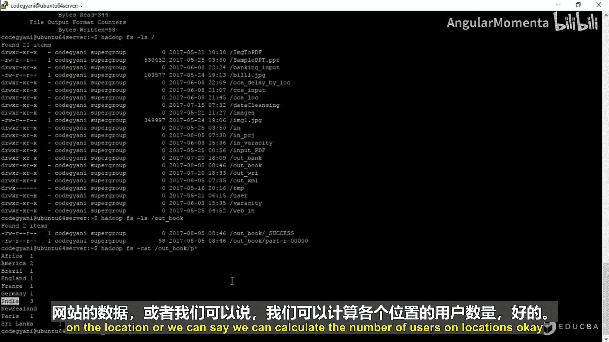
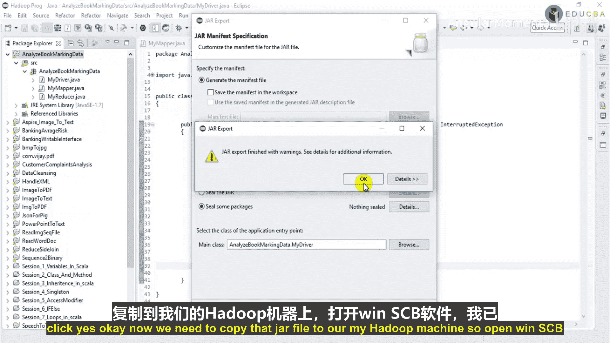
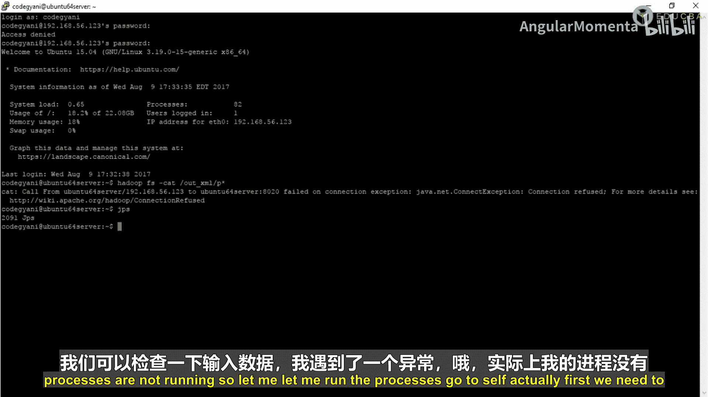
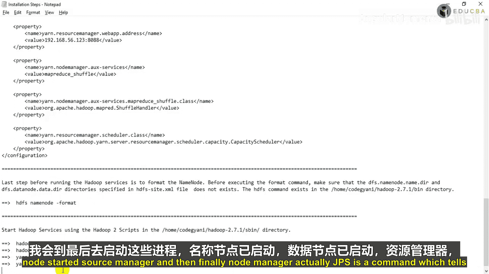
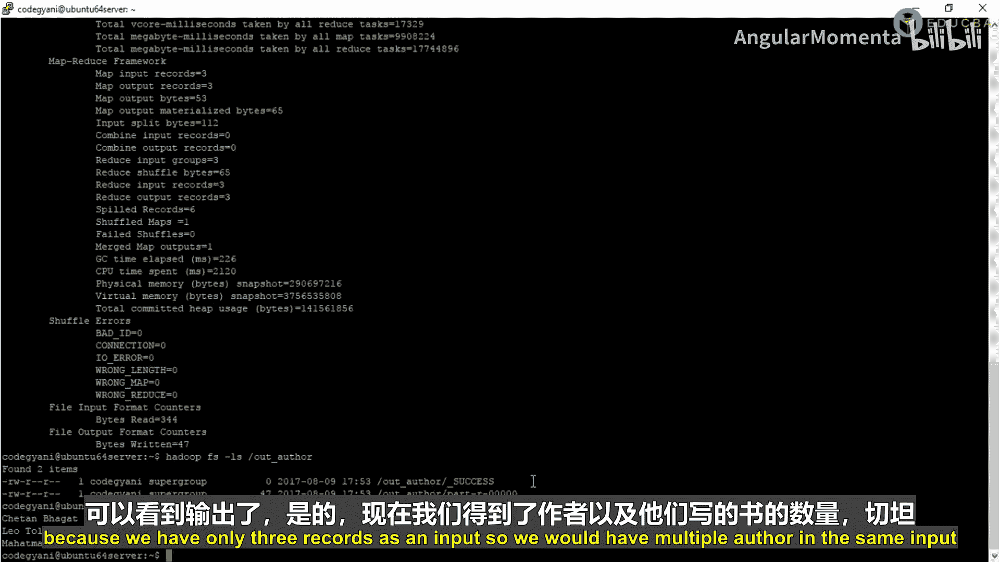
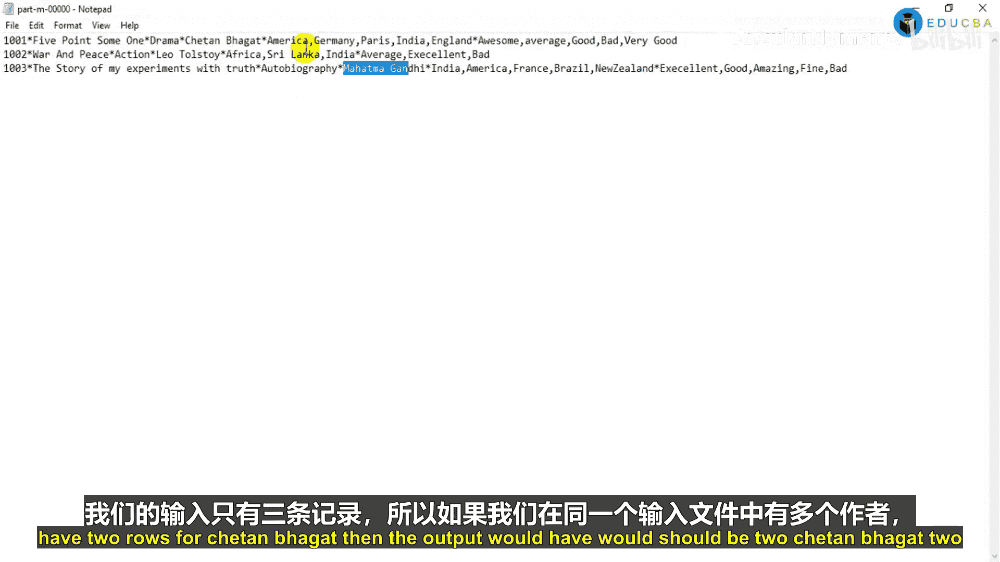
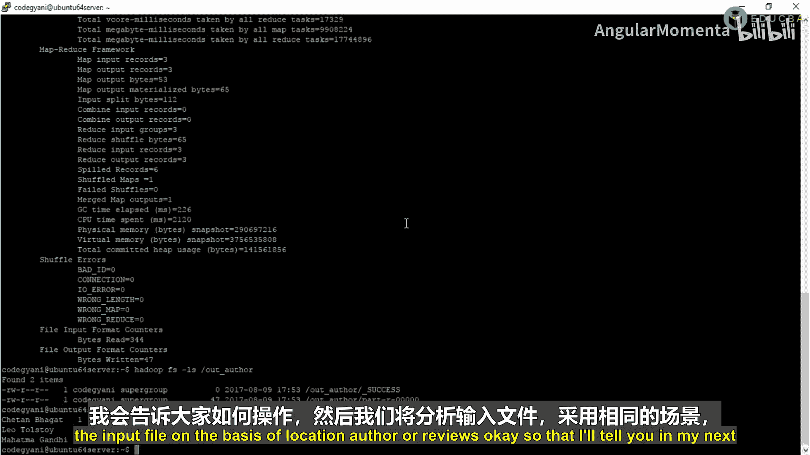

# 008：按地点分析书籍 📚

在本节课中，我们将学习如何使用MapReduce程序，根据用户的地理位置信息来分析图书数据。我们将统计每个国家或地区的用户数量。

上一节我们基于评论内容分析了数据。本节中，我们来看看如何基于地理位置进行分析。

## 概述

假设一个图书网站或出版商希望分析其用户分布。他们需要知道在哪些国家或地区拥有读者。我们的输入数据中包含用户的地理位置信息（例如：美国、德国、印度）。本教程的目标是编写一个MapReduce程序，统计每个地理位置出现的次数，从而得出用户分布情况。

## 程序逻辑

以下是实现该功能的核心逻辑：

1.  **Mapper阶段**：读取输入文件的每一行，提取出地理位置字段。由于一个用户可能关联多个地点（用逗号分隔），我们需要将其拆分。然后，将每个独立的地点作为键（Key）输出，值（Value）固定为 `1`。
    *   **公式/逻辑**：对于输入行中的每个地点 `location_i`，输出键值对 `<location_i, 1>`。

2.  **Reducer阶段**：接收来自Mapper的键值对。Reducer会将具有相同键（即相同地点）的所有值（都是 `1`）进行累加求和。
    *   **公式**：`sum = Σ(value_i)`，其中所有 `value_i` 都等于 `1`。最终输出 `<location, sum>`。

## 代码实现详解

以下是MapReduce各组件类的具体实现。



### Mapper类

Mapper类负责读取数据并生成中间键值对。

```java
public class MyMapper extends Mapper<LongWritable, Text, Text, IntWritable> {
    private final static IntWritable one = new IntWritable(1);
    private Text location = new Text();

    public void map(LongWritable key, Text value, Context context) throws IOException, InterruptedException {
        // 1. 将每行文本按星号(*)分割成字段
        String[] fields = value.toString().split("\\*");
        // 假设字段顺序为：图书ID, 书名, 类别, 作者, 地点, 评论
        String locationStr = fields[4]; // 获取地点字段

        // 2. 地点字段可能包含多个地点，用逗号分隔
        String[] multiLocation = locationStr.split(",");

        // 3. 遍历每个地点，输出 <地点, 1>
        for (String loc : multiLocation) {
            location.set(loc.trim()); // 去除空格并设置为Text类型
            context.write(location, one);
        }
    }
}
```





### Reducer类



Reducer类负责对相同键的值进行聚合计算。

```java
public class MyReducer extends Reducer<Text, IntWritable, Text, IntWritable> {
    private IntWritable result = new IntWritable();

    public void reduce(Text key, Iterable<IntWritable> values, Context context) throws IOException, InterruptedException {
        int sum = 0;
        // 1. 遍历传入的值的集合（全部为1）
        for (IntWritable val : values) {
            sum += val.get(); // 2. 累加求和
        }
        // 3. 输出最终结果：<地点, 总数>
        result.set(sum);
        context.write(key, result);
    }
}
```

### Driver类

Driver类是程序的入口，负责配置和提交MapReduce作业。

```java
public class MyDriver {
    public static void main(String[] args) throws Exception {
        Configuration conf = new Configuration();
        Job job = Job.getInstance(conf, "Analyze Book Data by Location");

        job.setJarByClass(MyDriver.class);
        job.setMapperClass(MyMapper.class);
        job.setReducerClass(MyReducer.class);

        job.setOutputKeyClass(Text.class);
        job.setOutputValueClass(IntWritable.class);

        // 设置输入和输出路径
        FileInputFormat.addInputPath(job, new Path(args[0]));
        FileOutputFormat.setOutputPath(job, new Path(args[1]));

        // 设置Reducer任务数量
        job.setNumReduceTasks(1);

        System.exit(job.waitForCompletion(true) ? 0 : 1);
    }
}
```

## 执行与验证



程序编写完成后，需要打包并提交到Hadoop集群运行。





以下是执行步骤：
1.  将Java项目导出为JAR文件（例如 `book-analysis.jar`）。
2.  将JAR文件上传到Hadoop集群主节点。
3.  确保Hadoop服务（如NameNode, DataNode）正在运行。
4.  使用 `hadoop jar` 命令提交作业。输入路径是上一节生成的扁平化数据文件，输出路径是一个新目录。
    ```bash
    hadoop jar book-analysis.jar MyDriver /user/input/flat_book_data /user/output/location_analysis
    ```
5.  作业完成后，查看输出目录中的结果文件。
    ```bash
    hadoop fs -cat /user/output/location_analysis/part-r-00000
    ```

预期输出格式类似：
```
America   2
Germany   3
India     3
England   1
...
```
这表示在美国有2个用户记录，在德国有3个，依此类推。



## 总结





本节课中我们一起学习了如何使用MapReduce进行基于地理位置的数据分析。我们实现了Mapper来提取和拆分地点数据，Reducer来统计每个地点的出现次数。通过这个简单的例子，我们可以将同样的逻辑应用于海量数据，为出版商或网站提供有价值的用户地域分布洞察。下一节，我们将开始学习使用Apache Pig来处理和分析相同的数据集。