# 009：在Pig中处理XML文件

在本节课中，我们将学习如何使用Apache Pig处理半结构化的XML数据。我们将从加载XML文件开始，逐步学习如何提取数据、分析数据，并最终将结果存储起来。课程将涵盖Pig的基本概念、处理XML所需的特殊加载器，以及如何编写和使用用户自定义函数（UDF）来实现复杂的数据分析逻辑。

## 什么是Apache Pig？ 🐷

上一节我们介绍了使用MapReduce处理XML文件的方法。本节中，我们来看看另一种强大的工具——Apache Pig。

Apache Pig是一种数据流语言，最初由Yahoo开发，后来由Apache基金会接管。它主要为那些不想编写冗长代码或不熟悉Java、Python、Scala等编程语言的用户设计。Pig允许用户或开发者通过定义数据流（即一系列关系）来处理数据。Pig中的数据仅存在于当前会话中，会话结束后数据将丢失。

Pig的核心概念是**关系**。一个Pig脚本通常包含多个相互关联的关系。例如：
*   **关系S1**：加载XML文件。
*   **关系S2**：对S1中的数据执行操作（如按位置分析）。
*   **关系S3**：将结果输出到控制台。

## 准备工作：注册Piggy Bank JAR

与MapReduce类似，Pig本身不直接支持处理XML文件。我们需要借助一个包含`XMLLoader`等函数的库——`piggybank.jar`。

以下是获取和注册该JAR文件的步骤：
1.  从互联网下载`piggybank.jar`文件。
2.  将其复制到Hadoop系统中。
3.  在Pig Grunt Shell中，使用`REGISTER`命令注册该JAR文件。

```pig
REGISTER /path/to/piggybank.jar;
```

## 加载并提取XML数据 📂

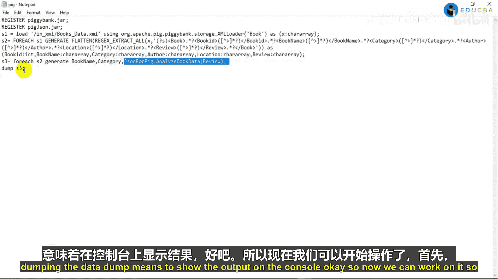

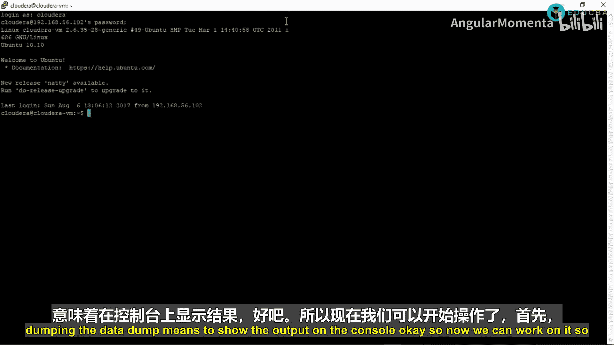

注册好JAR文件后，我们就可以开始处理XML数据了。处理过程分为两步：首先加载整个父标签下的数据，然后使用正则表达式提取所需的特定节点数据。

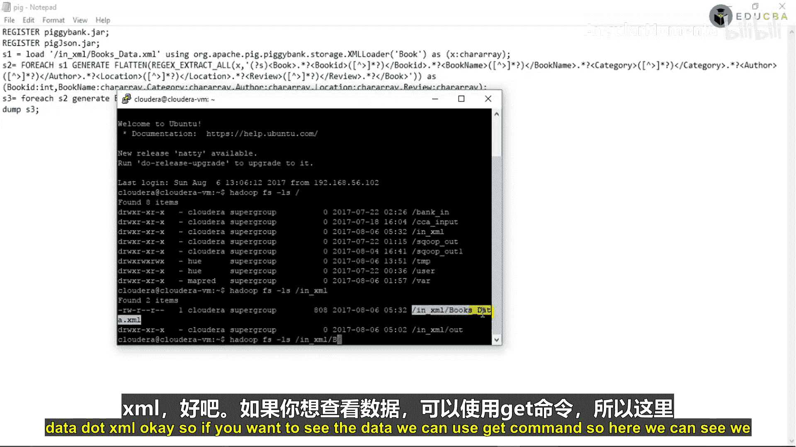

假设我们的XML文件结构如下，父标签是`<book>`：
```xml
<book>
    <bookid>1</bookid>
    <bookname>Book1</bookname>
    <category>Fiction</category>
    <author>Author1</author>
    <location>India</location>
    <review>Awesome|Average|Good|Bad|Very Good</review>
</book>
```

以下是相应的Pig Latin脚本：

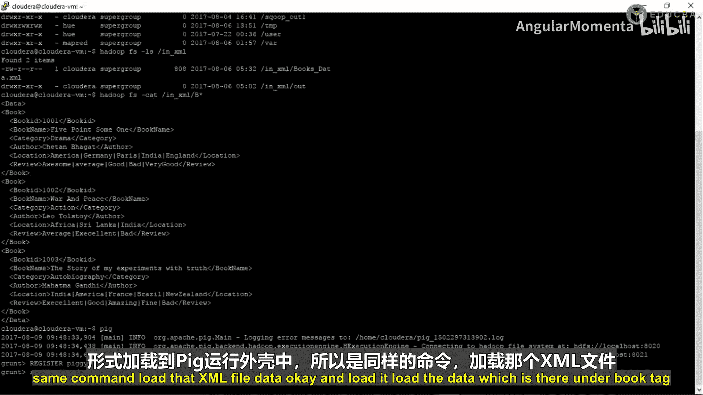

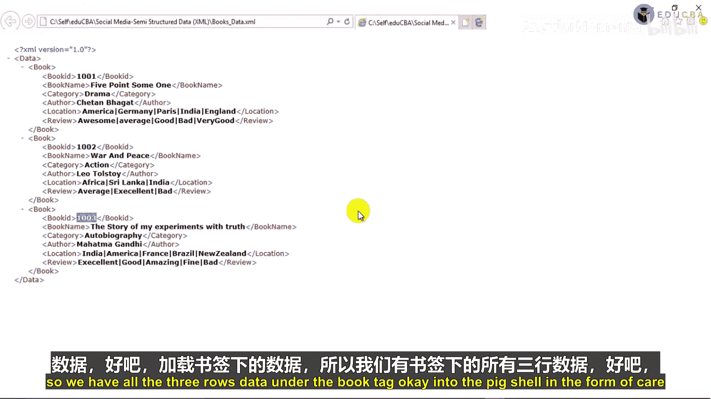

```pig
-- 关系 S1: 加载XML文件
-- 使用 XMLLoader，并指定父标签为 ‘book‘
S1 = LOAD ‘/input/books_data.xml‘ USING org.apache.pig.piggybank.storage.XMLLoader(‘book‘) AS (content:chararray);

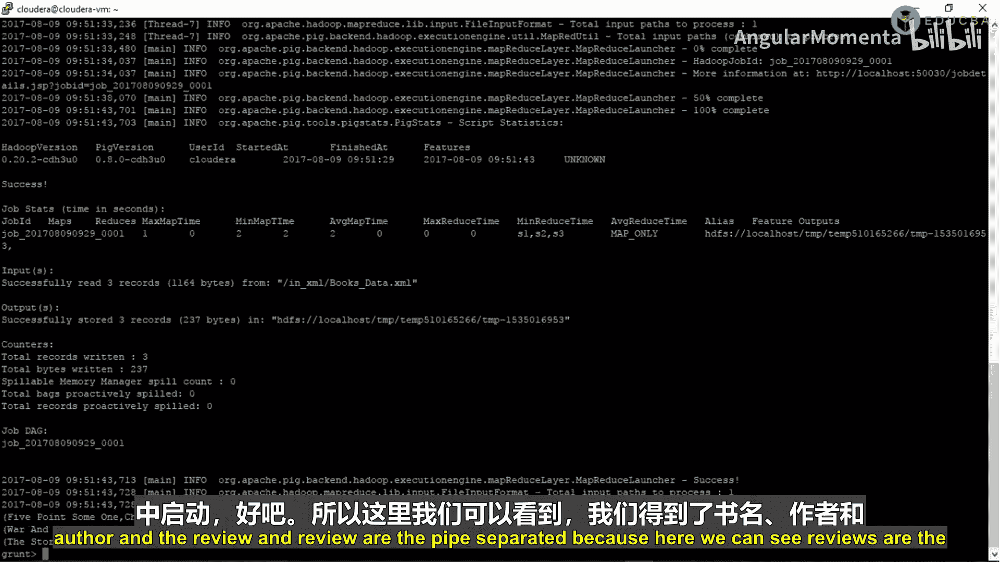

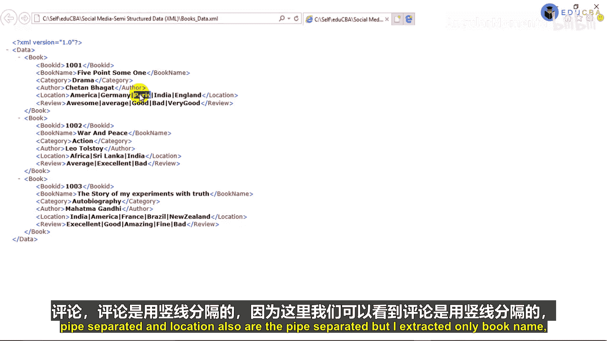

-- 关系 S2: 使用正则表达式提取各个字段
-- 注意：Pig中没有string类型，使用chararray代替
S2 = FOREACH S1 GENERATE
    REGEX_EXTRACT(content, ‘<bookid>(.*?)</bookid>‘, 1) AS bookid:int,
    REGEX_EXTRACT(content, ‘<bookname>(.*?)</bookname>‘, 1) AS bookname:chararray,
    REGEX_EXTRACT(content, ‘<category>(.*?)</category>‘, 1) AS category:chararray,
    REGEX_EXTRACT(content, ‘<author>(.*?)</author>‘, 1) AS author:chararray,
    REGEX_EXTRACT(content, ‘<location>(.*?)</location>‘, 1) AS location:chararray,
    REGEX_EXTRACT(content, ‘<review>(.*?)</review>‘, 1) AS review:chararray;

-- 关系 S3: 选择并查看部分字段
S3 = FOREACH S2 GENERATE bookname, author, review;
DUMP S3;
```
执行`DUMP S3;`后，可以在控制台看到提取出的书名、作者和评论数据。

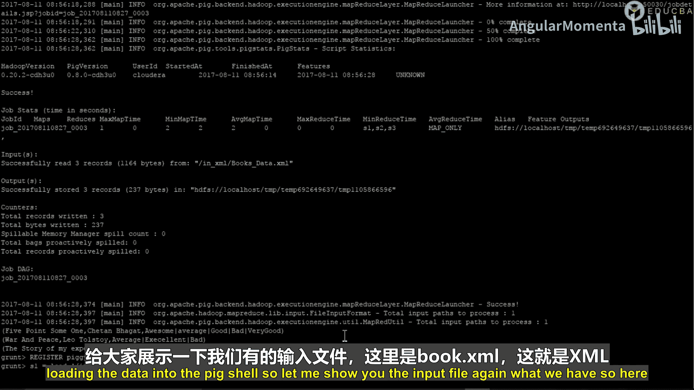

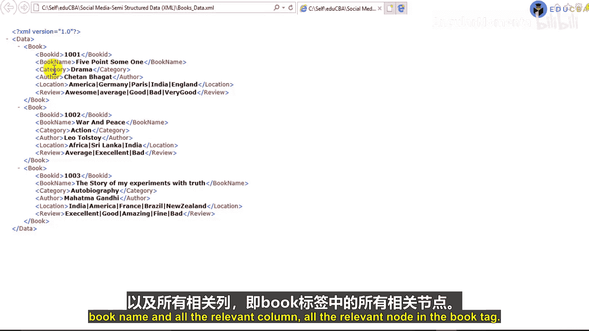

## 使用UDF进行数据分析 🔍

我们已经成功提取了原始数据。现在，假设我们想分析每本书的评价表现，即统计每条评论中正面、负面和中性评价的数量。Pig的内置函数可能无法直接完成这种复杂逻辑，这时就需要编写**用户自定义函数**。

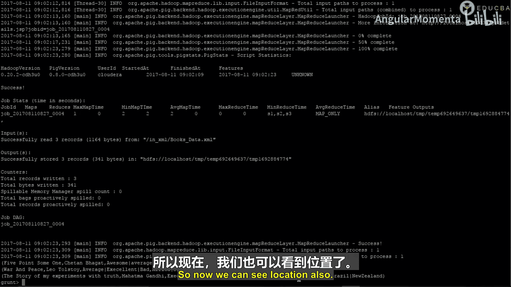

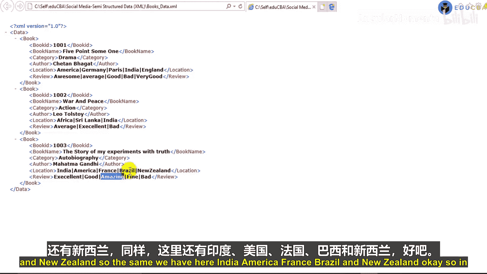

UDF主要有两种类型：
*   **FilterFunc**：用于过滤数据（返回布尔值）。
*   **EvalFunc**：用于处理数据并返回新值（如字符串、数值）。

我们的需求是分析评论字符串，因此选择扩展`EvalFunc`类。

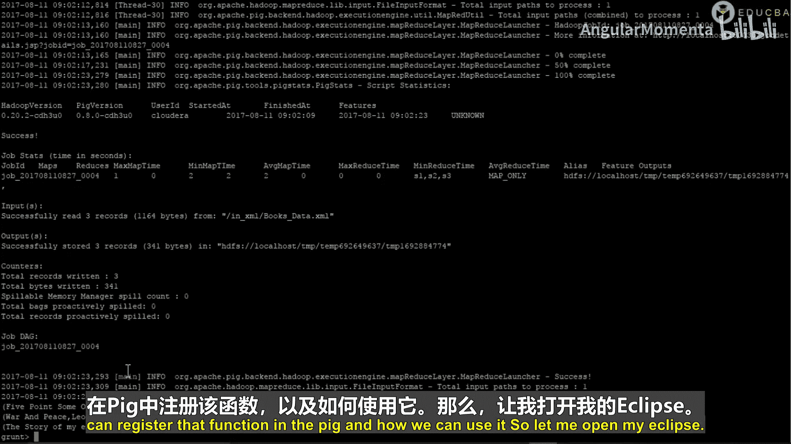

以下是一个Java UDF示例（`AnalyzeBookData`），它统计评论字符串中正面、负面和中性词的数量：

```java
package com.example.pig.udf;
import org.apache.pig.EvalFunc;
import org.apache.pig.data.Tuple;
import java.io.IOException;

public class AnalyzeBookData extends EvalFunc<String> {
    @Override
    public String exec(Tuple input) throws IOException {
        if (input == null || input.size() == 0) {
            return null;
        }
        String reviewStr = (String) input.get(0);
        int positiveCount = 0;
        int negativeCount = 0;
        int averageCount = 0;

        String[] reviews = reviewStr.split("\\|");
        for (String singleReview : reviews) {
            if (singleReview.matches("(?i)awesome|excellent|amazing|very good")) {
                positiveCount++;
            } else if (singleReview.matches("(?i)bad|poor|terrible")) {
                negativeCount++;
            } else {
                averageCount++;
            }
        }
        String result = "Positive=" + positiveCount + ", Negative=" + negativeCount + ", Average=" + averageCount;
        return result;
    }
}
```

编写并编译UDF后，需要将其导出为JAR文件（例如`pig_udf.jar`），然后像注册`piggybank.jar`一样在Pig脚本中注册它。

```pig
REGISTER /path/to/pig_udf.jar;
```

注册后，就可以在Pig Latin脚本中调用这个UDF了：

```pig
-- 继续使用之前的关系 S2
-- 关系 S4: 使用UDF分析评论
S4 = FOREACH S2 GENERATE bookname, com.example.pig.udf.AnalyzeBookData(review) AS review_analysis;
DUMP S4;
```
执行后，输出将显示每本书名及其对应的评价分析结果，例如：`Positive=2, Negative=1, Average=2`。

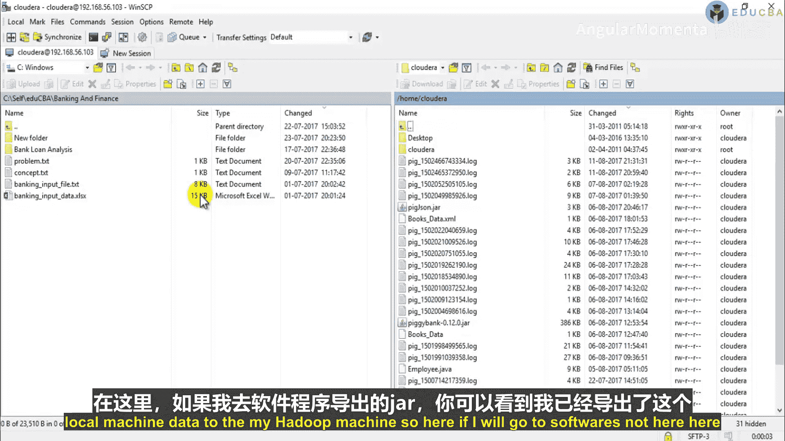

## 存储处理结果 💾

最后，我们可能希望将分析结果保存到HDFS中，以供后续使用，而不是仅仅打印在控制台。这可以通过`STORE`命令实现。

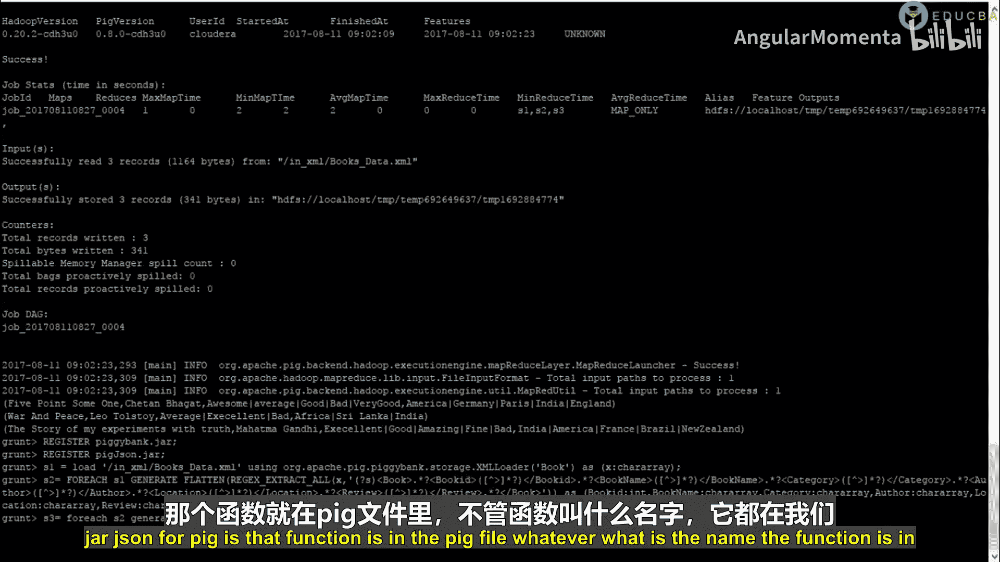

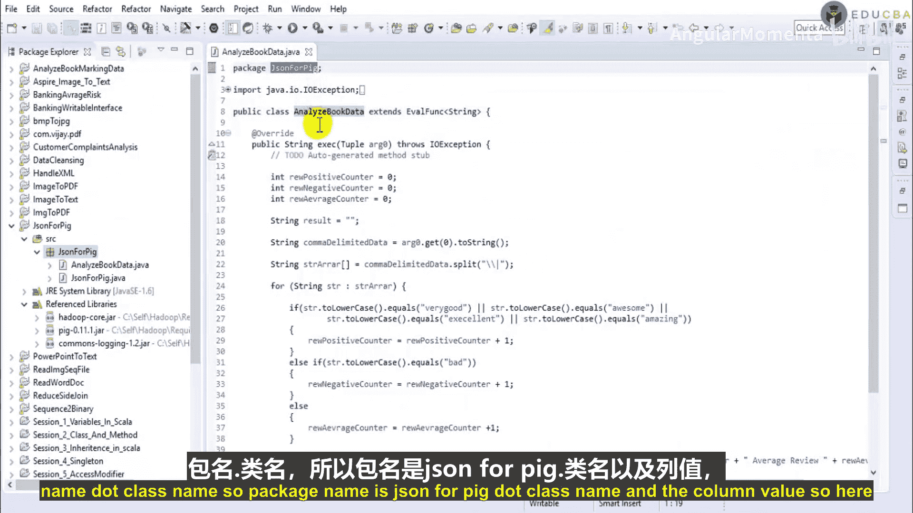

```pig
-- 将关系 S4 的结果存储到 HDFS
STORE S4 INTO ‘/output/book_review_analysis‘;
```
执行后，可以在HDFS的指定目录下找到输出文件。

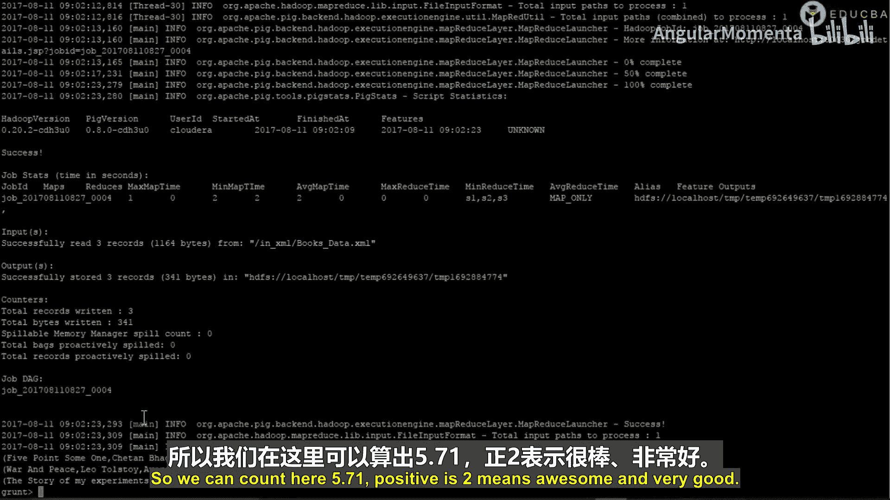

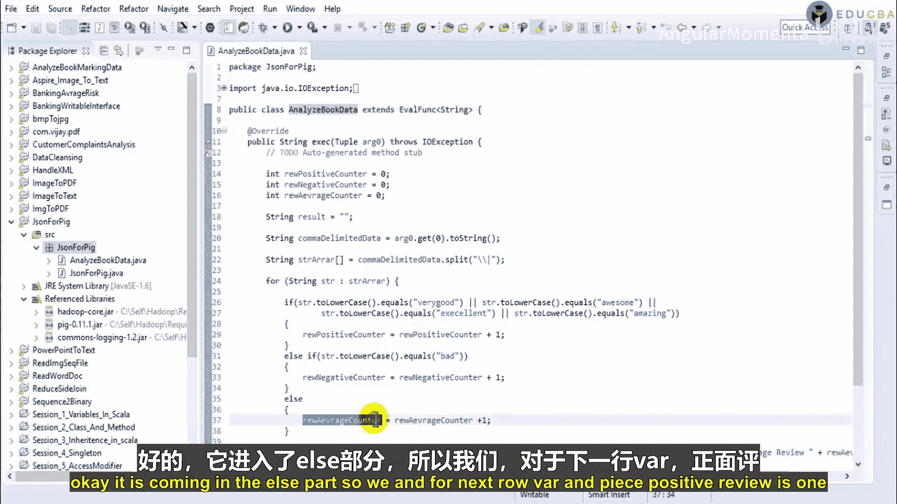

## 总结

本节课中我们一起学习了如何在Apache Pig中处理XML文件。我们从了解Pig作为一种数据流语言的基本概念开始，然后逐步实践了以下关键步骤：
1.  注册包含`XMLLoader`的`piggybank.jar`以支持XML加载。
2.  使用`LOAD`和`REGEX_EXTRACT`加载并提取XML数据。
3.  为了执行复杂的数据分析（如评论情感统计），我们编写、编译、注册并调用了一个Java用户自定义函数（UDF）。
4.  最后，使用`STORE`命令将最终结果持久化存储到HDFS中。

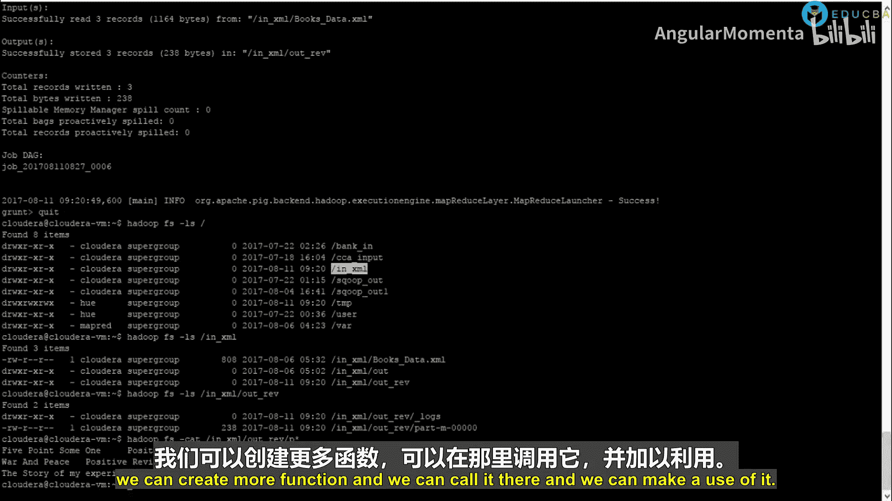

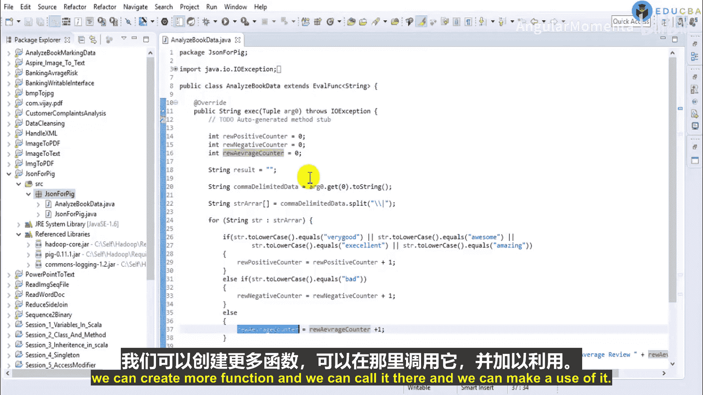

通过本教程，你掌握了使用Pig处理半结构化数据的基本流程，并了解了如何通过UDF扩展Pig的功能以满足特定分析需求。