# 010：使用Pig处理XML文件输出

在本节课中，我们将学习如何进一步处理上一节中从XML文件解析得到的数据。我们将重点介绍Pig中的两个核心函数：`TOKENIZE`和`FLATTEN`，并演示如何利用它们将复杂的数据结构（如包含多个值的字段）转换为易于分析的格式。

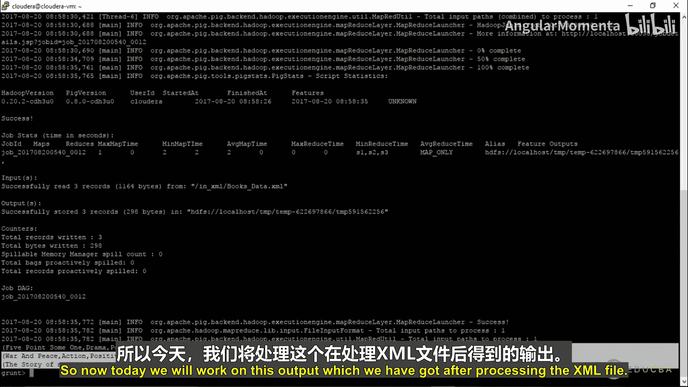

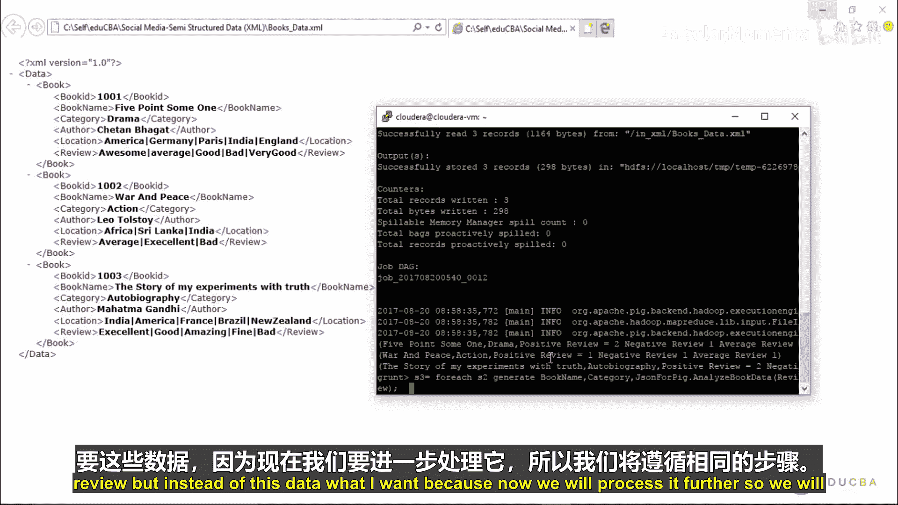

上一节我们介绍了如何使用自定义函数（UDF）处理XML文件并存储结果。本节中，我们来看看如何对已处理的数据进行更深入的分析，特别是处理那些包含多个值（如以管道符分隔的位置或评论）的字段。

## 数据回顾与目标

我们之前处理XML文件后，得到了以下格式的数据：
*   **Book ID**：书籍ID
*   **Category**：书籍类别
*   **Locations**：多个位置，以管道符 `|` 分隔（例如：`America|Germany|Paris|India|England`）

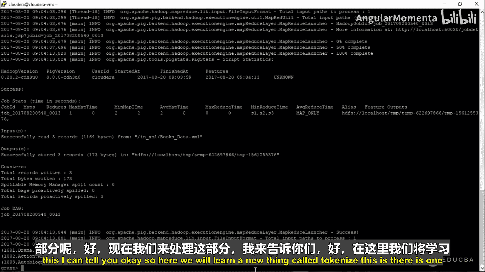

我们的目标是分析每个位置（Location）出现的次数。由于所有位置都挤在单个字段里，直接分析很困难。因此，我们需要先将这些位置拆分成独立的行。

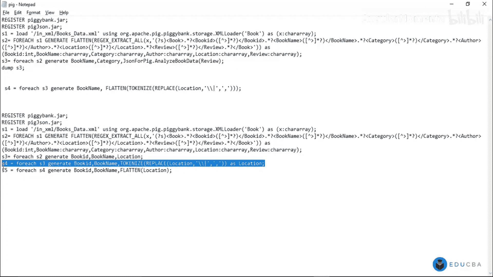

## 核心函数：TOKENIZE 与 FLATTEN

为了实现数据拆分，我们将使用Pig Latin中的两个内置函数。

### 1. TOKENIZE 函数

`TOKENIZE` 函数的作用是将一个字符串按照指定的分隔符拆分成多个**词元（token）**，并将这些词元封装在一个**包（bag）** 中。在Pig中，一行数据称为一个**元组（tuple）**，一个字段称为一个**原子（atom）**。`TOKENIZE` 处理一个原子（字符串），并生成一个包含多个原子的包。

**公式/代码描述**：
```pig
-- 假设有一个字段 `locations` 值为 ‘A|B|C’
tokenized_data = TOKENIZE(locations, ‘|’);
-- 结果：一个包 {(‘A’), (‘B’), (‘C’)}，这个包属于原元组的一个字段。
```

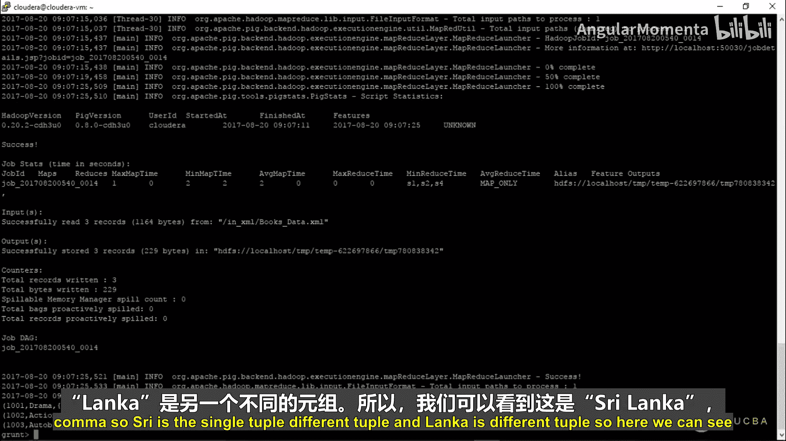

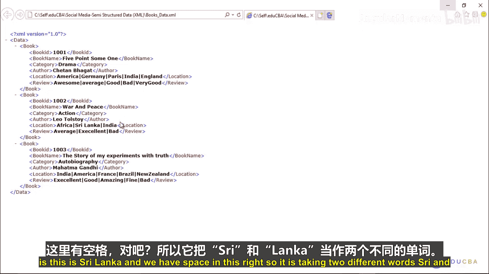

### 2. FLATTEN 函数

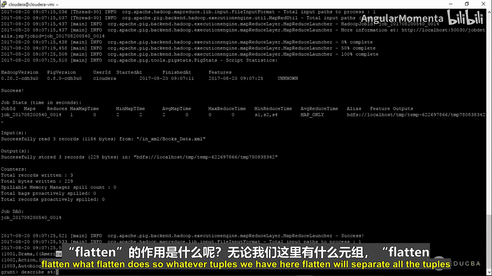

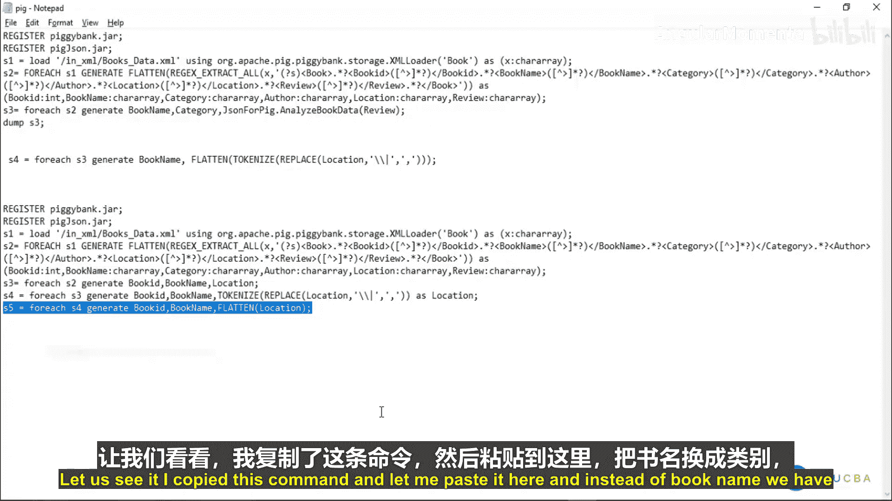

`FLATTEN` 函数用于“展平”嵌套的数据结构，如包（bag）或元组（tuple）。当对一个包含包的字段使用 `FLATTEN` 时，Pig会为包中的每个元素生成一个新的独立元组，并复制其他字段的值。

**公式/代码描述**：
```pig
-- 接上例，`tokenized_data` 是一个包字段
flattened_data = FOREACH source_data GENERATE book_id, FLATTEN(tokenized_data) AS location;
-- 结果：为包中每个元素生成新行
-- (book_id1, ‘A’)
-- (book_id1, ‘B’)
-- (book_id1, ‘C’)
```

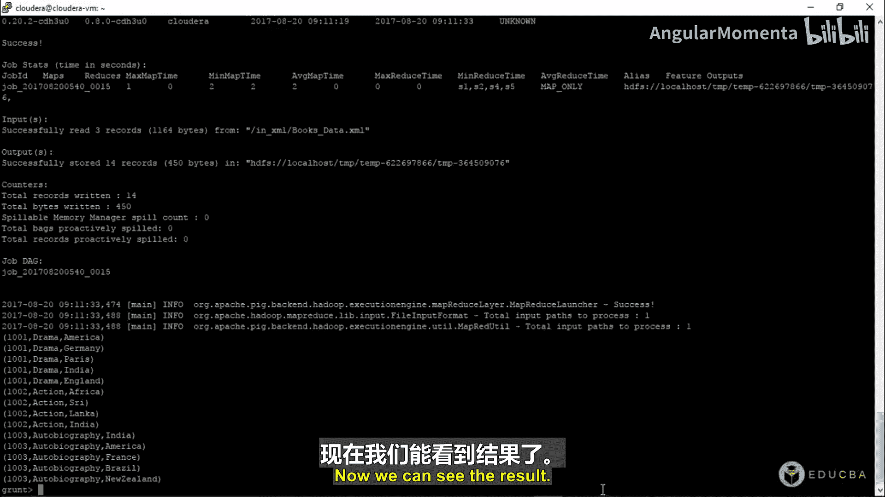

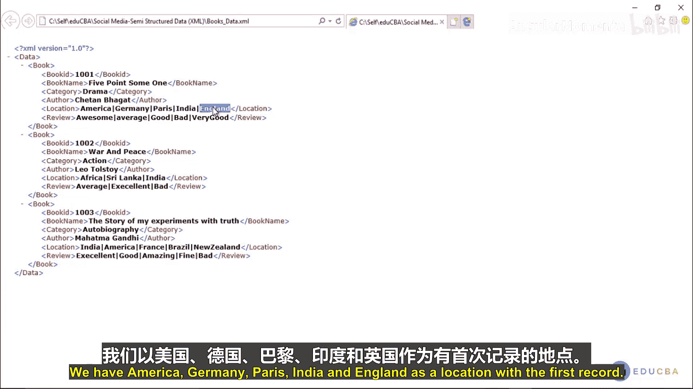

## 实践步骤：拆分与统计位置

以下是使用 `TOKENIZE` 和 `FLATTEN` 处理位置数据并统计的完整步骤。

### 步骤 1: 加载数据并提取字段

首先，我们注册必要的JAR包和UDF，然后加载上一节存储的XML处理结果。

```pig
REGISTER /path/to/piggybank.jar;
REGISTER /path/to/your_udf.jar;
-- 假设UDF函数名为 `XmlLoader`
A = LOAD ‘/user/hadoop/xml_output’ USING XmlLoader() AS (book_id:int, category:chararray, locations:chararray);
```

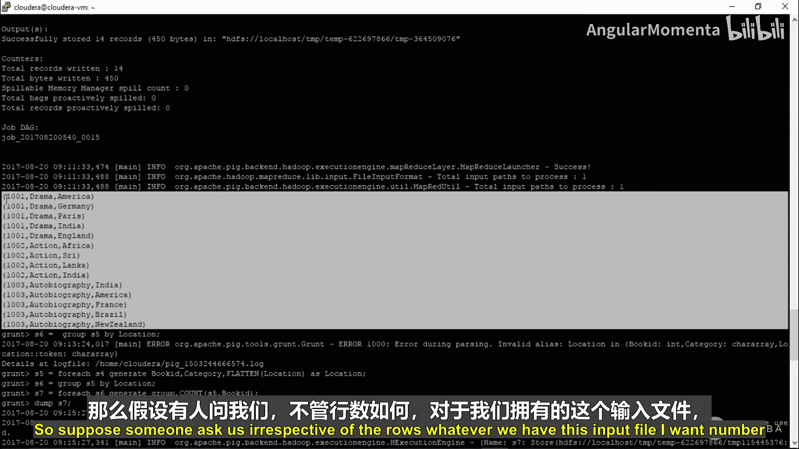

### 步骤 2: 使用 TOKENIZE 拆分位置字符串

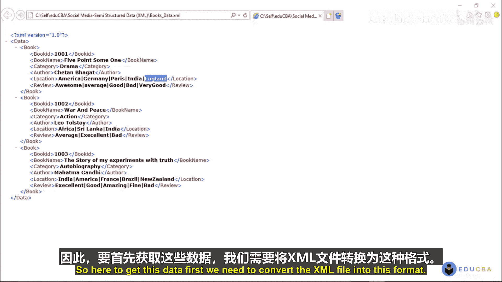

接下来，我们使用 `TOKENIZE` 函数。为了正确分隔，我们先将管道符 `|` 替换为 `TOKENIZE` 默认识别的空格（或指定逗号分隔）。

```pig
B = FOREACH A GENERATE
    book_id,
    category,
    TOKENIZE(REPLACE(locations, ‘|’, ‘,’)) AS location_bag;
```
执行 `DESCRIBE B;` 和 `DUMP B;`，可以看到 `location_bag` 字段的类型是 `{tuple of (chararray)}`，即一个由元组构成的包。所有位置都被打包在原始数据每一行的这个字段中。

### 步骤 3: 使用 FLATTEN 展平数据

为了使每个位置成为独立的行，我们对包使用 `FLATTEN` 操作。

```pig
C = FOREACH B GENERATE
    book_id,
    category,
    FLATTEN(location_bag) AS single_location;
```
执行 `DUMP C;`，现在数据已经展开。原来的一行数据（例如，book_id=1001，位置包含5个国家）现在变成了五行数据，每行具有相同的 `book_id` 和 `category`，但 `single_location` 分别是 America、Germany 等。

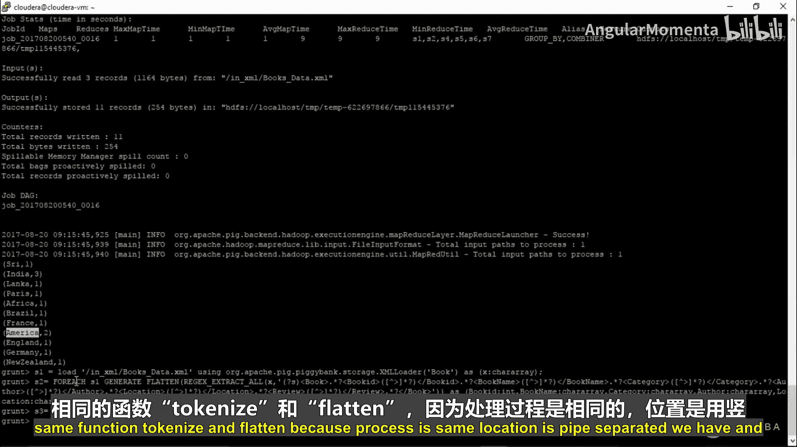

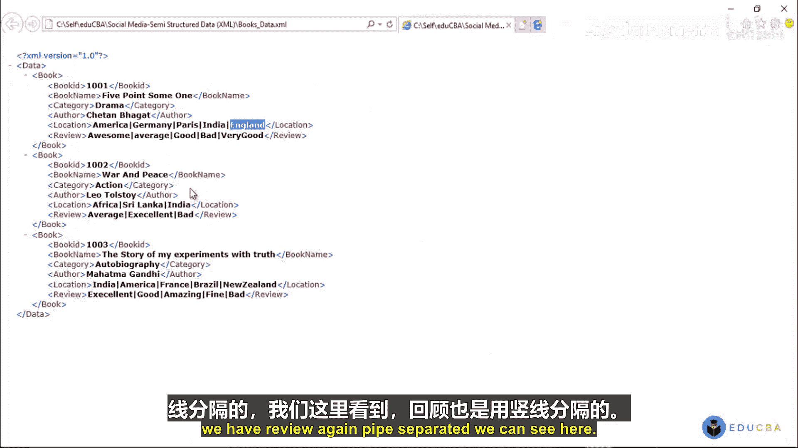

### 步骤 4: 分组与统计

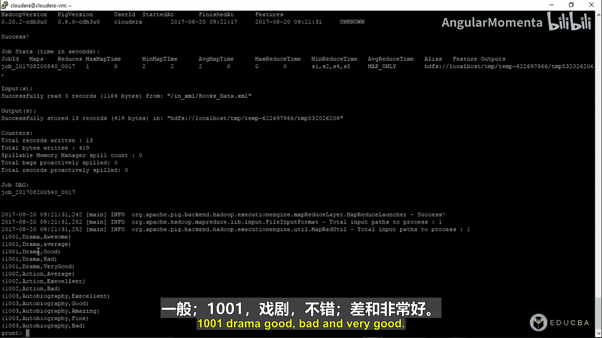

数据展平后，按位置进行分组和计数就变得非常简单。

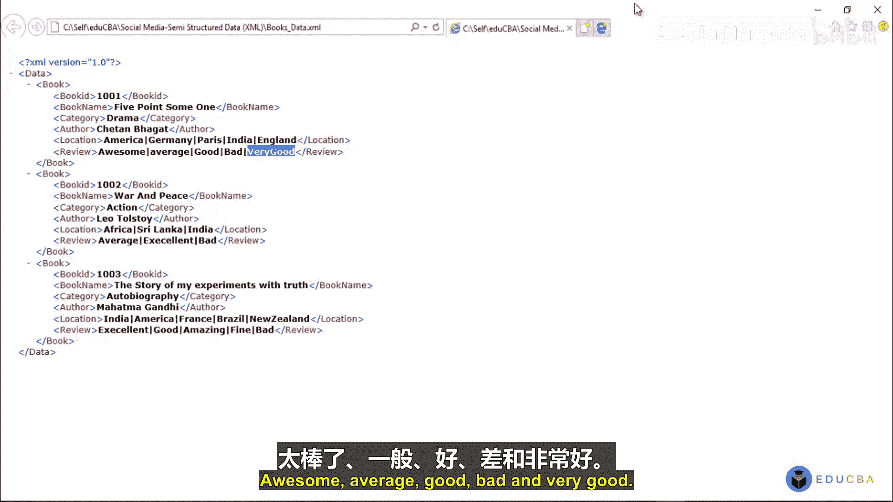

```pig
D = GROUP C BY single_location;
E = FOREACH D GENERATE
    group AS location,
    COUNT(C.book_id) AS record_count;
DUMP E;
```
输出结果将显示每个位置出现的总记录数，例如：`(America, 2)`，`(India, 4)` 等。

## 处理评论字段

同样的方法可以应用于评论字段。假设原始数据中 `reviews` 字段也是管道符分隔（如 `awesome|average|good|bad|very good`）。

处理流程完全一致：
1.  使用 `TOKENIZE(REPLACE(reviews, ‘|’, ‘,’))` 将评论字符串拆分成包。
2.  使用 `FLATTEN` 将每条评论展平成独立行。
3.  使用 `GROUP BY` 和 `COUNT` 统计每种评论出现的次数。

**注意**：Pig 默认是**大小写敏感**的。例如，“Average” 和 “average” 会被视为两种不同的评论进行统计。

## 同时处理多个多值字段

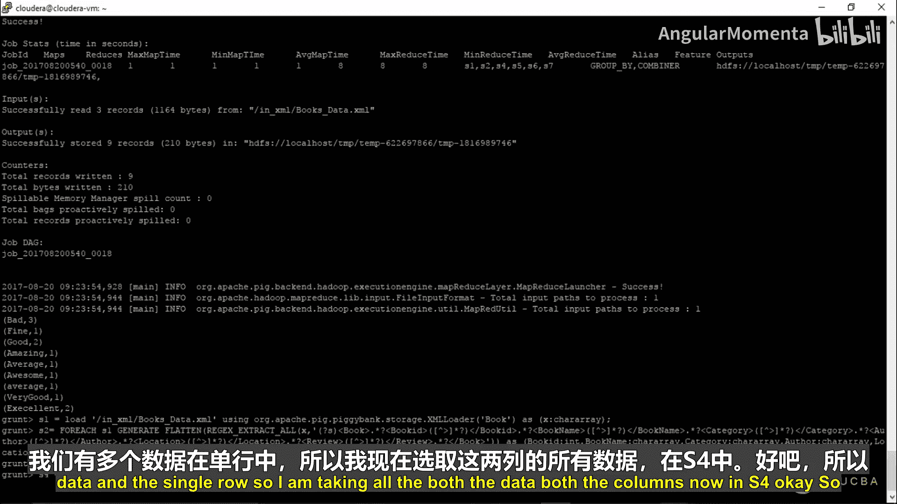

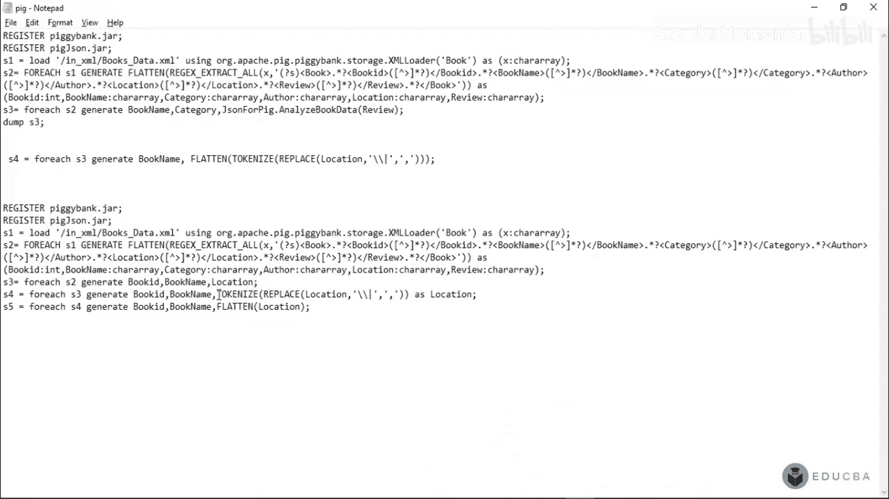

可以同时对多个字段（如 `locations` 和 `reviews`）应用 `FLATTEN` 操作。但这会产生这些字段的**笛卡尔积**，即每个位置会与每条评论组合。

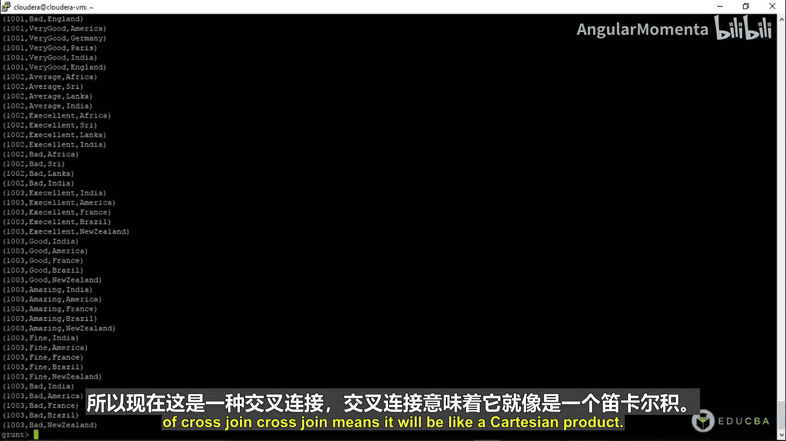

```pig
-- 同时展平位置和评论
F = FOREACH A GENERATE
    book_id,
    FLATTEN(TOKENIZE(REPLACE(locations, ‘|’, ‘,’))) AS loc,
    FLATTEN(TOKENIZE(REPLACE(reviews, ‘|’, ‘,’))) AS rev;
```
结果行数会显著增加（位置数 × 评论数），适用于特定的关联分析场景。

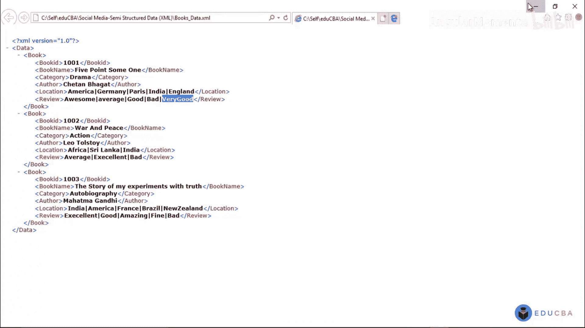

## 存储分析结果

与之前一样，我们可以将最终的分析结果存储到 HDFS，以便后续使用。

```pig
STORE E INTO ‘/user/hadoop/analysis/location_count’ USING PigStorage(‘,’);
```
存储后，可以通过HDFS命令查看或下载结果文件。

## 总结

本节课中我们一起学习了：
1.  **`TOKENIZE` 函数**：用于将包含分隔符的字符串字段拆分成一个词元包。
2.  **`FLATTEN` 运算符**：用于将包中的元素展开，使每个元素形成独立的行，这是将复杂嵌套数据转换为扁平表结构的关键步骤。
3.  **组合应用**：通过 `TOKENIZE` 和 `FLATTEN` 的组合，我们能够轻松处理XML或JSON中常见的多值字段，为后续的 `GROUP BY` 和聚合分析（如 `COUNT`）做好准备。
4.  **实际工作流**：我们实践了从加载数据、拆分字段、展平数据到分组统计的完整分析流程，并将结果持久化存储。

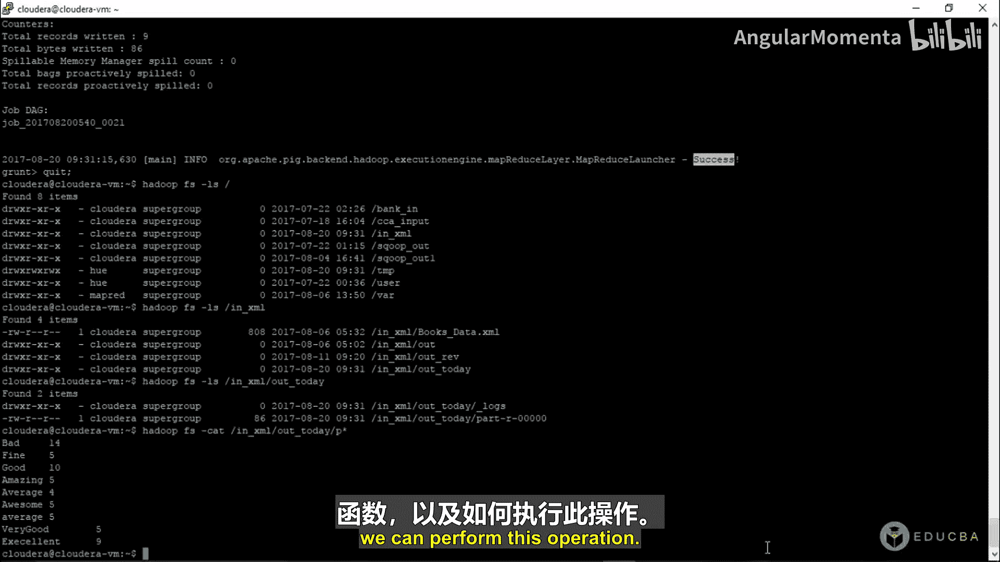

掌握这些技巧，能够极大地增强我们在Pig中处理半结构化数据的能力，为大数据分析中的维度拆分和指标统计打下坚实基础。