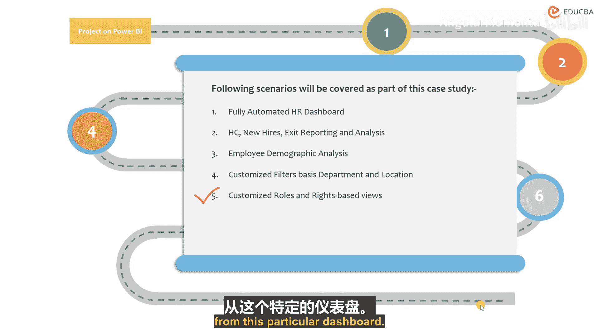
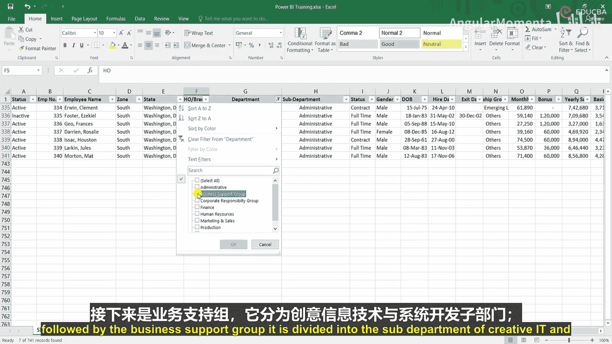

# 001：人力资源仪表板项目导论

在本节课中，我们将学习如何使用 Power BI 创建一个组织人力资源仪表板。这是一个中级难度的项目，旨在将图表基础知识和 Power BI 基本技能结合起来，完成一个完整的仪表板构建。

## 项目目标与技能要求

要完成此项目，您需要具备以下技能：
*   图表的基础知识。
*   Power BI 的基础知识。

同时，您还需要具备学习该工具的技术思维。

项目的目标是使参与者能够设计人力资源仪表板，并获得 Power BI 的实践操作经验。

## 项目学习内容

在本项目中，您将学习：
*   创建仪表板：我们将完全专注于如何实际创建一个仪表板。
*   学习 Power BI 的中级应用。

## 项目要求与适用人群

以下是项目的前提要求：
*   基础的 Power BI 知识。
*   基础的图表知识。

本项目适合以下人群：
*   渴望成为人力资源分析师或进入人力资源分析领域的从业者。
*   正在攻读人力资源与分析专业的研究生。
*   任何希望学习在 Power BI 中创建仪表板的人。

完成本项目后，您将获得以下技能：
*   获得使用 Power BI 创建仪表板解决实际场景问题的实践经验。
*   掌握如何从零开始创建一个优秀的人力资源 Power BI 仪表板。

## 案例研究背景

一家快速消费品公司决定持续地分析和报告其员工信息给董事会。

作为案例研究的一部分，您需要创建一个自动化的仪表板任务。这意味着当这家公司想要分析其员工信息时，我们需要创建这个仪表板来满足需求。

本案例研究将涵盖以下场景：
*   创建一个完全自动化的人力资源仪表板，该仪表板将链接到 Excel 或文本文件。
*   展示员工总数、新入职、离职报告及其分析。
*   展示员工人口统计分析。
*   在 Power BI 中设置基于部门和地点的自定义筛选器，以便查看者可以自行对数据进行持续的筛选和排序。
*   创建自定义角色和权限视图。

## 数据理解与探索

现在，让我们开始。首先，让我们了解数据，因为在创建仪表板之前，您必须始终理解数据的含义，只有这样您才能从中提取有意义的见解。这是人力资源的职能部分，您需要理解数据，并将其与技术部分相结合，从而为查看者创建完整的仪表板。

让我们从第一部分开始，即员工状态。状态分为**在职**和**离职**。

接下来是员工代码。共有 **741** 个员工代码，这意味着总共有 741 名员工，包括当前在职和离职的员工。

第二部分是员工姓名。数据中还有一个“名”的字段，目前我们可以忽略它，从数据中删除，我们只需要完整的员工姓名。

接下来是区域。区域下面进一步划分为州。

以下是区域与州的对应关系：
*   **东北区**：纽约州、新泽西州。
*   **南区**：佐治亚州、华盛顿特区、佛罗里达州、密西西比州、田纳西州。
*   **西区**：亚利桑那州、科罗拉多州。

这代表了公司及其分支机构所在地。

州之后是总部或分支机构。公司的总部在华盛顿特区，所有其他办公室都属于分支机构。

现在，我们以类似的方式查看部门部分。部门和子部门是关联的。

以下是部门与子部门的对应关系：
*   **行政部**：行政。
*   **业务支持组**：创意、IT、系统开发。
*   **企业责任组**：环境合规、环境健康与安全、绿色建筑。
*   **财务部**：账户管理、分析团队。
*   **人力资源部**：培训、人力资源运营、专业培训。
*   **市场与销售部**：市场品牌、媒体、销售。
*   **生产部**：ADC 设施、工程、主要制造项目、制造、产品开发。
*   **研究与质量组**：质量保证、质量控制、研究中心、研发。

以上是关于部门和子部门的信息。

现在我们继续看另一个方面：雇佣状态。员工的工作方式分为全职、合同制、兼职或临时工。这是四种分类，分别对应按月支付的全职、按小时支付、兼职或合同制。

接下来是性别，公司员工分为男性和女性。

出生日期是员工的出生日期，结合性别，这将帮助我们分析人口统计特征，这也是我们的主要分析工具之一。

入职日期是截至 2012 年的员工入职日期。数据基于 2012 年，我们将据此进行分析。这显然是一个示例数据，您可以应用我创建的观点和分析到您自己的数据集上。

同样，离职日期也是 2012 年的。

接下来的部分是领导力组别。员工被分为四个领导力组别：进阶领导者、新兴领导者、其他、高级领导者。

继续往下，我们将看到员工的薪资构成。这是月薪，这是奖金，这是年薪。年薪基本上是月薪乘以 12。

此外，还包括员工的基本工资、房屋租金津贴、交通津贴、特殊津贴和退休金。

最后但同样重要的是工作评级。

## 数据总结与连接方式

这是我们拥有的主要数据，基本从员工状态开始，包括：员工代码、姓名、区域、州、总部/分支机构、部门、子部门、雇佣状态、性别、出生日期、入职日期、离职日期、领导力组别，以及最后的金额总计，即员工的月薪、奖金、年薪，及其在基本工资、房屋和交通津贴、特殊津贴、退休金之间的分配，以及工作评级。

我们将使用这些基本数据在 Power BI 中创建整个仪表板，并从中得出见解和分析。

目前数据在 Excel 中，但在某些情况下，您也可能会收到文本格式的数据，这同样可以链接到 Power BI。当然，Excel 也可以链接到 Power BI。这样做的一个好处是，如果我在两者之间保持活动连接，即使我更新了某些内容，它也会自动在 Power BI 中更新。这是这种连接方式的一个优点。显然，也可以将 Power BI 连接到数据所在的系统本身。当然，有多种方法可以实现，我使用的是最流行的方法，即从 Excel 连接到 Power BI，这种方法被大多数公司广泛使用，并且很多员工也在使用 Power View。您显然可以使用自己的方法来创建仪表板。

## 总结

本节课中，我们一起学习了第二个 Power BI 项目——创建人力资源仪表板的导论部分。我们明确了项目的目标、所需技能、学习内容以及适用人群。接着，我们深入了解了案例背景，即一家公司需要自动化分析员工信息。最后，我们详细探索了将要使用的源数据结构，包括员工状态、地域、部门、人口统计信息、雇佣详情及薪资构成等，为下一阶段的实际仪表板构建打下了坚实的基础。在接下来的课程中，我们将开始将这些数据导入 Power BI 并进行可视化设计。