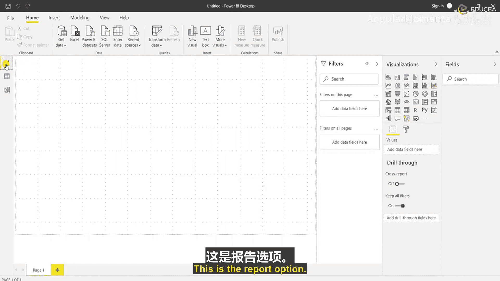
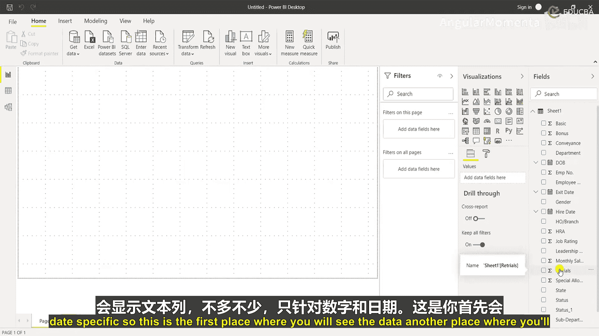
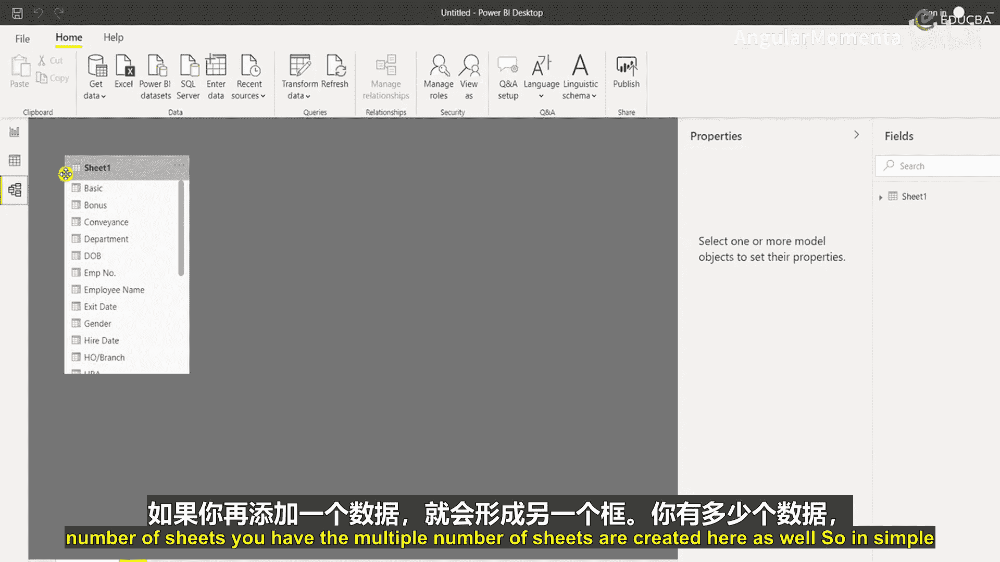
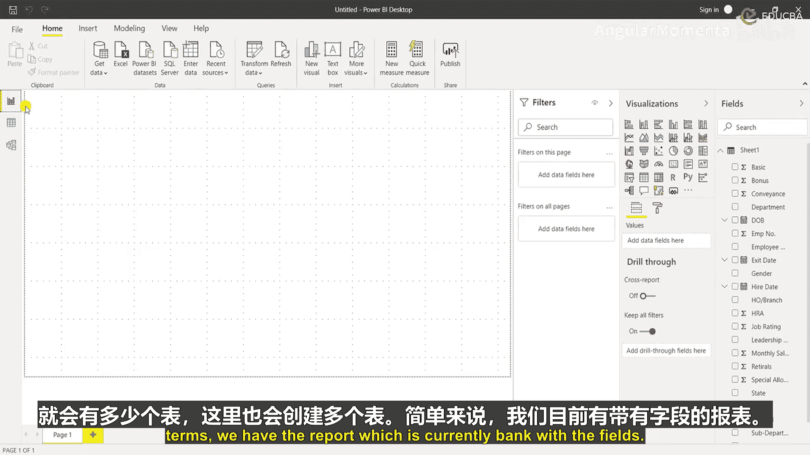
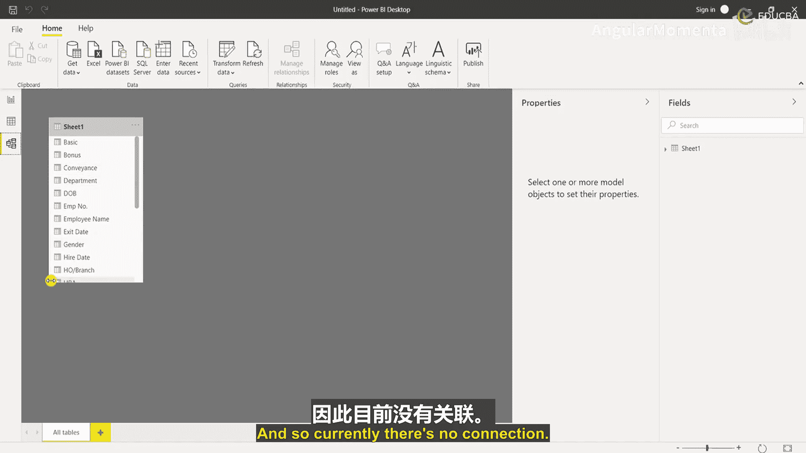
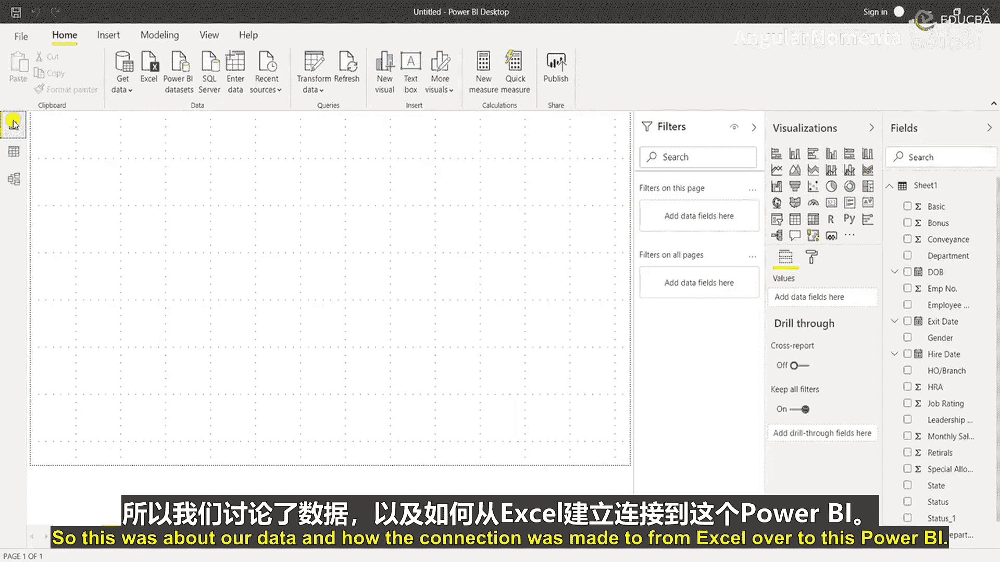

# 002：Power BI 界面导览与数据导入

在本节课中，我们将学习Power BI Desktop软件的基本界面布局，并完成从Excel文件导入数据的第一个关键步骤。这是构建任何仪表板的基础。

## 界面概览

上一节我们介绍了Power BI的安装，本节中我们来看看软件启动后的主界面。打开Power BI后，你会看到一个类似下图的界面。我们将快速浏览整个界面，然后开始我们的项目。

界面上方是主功能区，包含多个选项卡，其功能与Excel等微软工具类似。

以下是各主要选项卡的功能介绍：

*   **文件**：包含保存、获取数据、导入、导出等基本操作。所有已保存的文件也会在此显示。
*   **开始**：这是核心功能区。你可以在此添加数据并进行各种计算。
    *   **剪贴板**：包含剪切、复制、粘贴等常见功能。
    *   **数据**：最重要的部分之一。点击“获取数据”，你可以从多种来源导入数据，如Excel、Power BI数据集、SQL Server、文本/CSV文件、Web等。在本课程中，我们将主要使用**Excel**。
*   **转换数据**：导入数据后，有时需要编辑数据（例如修正日期格式、数字格式等）。此功能允许你按需转换数据并保存步骤。之后导入新文件时，这些步骤会自动运行。例如，你可以设置将文本格式的日期自动转换为日期格式。
*   **插入**：主要用于可视化。你可以添加新的视觉对象、文本框，或从应用商店导入更多视觉对象。
*   **计算**：这是Power BI中非常有趣的部分，涉及公式（称为“度量值”或“快速度量”）。它帮助你在数据基础上进行计算和分析。
*   **共享**：完成报告后，你可以在此保存并将其分享给相关利益相关者（如HR负责人、业务负责人）。与Excel相比，Power BI的分享和权限管理更加简便。

Power BI的一个显著优势是能够以清晰的方式分析数据并快速发布。

## 深入功能区

现在，让我们更详细地了解“插入”和“建模”等选项卡。

“插入”选项卡下，你可以添加新页面（类似Excel的工作表）、各种视觉对象，甚至AI驱动的视觉对象（如关键影响因素和分解树）。你还可以集成其他Microsoft 365应用，例如将Power BI仪表板嵌入到自定义的Power Apps中。

“建模”选项卡用于管理数据之间的关系。如果你有多个数据表，可以在此创建它们之间的关联。“计算”部分再次提供了公式工具。“页面刷新”用于更新数据，“新建参数”可用于执行假设分析。“安全性”则用于管理数据角色和权限。

“视图”选项卡控制报告的外观，例如主题、缩放、网格线和对齐选项。启用“对齐到网格”和“锁定对象”功能，有助于整齐地排列视觉对象并在演示时保持布局稳定。

右侧的“显示窗格”可以打开或关闭“筛选器”、“书签”、“性能分析器”等面板。

最后，“帮助”选项卡提供了Power BI的官方帮助工具。

## Power BI的核心优势区域

然而，真正让Power BI区别于普通Excel使用的，是界面右侧的交互式工具面板。这是创建仪表板的核心区域。

这个区域主要包含“筛选器”、“视觉对象”和“字段”窗格。一旦我们添加数据并开始构建视觉对象，这里就会变得非常活跃。创建基础仪表板很大程度上只是简单的拖放操作，通常**15分钟内**即可完成一个基本版本。这是Power BI平台发挥其超越Excel优势的关键区域。

在界面左侧，你会看到三个小图标，分别代表：
1.  **报表**视图：设计和编辑仪表板页面的地方。
2.  **数据**视图：以表格形式查看和探索原始数据。
3.  **模型**视图：查看和管理所有数据表之间的关系图。

在本课程中，我们将使用单一数据源，但会进行多项计算、添加度量值、筛选器和各种可视化，以构建一个出色的演示用仪表板。

## 导入Excel数据

接下来，我们将进行实际操作——导入数据。过程非常简单。

1.  转到“开始”选项卡。
2.  点击“获取数据”，在下拉菜单中选择“Excel”。
3.  在弹出的窗口中，导航并选择你想要连接的Excel文件。

我已经准备了一份数据，现在将其连接到Power BI。选择文件后，系统需要一些加载时间。

加载后，你会看到一个导航器窗口，列出Excel文件中的所有工作表。我只有一个工作表，所以直接选择它。如果你的文件有多个工作表，可以在此选择需要连接的那个。

点击“加载”后，整个数据将被导入。Power BI可能会对大型数据集进行采样或压缩以提升处理速度，这是正常现象。

数据加载完成后，建议先检查数据预览，确保一切符合预期。例如，数字字段应为数值型，日期字段应为日期型。在我的数据中，“基本工资”是数值，“出生日期”是日期，看起来都正确。

确认无误后，点击“加载”。加载过程需要一些时间，系统会构建数据模型。

## 验证加载的数据

如何知道数据已成功加载？有两个主要地方可以查看：

首先，在右侧的“字段”窗格中，之前是空白的，现在列出了所有数据表的字段。Power BI会自动识别每个字段的数据类型（例如，`123`表示数值，`日历`图标表示日期）。对于日期字段，Power BI还会自动创建层次结构（年、季度、月、日），便于后续分析。这与Excel数据透视表的功能类似。

其次，你可以点击左侧的“数据”视图图标，以完整的表格形式查看所有数据，操作体验类似Excel。

在这里，你可以对数据进行排序、筛选，并检查是否有任何异常。例如，我发现“状态”字段在导入后自动重命名为“状态1”，这是因为原数据中有两个同名字段。我可以直接在此处右键点击字段名进行重命名。

## 检查数据模型

最后，点击左侧的“模型”视图图标，查看数据连接情况。

目前我们只有一个数据表，所以模型视图中只有一个独立的框。如果连接了多个具有关联关系的表，这里会以连线显示它们之间的关系。

至此，我们已经成功完成了三件事：
1.  **报表**视图：待设计的空白画布，右侧已列出数据字段。
2.  **数据**视图：完整、准确的数据表。
3.  **模型**视图：确认了单一数据表的连接。

本节课中我们一起学习了Power BI Desktop的基本界面构成，并成功地从Excel文件导入了数据，为后续构建交互式仪表板打下了坚实的基础。下一节，我们将开始利用这些数据创建我们的第一个可视化图表。

