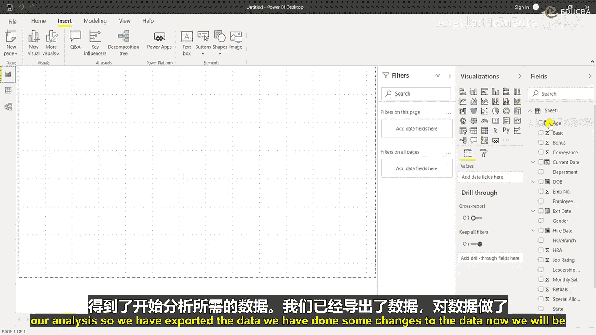
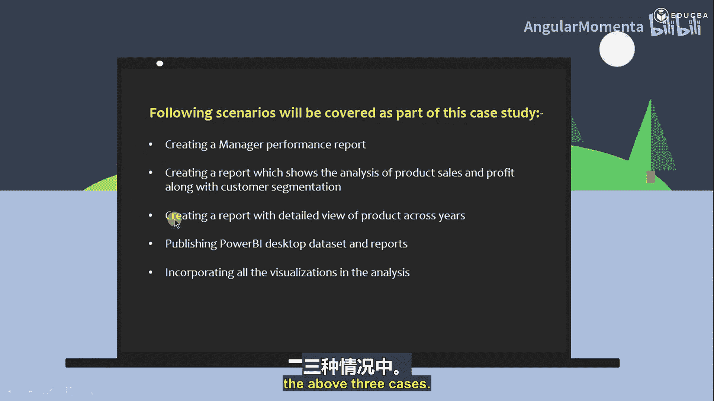
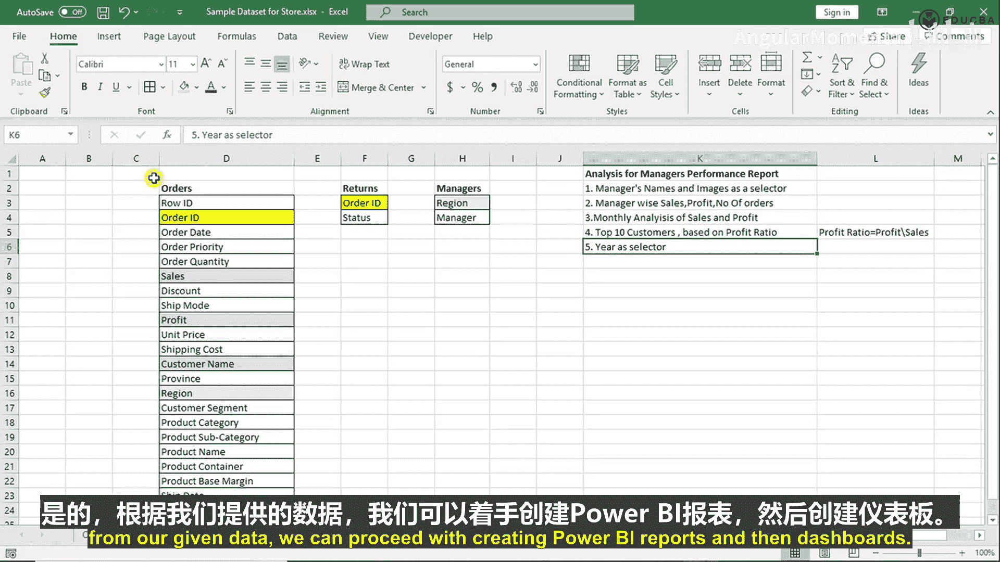

# 003：Power BI 中的公式化列 📊

## 概述
在本节课中，我们将学习如何在 Power BI 中创建和使用公式化列。我们将通过一个具体的案例，为员工数据集添加“工龄”、“当前日期”和“年龄”等计算列，并学习相关的 DAX 公式。

---

## 数据准备与列创建

上一节我们导入了数据。本节中，我们将对数据进行编辑和增强。

我们将创建一个新列。具体来说，我们拥有“出生日期”和“雇佣日期”字段，我们希望创建一个能告诉我们员工年龄和工龄的新列。

以下是创建新列的步骤：

1.  首先，为新列命名。我们将创建两个列：“工龄”和“年龄”。
2.  新列将被添加到数据表中。

## 创建“工龄”列

我们将尝试从“离职日期”中减去“雇佣日期”，然后除以 365 天来计算工龄。

初始公式为：`工龄 = (离职日期 - 雇佣日期) / 365`

然而，这个公式只适用于已离职的员工（即“离职日期”不为空的记录）。对于仍在职的员工，我们需要使用当前日期进行计算。

因此，我们需要一个更复杂的逻辑：如果“离职日期”不为空，则使用它；否则，使用一个指定的“当前日期”。

## 引入“当前日期”并完善公式

我们可以使用 `TODAY()` 函数获取系统当前日期，但我们的数据集是 2012 年的历史数据。为了分析的一致性，我们需要一个固定的“当前日期”，例如 2012年12月31日。

我们可以使用 `DATE` 函数手动指定这个日期：`DATE(2012, 12, 31)`。

现在，我们可以使用 `IF` 函数来构建完整的“工龄”计算公式。`IF` 函数检查一个条件是否满足，如果为真则返回一个值，为假则返回另一个值。

完整的“工龄”列 DAX 公式如下：
```
工龄 =
IF(
    NOT(ISBLANK([离职日期])), // 如果离职日期不为空
    ([离职日期] - [雇佣日期]) / 365, // 则使用离职日期计算
    (DATE(2012,12,31) - [雇佣日期]) / 365 // 否则使用固定“当前日期”计算
)
```
创建列后，可以在“建模”选项卡中调整数字格式（例如，保留一位小数）。

## 创建“年龄”列

接下来，我们创建“年龄”列。其逻辑与“工龄”类似。

公式为：`年龄 = (当前日期 - 出生日期) / 365`

同样，我们使用固定的“当前日期”（2012年12月31日）进行计算：
```
年龄 = (DATE(2012,12,31) - [出生日期]) / 365
```
创建后，同样需要将列的格式设置为数字并调整小数位数。

## 操作回顾与总结

以上，我们通过添加新列的方式增强了数据集。操作非常简单：

1.  进入“数据”视图，在“表工具”下选择“新建列”。
2.  输入列名和 DAX 公式。
3.  公式化列旁边会有一个特殊符号（fx）标识。

我们添加了三个列：
*   **工龄**：使用 `IF` 函数判断员工状态，分别用“离职日期”或固定“当前日期”计算。
*   **当前日期**：使用 `DATE(2012,12,31)` 公式固定为分析基准日。
*   **年龄**：使用固定“当前日期”减去“出生日期”并除以 365 计算。

至此，我们完成了数据的初步准备和增强，可以开始进行仪表板分析了。

---

## 项目介绍：使用 Power BI 构建经理绩效报告 📈

### 概述
欢迎来到 Power BI 项目课程。本项目将重点介绍 Power BI Desktop，这是一个可以安装在本地电脑上、用于可视化任何数据的免费应用程序。

本项目旨在通过案例研究，学习如何使用 Power BI 创建经理绩效报告。



### 项目难度与技能要求
本项目的难度主要针对初学者。您只需要具备学习工具的心态以及 Power BI Desktop 的免费安装程序。

### 项目目标
完成本项目后，参与者将能够通过案例研究获得 Power BI 的实践操作经验。重点将放在学习如何构建仪表板上。

### 学习内容
在本项目中，您将学习：
1.  如何创建美观、视觉吸引力强的 Power BI 仪表板。
2.  Power BI 的高级报告主题，主要是 **DAX（数据分析表达式）**。DAX 是 Power BI 中用于开发简单和稍复杂计算的重要概念。
3.  如何使用市场中的自定义可视化效果以及 Power BI 的内置可视化效果。
4.  如何通过案例研究数据集运用一些数据建模的概念。


### 项目要求与先决条件
唯一的先决条件是工具要求（免费开源），以及学习 Power BI 的热情。


### 目标学员
任何想学习 Power BI 工具的人都可以成为本项目的目标学员。

### 项目成果
项目结束时，您将获得使用 Power BI 创建报告和仪表板的实际场景动手经验。

---

## 案例研究：零售公司经理绩效分析

### 业务背景
一家零售公司希望分析其经理的绩效。这类报告对公司非常重要，通常用于理解经理表现并决定其年度绩效评级。

他们希望分析以下内容：
1.  **产品销售**：每种产品的销售情况，哪种产品销量最大，哪种产品销量不佳。
2.  **利润**：每种产品的利润和利润率。
3.  **客户**：不同客户细分群体在各年份的表现。
4.  **年度产品详情**：产品在不同年份的详细表现视图。

### 项目任务
我们将使用 Power BI 帮助公司完成上述分析。


以下是本案例研究将涵盖的场景：
1.  **创建经理绩效报告**：通过关键绩效指标（KPI）查看每位经理的表现。
2.  **创建产品销售与利润分析报告**：包含客户细分分析。
3.  **创建产品年度详情报告**：展示产品跨年份的详细视图。
4.  **发布与整合**：学习如何发布 Power BI Desktop 报告，以及如何查看数据集和报告。我们将整合上述三个案例所需的所有可视化效果。



希望到目前为止一切清晰。


让我们开始吧。

---

## 数据集探索与关系分析 🔍

现在，让我们查看案例研究将使用的数据集。


我们收到的是一个商店的样本数据集。首先查看有多少个工作表：
1.  第一个工作表是“订单”表。
2.  第二个工作表是“退货”表。
3.  第三个工作表是“经理”表。

在 Power BI 中，每个工作表将作为一个表。

### 数据概览
通常，在收到所有工作表后，我们会创建一个新表，将所有表中的列转置并粘贴过来。这样做的好处是，可以快速概览所有列的内容，并帮助我们确定每个表之间的关系。

以下是各表的主要信息：
*   **订单表**：粒度级别是“订单ID”。包含订单日期、订单优先级、订单数量、销售额、折扣、运费、利润等列。
*   **退货表**：包含“订单ID”和“状态”列。
*   **经理表**：包含“区域”和“经理”列。

### 识别表间关系
下一步是识别表之间的共同列。

以下是表间关系分析：
1.  **订单表与退货表**：共同列是 **`订单ID`**。这表明它们之间存在关系。
2.  **订单表与经理表**：共同列是 **`区域`**。这也表明它们之间存在关系。

识别出关系后，我们就知道了表之间应如何连接，这为在 Power BI 中创建数据模型奠定了基础。

---

## 需求分析与数据映射 ✅

完成关系分析后，我们将列出经理绩效报告需要回答的问题，并检查现有数据是否支持。

以下是需求与数据的映射分析：

1.  **需求：经理姓名和图片作为选择器**
    *   数据支持：经理姓名存在于“经理”表的“经理”列中。图片不存在，我们需要学习如何在 Power BI 报告中获取和使用图片。

2.  **需求：经理的销售额、利润和订单数量**
    *   数据支持：销售额和利润列存在于“订单”表中。订单数量没有直接列，但我们可以通过计算“订单ID”的数量来得到。

3.  **需求：销售额和利润的月度分析**
    *   数据支持：销售额和利润列存在。没有直接的月份列，但我们可以从“订单日期”列创建“订单月份”和“年份”列。

4.  **需求：基于利润率的前10名客户**
    *   数据支持：客户姓名存在于“订单”表中。利润率列不存在，但我们可以根据公式 **`利润率 = 利润 / 销售额`** 进行创建，因为利润和销售额列都存在。

5.  **需求：年份作为选择器**
    *   数据支持：没有直接的年份列，但我们可以从“订单日期”列中提取。

### 结论
通过以上分析，我们得出结论：根据给定的数据，我们可以继续创建 Power BI 报告和仪表板。



---

## 总结
本节课中，我们一起学习了：
1.  **Power BI 公式化列**：如何使用 DAX 公式创建计算列，例如使用 `IF`、`DATE` 函数计算“工龄”和“年龄”。
2.  **项目整体介绍**：了解了构建经理绩效报告 Power BI 项目的目标、内容和学习路径。
3.  **案例研究分析**：深入探讨了零售公司的业务需求，并对提供的数据集进行了探索、关系分析和需求映射，确认了利用现有数据构建报告的可能性。


接下来，我们将开始实际操作，将数据导入 Power BI 并着手构建我们的第一个可视化报告。