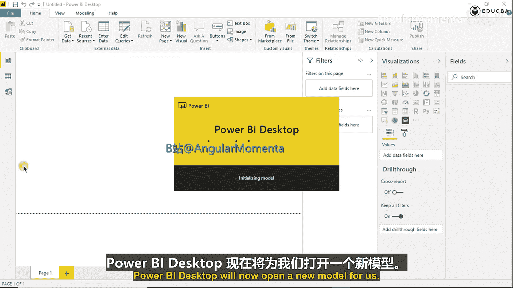
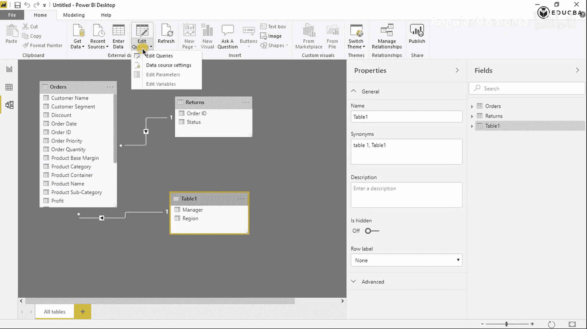
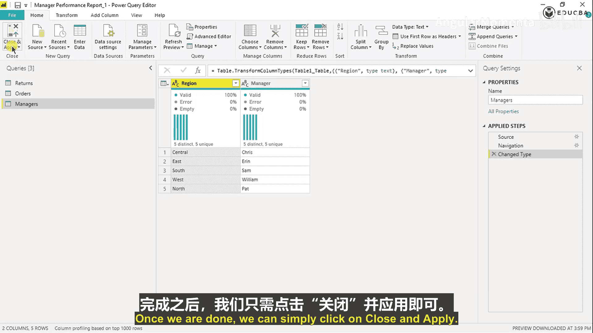
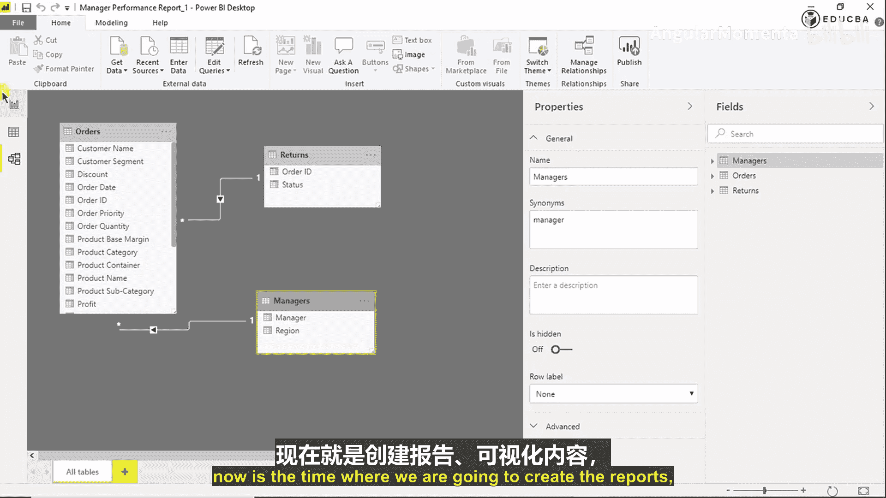

# 004：导入数据与建立模型 📊

在本节课中，我们将学习如何将准备好的Excel数据集导入Power BI Desktop，并建立正确的数据模型关系。这是创建交互式仪表板的第一步。

## 概述

上一节我们完成了Excel中的数据准备与分析。本节中，我们将把数据导入Power BI，建立表间关系，并初步了解Power BI的界面与核心功能。

## 打开Power BI Desktop并获取数据

首先，打开Power BI Desktop应用程序。其初始界面提供了多种数据获取选项。

以下是Power BI Desktop初始界面的主要区域：

*   **获取数据**：这是导入数据的核心入口。
*   **最近使用的源**：可以快速连接之前使用过的数据源。

点击“获取数据”按钮。Power BI支持连接多种数据源，主要分为以下几类：

*   **文件**：如Excel、文本/CSV、XML、JSON、PDF、文件夹等。
*   **数据库**：如SQL Server、Oracle、MySQL等。
*   **Power Platform**：如Power BI数据集、数据流、Common Data Service。
*   **Azure**：各类Azure云数据服务。
*   **在线服务**：如SharePoint Online、Salesforce、Google Analytics等。

对于本例，我们选择最简单的“Excel”工作簿作为数据源，然后点击“连接”。

## 选择并预览数据

在弹出的文件选择器中，找到并选择我们的Excel文件。导航器窗口会显示该文件中的所有工作表。

在左侧列表中，我们可以看到之前准备好的工作表：`Manager`、`Orders`、`Returns`以及用于分析的`Sheet1`。

以下是各工作表的预览情况：

*   `Orders`和`Returns`表：被正确识别为表格，首行是列标题。
*   `Manager`表：未被识别为规范表格，列名显示为“Column1”、“Column2”。
*   `Sheet1`：这是我们用于分析的工作表，本次导入不需要它。

我们选中`Returns`、`Orders`和`Table1`（即`Manager`数据）的复选框。虽然`Manager`表显示为`Table1`且列名不规范，但我们可以稍后在Power Query编辑器中修正。确认选择后，点击“转换数据”。

## 使用Power Query编辑器进行数据转换

点击“转换数据”后，会打开Power Query编辑器。这是Power BI的“数据厨房”，用于数据清洗、转换和建模。

Power Query编辑器的主要特点是每一步操作都会被记录为“应用步骤”，您可以随时查看或退回之前的步骤。

目前，我们暂不进行复杂转换。直接点击“关闭并应用”，将数据加载到Power BI模型中。

## 在模型视图中检查并建立关系

数据加载后，Power BI会进入报告视图。为了查看和管理数据模型，我们需要切换到“模型”视图。

在这里，我们可以看到已加载的三个表：`Orders`、`Returns`和`Table1`。Power BI自动检测到了`Orders`表和`Table1`（`Manager`）之间通过`Region`列建立的关系。

但是，Power BI没有自动创建`Orders`表和`Returns`表之间的关系。我们需要手动建立。

首先，点击“管理关系”。在对话框中，可以看到当前已激活的关系。点击“自动检测”，但未能发现新关系。

因此，我们需要手动新建关系。点击“新建”，进行如下设置：

*   **第一个表**：选择`Orders`
*   **第二个表**：选择`Returns`
*   **列**：在两表中选择`Order ID`列
*   **基数**：选择“多对一(`*:1`)”，因为`Orders`表中同一`Order ID`可能对应多行（不同产品），而`Returns`表中每个`Order ID`通常只出现一次。
*   **交叉筛选器方向**：选择“单个”
*   勾选“将此关系设为活动状态”

点击“确定”后，所需的关系就建立完成了。关闭关系管理窗口。

## 重命名表并保存文件

回到模型视图，我们希望将`Table1`重命名为更具意义的`Managers`。

重命名操作需要在Power Query编辑器中进行。点击“主页”选项卡下的“转换数据”，再次打开编辑器。

在左侧“查询”窗格中，右键点击`Table1`，选择“重命名”，将其改为`Managers`。完成后，点击“关闭并应用”。

系统会提示保存Power BI文件（`.pbix`文件），请选择一个位置进行保存。至此，数据导入和模型建立阶段完成。

## 了解仪表板蓝图（Mockup）

在商业项目中，开始创建可视化之前，通常会有一个称为“Mockup”（蓝图或线框图）的设计稿。

我们的Mockup展示了最终仪表板应有的样子，它包含以下关键元素：

*   **年份选择器（单选）**：用于筛选数据年份。
*   **经理图片选择器**：点击不同经理的图片，可筛选对应数据。
*   **KPI卡片**：展示关键绩效指标。
*   **月度趋势折线图**：分析月度数据变化。
*   **前10客户表格**：以表格形式展示，并包含利润率计算。

这个Mockup为我们接下来的可视化工作提供了清晰的指引。

## 创建第一个可视化：年份切片器

现在，我们开始根据Mockup创建可视化。首先从“年份切片器”开始。

在Power BI中，切片器是一种用于筛选其他视觉对象的控件。在“可视化”窗格中，点击“切片器”图标，画布上会出现一个空的切片器。

我们需要将包含年份信息的字段拖入这个切片器。由于`Orders`表中有`Order Date`字段，Power BI智能地自动生成了一个`Year`层次结构。将`Order Date`下的`Year`字段拖入切片器的“字段”区域。

默认的切片器可能是下拉列表或复选框样式。根据Mockup，我们需要一个单选列表。

在“可视化”窗格中，切换到“格式”选项卡，展开“选择控件”，将“单选”选项设置为“开”。这样，切片器就变成了单选按钮样式。我们可以暂时调整其大小和位置。

## 创建经理选择器（使用自定义视觉对象）

接下来，创建经理选择器。Mockup要求使用经理的图片作为筛选按钮。Power BI内置的视觉对象中没有直接满足此需求的。

但Power BI提供了一个市场，可以下载社区开发的自定义视觉对象。

点击“可视化”窗格底部的“…”图标，选择“从AppSource获取更多视觉对象”。在市场中搜索“Chiclet Slicer”。

“Chiclet Slicer”这个视觉对象可以显示图像或文本按钮，并作为画布上其他视觉对象的筛选器。这正符合我们的需求。点击“添加”将其导入。

导入后，“Chiclet Slicer”会出现在可视化窗格中。点击它，在画布上添加该视觉对象。

将`Managers`表中的`Manager`字段拖入该视觉对象的“字段”区域。现在，画布上会显示以经理名字为按钮的切片器。我们可以暂时调整其大小和位置。

关于如何将经理名字替换为图片，我们将在后续课程中详细讲解。

## 总结

本节课中，我们一起学习了Power BI数据导入与建模的核心流程。我们首先将Excel数据导入Power BI，并使用Power Query编辑器进行初步管理。随后，在模型视图中检查并手动建立了必要的表间关系（特别是`Orders`和`Returns`之间的多对一关系）。最后，我们根据仪表板蓝图（Mockup），创建了年份单选切片器，并引入了“Chiclet Slicer”自定义视觉对象作为经理选择器的基础。

下一节，我们将深入探索如何美化这些视觉对象，并开始构建展示业务指标的KPI卡片。