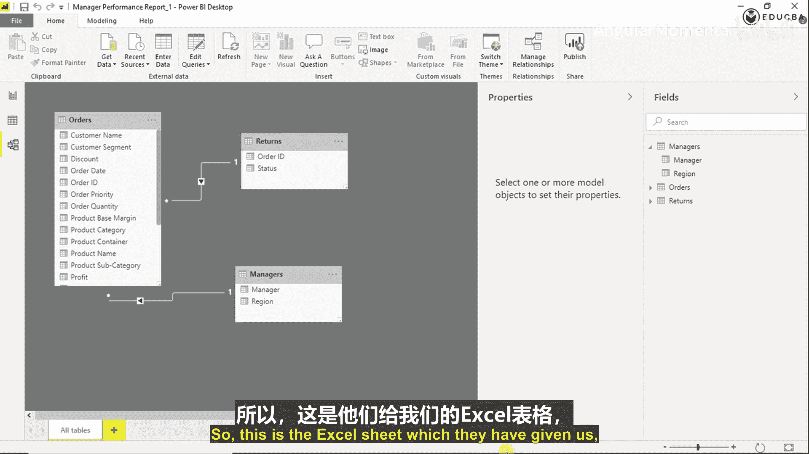
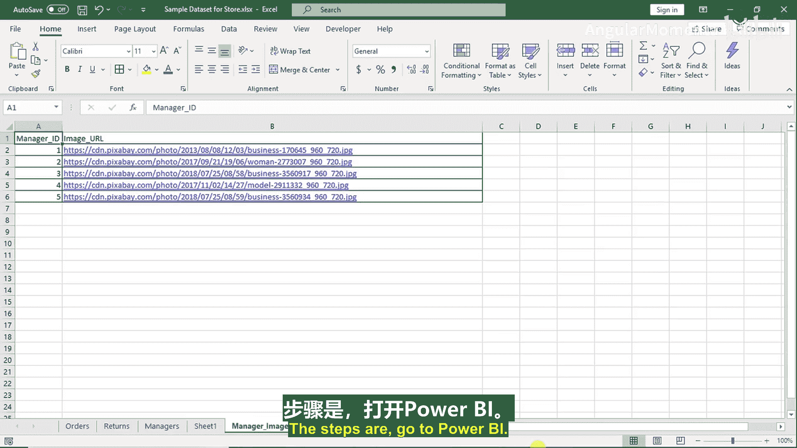
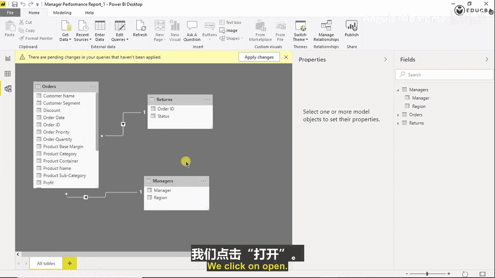
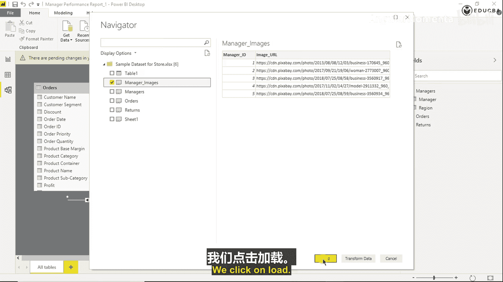
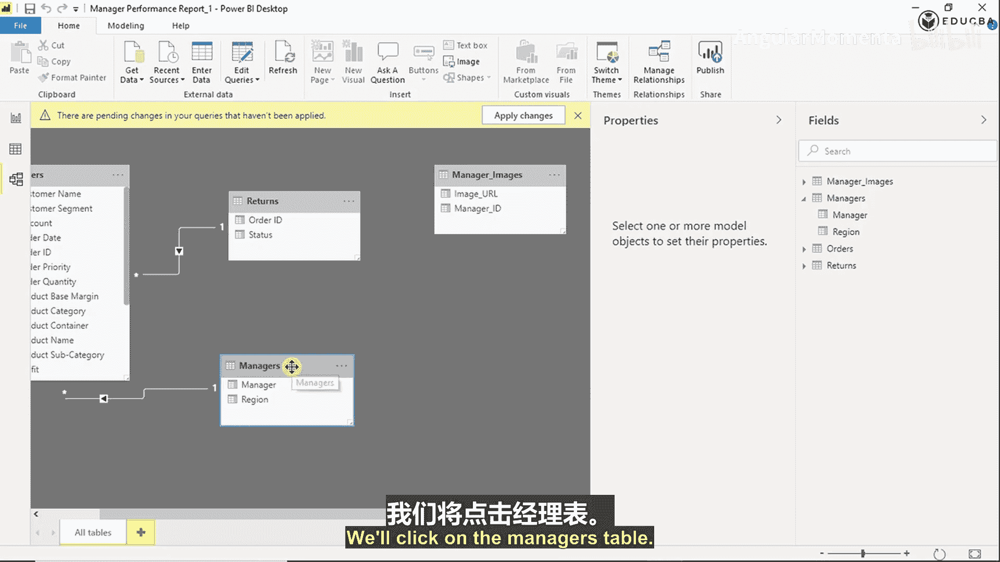
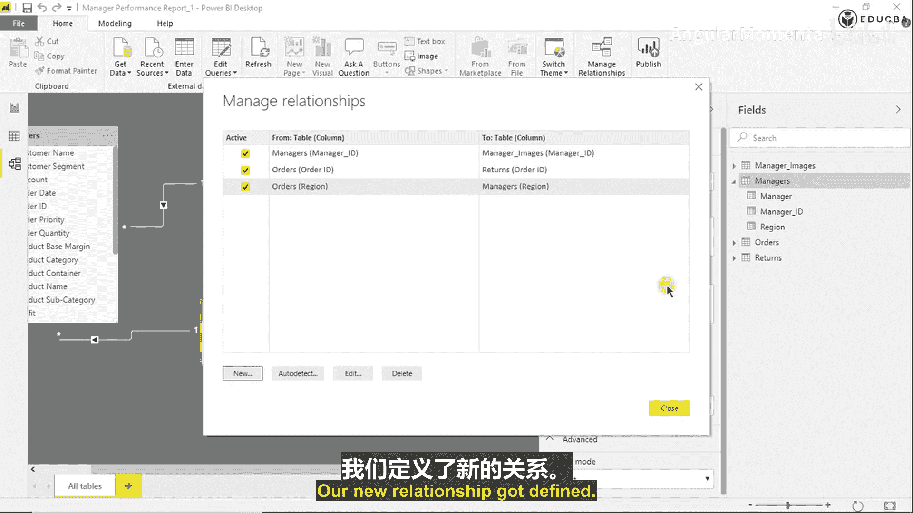
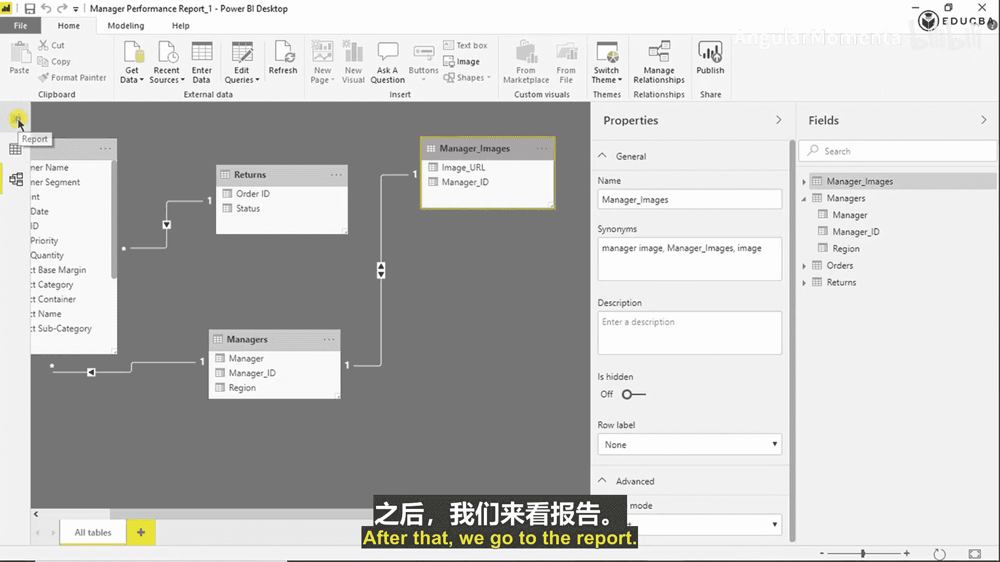
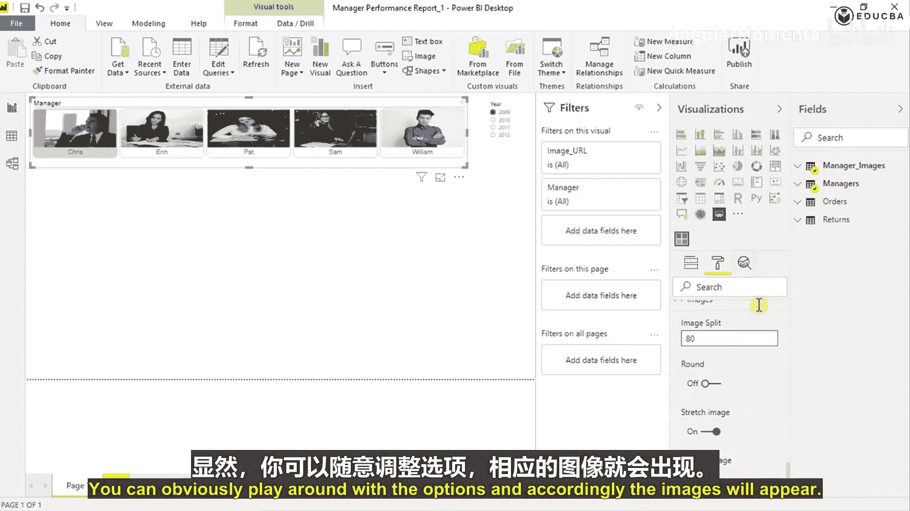

# 005：在切片器中使用图像

## 概述
在本节课程中，我们将学习如何在Power BI的切片器控件中显示经理的头像图片。我们将从导入包含图片URL的Excel数据开始，建立数据表之间的关系，并最终在仪表板上创建一个美观的图片切片器。

## 导入图片数据
上一节我们完成了基础数据模型的构建，本节中我们来看看如何为经理信息添加图片。

假设我们收到了一个包含经理图片信息的Excel表格。

这是提供的Excel表格，其中包含了经理ID和对应的图片URL。

在行业中，通常最佳实践是让经理姓名对应一个ID列。然而，到目前为止，我们的经理表中并没有经理ID。有两种方法可以解决这个问题。

第一种方法是要求对方在这个新表格中添加一个经理名列，以便我们可以基于姓名与我们的经理表进行连接。

由于我们这里的数据非常有限，只有五行，我们可以选择第二种方法：在Power BI的经理表中自行添加一个经理ID列。接下来我们将看到具体如何操作。

首先，让我们将这个数据导入到Power BI中。步骤如下：

我们转到“建模”选项卡，点击“获取数据”。选择“Excel”。首先点击示例数据集所在的文件。我们点击“打开”。

我们点击“manager images”工作表。这是我们想要的数据。点击“加载”。

## 建立数据关系
接下来，我们需要在这些表之间建立关系。让我们看看如何操作。

我们点击“经理”表。

点击“编辑查询”。进入“经理”表。现在我们需要一个经理ID列。操作如下：

我们转到“添加列”选项卡。选择“重复列”。将其命名为“ManagerID”。

由于我们没有信息表明“Chris”是否等于“Manager ID1”，目前我们假设Chris对应ID 1。但在实际工作中，这应是客户提供的信息。

因此，我们将“Chris”的值替换为“1”。将“Ed”的值替换为“2”。将“Sam”的值替换为“3”。其他经理也依此类推。

完成后，我们点击“关闭并应用”。可以看到，我们得到了一个新列“ManagerID”。

现在我们可以定义表之间的关系。为此，我们点击这里的关系视图。

点击“管理关系”。点击“新建”。选择源表（经理表）。选择目标表（经理图片表）。选择“ManagerID”列进行连接。这是一个一对一的关系，因为两个表都只有五行数据。点击“确定”。

我们的新关系已定义，点击“关闭”。

现在，经理表和经理图片表之间已建立关系。

## 创建图片切片器
之后，我们转到报表视图。

我们已经创建了这个卡片切片器。现在让我们看看如何获取这些图片。

我们转到“数据”字段窗格。找到“manager images”表。

点击“Image URL”字段，并将其拖拽到画布上的“图像”视觉对象区域。看，图片已经显示在这里了。

每张图片都作为一个切片器选项出现。我们可以看到这部分已经完成。

## 格式化切片器
接下来，我们将处理其他可视化效果。但在继续之前，我们最好先格式化当前这些可视化效果，以便了解现有页面的空间布局。

因此，我们将从这个切片器开始格式化。我们转到“格式”窗格。

逐一调整各个格式选项。在“常规”选项中，有切片器的方向。我们希望是水平方向，所以首先将其改为“水平”。

然后我们可以看到，前三张图片在一行，后两张在下一行。但我们希望所有五张图片都在同一行。因此，我们将“每行项目数”设置为5。

接下来，将“行”保持为0。在这里，你可以勾选或取消勾选“允许多选”。目前我们保留多选。如果设置为“单选”，则必须选择一位特定经理才能继续操作。如果需要，可以设置为“第一个”，这样第一个选项会自动被选中。

作为规则，我们通常将“X位置”和“Y位置”设置为10，以便仪表板布局整齐。目前，我们先设置一个绝对值，例如X: 1100。之后显然可以更改。

暂时将“高度”设置为180。200看起来有点大。之后随着可视化效果的增多，我们显然会再调整。

然后是“标题”，即经理切片器的标题。我们将格式化它，增加文本大小，使颜色更深一些，你可以选择任何你想要的颜色。

“轮廓”指的是这个区域。我们转到“切片器项”。“文本大小”是选项的大小。如果你想要稍大一点的切片，可以调整。“每个切片器项的高度”也可以调整。

“选定颜色”是选中项的颜色。“悬停颜色”是鼠标悬停时的颜色。“未选定颜色”是未选中项的颜色。“禁用颜色”是禁用状态的颜色。“轮廓颜色”是这个边框的颜色，我们可以让它更浅一些。

“内边距”是额外的填充间距。

我们这里有各种“轮廓样式”选项，可以设置为“圆形”或保持“方形”。这基本上决定了切片器的形状。注意我们做成了方形。如果选择“圆形”，可以看到边缘变圆了。我们认为对于图片，圆形看起来更好。

## 调整图片显示
现在这些图片看起来很小，并且位置偏上。我们需要格式化这些图片。“图像拆分”作为一个通用实践，我们需要调整数值以获得理想的图片显示效果。目前我将其设置为75。

你可以选择显示圆形图片还是正常图片，是否拉伸图片。

“底部图像”选项会使图片向下移动，名称向上移动。75的拆分比例看起来对我们比较合适，因此我们继续使用75。你显然可以尝试不同的选项，图片会相应变化。

## 总结
在本节课中，我们一起学习了如何将外部图片数据集成到Power BI中。我们通过添加ID列和建立表关系，成功地将经理头像URL与经理信息关联起来。最后，我们创建并精细地格式化了一个图片切片器，使其在仪表板中既美观又实用。这为构建交互式商业报告仪表板增添了重要的视觉元素。