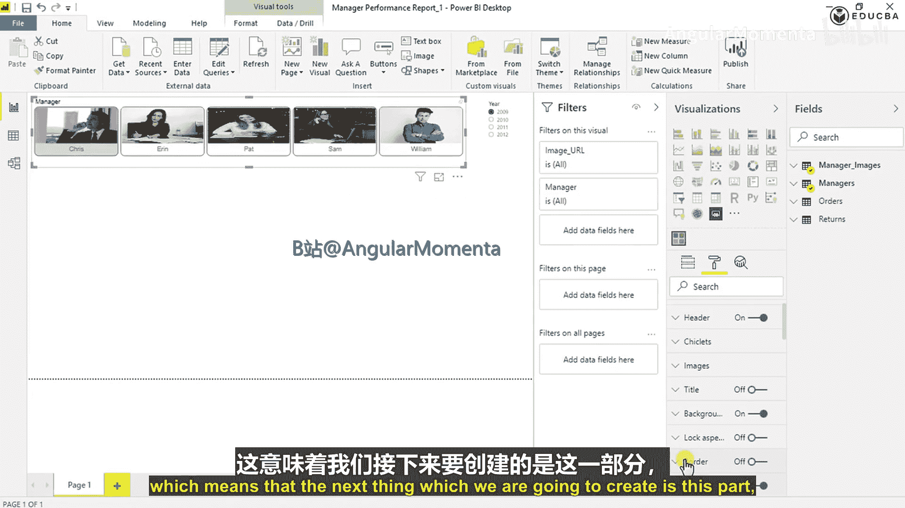
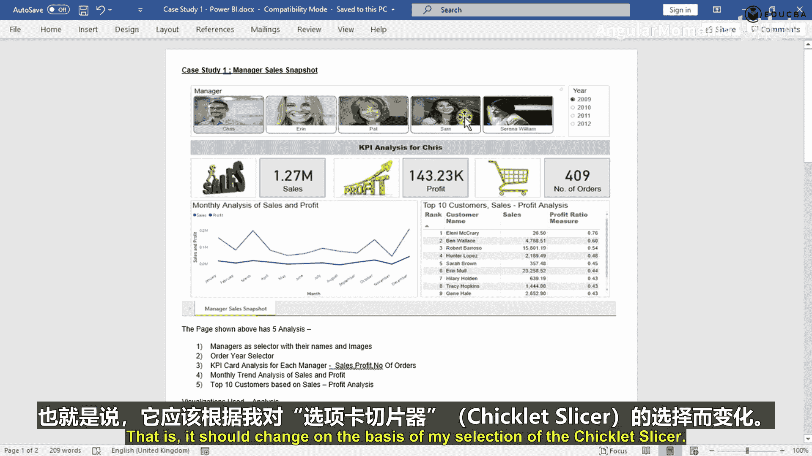
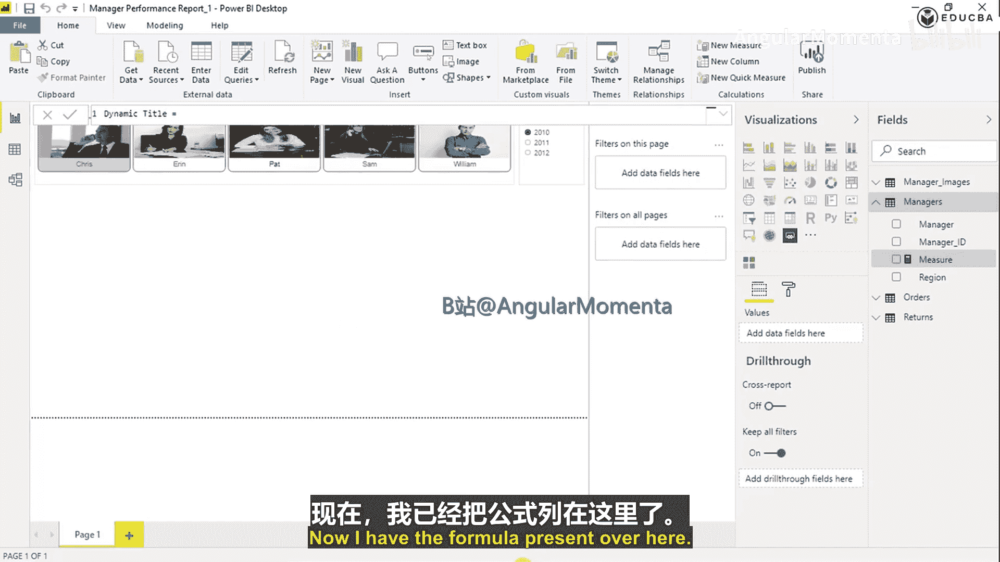
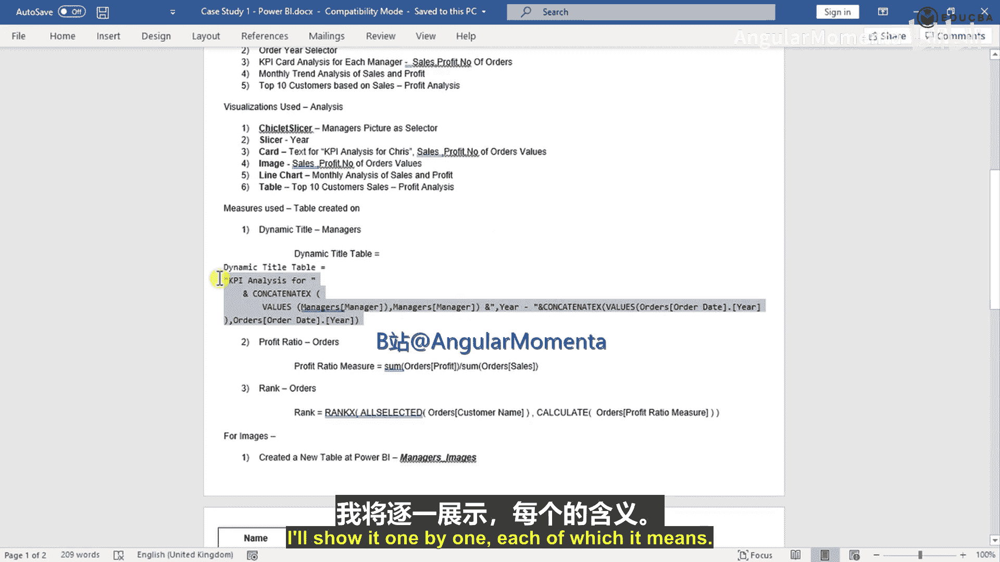
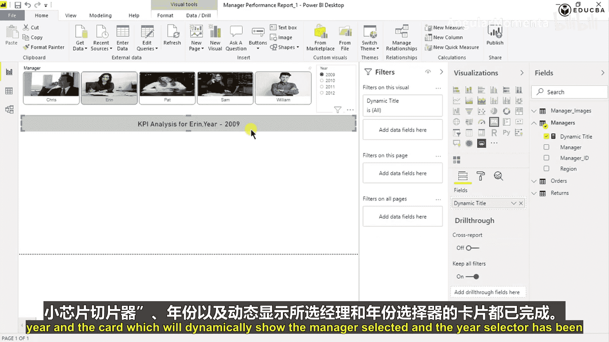
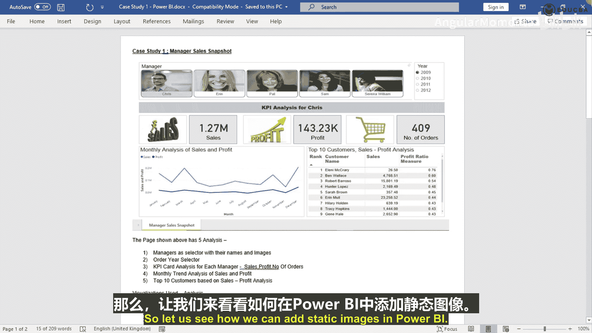
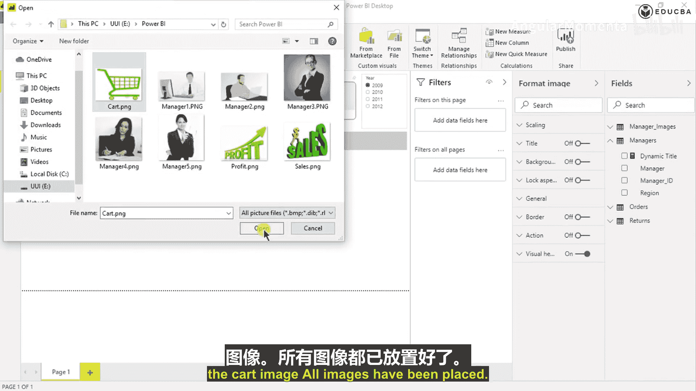
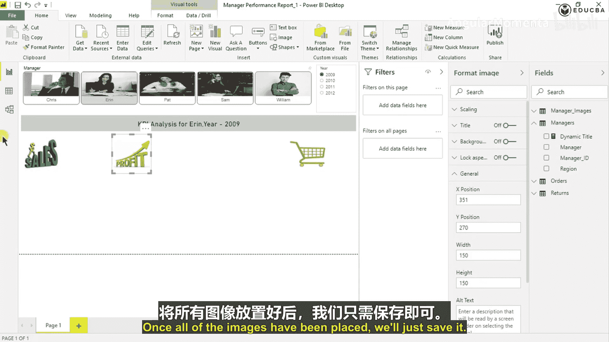

# 006：视觉对象标题与动态文本

在本节课中，我们将学习如何配置视觉对象的标题选项，并创建一个能根据切片器选择而动态变化的文本标题。这是构建交互式仪表板的关键步骤。

## 视觉对象标题详解

上一节我们配置了切片器，本节中我们来看看视觉对象标题部分。视觉对象标题指的是出现在视觉对象顶部的所有选项控件。

当您将鼠标悬停在某个设置上时，可以看到其说明。例如，“选择以打开视觉对象标题。对视觉对象标题可见性的更改仅应用于阅读视图。”这意味着此处所有额外的选项都与视觉对象标题相关。

以下是视觉对象标题包含的主要选项，您可以根据需要进行开关：

*   **背景**：可以调整标题背景的颜色和透明度。
*   **视觉错误图标**：当视觉对象出现错误或警告时，是否显示错误图标。
*   **信息图标**：是否显示额外的信息图标。
*   **下钻下拉菜单**：是否允许通过下拉菜单进行数据下钻。
*   **固定图标**：是否显示将视觉对象固定到其他位置的图标。
*   **焦点模式图标**：是否显示进入焦点模式的图标。
*   **更多选项图标**：是否显示包含更多操作（如导出、查看数据等）的图标。
*   **筛选器图标**：是否显示用于筛选此视觉对象的图标。

您也可以选择完全禁用视觉对象标题。目前，我们暂时保留这些设置。

## 格式化切片器

接下来，我们继续格式化之前创建的切片器。我们之前为此切片器的Y轴位置设置了10，宽度为1100。因此，从X轴开始的整个宽度是 `10 + 1100 = 1110`。

我们希望与下一个视觉对象之间有10个单位的间隔。所以，年份切片器的X轴位置可以设置为大约1130。您可以根据视觉效果随时调整这些数值。

我们将进行以下设置：
*   **X轴位置**：1130
*   **Y轴位置**：10（与经理切片器保持一致）
*   **宽度**：150
*   **高度**：180

现在，我们进入“选择控件”部分进行配置。您可以设置是否为单选，以及是否开启切片器标题。为了保持一致性，我们将年份标题的字体大小也设置为12，字体家族选择Arial或Verdana。

以下是其他可调整的格式选项：
*   **项目颜色**：可以调深一些以提高可读性。
*   **文本大小**：可以增大以便更清晰。
*   **背景与边框**：可以添加一个淡淡的边框。
*   **标题**：可以开启或关闭。





我们建议在添加每个视觉对象时，都进行一些即时格式化。这有助于您了解画布上剩余的空间，以便规划下一个视觉对象的放置。

## 创建动态标题

接下来，我们希望在画布上添加一个文本框或卡片，用于显示针对所选经理和年份的KPI分析。这意味着，当用户点击不同的经理时，文本应相应变为“KPI分析 用于 Chris”等。因此，这个文本必须是动态的，而非静态。

我们将通过创建一个度量值来实现这个动态标题。

首先，右键点击“Managers”表，选择“新建度量值”。我们将其命名为“Dynamic Title”。

我们需要的文本结构是：`“KPI分析 用于 [经理姓名] 年份 [所选年份]”`。这涉及到将静态文本与动态值（经理姓名和年份）连接起来。





在Power BI中，有两个连接函数：`CONCATENATE` 和 `CONCATENATEX`。
*   `CONCATENATE` 用于连接两个**静态**文本字符串。
*   `CONCATENATEX` 则用于**动态**连接。它是一个迭代函数，会遍历一个表或列中的每一行，对每行计算一个表达式，然后将所有结果连接成一个字符串。您可以指定分隔符（如逗号或空格）。

由于我们的标题需要根据切片器的选择动态变化，因此必须使用 `CONCATENATEX` 函数。

动态标题度量值的DAX公式如下：
```
Dynamic Title =
"KPI分析 用于 " &
CONCATENATEX(
    VALUES('Managers'[Manager]),
    'Managers'[Manager],
    ", "
) &
" 年份 " &
CONCATENATEX(
    VALUES('Orders'[Order Date Year]),
    'Orders'[Order Date Year],
    ", "
)
```

**公式解析**：
1.  `"KPI分析 用于 "`：这是一个静态文本前缀。
2.  第一个 `CONCATENATEX`：遍历 `‘Managers‘[Manager]` 列中当前被筛选出的值（即切片器中选择的经理），将它们用逗号和空格连接起来。
3.  `" 年份 "`：另一个静态文本。
4.  第二个 `CONCATENATEX`：遍历 `‘Orders‘[Order Date Year]` 列中当前被筛选出的值（即切片器中选择的年份），进行连接。

创建好度量值后，在“可视化”窗格中选择“卡片图”视觉对象，将“Dynamic Title”度量值拖入“字段”区域。现在，卡片上显示的文本会随着您在切片器中选择不同的经理和年份而动态更新。

## 格式化动态标题卡片

现在，我们对这个动态标题卡片进行格式化，使其与布局协调。

首先进行位置计算。经理切片器的Y位置是10，高度是180，所以其底部在 `10 + 180 = 190` 的位置。我们希望卡片从Y轴200的位置开始，与切片器有10个单位的间隔。X位置设为10，与上方切片器对齐。

对于宽度，我们需要参考年份切片器。年份切片器的X位置是1130，宽度是150，所以其右侧边界在 `1130 + 150 = 1280`。我们希望卡片宽度与之匹配，因此将卡片宽度设置为1280。

进行以下设置：
*   **X轴位置**：10
*   **Y轴位置**：200
*   **宽度**：1280
*   **高度**：50

接着，调整卡片格式：
*   **边框**：添加一个淡淡的边框。
*   **背景色**：设置为浅灰色。
*   **文本**：关闭类别标签，调整字体大小（例如22），并启用自动换行。
*   **工具提示**：可根据需要设置悬停提示。

## 添加静态图像

最后，我们为仪表板添加一些装饰性的静态图像，如销售、利润等图标。

在“主页”选项卡下，点击“图像”按钮，从本地选择所需的图片文件（例如sales.png, profit.png等）。将它们插入到报表画布中。



插入后，需要对这些图像进行排列和格式化：
*   **位置**：将所有图像的X轴位置设为10，使其左对齐。Y轴位置需要依次计算，确保它们垂直排列且间距合适。
*   **尺寸**：统一调整宽度（例如150）和高度（例如150），使它们大小一致。



排列完毕后，保存报表。



## 总结

本节课中，我们一起学习了：
1.  **视觉对象标题**的配置选项及其作用。
2.  如何精确地**格式化切片器**的位置和外观。
3.  使用 `CONCATENATEX` DAX函数创建**动态文本标题**，使其能响应切片器的选择。
4.  如何**格式化卡片视觉对象**以融入整体布局。
5.  在Power BI报表中**插入和排列静态图像**。



现在，您的仪表板已经具备了交互式标题和初步的视觉结构。在接下来的课程中，我们将继续添加核心的KPI指标和图表。