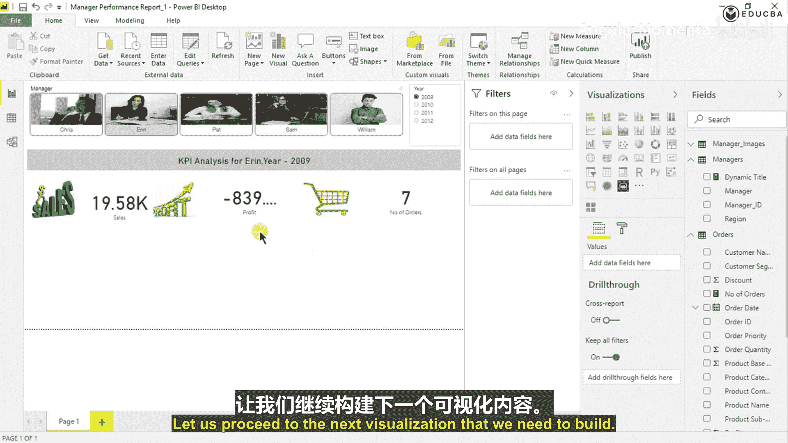
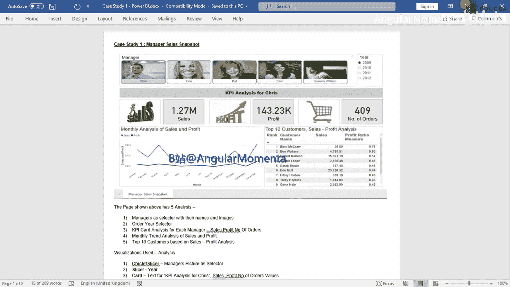
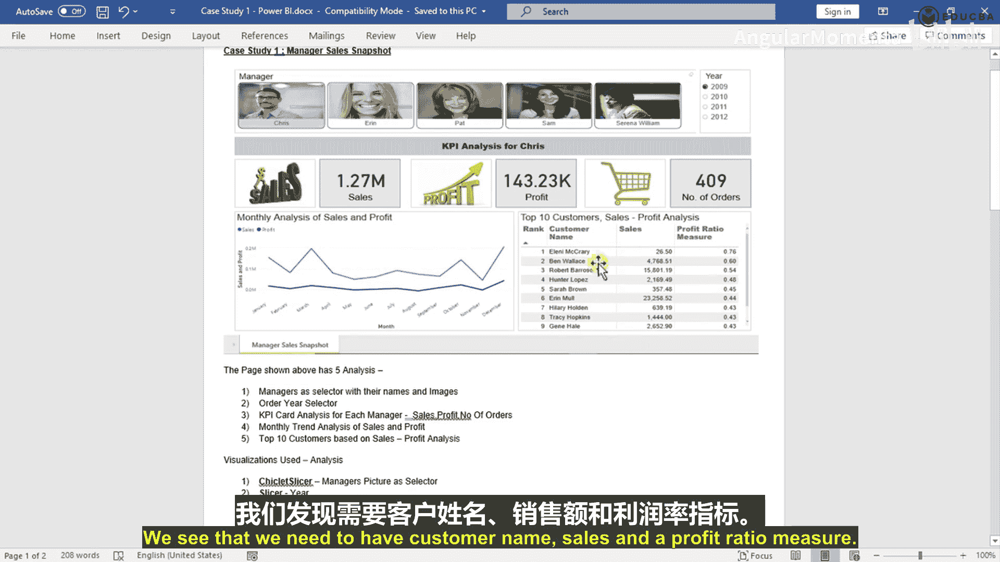
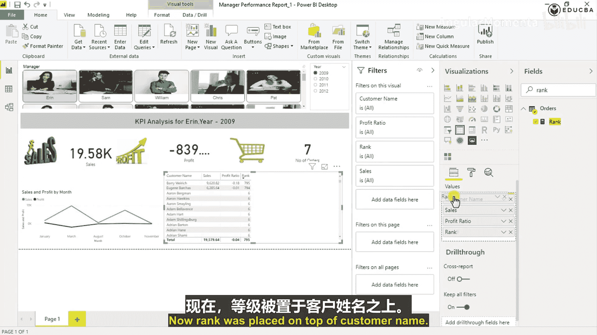

# 007：核心图表与度量值创建

## 概述

在本节课中，我们将学习如何在Power BI中创建关键绩效指标卡片、折线图以及数据表格。我们将重点介绍如何创建新的度量值，例如订单数量和利润率，并学习使用RANKX函数为数据添加动态排名。这些是构建交互式商业报告仪表板的核心步骤。

---

## 创建关键绩效指标卡片

上一节我们完成了图像的导入。本节中，我们来看看如何为每个经理展示关键绩效指标。

我们需要使用“卡片”视觉对象来动态显示销售、利润等数据。以下是操作步骤：

1.  在“可视化”窗格中，选择“卡片”视觉对象。
2.  将画布上新出现的卡片视觉对象拖放到合适位置。
3.  在“字段”窗格中，将“Sales”字段拖入该卡片的“字段”区域。
4.  重复上述过程，创建第二个卡片视觉对象，并放入“Profit”字段。

接下来，我们需要显示订单数量。我们发现数据模型中并没有现成的“订单数量”字段。



订单数量实际上是唯一订单ID的计数。这意味着，我们需要创建一个新的度量值来计算它。



## 创建“订单数量”度量值

以下是创建“订单数量”度量值的步骤：

1.  在“字段”窗格中，右键单击“Orders”表。
2.  选择“新建度量值”。
3.  在公式栏中输入：`Number of Orders = DISTINCTCOUNT(Orders[Order ID])`
    *   `DISTINCTCOUNT` 函数用于计算某一列中不同值的数量。
4.  按Enter键确认创建。
5.  现在，可以像使用其他字段一样，将这个新建的“Number of Orders”度量值拖入一个新的卡片视觉对象中。


至此，我们完成了销售、利润和订单数量三个KPI卡片的初步创建。详细的格式调整我们稍后进行。



---

## 构建月度销售与利润折线图

接下来，我们需要展示销售和利润的月度趋势分析。从示例图中可以看出，这需要使用折线图。

以下是创建折线图的步骤：

1.  在“可视化”窗格中，点击“折线图”图标。
2.  在“轴”字段区域，放入“Order Date”字段下的“Month”层次结构（例如，`Order Date[Year-Month]`）。
3.  在“值”字段区域，依次放入“Sales”和“Profit”字段。

此时，一个包含两条线（分别代表销售和利润）的月度趋势折线图就创建完成了。

---

## 构建客户分析表格

现在，让我们开始创建网格格式的表格，用于展示前10名客户的销售与利润分析。表格需要包含客户名称、销售额和利润率。

首先，我们拖入一个“表格”视觉对象，并进行初步设置：

1.  将“Customer Name”字段拖入表格的“值”区域。
2.  将“Sales”字段拖入表格的“值”区域。

接下来，我们需要“利润率”。我们发现数据模型中并没有这个度量值，因此需要根据业务逻辑创建一个新的。

## 创建“利润率”度量值

利润率通常定义为利润总额除以销售总额。以下是创建步骤：

1.  在“Orders”表上右键单击，选择“新建度量值”。
2.  在公式栏中输入：`Profit Ratio = SUM(Orders[Profit]) / SUM(Orders[Sales])`
    *   在Power BI中创建涉及计算的度量值时，通常需要使用聚合函数，如 `SUM`。
3.  按Enter键创建该度量值。

创建完成后，进行数据验证是一个好习惯。我们可以将“Profit Ratio”和“Profit”字段暂时都加入表格，手动计算一两个客户的利润率，与系统结果对比，以确保公式正确。验证无误后，可以从表格中移除“Profit”字段。

## 创建动态“排名”度量值

表格中还需要一个排名列。排名并非原始数据，需要根据利润率动态计算。这里我们将使用 `RANKX` 函数。

`RANKX` 函数用于返回当前上下文中的表达式在值列表中的排名。以下是创建步骤：

1.  在“Orders”表上右键单击，选择“新建度量值”。
2.  在公式栏中输入以下公式：
    ```
    Rank = RANKX(
        ALLSELECTED(Orders[Customer Name]),
        CALCULATE([Profit Ratio])
    )
    ```
    *   **`ALLSELECTED(Orders[Customer Name])`**：这是第一个参数，它返回一个去除了表格内部筛选器（但保留来自报表页面的外部筛选器，如“经理”和“年份”）的客户名称列表，作为排名的依据范围。
    *   **`CALCULATE([Profit Ratio])`**：这是第二个参数，它为列表中的每一个客户计算其对应的利润率值，`RANKX` 将根据这个值的大小进行排名。
3.  输入完成后，按Enter键保存。

**注意**：如果公式报错“向 RANKX 函数传递的参数过少”，请检查括号是否配对。`RANKX` 需要两个主要参数，确保 `ALLSELECTED(...)` 是一个完整的参数，`CALCULATE(...)` 是另一个。

创建后，将“Rank”度量值拖入表格的“值”区域。你可能会发现，利润率为空值的客户排名相同，这是 `RANKX` 函数的正常行为。

---

## 总结

本节课中，我们一起学习了Power BI仪表板构建的几个关键操作：
1.  使用**卡片图**可视化关键绩效指标。
2.  使用**折线图**展示数据随时间的变化趋势。
3.  通过**新建度量值**来扩展数据模型，满足定制化分析需求（如 `订单数量`、`利润率`）。
4.  使用 **`RANKX` 函数**创建动态排名度量值，其核心公式为 `RANKX(排名的范围, 用于排名的表达式)`。



这些技能是制作交互式、洞察丰富的商业报告的基础。下一节，我们将学习如何对这些可视化元素进行格式美化，并添加交互功能。