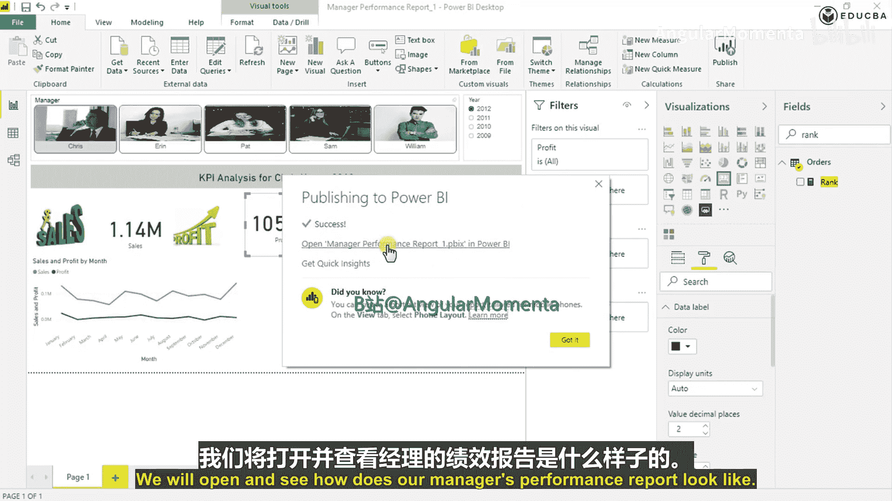
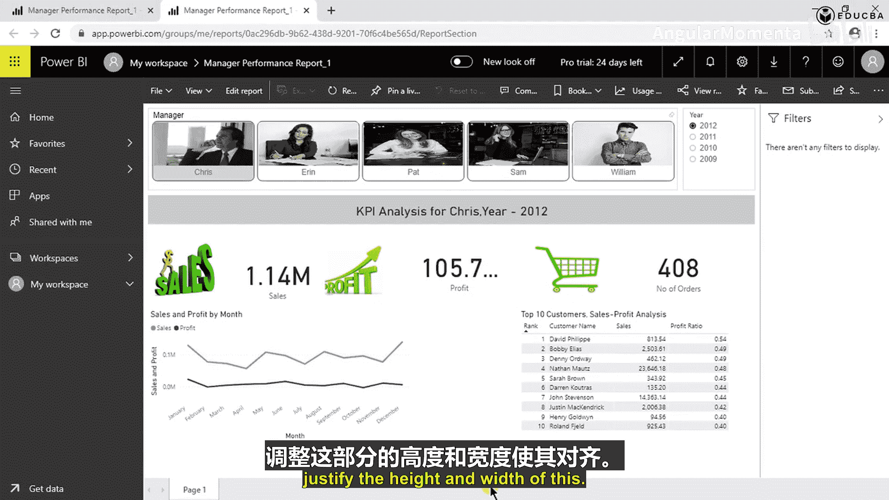
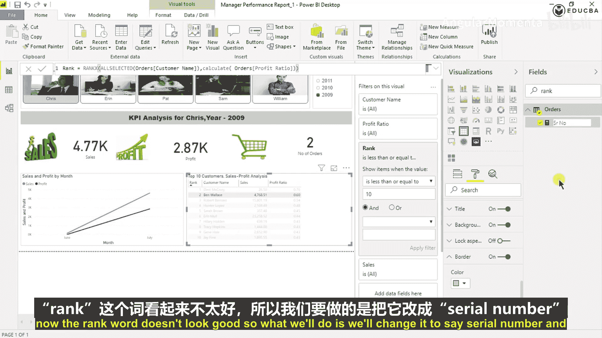

# 008：嵌套过滤器与仪表板格式化

在本节课中，我们将学习如何为“前10名客户销售利润分析”图表应用嵌套过滤器，并完成整个仪表板的视觉格式化工作，使其更加专业和美观。

上一节我们完成了核心图表的创建，本节中我们来看看如何通过过滤器精确控制数据，并对所有视觉对象进行排版美化。

## 应用“前10名”过滤器

现在，我们希望看到前10名客户的销售利润分析。这意味着排名应限制在前10个值。

请注意，Power BI是一个交互敏感的仪表板。在之前的操作中我们看到，当我拖拽“排名”字段时，这里的视图受到了干扰。因此请始终记住，即使在拖放操作中，也需非常小心放置的位置。最佳实践是始终将字段拖放到此处的字段区域，以避免干扰现有的视觉对象。正如我们所见，因为将字段拖到了图表上，现有的可视化效果被打乱了。

我们可以看到，“Val rank”字段出现在了这里，而我们实际上并不需要它，所以将其移除。

现在，让我们将其限制为前10个值。具体操作如下：

我们有一个过滤器窗格，此窗格用于应用所有我们需要的、针对特定视觉对象的过滤器。现在，我们想设置排名前10的过滤器。

以下是操作步骤：
1.  在过滤器窗格中，找到“Rank”字段。
2.  选择筛选条件为“小于或等于”。
3.  在值框中输入 `10`。

我们看到所有客户记录都被限制，最终得到的客户总数为10。保存此设置。

## 初步格式化图表

接下来，对此图表进行一些初步格式化。

首先，我们不需要总计行，因此将其关闭。然后，我们有一个利润度量值，需要为图表添加一个标题。

所需的标题是“Top 10 Customers Sales Profit Ana”。完成设置后保存。

## 与需求原型对比验证

在放置好所有视觉对象后，我们需要对照客户提供的需求原型进行验证，确认是否已完成所有所需视觉对象的基本开发。

让我们开始对比：
*   **经理切片器**：客户要求有一个经理切片器，点击后整个仪表板会刷新。我们已有一个经理切片器，点击时仪表板的各个值都在变化。此部分已完成。
*   **年份选择器**：客户需要一个年份选择器。我们也有一个年份选择器。然而，如果客户希望年份按降序排列（即2012年排在最前），操作方法是：先展开选择器，点击右上角的三个点，选择“降序”。我们看到2012年排到了前面，2009年在最后。通常，在这类经理快报中，客户通常偏好将最新年份显示在顶部。保存此设置。
*   **关键绩效指标分析**：客户需要此处有一个关键绩效指标分析。我们已创建，并且额外添加了一个功能，显示了在此处选择的年份。
*   **销售、利润和订单数量**：客户需要销售、利润和订单数量。我们已在此处创建。
*   **月度销售与利润分析**：客户需要销售和利润的月度分析。月度销售和利润分析已在此处呈现和开发。
*   **前10名客户销售利润分析**：客户需要基于利润率度量的前10名客户销售利润分析。此图表也已创建。

至此，我们得出结论：经理销售快报仪表板所需的所有视觉对象均已创建完成。最后一步是格式化，我们需要以视觉上吸引人的方式对整个仪表板进行格式化，以增强客户的使用意愿。保存当前进度，开始仪表板的详细格式化工作。

## 仪表板发布与视觉格式化

完成所有视觉对象的放置后，下一个重要步骤是对所有这些视觉对象进行格式化，使我们的仪表板看起来更美观。然而，为了最终了解仪表板的外观，我们需要先发布它。

首先点击“发布”，选择工作区，替换现有版本。发布成功后，打开查看经理绩效报告的外观。

这就是它目前的样子。我们理解需要对其进行适当的格式化，使其看起来更美观。

我们可以看到，经理切片器和年份切片器的文本样式不一致。同样，我们需要调整这个的宽度，将这些元素移动到顶部区域，并调整其高度和宽度。让我们开始操作。

首先，使年份切片器与经理切片器的样式一致。

我们将查看之前为经理切片器设置了什么格式。文本大小是12，格式较简单，经理标题是黑色。我们来到这里，点击年份切片器的标题，移除切片器标题，使所有元素保持同步。将标题颜色设为黑色。通常，根据是否需要加粗，我们偏好使用“Arial”或“Arial Black”字体，你可以选择其一。现在，我们将增大此处的字体。转到“项”设置，看起来好多了。

接下来处理这里。将其字体也改为“Arial”或“Arial Black”。将文本大小稍微调小一点。可以为它选择一个更浅的背景色，因为当前颜色看起来有点暗。或者，如果你有颜色的十六进制代码，也可以使用该颜色的浅色版本。接下来，为其添加一点边框。它已经有边框了。

现在，我们将每个元素放置到顶部。首先减少这个的高度。看起来如何？将高度调整为50。40看起来有点小，所以还是用50。现在宽度是50。接下来进行位置计算：Y轴位置是190，190加50等于240，再加10的间隔，所以下一个元素的Y轴位置应为250。对于所有后续顶部元素，Y轴位置都设为250。

希望你已经大致了解通常如何进行格式化，以及如何通过计算来实现完美格式化的仪表板。暂时保存，继续处理其他部分。

## 调整视觉对象布局

现在，让我们进行更多计算，看看页面尺寸是多少。宽度是1280。我们在两侧各保留10像素边距，所以中间可用宽度是1260。两个图表之间也需要10像素间隔，因此每个图表的可用宽度约为 `(1260 - 10) / 2 = 625` 像素。

我们得到了需要为这两个视觉对象设置的宽度。点击这个图表，转到“常规”设置，将宽度设为624。它的X轴起始位置大约是640。另一个图表的宽度也设为约620。我们看到还剩下一点空间，所以将其调整为625。630看起来更好。这样，这两个图表的布局就完成了。

现在，要添加边框吗？边框已经带来了不错的效果。但是，“Rank”这个词看起来不够好。所以我们将做什么呢？将其改为“Serial Number”（序号）。

是的，这样看起来好多了。

---

本节课中我们一起学习了如何为Power BI图表应用精确的“前10名”过滤器，并系统地进行了仪表板的视觉格式化，包括调整切片器样式、统一字体、计算并设置视觉对象的精确位置与尺寸，使仪表板布局更专业、协调。这些步骤对于创建美观且实用的商业报告至关重要。