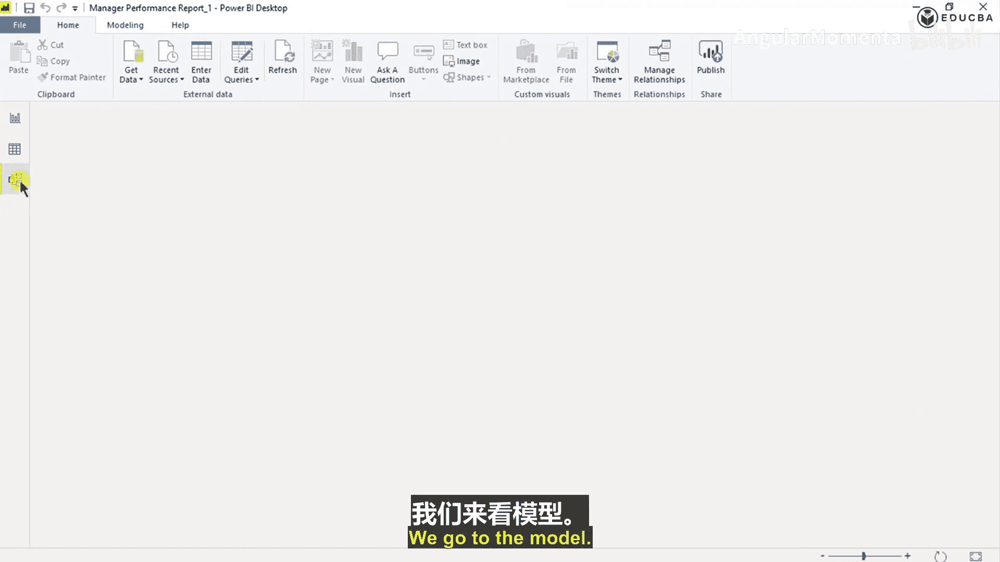
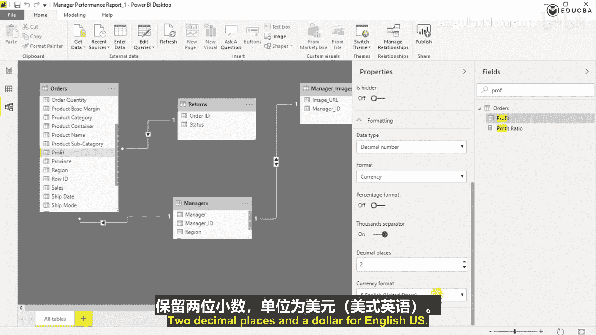
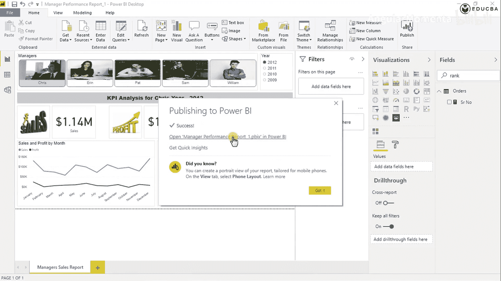
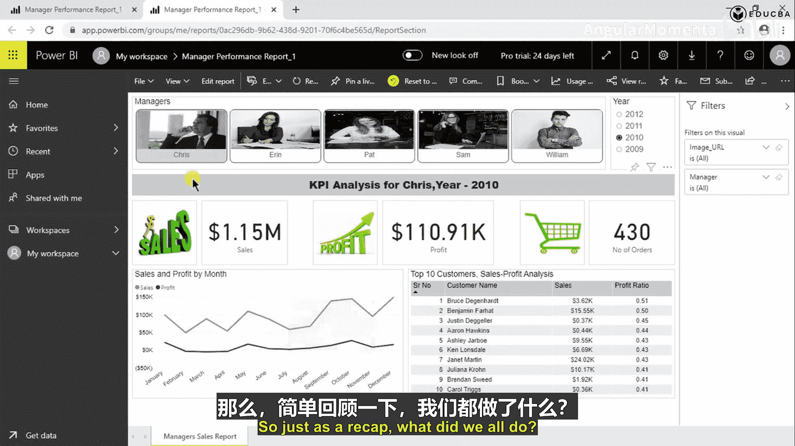
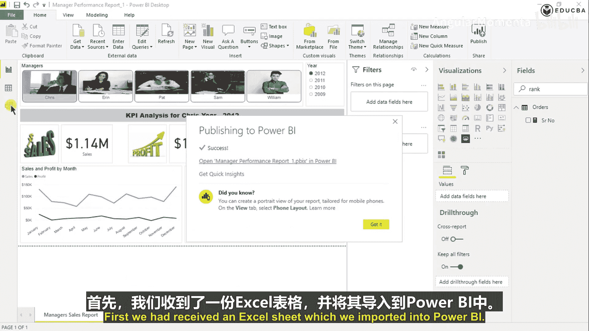
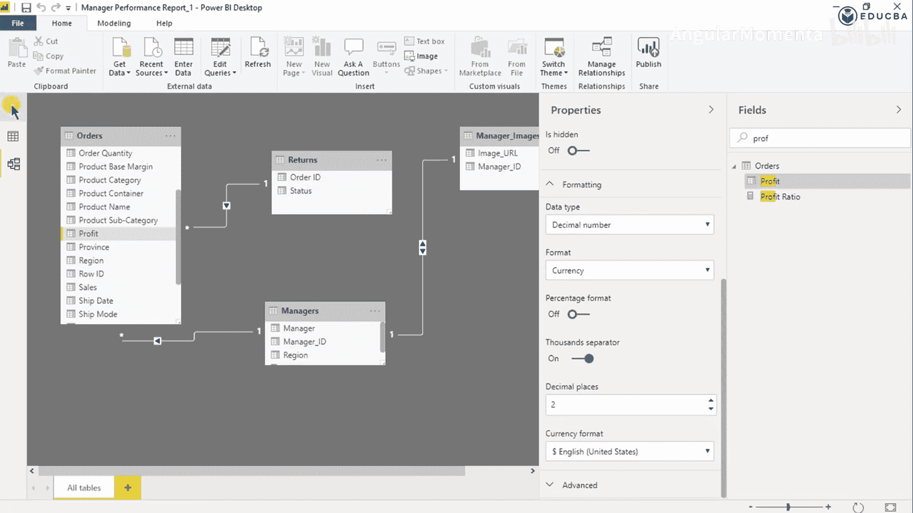
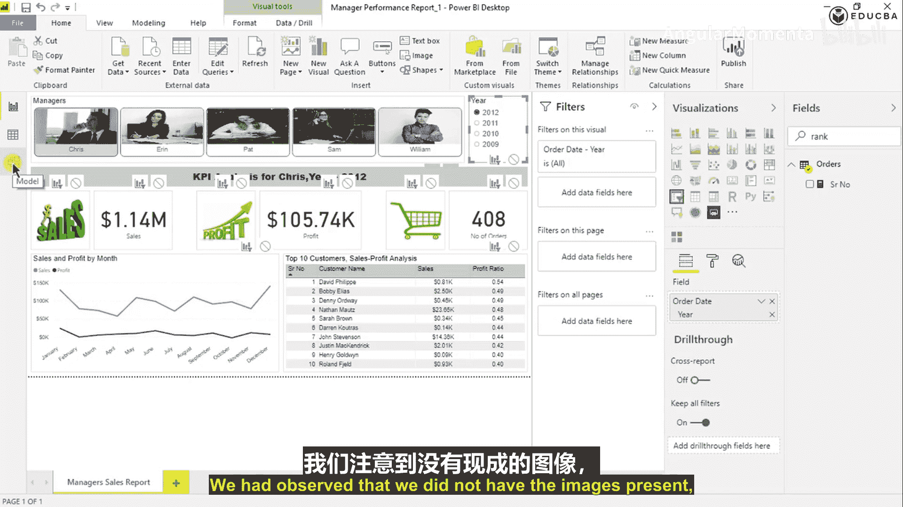
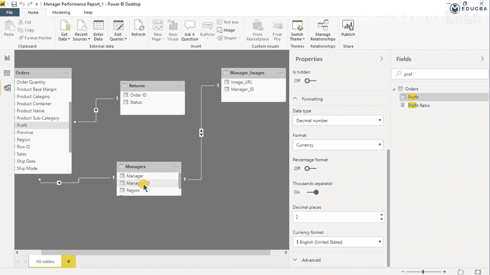
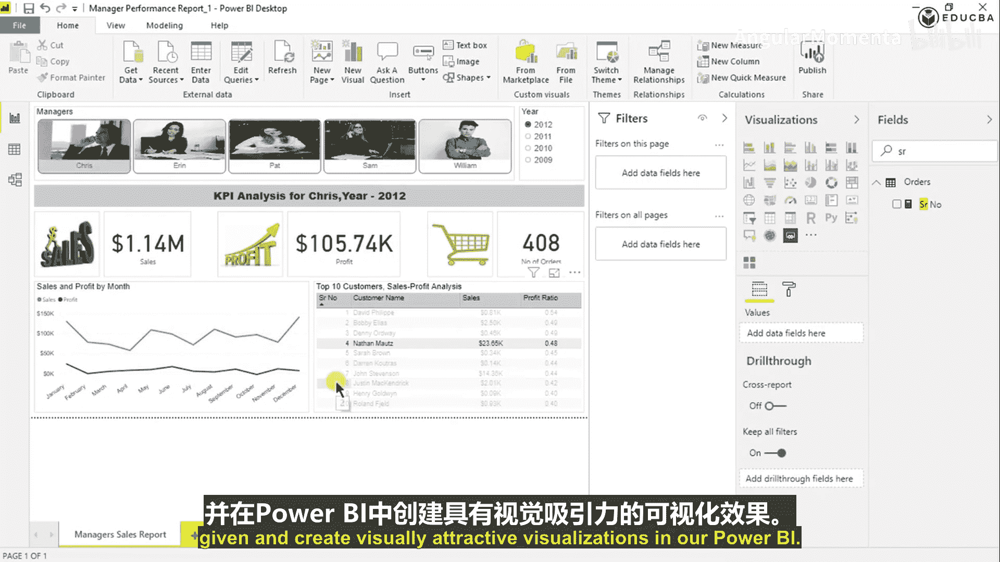

# 009：格式化与交互控制 🎨

在本节课中，我们将学习如何对Power BI仪表板进行格式化，并控制不同可视化图表之间的交互行为。这是让仪表板变得美观、专业且易于使用的关键步骤。

---

## 交互控制

上一节我们介绍了如何创建各种可视化图表。本节中，我们来看看如何管理它们之间的交互。

当点击某个可视化图表时，你可能会注意到其他图表的内容也随之发生了变化。这是Power BI的默认功能，所有可视化图表会自动相互筛选。

如果你不希望某个图表在点击时影响其他图表，可以进行如下操作：

1.  选中不希望触发筛选的图表。
2.  在顶部菜单栏找到“格式”选项卡。
3.  点击“编辑交互”。
4.  此时，其他图表上会出现筛选图标。点击这些图标，将其切换为“阻止”图标（一个带斜杠的圆圈）。
5.  对所有不希望被影响的图表重复此操作，然后点击“保存”。

操作完成后，即使点击该图表，其他图表的数据也不会再被筛选。

对于希望保持交互的图表（如切片器），则无需进行“阻止”操作。确保其筛选图标处于激活状态即可。

---

## 格式化图表元素

完成交互设置后，我们将对图表进行美化。格式化是仪表板开发中耗时最长的环节之一，涉及颜色、字体等视觉决策。

以下是格式化一个表格图表的步骤：

1.  **格式化标题**：选中图表，在“格式”窗格中找到“标题”。可以修改其文本、颜色和字体。
2.  **格式化列标题**：在“格式”窗格中找到“列标题”。可以修改其背景色、字体颜色和大小。
3.  **格式化值**：在“格式”窗格中找到“值”。可以修改其字体颜色和对齐方式。

---

## 字段级格式化

除了图表外观，我们还可以直接设置数据字段的显示格式。例如，将销售额和利润显示为美元格式。

操作步骤如下：

1.  在右侧“数据”窗格中，找到目标表（如“Sales”表）。
2.  找到需要格式化的字段（如“Sales”列）。
3.  点击该字段，在下方“属性”区域找到“格式”。
4.  将格式设置为“货币”。
5.  选择“千位分隔符”，设置所需的小数位数。
6.  在“货币符号”中选择“英语（美国）”- 美元 ($)。
7.  点击“保存”。

对“Profit”字段重复以上步骤，将其也设置为美元格式。设置完成后，相关图表中的数据将自动更新为带美元符号的格式。

此外，你还可以在图表级别的“字段格式”中，将数值显示为“千(K)”或“百万(M)”等缩写格式，以简化大数字的显示。

---

## 最终调整与发布

完成所有格式化和交互设置后，即可进行最终调整并发布仪表板。

1.  **重命名报表页**：在底部页面标签处双击，将页面名称改为更具描述性的名字，例如“经理报告”。
2.  **保存文件**。
3.  **发布仪表板**：点击“主页”选项卡中的“发布”按钮，将报表发布到Power BI服务。
4.  **在线查看**：发布后，可以在Power BI服务中查看最终效果，并验证所有筛选器、格式和交互是否按预期工作。

---

## 课程总结

本节课中，我们一起学习了Power BI仪表板构建的最后关键步骤：

1.  **控制交互**：通过“格式”->“编辑交互”功能，管理可视化图表之间的筛选关系。
2.  **美化图表**：对标题、列标题、数值等元素进行颜色、字体和布局的格式化。
3.  **设置数据格式**：在模型视图或图表属性中，为字段设置货币、百分比等特定显示格式。
4.  **最终发布**：重命名报表页并发布到Power BI服务，完成仪表板的交付。

回顾整个系列，我们从导入Excel数据开始，经历了数据建模、创建关系、导入自定义视觉对象（如图片切片器）、使用DAX创建度量值和计算列、构建各种图表（卡片图、折线图、表格），到最后进行格式化和交互控制。希望你现在已经掌握了从零开始构建一个交互式、视觉美观的Power BI商业报告仪表板的完整流程。