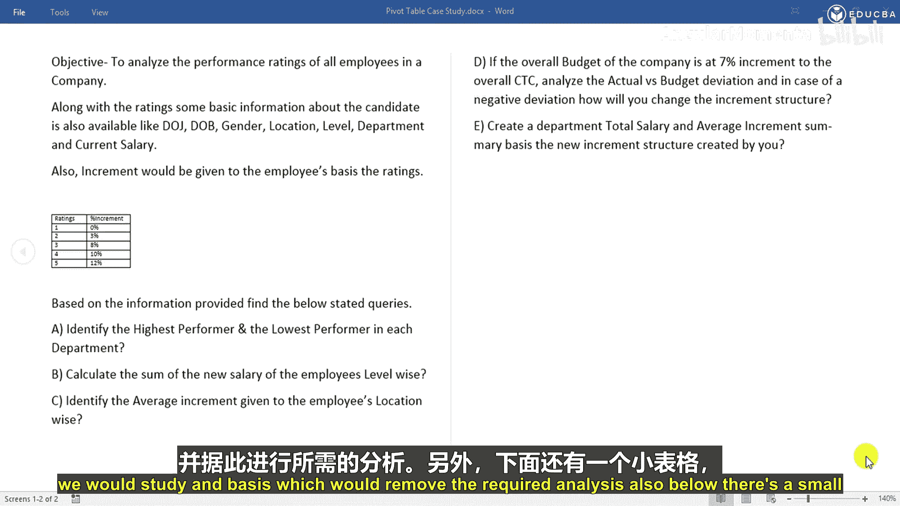
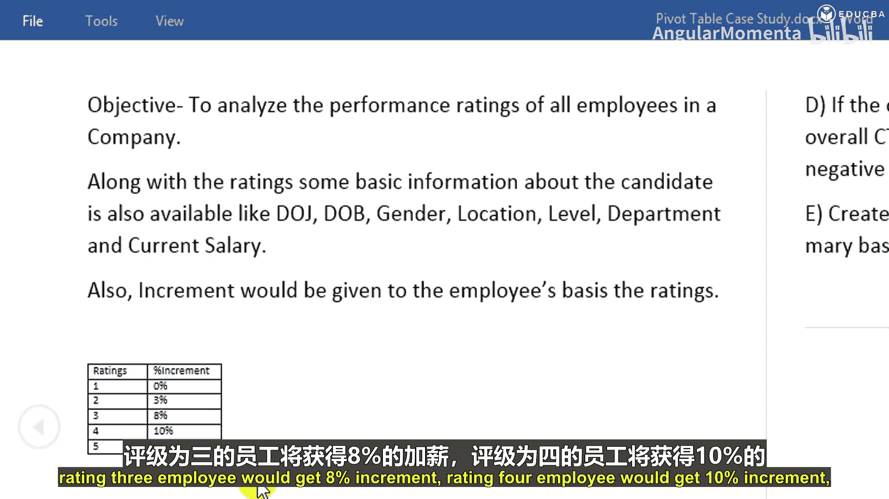
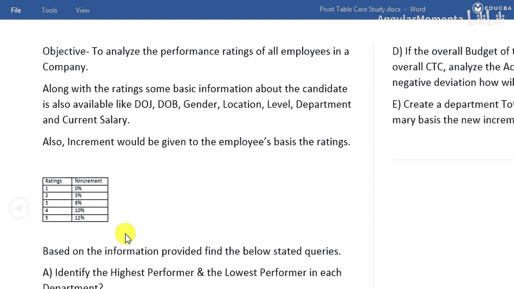
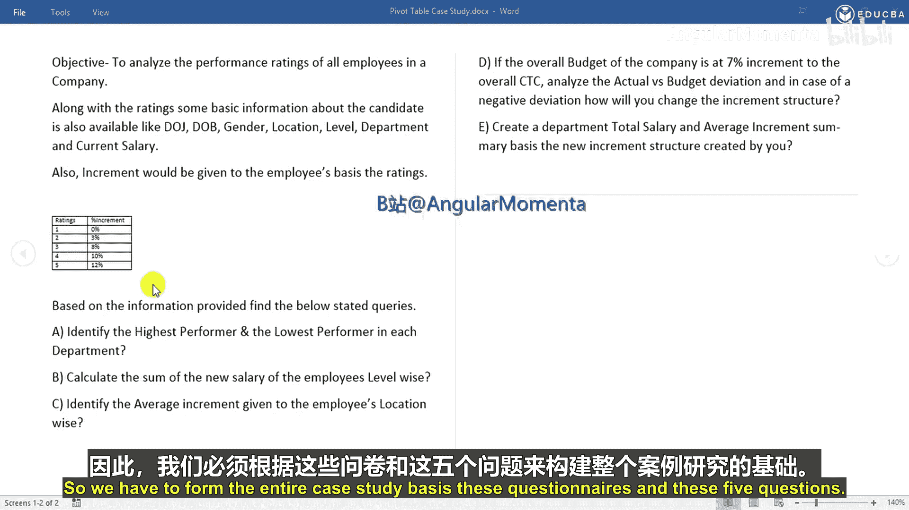

# 001：员工绩效分析案例概述

在本节课中，我们将通过一个真实的案例研究，学习如何使用Excel数据透视表来分析员工绩效数据。我们将面对一个模拟真实业务场景的数据集，并基于一系列具体问题，运用数据透视表功能来寻找解决方案。

## 案例背景介绍

我们手头有一份员工信息数据集。这份数据包含了员工的多项信息，例如：入职日期、出生日期、性别、工作地点、职级、所属部门以及当前薪资。此外，数据中还有其他一些列，我们将基于这些信息进行所需的分析。

在数据下方，还有一个小的参照表，它明确了员工根据其绩效评级所能获得的加薪幅度。

具体规则如下：
*   评级为1的员工将获得 **0%** 的加薪。
*   评级为2的员工将获得 **3%** 的加薪。
*   评级为3的员工将获得 **8%** 的加薪。
*   评级为4的员工将获得 **10%** 的加薪。
*   评级为5的员工将获得 **12%** 的加薪。

## 需要解决的问题

基于以上提供的信息，我们需要解决以下五个核心问题：

以下是本次案例研究需要完成的具体任务列表：

1.  **识别各部门的最高绩效者和最低绩效者**：我们需要分析并找出每个部门中绩效评级最高和最低的员工。
2.  **按职级计算员工的新薪资总和**：在应用加薪后，员工将获得新的薪资。我们需要按职级分类，计算这些员工新薪资的总和。
3.  **按工作地点识别员工的平均加薪幅度**：我们需要分析按工作地点划分，员工获得的平均加薪百分比，以及对应的平均加薪金额。
4.  **预算与实际偏差分析**：现在引入一个基于推理和分析的案例。假设公司的整体薪资预算增幅为 **7%**。我们需要分析实际总加薪额与预算之间的偏差。如果出现负偏差（即实际超出预算），你将如何调整加薪结构？例如，公司预算是700元，但根据员工评级计算出的总加薪额是800元，这就超出了预算100元。此时，我们需要调整加薪结构，使实际总额等于或低于预算水平。
5.  **创建部门薪资与加薪汇总**：在创建了新的加薪结构后，你需要基于新的结构，展示各部门的总薪资和平均加薪幅度的摘要。

这就是摆在我们面前的完整案例。显然，完成这个案例需要一个数据库，我将在接下来的详细步骤中带你逐一使用数据透视表来解决这五个问题。

## 课程总结

本节课我们一起了解了本次数据透视表实战案例的背景与目标。我们明确了手头的数据包含员工基本信息和绩效加薪规则，并定义了五个需要解决的具体分析问题，包括识别绩效高低、计算薪资、分析平均加薪、进行预算控制以及生成汇总报告。在接下来的课程中，我们将逐步应用Excel数据透视表来找到这些问题的答案。