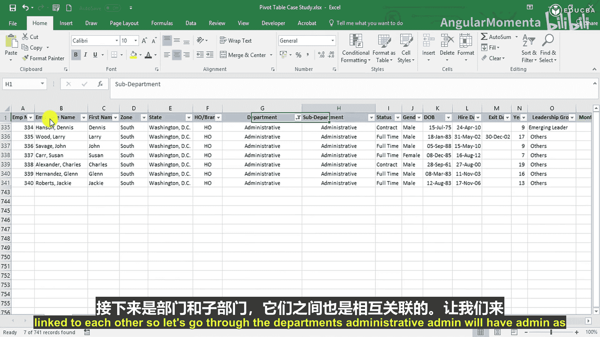

# 002：数据导论 📊

在本节课中，我们将学习用于分析员工绩效案例研究的基础数据库。了解数据的结构和内容是进行有效分析的第一步。

## 数据库概览

我们将要使用的数据库是一个典型的员工数据库，其结构与您在公司中可能遇到的数据集相似。

以下是数据库中各字段的详细介绍。

### 员工基本信息

首先，我们来看员工的基本身份信息。

*   **员工编号**：每位员工的唯一标识。
*   **员工姓名**：员工的全名。
*   **名**：员工的名字。
*   **姓**：员工的姓氏。
*   **州**：员工工作所在的州。
*   **办公室类型**：员工所属办公室是总部还是分部。总部位于华盛顿特区。

### 地理与组织划分

每个地理位置都与一个特定的区域相关联。

*   **区域**：根据州进行划分。
    *   **中西部**：包含特定州。
    *   **东北部**：包含特定州。
    *   **南部**：包含佛罗里达、佐治亚、密西西比、田纳西和华盛顿特区。
    *   **西部**：包含亚利桑那和科罗拉多。

### 部门结构

接下来是公司的部门架构，部门与子部门相互关联。

*   **部门**：员工所属的主要部门。
*   **子部门**：隶属于主部门的细分团队。
    *   **行政部**：子部门为“行政”。
    *   **业务支持组**：子部门包括“创意”和“系统开发”。
    *   **企业责任组**：子部门包括“合规”、“环境健康安全”和“绿色建筑”。
    *   **财务部**：子部门包括“账户管理团队”和“分析师团队”。
    *   **人力资源部**：子部门包括“培训”、“专业培训组”和“培训”。
    *   **运营部**
    *   **市场与销售部**：子部门包括“市场品牌”、“媒体”和“销售”。
    *   **生产部**：子部门包括“设施”、“重大制造项目”和“制造”。
    *   **研发与质量组**：子部门包括“质量保证”、“质量控制”、“研究中心”和“研发”。

### 雇佣详情

这一部分描述了员工的雇佣状态和个人信息。

*   **状态**：员工的雇佣类型，如合同制、全职、小时工或早期雇佣。
*   **性别**：男性或女性。
*   **出生日期**：员工的出生日期。
*   **入职日期**：员工加入公司的日期，也称为聘用日期。数据从1998年开始。
*   **离职日期**：员工离开组织的日期（如果适用）。
*   **在职年限**：员工在公司服务的年数。

### 职级与薪酬

最后，我们来看与员工职级和薪酬相关的关键信息。

*   **领导组**：公司设定的特定领导层级，员工可能归属于某个组或不归属。例如：高级领导、新兴领导、其他等。
*   **月薪**：员工的月薪，这是分析中最重要的部分之一。
*   **奖金**：员工在年度内获得的奖金。
*   **年薪**：员工的年度总薪酬。
*   **基本工资**：薪酬的基础部分。
*   **房屋租金津贴**：住房补贴。
*   **交通津贴**：通勤补贴。
*   **特殊津贴**：其他特定补贴。
*   **公积金**：养老金储蓄。
*   **工作评级**：用于分析薪资增长的绩效评级。

## 薪酬计算逻辑

为了帮助理解，以下是薪酬各组成部分的一些计算逻辑：

*   **基本工资** 通常是年薪的50%。公式可表示为：
    `基本工资 = 年薪 * 0.5`
*   **房屋租金津贴** 是基本工资的50%。公式为：
    `房屋租金津贴 = 基本工资 * 0.5`
*   **交通津贴** 是给予员工的固定金额。
*   **特殊津贴** 是使总薪酬达到约定数额的平衡项。
*   **公积金** 是基本工资的12%。公式为：
    `公积金 = 基本工资 * 0.12`

## 本节总结

本节课中，我们一起详细查看了用于员工绩效分析案例研究的数据库。我们了解了员工的基本信息、地理分布、部门结构、雇佣详情以及薪酬的各个组成部分和计算逻辑。这个数据库将是我们后续创建数据透视表、运用公式和分析问题的核心基础。在接下来的课程中，我们将利用这些数据来解答具体的业务问题。