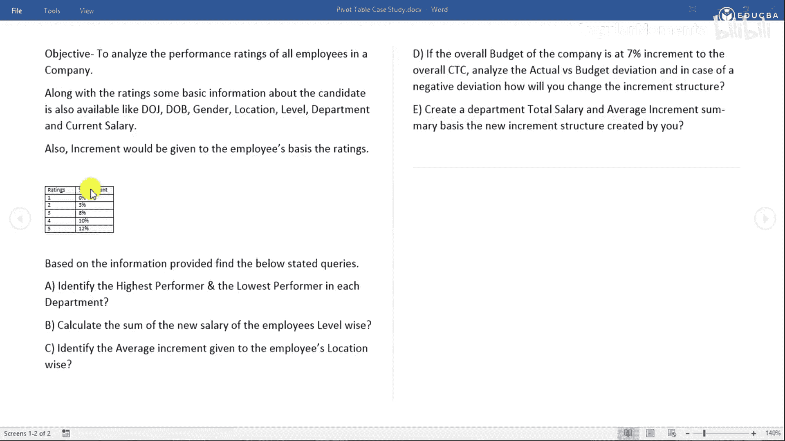
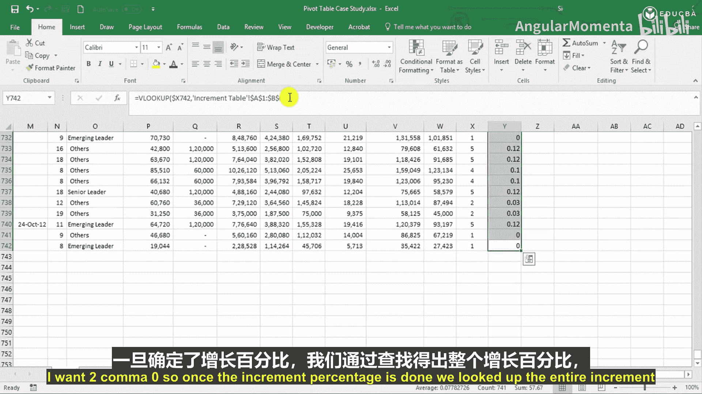
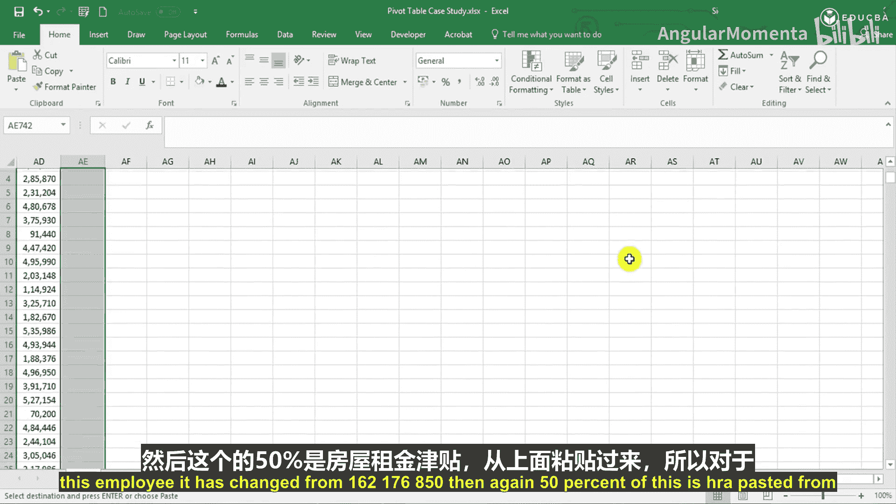

# 003：增量计算案例研究

在本节课中，我们将通过一个案例研究，学习如何使用Excel的VLOOKUP函数和基础公式，根据不同的增量百分比计算员工的新薪资结构。我们将从识别每个部门中绩效最高和最低的员工这个问题开始。



## 准备工作

首先，我们需要将数据表导入到Excel工作表中。


创建一个名为“数据”的新工作表。我们将在此处创建一个名为“增量”的表格，其内容与原始数据表相同。


表格包含以下列：评级、增量百分比。评级分为1到5级，对应的增量百分比分别为：0%、3%、8%、10%和12%。此外，我们后续会用到的一个预算基准值是7%。


## 应用增量百分比

现在，我们将根据增量百分比来计算全新的薪资结构。

首先，我们需要使用VLOOKUP函数为每位员工查找对应的增量百分比。这是一个非常简单的查找操作。



以下是VLOOKUP公式的应用：

```excel
=VLOOKUP(评级单元格, 增量表格区域, 2, FALSE)
```
在这个公式中，“2”代表我们希望返回增量表格区域中的第二列（即增量百分比），“FALSE”表示需要精确匹配。

应用公式后，我们得到了每位员工的增量百分比。


请确保将这一列的格式设置为百分比格式。

## 构建新薪资结构

上一节我们确定了增量百分比，本节中我们来详细构建新的薪资结构。

我们将创建一个独立的区域来展示新结构，并使用浅黄色背景进行区分。


以下是计算新薪资结构的步骤：

1.  **月薪**：对于获得0%增量的员工，月薪保持不变。对于其他员工，新月薪等于旧月薪乘以 `(1 + 增量百分比)`。我们使用ROUND函数将结果四舍五入到整数。
    ```excel
    =ROUND(旧月薪 * (1 + 增量百分比), 0)
    ```

2.  **奖金**：由于没有关于奖金的调整说明，因此奖金金额保持不变。直接链接到原始奖金单元格即可。

3.  **年薪资**：新的年薪资等于新的月薪乘以12。
    ```excel
    =新月薪 * 12
    ```

4.  **基本工资**：基本工资通常占总薪资的固定比例（例如50%）。这里，新基本工资等于新月薪的50%。
    ```excel
    =新月薪 * 50%
    ```

5.  **房租津贴**：房租津贴（HRA）是基本工资的40%。
    ```excel
    =新基本工资 * 40%
    ```



6.  **交通津贴**：交通津贴是月薪的2.5%。
    ```excel
    =新月薪 * 2.5%
    ```

7.  **公积金**：公积金（PF）缴纳比例为基本工资的12%，由公司和员工共同承担，因此总额为24%。
    ```excel
    =新基本工资 * 24%
    ```

8.  **特殊津贴**：特殊津贴是年薪资减去上述所有其他津贴（基本工资、HRA、交通津贴、PF）后的余额。
    ```excel
    =新年薪资 - SUM(新基本工资, HRA, 交通津贴, PF)
    ```

9.  **工作评级**：工作评级不适用于下一年度的计算，因此可以暂时忽略或标注为“不适用”。


对于获得0%增量的员工，其薪资结构的所有组成部分将完全保持不变。

## 总结

本节课中，我们一起学习了如何为一个简单的员工绩效案例构建增量计算模型。我们首先使用VLOOKUP函数匹配绩效评级与对应的增量百分比，然后逐步应用公式计算出包括月薪、年薪资、基本工资、各项津贴在内的完整新薪资结构。这个过程清晰地展示了如何将基础Excel函数应用于实际的人力资源数据分析场景中。