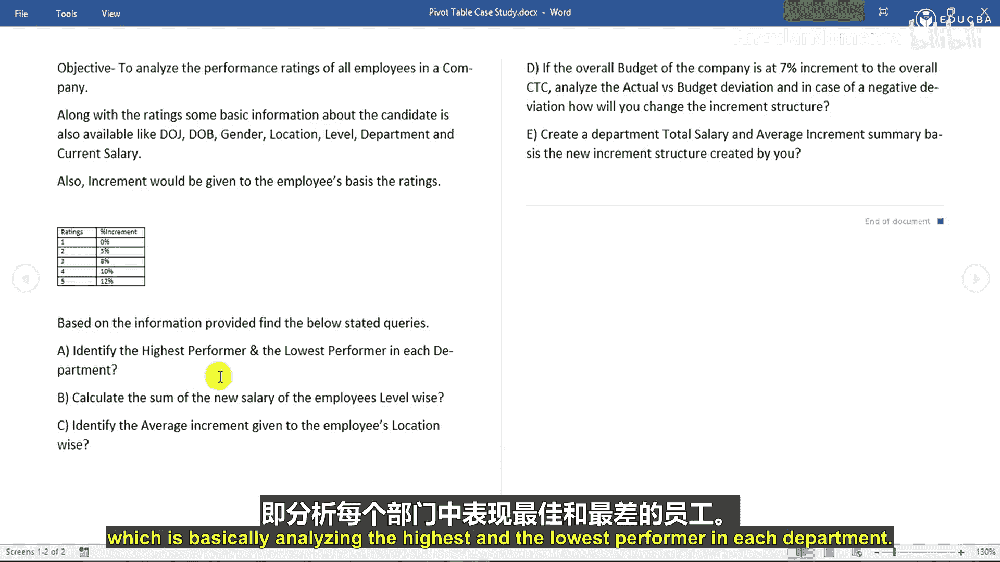
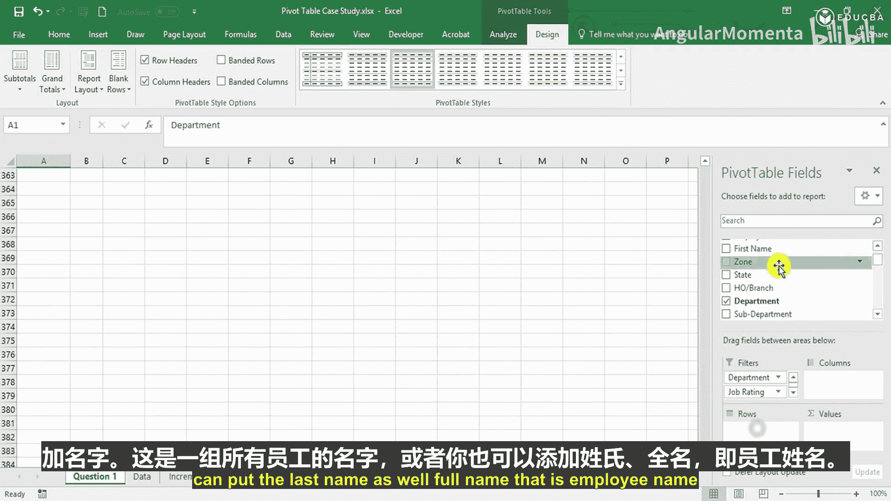

# 004：创建用于绩效分析的数据透视表 📊

在本节课中，我们将学习如何创建数据透视表，这是分析员工绩效的第一步。我们将基于准备好的数据库，开始解答第一个问题：找出每个部门中绩效最高和最低的员工。

---

上一节我们完成了数据库的整理，本节中我们来看看如何利用数据透视表进行初步分析。

首先，我们需要为第一个问题创建一个数据透视表。操作步骤如下：

以下是创建数据透视表的具体步骤：

1.  **选择数据**：选中整个数据表区域。
    

2.  **插入透视表**：点击菜单栏的“插入”选项卡，然后选择“数据透视表”。

3.  **配置透视表**：此时会弹出“创建数据透视表”对话框。它要求你选择要分析的数据范围（通常已自动选中），并选择放置透视表的位置。
    *   你可以选择“新工作表”或“现有工作表”。
    *   我们点击“新工作表”，然后按“确定”。

4.  **重命名与保存**：将新生成的工作表重命名为“question1”，并保存文件。

数据透视表创建完成后，点击透视表区域，右侧会出现“数据透视表字段”窗格。这个窗格列出了数据库中所有的列（字段），例如“salary 2”代表新的加薪后薪资。

在字段窗格右侧，你可以看到四个区域：**筛选器**、**列**、**行**和**值**。通过将字段拖拽到不同区域，可以构建不同的数据视图。

窗格下方是“设置”选项，可以改变字段列表的布局方式。例如：
*   `字段部分和区域部分层叠`：同时显示字段列表和区域布局。
*   `仅字段部分`：只显示字段列表。
*   `仅区域部分`：只显示区域布局。
*   `区域部分仅1×4`：以特定行列方式显示区域。

通常，我们保持默认的“字段部分和区域部分层叠”即可。

此外，在Excel功能区还会出现两个与数据透视表相关的上下文选项卡：“分析”和“设计”。

在“分析”选项卡中，你可以：
*   查看和修改透视表名称。
*   使用“活动字段”选项。
*   执行“向下钻取”或“向上钻取”。
*   对数据进行分组。
*   插入“切片器”和“时间线”进行动态筛选。
*   更改数据源、刷新数据、清除或移动透视表。
*   进行字段项设置等计算。
*   插入“数据透视图”或“推荐的透视表”。
*   控制是否显示字段列表、+/-按钮和字段标题。

在“设计”选项卡中，你可以调整透视表的布局和样式：
*   **小计**：选择不显示小计、在组底部显示或在组顶部显示。
*   **总计**：控制是否对行和列启用总计。
*   **报表布局**：可以选择以压缩形式、大纲形式或表格形式显示。
*   **重复项目标签**：选择是否重复所有项目标签。
*   **空行**：选择是否在每个项目后插入空行。
*   **透视表样式选项**：控制是否启用“镶边行”和“镶边列”。
*   **透视表样式**：为透视表选择不同的预定义样式。

---

现在，我们回到第一个问题：找出每个部门中绩效最高和最低的员工。有两种分析方法，这里我们先创建两个透视表。

首先，让我们找出各部门的员工。操作如下：

以下是构建第一个分析视图的步骤：

1.  将“Department”（部门）字段拖到**筛选器**区域。
2.  将“Job Rating”（工作评级）字段也拖到**筛选器**区域，这样我可以在下方筛选特定的绩效评级。
3.  将“ID”和“Full Name”（员工姓名）字段拖到**行**区域。
    

这样，我们就得到了一个按部门筛选、并列出所有员工ID和姓名的透视表，为后续分析绩效高低奠定了基础。

---

本节课中我们一起学习了创建数据透视表的基本流程，并熟悉了其核心界面和功能选项。我们成功构建了第一个分析视图，将部门和绩效评级作为筛选条件，员工信息作为行标签，为下一步具体分析最高和最低绩效者做好了准备。