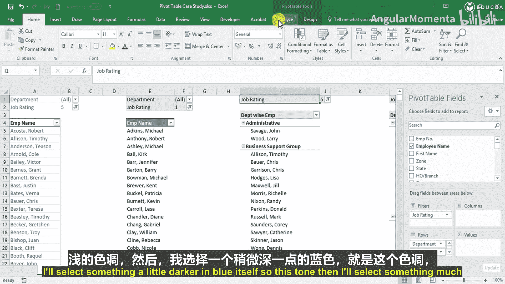
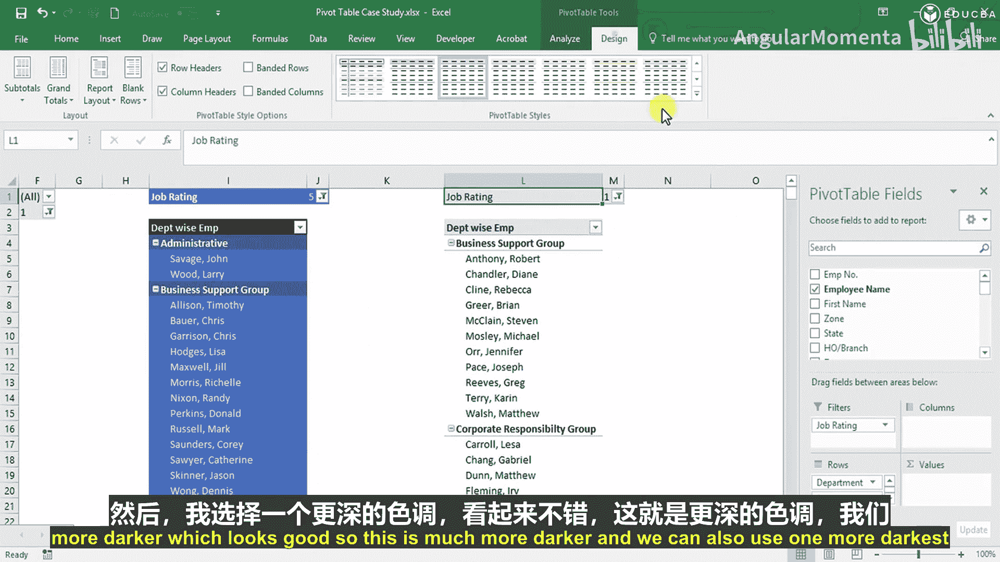
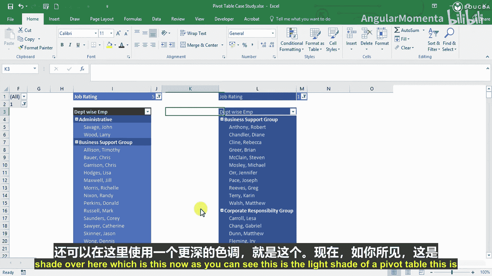
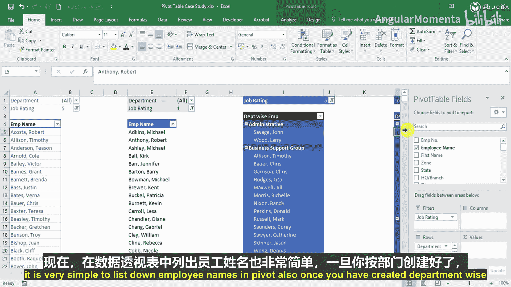
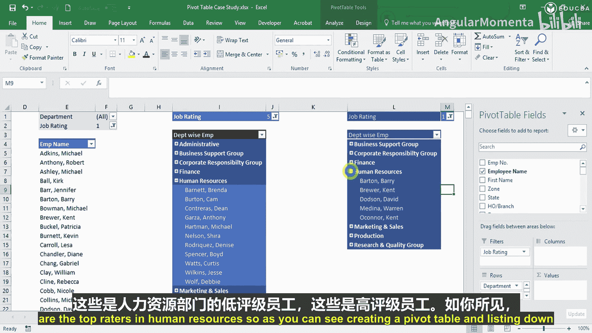
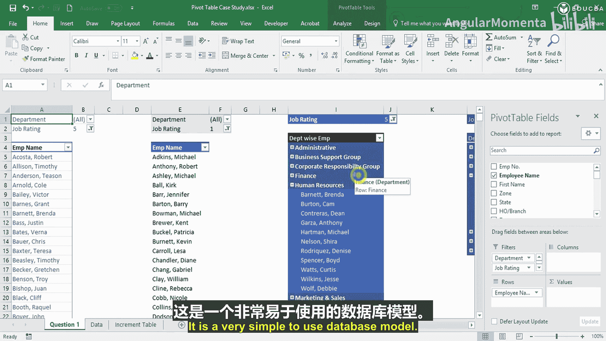

# 005：利用计算增强数据透视表

在本节课中，我们将学习如何使用Excel数据透视表来筛选和展示数据，具体目标是找出各部门中绩效评分最高和最低的员工。我们将通过创建和格式化数据透视表来实现这一目标，整个过程无需复杂的数学计算，非常适合初学者掌握。

## 创建基础数据透视表

首先，我们通过数据透视表列出了所有员工。员工名单按字母顺序排列。数据显示员工总数为741人，这与数据源的总数一致。

## 筛选最高与最低评分员工

我们的第一个任务是找出各部门中绩效评分最高和最低的员工。以下是实现此目标的几种方法之一。

我们将部门与工作评级作为筛选条件。在行区域放置员工姓名，然后在筛选器中选择工作评级。首先，我们选择最高评级5。

执行此操作后，我们得到了所有评级为5的员工名单，总计约182人。

同理，要找出最低评级的员工，我们无需重新创建整个数据透视表。只需复制现有的数据透视表，粘贴到旁边，并将筛选器中的工作评级改为1即可。

现在，我们得到了评级为1的员工名单，大约有74人。至此，我们已经列出了最高和最低评级的员工。

## 按部门深入分析

接下来，我们希望按部门查看这些员工。我们可以添加部门筛选器。例如，选择“行政部”后，可以看到该部门评级最高的两名员工是John Savage和Larry Wood。选择“人力资源部”，则显示有11名员工评级最高。

对于最低评级，我们同样可以应用筛选。例如，在“财务部”约有15名低评级员工，在“市场与销售部”有7名。

通过使用筛选器，我们可以清晰地描绘出每个部门中绩效最高和最低的员工。

## 创建部门对比视图

如果我们想对比不同部门的情况，可以创建另一个数据透视表。

在现有工作表下方插入一个新的数据透视表。我们将“部门”和“员工姓名”放入行区域，将“工作评级”放入筛选器列。选择评级5后，我们得到了每个部门中所有评级为5的员工列表。

默认情况下，数据透视表会显示分类汇总和总计。为了视图更简洁，我们可以移除它们。右键点击数据透视表，选择“分类汇总‘员工姓名’”以取消勾选，即可移除分类汇总。若要移除总计，可以进入数据透视表选项，在“总计和筛选”标签页中，取消勾选“对行和列启用总计”。

现在，视图只显示了评级为5时各部门的员工名单。要查看评级为1的员工，只需复制此数据透视表，并将筛选器中的评级改为1。

创建数据透视表并按部门列出员工姓名非常简单，这不需要任何数学知识，仅仅是利用评级筛选来生成列表。

## 美化数据透视表

在完成结构创建后，我们可以为其添加一些视觉效果以提升可读性。

首先，进入“视图”选项卡，取消勾选“网格线”，使整个工作表背景变得干净。接着，进入数据透视表的“设计”选项卡。这里有多种预置样式，分为“浅色”、“中等深浅”和“深色”三类，您可以根据个人喜好选择。

例如，我们可以先选择一个非常浅的色调，然后选择一个稍深的蓝色样式，最后尝试一个更深的样式。不同的样式可以赋予数据透视表不同的外观，从明亮到深邃，方便您根据报告场景选择最合适的一款。

## 使用折叠与展开功能

数据透视表还提供了便捷的折叠与展开功能。在按部门分组后，每个部门旁边会出现一个减号（-）按钮。点击它可以折叠该部门下的所有员工详情，只显示部门名称。同样，右键点击数据透视表，选择“展开/折叠” -> “折叠整个字段”，可以一次性折叠所有分组。

这个功能非常有用。例如，在查看最低评级员工时，我们可以快速发现“行政部”下没有评级为1的员工。通过展开“人力资源部”分组，我们可以并排查看该部门的最高和最低评级员工名单。

## 总结与应用场景

本节课中，我们一起学习了如何创建和格式化Excel数据透视表来筛选并列出特定条件的员工。整个过程直观且简单。数据透视表的用途非常广泛，不仅限于人力资源分析。

在财务部门，可以列出有业务往来的公司或需要重点跟进的贷款客户。在市场与销售部门，可以列出顶级客户、需要提升的客户或潜在客户目标。列表管理在许多业务场景中都至关重要。

数据透视表的核心价值在于，它能帮助您从庞大的数据库中，快速、灵活地创建出符合特定视角的子集列表，而无需手动复制和筛选原始数据。它是一个非常简单易用的数据视图工具，能极大地提升数据分析的效率。