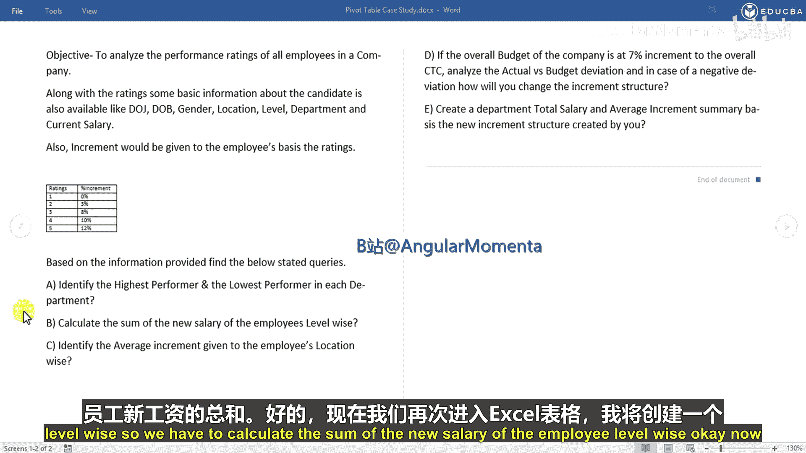
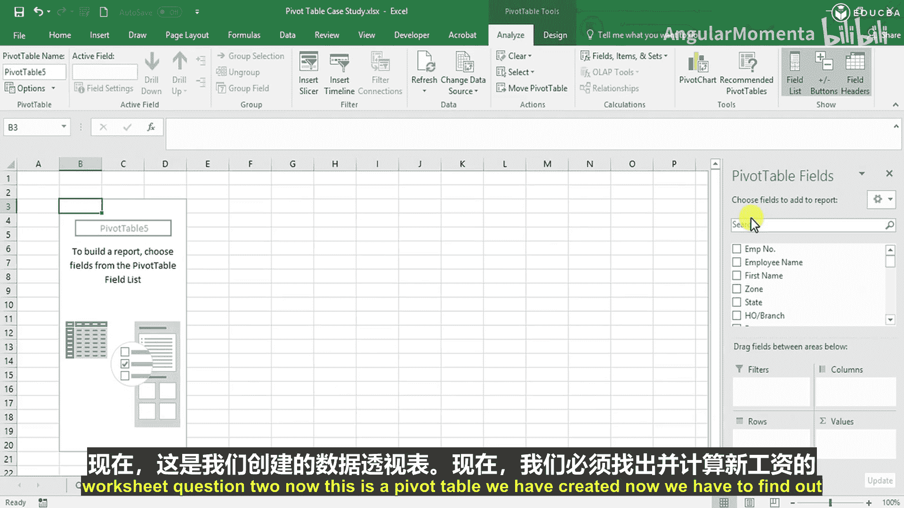
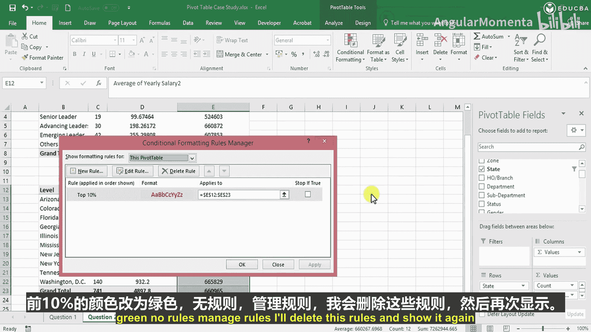

# 006：按级别计算薪资总和

在本节中，我们将学习如何使用Excel数据透视表，按员工的领导力级别计算新薪资的总和与平均值。上一节我们识别了各部门的最高和最低绩效者，本节我们将聚焦于薪资数据的汇总分析。

## 创建数据透视表

首先，我们需要为第二个问题创建一个新的数据透视表。在Excel中插入一个新的工作表，并将其命名为“question2”。然后，基于原始数据在此工作表中创建数据透视表。

以下是创建数据透视表的步骤：
1.  选择数据区域。
2.  点击“插入”选项卡，选择“数据透视表”。
3.  在对话框中，选择“现有工作表”并指定“question2”工作表中的位置。
4.  点击“确定”。

## 配置数据透视表字段

数据透视表创建后，我们需要配置字段以按级别分析薪资。

以下是需要拖放的字段：
*   **行**：将“Leadership Group”（领导力组）字段拖入“行”区域。这将按级别（如高级领导、进阶领导等）对员工进行分组。请确保从列表中移除任何空白项。
*   **值**：将“Early Salary2”（新年度薪资）字段拖入“值”区域两次。第一次用于计算员工数量（计数），第二次用于计算薪资总和。

## 计算薪资总和与转换单位

默认情况下，数值字段可能显示为计数。我们需要将其更改为求和以计算总薪资。

操作步骤如下：
1.  在“值”区域，点击“计数项：Early Salary2”旁边的下拉箭头。
2.  选择“值字段设置”。
3.  在“值汇总方式”选项卡下，选择“求和”。
4.  点击“确定”。现在，数据透视表显示了每个领导力级别的新薪资总和。

为了使大额数字更易读，我们可以将其单位从“元”转换为“十万（Lakh）”。这可以通过创建计算字段来实现。

创建计算字段的公式如下：
`= ‘Early Salary2’ / 100000`

操作步骤如下：
1.  在数据透视表分析选项卡中，点击“字段、项目和集”。
2.  选择“计算字段”。
3.  输入名称（如“New Salary Lakhs”）和上述公式。
4.  点击“添加”，然后“确定”。新字段将出现在数据透视表中，显示以“十万”为单位的薪资。

## 计算平均薪资

除了总和，了解每个级别的平均薪资也很有用。我们可以直接对原始薪资字段应用平均值计算。

操作步骤如下：
1.  在“值”区域，再次添加“Early Salary2”字段。
2.  点击该字段的下拉箭头，选择“值字段设置”。
3.  在“值汇总方式”选项卡下，选择“平均值”。
4.  点击“确定”。数据透视表现在会显示每个领导力级别的平均薪资。

## 扩展分析：按州汇总薪资

数据透视表的优势在于其灵活性。我们可以轻松地改变分析维度。例如，将行标签的“Leadership Group”替换为“State”（州），即可快速查看不同地区的薪资汇总情况。

操作步骤如下：
1.  将“行”区域中的“Leadership Group”字段拖出。
2.  将“State”字段拖入“行”区域。
3.  数据透视表将立即更新，显示按州汇总的薪资总和与平均值。

为了更直观地看出哪个州的薪资最高或最低，可以使用条件格式。

以下是应用条件格式的步骤：
1.  选择包含平均薪资的数据列。
2.  点击“开始”选项卡中的“条件格式”。
3.  选择“项目选取规则” -> “前10%”。
4.  在弹出的对话框中，可以设置格式（如将前10%的单元格填充为绿色），以高亮显示平均薪资较高的州。

## 总结

本节课中，我们一起学习了如何利用Excel数据透视表按级别计算员工薪资的总和与平均值。我们创建了数据透视表，配置了行字段和值字段，使用计算字段转换了数据单位，并计算了平均值。最后，我们还探索了如何通过替换行字段来快速切换分析维度（如按州分析），并使用条件格式使关键数据更加突出。这些技能能帮助你高效地从不同角度汇总和分析大型数据集。