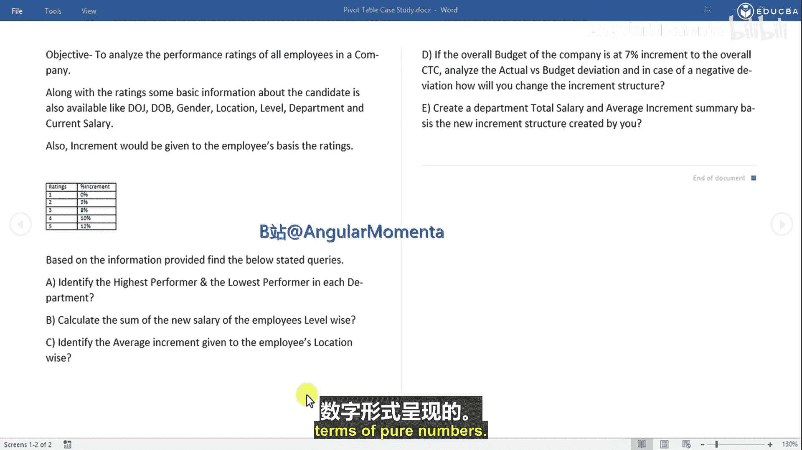
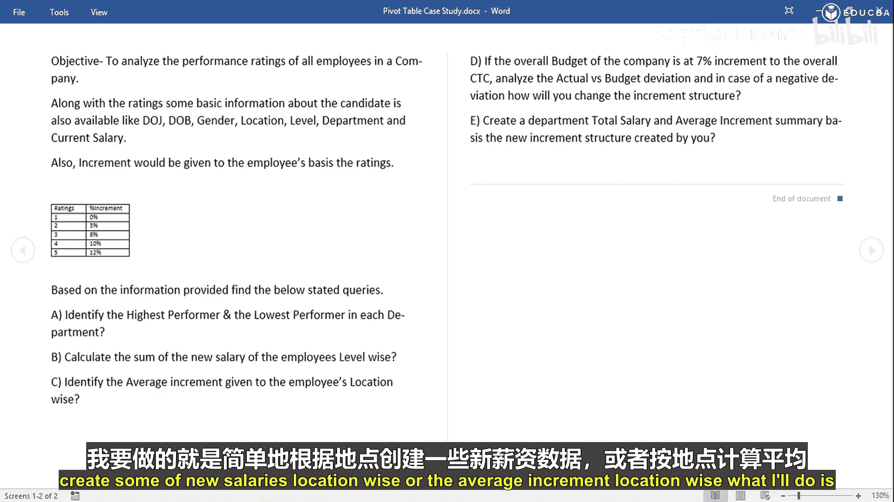
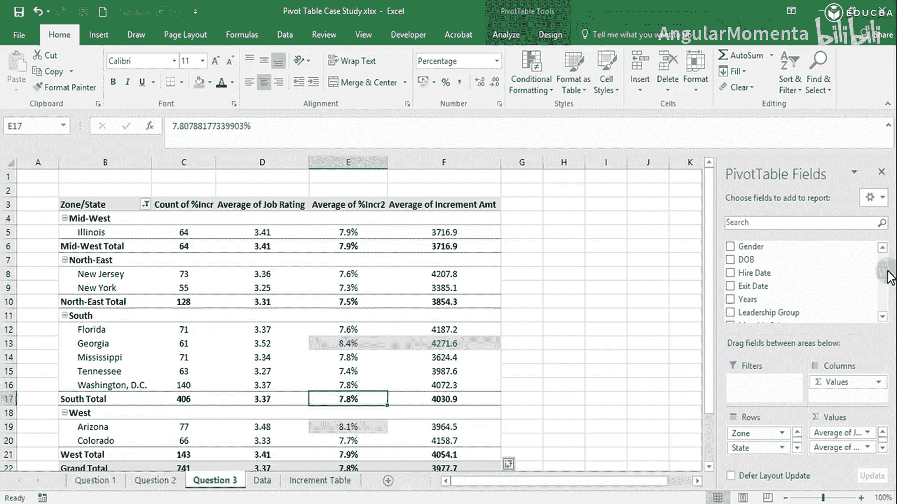
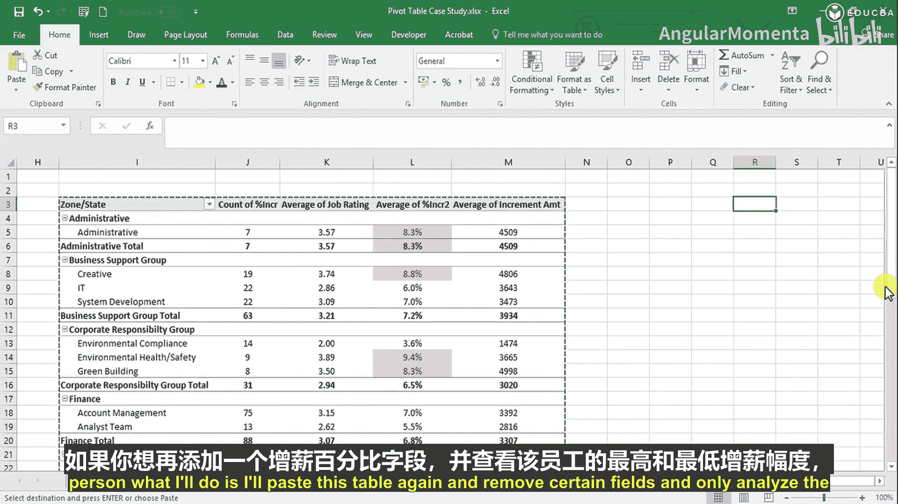
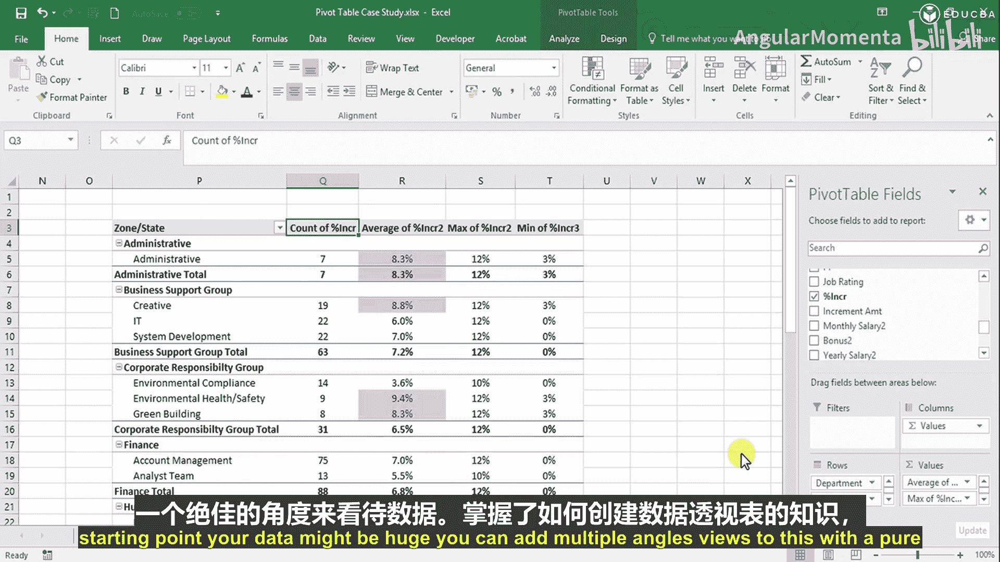
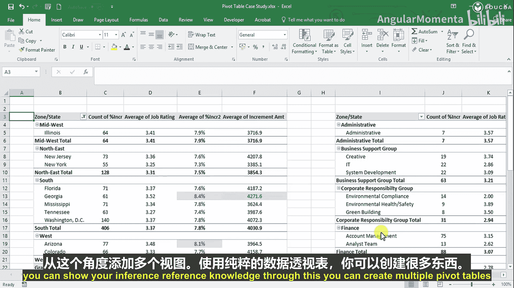
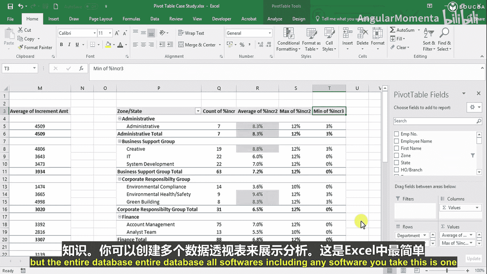
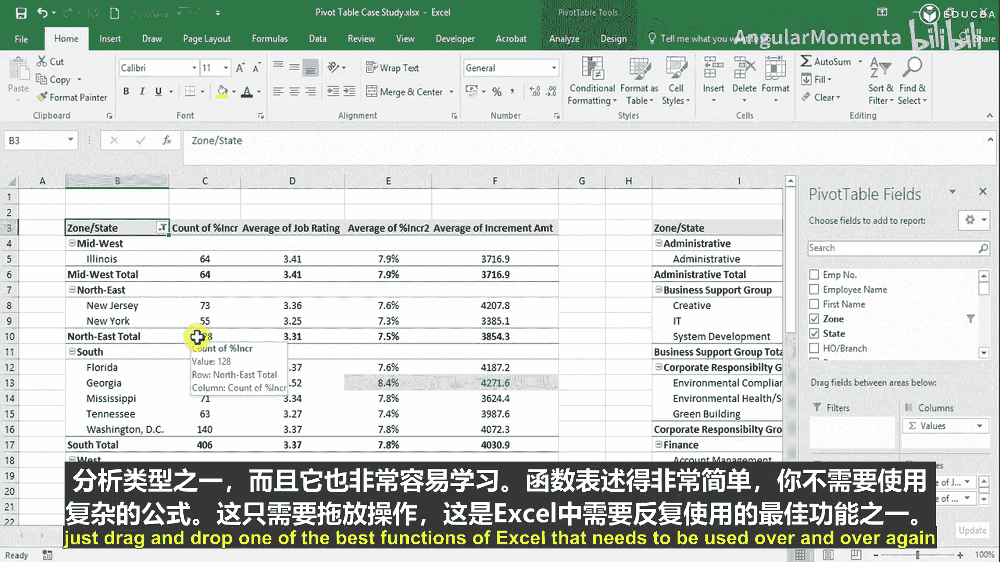

# 007：地理位置性能对比 📊

在本节课中，我们将学习如何使用Excel数据透视表，按地理位置分析员工的平均加薪百分比。我们将从基础操作开始，逐步深入，并探索如何超越问题本身，进行更丰富的多维度分析。

## 概述

上一节我们计算了员工的新工资总和。本节中，我们将聚焦于第三个问题：**按地理位置识别给予员工的平均加薪百分比**。我们将创建一个数据透视表，按州和区域计算平均加薪率，并学习如何格式化数据、应用条件格式以及添加更多分析维度。

## 创建基础数据透视表

首先，我们需要基于原始数据创建一个新的数据透视表来分析地理位置维度的平均加薪。

1.  新建一个工作表，命名为“Question3”。
2.  转到“数据”选项卡，选择全部数据。
3.  点击“插入”选项卡中的“数据透视表”。
4.  在对话框中，选择“现有工作表”，并定位到“Question3”工作表的某个单元格。

操作完成后，Excel会创建一个空白的数据透视表框架。

## 配置字段与计算平均值

接下来，我们需要将相应的字段拖拽到数据透视表区域，以构建我们的分析视图。

以下是配置数据透视表字段的步骤：
*   将“State”（州）和“Zone”（区域）字段拖入“行”区域。
*   将“Increment Percentage”（加薪百分比）字段拖入“值”区域两次。

默认情况下，数据透视表对数值字段进行“计数”。我们需要将其改为计算平均值。
*   右键单击第二个“Increment Percentage”字段，选择“值字段设置”。
*   在“值汇总方式”选项卡下，选择“平均值”。

此时，数据透视表会显示按州和区域划分的平均加薪百分比，但格式是数字。

## 格式化与初步解读

为了使数据更直观，我们需要将其格式化为百分比。

有两种方法可以设置百分比格式：
1.  选中平均加薪百分比所在的整列，在“开始”选项卡中点击“百分比样式”按钮（%）。
2.  或者，右键单击数据，选择“设置单元格格式”，然后在“数字”选项卡中选择“百分比”。你可以使用快捷键 `Ctrl + Shift + 5` 快速应用百分比格式。

建议将小数位数设置为一位，以获得更清晰的视图。

现在，我们可以解读数据了。例如：
*   在中西部区域，有一个州拥有64名员工，平均加薪为7.9%。
*   在东北区域，新泽西州有73名员工，平均加薪7.6%；纽约州有55名员工，平均加薪7.3%。

你可以取消选择数据透视表中的“（空白）”项，并可以将行标签重命名为“Zone / State”，使表格更清晰。

## 应用条件格式深入分析

为了快速识别表现突出的数据，我们可以使用条件格式。

转到“开始”选项卡，点击“条件格式”，选择“突出显示单元格规则” -> “大于”。
*   在对话框中输入 `8%`，并选择一个突出显示格式（如浅红色填充）。

应用后，你可以立即看到哪些州的平均加薪率超过了8%。这通常与员工的绩效评级相关。

## 超越问题：多维度关联分析

优秀的分析不应局限于问题本身。我们可以添加更多维度来探索数据背后的关联。

让我们将“Job Rating”（工作评级）字段也加入分析。
*   将“Job Rating”字段拖入“值”区域。
*   右键单击该字段，将其值汇总方式设置为“平均值”，并设置两位小数。

现在，表格同时显示了平均加薪百分比和平均绩效评级。观察发现，加薪率较高的州（如佐治亚州，8.4%），其平均绩效评级也较高（3.52）。这表明**加薪百分比与绩效评级呈正相关**。

然而，加薪金额还受原有薪资水平影响。为了验证这一点，我们再添加“Increment Amount”（加薪金额）字段。
*   将“Increment Amount”字段拖入“值”区域，并设置其汇总方式为“平均值”。
*   可以对此列应用新的条件格式，例如“项目选取规则” -> “值最大的10%项”，用绿色填充突出显示。

分析结果可能显示，新泽西州的平均加薪百分比虽不是最高，但因其员工平均原有薪资较高，导致**平均加薪金额**反而名列前茅。

**核心逻辑公式可以总结为：**
*   **平均加薪百分比 ≈ f(绩效评级)** —— 主要取决于评级。
*   **平均加薪金额 ≈ 平均原有薪资 × 平均加薪百分比** —— 同时受原有薪资水平影响。

因此，回归线在这两个案例中都是正向的。

## 灵活切换分析维度

数据透视表的强大之处在于可以快速切换分析视角，无需重建。

例如，如果我们想按部门而非地理位置进行分析：
1.  复制当前数据透视表。
2.  在新的数据透视表中，将“行”区域中的“Zone”和“State”字段移除。
3.  将“Department”（部门）和“Sub-Department”（子部门）字段拖入“行”区域。

瞬间，整个分析视图就切换到了部门维度。你可以发现，市场部和研究中心的平均加薪率可能最高。

我们还可以进行更细致的分析，比如查看每个部门内员工的最高和最低加薪情况。
1.  再次复制数据透视表。
2.  移除不必要的字段，只保留部门和分析字段。
3.  将“Increment Percentage”字段再拖入“值”区域两次。
4.  分别将这两个字段的汇总方式设置为“最大值”和“最小值”。

这样，你就能看到，例如在创意部，所有人的评级都较高，因此最高和最低加薪率很接近；而在某些部门，评级分布广，最高与最低加薪率的差距就会较大。

## 总结

本节课中，我们一起学习了如何使用Excel数据透视表进行地理位置维度的绩效分析。

我们首先创建了基础数据透视表来计算平均加薪百分比，并学会了格式化数据。接着，我们应用条件格式来快速识别关键数据点。更重要的是，我们探索了如何超越单一问题，通过添加绩效评级、加薪金额等字段进行多维度关联分析，揭示了加薪逻辑。最后，我们演示了数据透视表的灵活性，通过简单拖拽字段即可快速切换分析维度（如从地理位置切换到部门）。

数据透视表是Excel中最强大、最实用的功能之一。它操作简单（拖拽即可），无需复杂公式，却能对数据库进行高效、直观的多角度分析，是职场中必须反复掌握的核心技能。