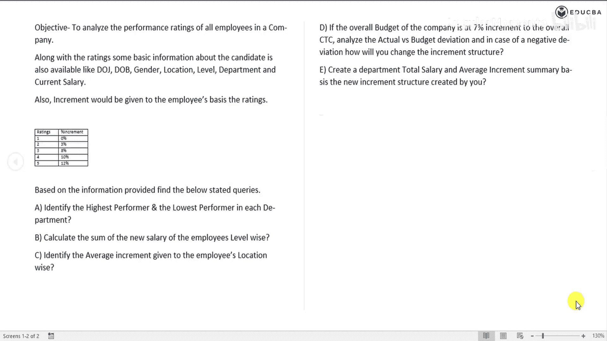
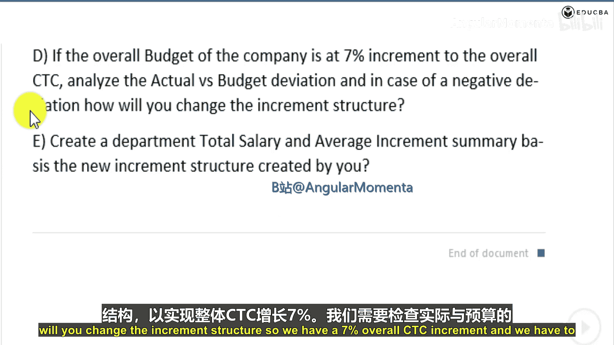
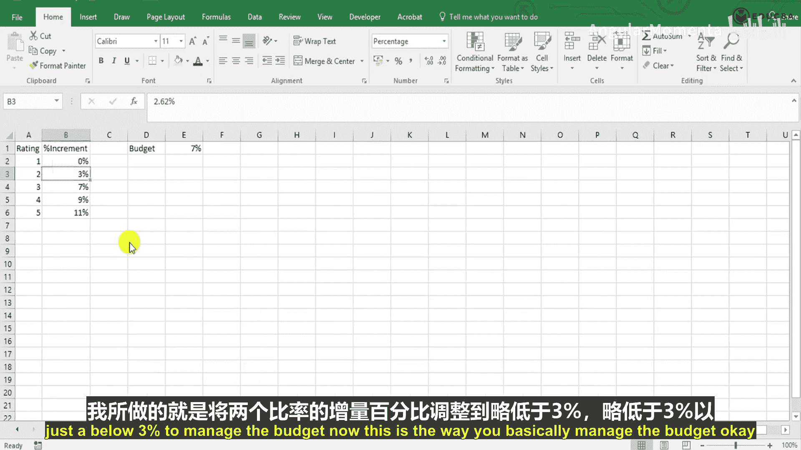
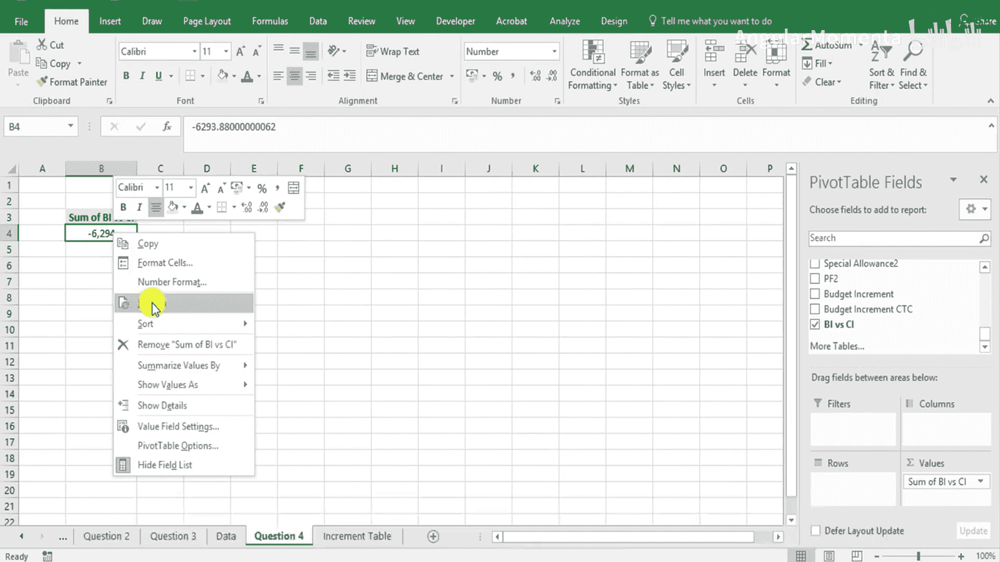

# 008：预算与实际绩效分析对比 📊

在本节课中，我们将学习如何使用Excel数据透视表进行预算与实际绩效的对比分析。我们将通过一个具体案例，分析公司设定的7%整体预算增幅与实际执行情况之间的偏差，并探讨如何调整薪酬结构以管理预算。

---

上一节我们介绍了如何计算员工的新薪酬，本节中我们来看看如何将实际薪酬与预算目标进行对比分析。

公司设定的整体预算增幅为7%。我们需要分析实际薪酬与预算薪酬之间的偏差。如果出现负偏差（即实际成本超出预算），我们将探讨如何调整薪酬增幅结构。

首先，我们需要在数据表中加入预算增幅的计算。预算增幅的计算公式为：
`预算增幅 = 当前薪酬 * 7%`

接着，计算预算薪酬总额（Budget CTC）：
`预算薪酬总额 = 当前薪酬 + 预算增幅`

我们将预算相关数据用不同颜色（如红色）标记以便区分。完成计算后，可以观察到实际薪酬总额与预算薪酬总额之间存在差异。在本例中，总差异为负的35.6万，这意味着实际薪酬总额比预算高出约35.6万。

为了更清晰地分析，我们创建一个新的工作表并插入数据透视表。

以下是创建数据透视表的步骤：
1.  选中数据区域。
2.  点击 **插入** 选项卡。
3.  选择 **数据透视表**。
4.  在弹出的对话框中，选择将透视表放在现有工作表中。
5.  将需要求和的字段（如薪酬差异）拖入“值”区域，并设置为“求和”。

透视表显示，总薪酬差异为正值35.6万，表明公司整体薪酬超出了预算。具体到个人，有的员工薪酬低于预算（如某人少4.5万），有的则高于预算（如某人多3.5万）。

我们的目标是将总差异尽可能调整至接近零。由于当前总差异为正（超出预算），我们需要通过降低部分员工的薪酬增幅百分比来减少总体支出。

---

上一部分我们通过透视表识别了预算超支的问题，接下来我们看看如何通过调整薪酬增幅结构来管理预算。

调整的核心思路是修改基于绩效评级的增幅百分比表。我们将尝试降低某些评级（如评级2）的增幅比例，并观察其对总差异的影响。

操作过程如下：
1.  修改“增幅表”中对应绩效评级的百分比。例如，将评级2的增幅从3%尝试调整为2.5%。
2.  每次修改后，**刷新** 数据透视表以查看最新的总差异。
3.  重复此过程，微调百分比，直到总差异接近零。这是一个类似“单变量求解”的手动迭代过程。

例如，经过多次尝试，将评级2的增幅调整为2.62%后，总差异被缩小到约2万的正向差异（即实际仅超出预算2万），这已是非常接近预算目标的结果。

通过这种方式，我们实现了预算管理。关键在于所有工作表都是动态链接的：修改增幅表 → 预算增幅和预算总额自动重新计算 → 数据透视表刷新后立即反映最新的差异。

---

本节课中我们一起学习了如何使用Excel数据透视表进行预算与实际绩效的对比分析。关键步骤包括：计算预算增幅与预算总额、利用透视表快速汇总和识别总体偏差、以及通过动态链接的工作表和迭代调整增幅百分比来实现精细化的预算控制。掌握这一方法，你可以有效地监控和管理薪酬等项目的预算执行情况。