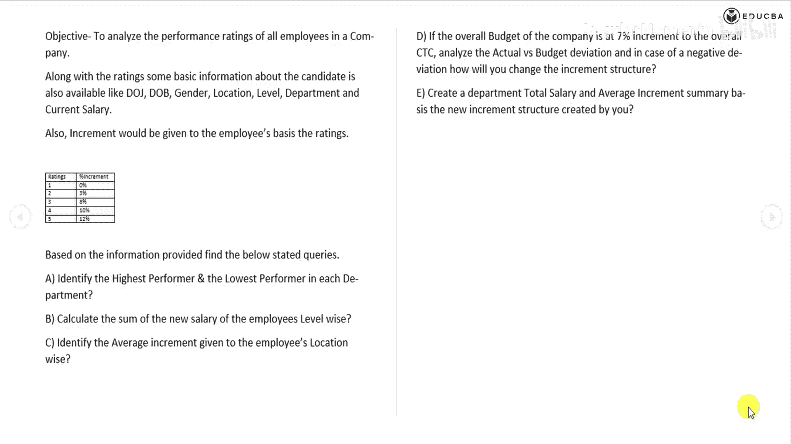
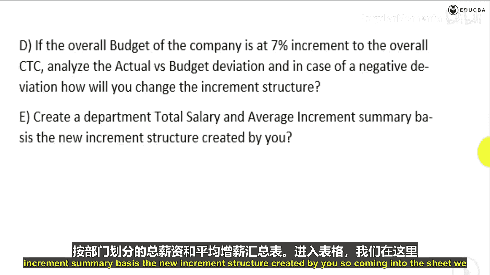
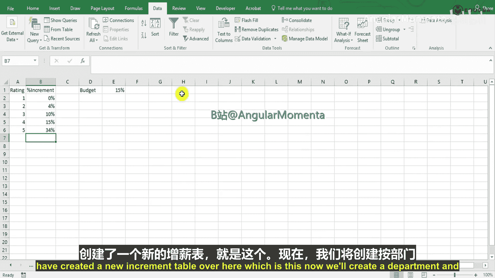
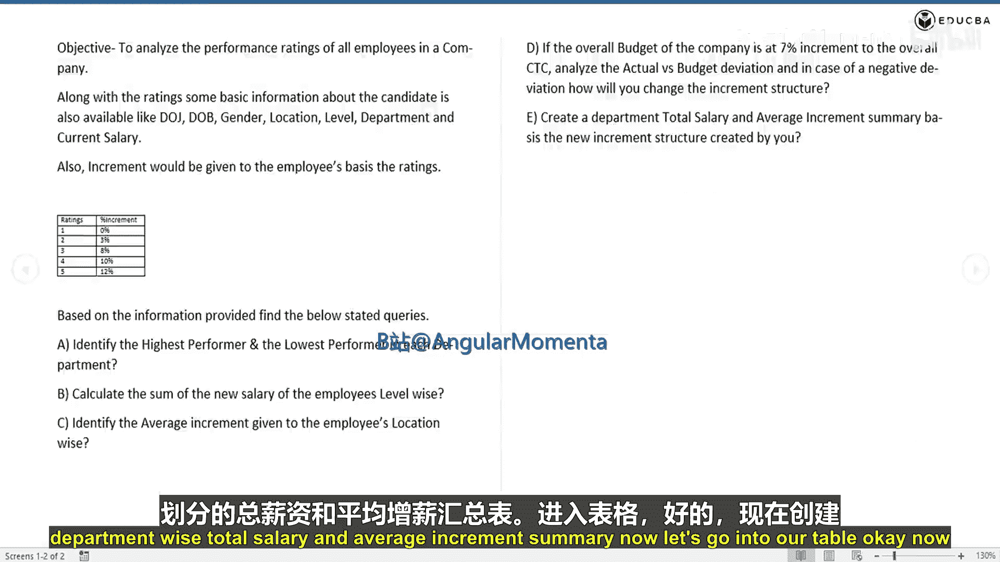
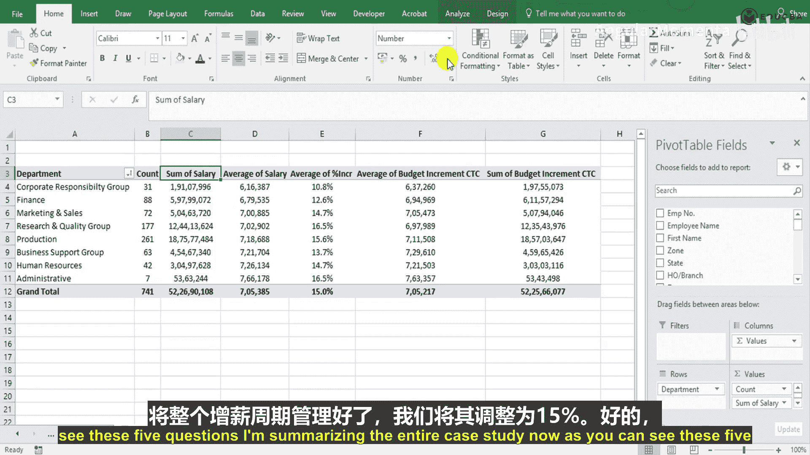
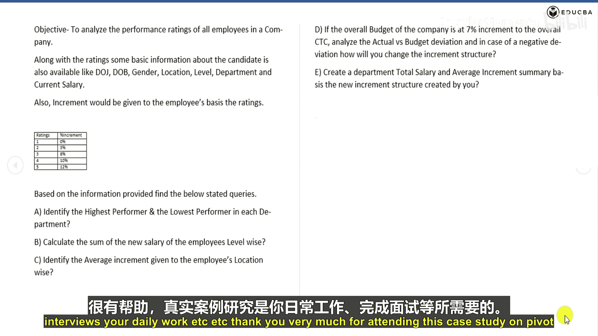

# 010：数据透视表应用 📊

在本节课中，我们将学习如何使用数据透视表创建部门化的薪资与调薪汇总，这是分析员工绩效案例研究的最后一步。我们将整合所有数据，从多个角度审视调薪周期的最终结果。

上一节我们完成了调薪结构的计算，本节中我们将利用数据透视表，对各部门的薪资总额、平均薪资及平均调薪率进行综合分析。

现在，我们进入工作表，这里已经创建了包含新调薪后数据的数据集。

## 创建部门汇总数据透视表

我们将基于新的数据集创建一个数据透视表，以按部门进行汇总分析。

1.  首先，选中数据区域，点击 **插入** -> **数据透视表**。
2.  在弹出的对话框中，选择将数据透视表放置在新工作表。
3.  我们将这个新工作表命名为“部门汇总”。

以下是构建数据透视表字段的步骤：

*   **行区域**：将“部门”字段拖入此处，作为分类依据。
*   **值区域**：我们需要添加多个计算字段来全面分析。
    *   将“薪资”字段拖入值区域，默认会计算为 **`求和项:薪资`**。这代表各部门的薪资总额。
    *   再次将“薪资”字段拖入值区域，并将其值字段设置改为 **`计数`**。这可以让我们知道每个部门有多少名员工。
    *   第三次将“薪资”字段拖入值区域，并将其值字段设置改为 **`平均值`**。这代表各部门的平均薪资。
    *   将“调薪率”字段拖入值区域，并将其值字段设置改为 **`平均值`**。这代表各部门的平均调薪百分比。
    *   将“预算调薪后薪资”字段拖入值区域，并将其值字段设置改为 **`平均值`**。这提供了一个对比视角。

完成后的数据透视表将清晰展示各部门的以下信息：员工数量、薪资总额、平均薪资、平均调薪率以及平均预算调薪后薪资。

## 分析数据透视表结果

现在，我们可以对生成的数据透视表进行分析和解读。

*   **排序分析**：我们可以按“平均薪资”进行排序。结果显示，企业责任组的平均薪资最低（约61,000），而行政部门的平均薪资最高（约76,600）。
*   **关联洞察**：尽管企业责任组的平均调薪率最高（16.5%），但其平均薪资仍然最低。这是因为他们的薪资基数原本就较低，因此即使调薪比例高，增长的绝对值也相对较小。
*   **预算对比**：我们还可以在值区域添加“预算调薪后薪资”的 **`求和项`**，与实际的“薪资总额”进行对比。计算两者差异的百分比公式为：**`=(实际薪资总额/预算薪资总额)-1`**。在本案例中，差异率仅为0.02%，远低于1%，说明整个调薪周期被严格控制在预算范围内。

通过这个数据透视表，我们成功地从员工数量、成本总额、薪酬水平、调薪力度以及预算符合度等多个维度，全面评估了本次调薪的效果。

## 案例总结与回顾

本节课中我们一起学习了如何运用数据透视表解决一个完整的、贴近实际工作的数据分析案例。我们通过五个核心问题，逐步演示了从数据清洗、计算新字段到多维度分析的完整流程。

这个案例是现实场景的典型缩影。在工作中或面试时，你很可能遇到类似的数据集，需要运用Excel技能（特别是数据透视表）来完成数据整理并通过它产生有价值的洞见。掌握此类分析方法，对于完成日常工作或应对专业挑战都至关重要。

希望本案例研究对你非常有帮助。我们的网站上还有更多实用课程和真实案例研究，这些都将助力你的日常工作和职业发展。感谢你学习本次关于数据透视表的案例课程。