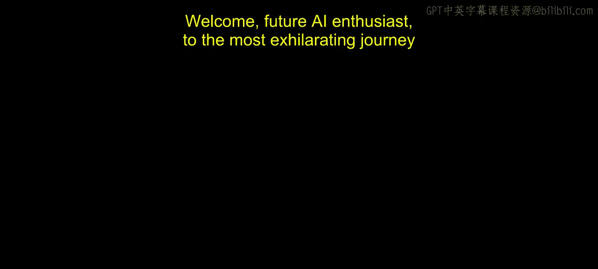
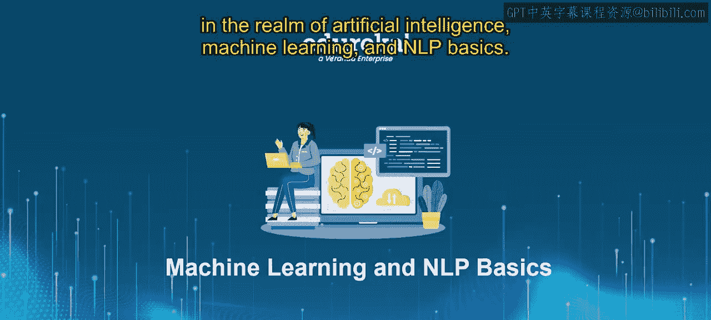
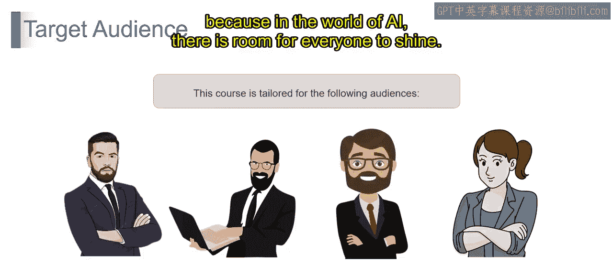
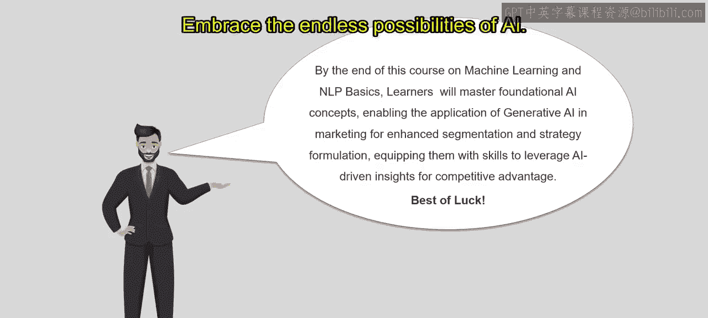

# 第一部分 1：课程介绍 🚀

在本节课中，我们将一起了解生成式人工智能与大型语言模型（LLMs）课程的概览，探索人工智能、机器学习和自然语言处理（NLP）的广阔世界。我们将明确课程目标、适用人群以及你将学到的核心技能。

---

欢迎各位人工智能爱好者，踏上人工智能、机器学习和自然语言处理基础领域最激动人心的旅程。

我很荣幸能作为向导，带领大家开启一段穿越机器学习、深度学习和自然语言处理奇妙世界的冒险之旅。所有这些内容都包含在这门综合课程中。但在我们深入算法和神经网络的细节之前，让我们先来设定一下背景。

想象一个世界，机器不仅能执行任务，还能像人类一样从数据中学习。这就是机器学习的精髓，也是现代人工智能的支柱。从预测股价到诊断疾病，其可能性是无穷无尽的。

现在，让我们更进一步，深入神经网络的深渊，探索深度学习。它就像是强化版的机器学习，赋予计算机理解、分析甚至生成类人响应的能力。从图像识别到自动驾驶汽车，深度学习正在全球范围内革新各行各业。

接着是自然语言处理，在这里，机器理解人类语言的复杂性。想象一下，你的计算机能够像一位经验丰富的智者一样理解、翻译甚至生成文本。这就是NLP创造奇迹的地方，它驱动着虚拟助手、情感分析等诸多创新。

在本课程中，我们将穿越这些尖端技术的复杂领域，逐一揭开它们的神秘面纱。你将获得实践经验，应对现实世界的挑战，并最终掌握自信应对人工智能领域所需的技能。

所以，请系好安全带，准备好通过本课程提升你对人工智能的理解。

现在，你可能在想：这门课程适合我吗？不必再疑惑了。这段穿越人工智能领域的激动人心的旅程，是为广泛的爱好者量身定制的。

以下是本课程的目标学员：
*   **机器学习工程师**：如果你渴望提升技能并保持领先，那么你来对地方了。
*   **初学者**：别担心，我们为你准备了友好的入门方法，让你能迅速掌握人工智能。
*   **数据科学家**：深入人工智能世界，通过实践见解和动手经验来扩展你的工具箱。
*   **研究人员**：准备好推动创新的边界，我们将深入探讨驱动人工智能向前发展的最新进展和技术。

无论你是为了职业发展、探索新热情，还是开创突破性解决方案而来，本课程都是释放人工智能全部潜力的门户。

因此，无论你的背景或抱负如何，都请加入我们这场激动人心的冒险。因为在人工智能的世界里，每个人都有发光发热的空间。

在本课程结束时，你将掌握人工智能的基本概念，为深入理解其复杂性铺平道路。你将具备知识和技能，能够利用生成式人工智能的力量，通过高级细分和制定来革新营销策略。凭借人工智能驱动的洞察力，你将准备好自信地驾驭竞争格局，利用尖端技术保持领先，并为你自己和你的组织推动成功。当你带着新获得的知识和技能开启下一篇章时，请记住，天空才是极限。

祝愿你在旅程中一切顺利，愿你的未来充满成功与创新。拥抱人工智能的无限可能。你的冒险才刚刚开始。谢谢。

---

本节课中，我们一起学习了本课程的总体介绍。我们了解了人工智能、机器学习和自然语言处理的基本概念及其广阔的应用前景，明确了课程的目标学员和最终的学习成果。在接下来的课程中，我们将逐步深入这些技术的核心。