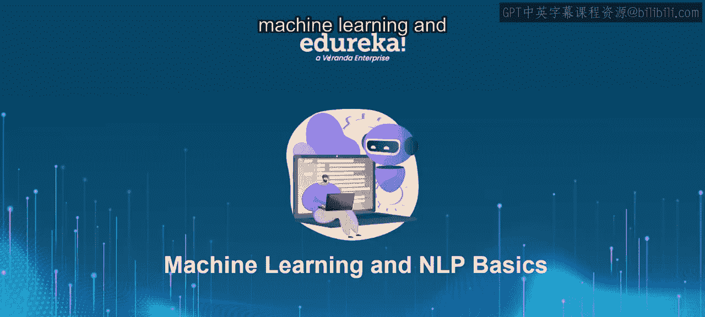
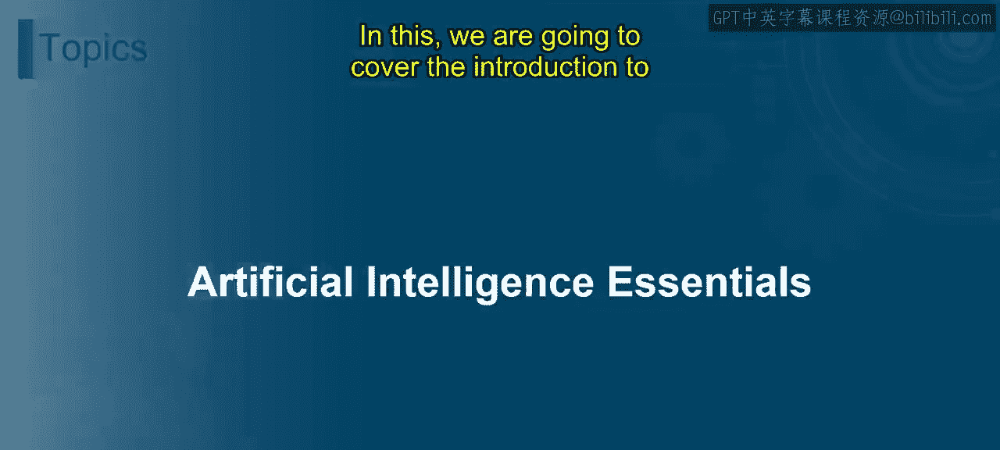
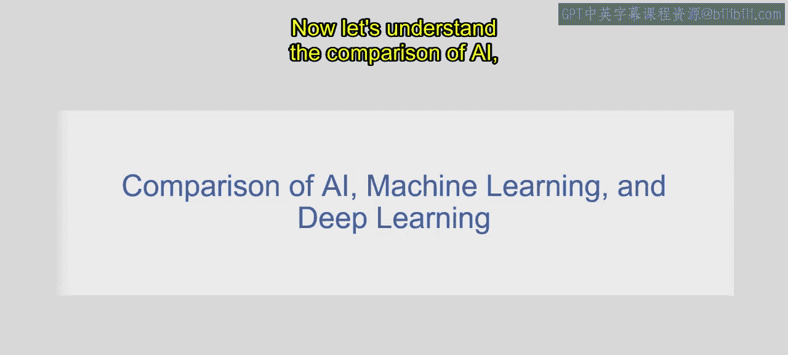
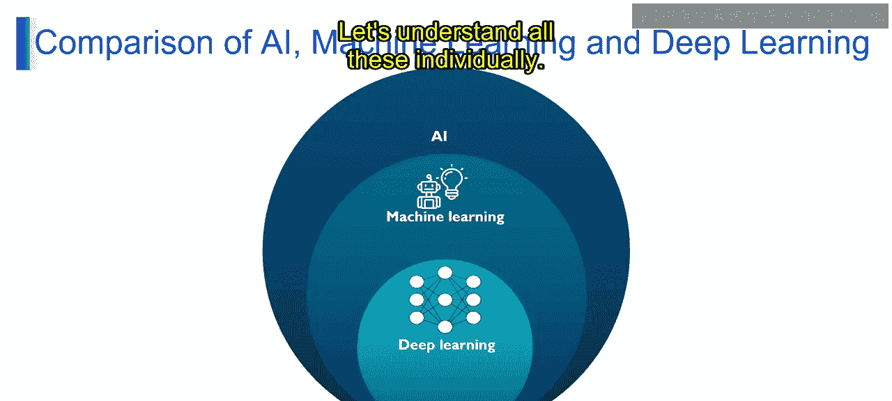
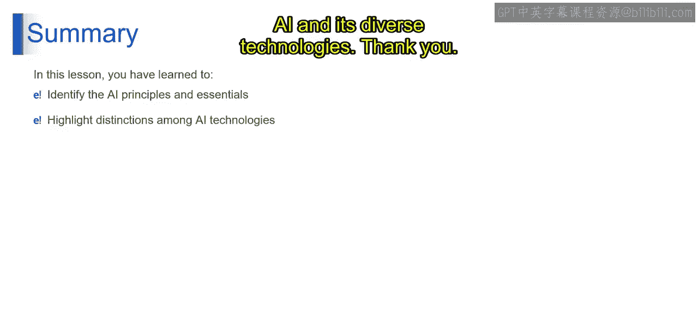

# 第一部分 2：人工智能基础 🧠

在本节课中，我们将一起探索人工智能的基础概念，并了解人工智能、机器学习和深度学习之间的关系。课程结束时，你将能够理解人工智能的基本原理，并清晰阐述这三者之间的区别。

---

## 人工智能基础介绍

想象一下，你正在与一位在线客服代表聊天。有时，与你对话的可能是一个由人工智能驱动的聊天机器人程序。这些聊天机器人经过大量数据训练，能够识别人类语言中的模式并据此提供有用的回应。

人工智能是计算机科学的一个分支，专注于创建能够执行通常需要人类智能才能完成任务的系统。这些任务包括解决问题、理解语言、识别模式和做出决策。在上述聊天机器人的例子中，其背后的人工智能旨在通过分析和解释用户输入来模仿人类对话，并相应地生成回应。这涉及多个技术概念。

具体而言，人工智能具备四种主要能力：

以下是人工智能的四种核心能力：

1.  **学习**：人工智能系统使用算法从数据中学习，以发现模式和获取洞察。这有助于它们在没有明确编程的情况下随时间不断改进。
2.  **推理**：人工智能能够推理，并从现有信息中得出逻辑结论，使其能够基于规则和数据做出明智决策并解决复杂问题。
3.  **解决问题**：人工智能擅长解决各个领域的难题，它利用算法和计算技术来优化流程并找到解决方案。
4.  **感知**：人工智能系统能够像人类一样感知和解释感官数据。计算机视觉和自然语言处理等技术使它们能够理解和与世界互动，从而实现自动驾驶汽车和虚拟助手等应用。

---

## 人工智能、机器学习与深度学习的比较

上一节我们介绍了人工智能的核心能力，本节中我们来看看人工智能、机器学习和深度学习之间的关系。首先需要明确的是，机器学习和深度学习是人工智能的一部分。

以下是三者的定义与区别：

*   **人工智能**：指计算机科学中更广泛的领域，旨在创建能够执行通常需要人类智能才能完成任务的系统。这些任务包括识别图像中的物体、理解自然语言以及基于复杂数据做出决策。
    *   **示例**：人工智能使得智能语音助手（如亚马逊的Alexa、苹果的Siri或谷歌助手）成为可能，用户可以使用自然语言命令来控制家电、播放音乐、设置提醒和回答问题。
*   **机器学习**：是人工智能的一个子集，专注于开发允许计算机从数据中学习并随时间提高性能的算法，而无需进行明确的编程。
    *   **示例**：在图像识别中，一个机器学习算法可以在包含数千张带有“猫”和“狗”标签的图像的数据集上进行训练。通过接触这些示例，算法学会根据形状、颜色甚至纹理等特征来区分猫和狗。
*   **深度学习**：是机器学习的一个子领域，它利用具有多层结构的人工神经网络（也称为深度架构）来从数据中学习复杂的模式和表示。
    *   **示例**：聊天机器人利用深度学习技术来提供与用户交互的对话界面。例如，客户服务部门或网站上的虚拟助手所使用的聊天机器人，它们采用深度神经网络来理解和生成对用户查询、询问和请求的类人回应。它们从交互中学习，以不断提高对话能力，并提供更准确的响应。

在这个例子中，人工智能涵盖了创建智能系统的更广泛目标，而机器学习和深度学习代表了人工智能工具包中用于实现图像识别等任务的具体方法。机器学习侧重于从数据中学习以提高性能，而深度学习则利用深度神经网络直接从原始数据中学习复杂的模式和表示。

---

## 总结

本节课中，我们一起学习了人工智能的原理和基础知识，包括其目标和基本概念。此外，你还学会了区分人工智能、机器学习和深度学习等各种人工智能技术，并理解了它们在解决现实世界问题中的角色和应用。这些知识为你奠定了理解人工智能及其多样化技术的基础。