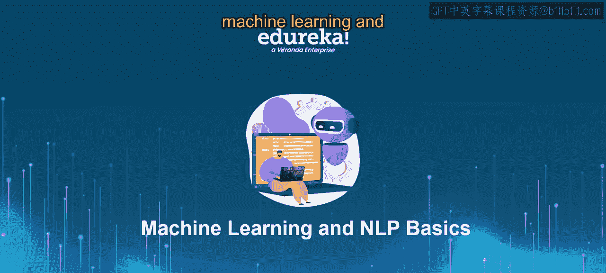
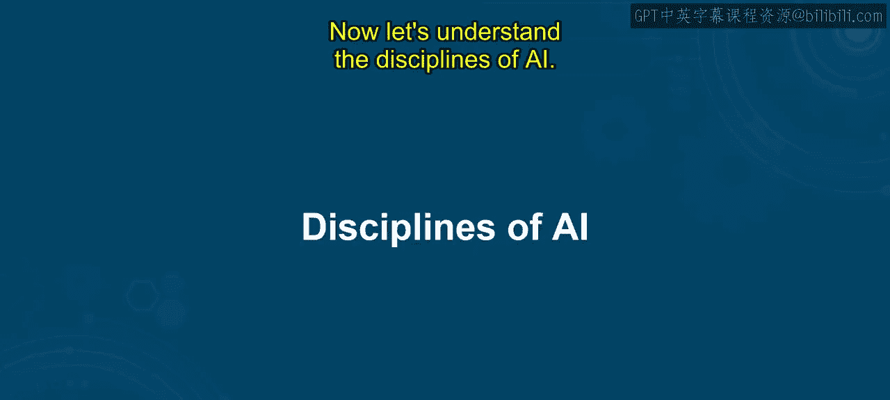
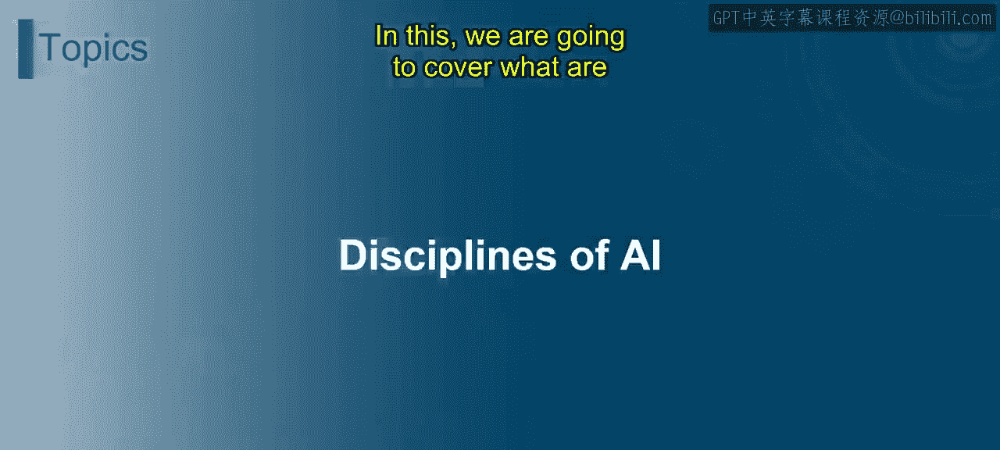
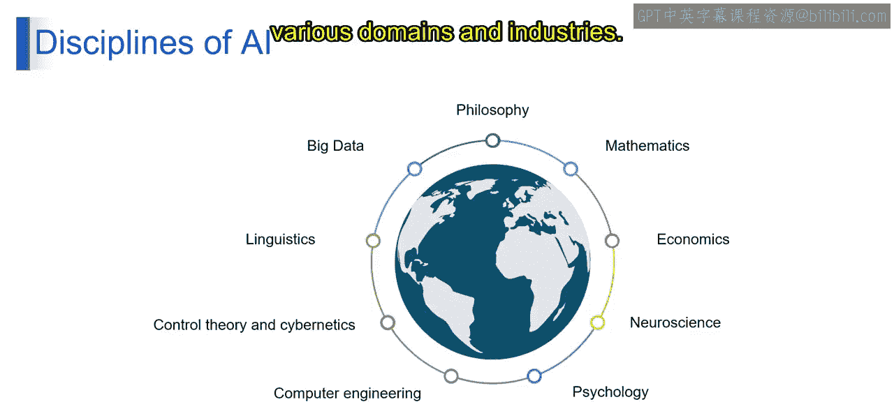
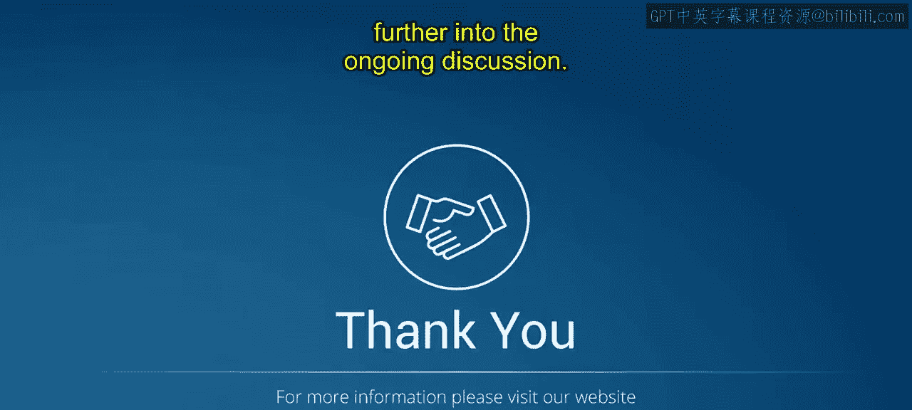

# 第一部分 3：人工智能的学科 🧠

在本节课中，我们将一起探索人工智能的学科领域。我们将了解构成人工智能的各个核心分支，并学习它们各自的核心概念与应用。课程结束时，你将能够理解、识别并解释人工智能的核心思想，掌握不同AI学科的基本概念及其应用。

---

## 什么是人工智能的学科？

人工智能的学科，指的是人工智能领域内不同的研究主题或方向。每个学科都专注于特定的方面，例如教计算机从数据中学习、理解人类语言、识别图像中的物体，或者让机器人模仿人类行为。这些不同的领域帮助研究者和开发者探索人工智能的各个方面，并以不同方式将其应用于医疗、金融或娱乐等行业。理解这些学科，有助于我们看到人工智能的广泛应用前景。

## 人工智能学科包含哪些内容？

以下是构成人工智能的主要学科领域：

**机器学习**
机器学习旨在教计算机从数据中学习，并随着时间的推移改进其性能，而无需进行明确的编程。其核心思想可以概括为：**模型 = 算法 + 数据**。

**自然语言处理**
自然语言处理使计算机能够以有意义且符合上下文的方式理解、解释和生成人类语言。

**计算机视觉**
计算机视觉赋予计算机解释和分析来自图像或视频的视觉信息的能力，从而实现物体检测、图像分类和人脸识别等任务。

**机器人学**
机器人学专注于设计和开发能够感知环境、做出决策并自主或半自主执行任务的机器人。

**规划**
规划涉及创建算法和方法，以生成一系列行动来实现特定目标，应用领域包括物流、调度或自主导航。

**知识表示**
知识表示为智能系统提供技术，以计算机能够理解和推理的方式组织和表示知识，从而促进智能决策和问题解决。

这些学科共同推动了人工智能的进步，它们从不同方面处理智能问题，并在各个领域和行业中实现了广泛的应用。

---

上一节我们概述了人工智能的主要应用学科，接下来，我们将深入探讨支撑这些应用的基础理论学科。

## 支撑人工智能的基础学科

人工智能的发展建立在多个基础学科之上，它们提供了理论、方法和工具。

**哲学**
哲学探讨关于智能、意识和伦理的基本问题，为人工智能发展的理论基础和伦理考量提供信息。

**数学**
数学为人工智能提供了基础框架，包括微积分、线性代数、概率论和最优化等关键算法与技术，这些对于建模和解决AI问题至关重要。

**经济学**
经济学研究资源分配和决策过程，这与人工智能在博弈论、优化、市场设计等领域的应用相关，同时也帮助我们理解AI技术带来的经济影响。

**神经科学**
神经科学研究大脑的结构和功能，为理解生物智能提供见解，并启发了人工智能中的神经网络模型，例如人工神经网络和深度学习架构。

**心理学**
心理学探索人类认知、感知和行为，这为设计与人类交互的AI系统（如虚拟助手、聊天机器人和情感计算应用）提供了信息。

**计算机工程**
计算机工程专注于设计和构建硬件与软件系统，包括处理器、内存、操作系统和编程语言，这些是实现AI算法和应用的基础。

**控制论与控制理论**
控制论与控制理论研究动态系统中的反馈与控制原理，这些原理与机器人、自动驾驶汽车和自适应系统等AI领域密切相关。

**语言学**
语言学研究语言的结构和规则，这对于人工智能中的自然语言处理至关重要，包括语音识别、机器翻译和情感分析等任务。

**大数据**
大数据专注于大规模复杂数据集的收集、存储和分析，这是许多AI应用（包括机器学习、数据挖掘和预测分析）的核心。

这些学科提供了多样化的视角和方法论，共同促进了人工智能在各个领域和行业中的发展、理解和应用。

---

本节课中，我们一起学习了人工智能的学科体系。我们首先了解了人工智能的主要应用学科，如机器学习、自然语言处理和计算机视觉等。接着，我们探讨了支撑这些应用的基础理论学科，包括数学、哲学、神经科学等。理解这些学科如何交织在一起，是掌握人工智能广阔领域的第一步。在接下来的课程中，我们将继续深入探讨这些概念。