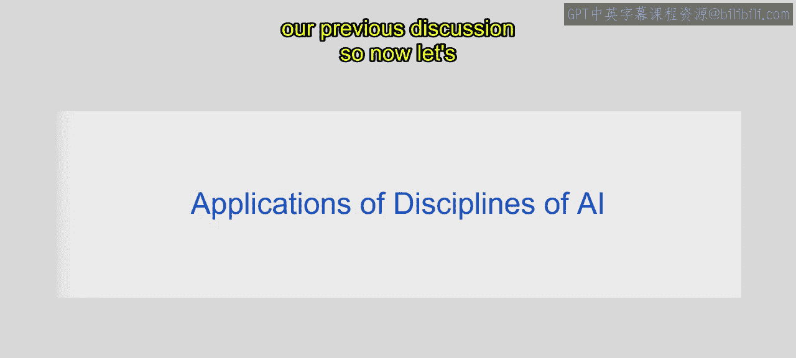
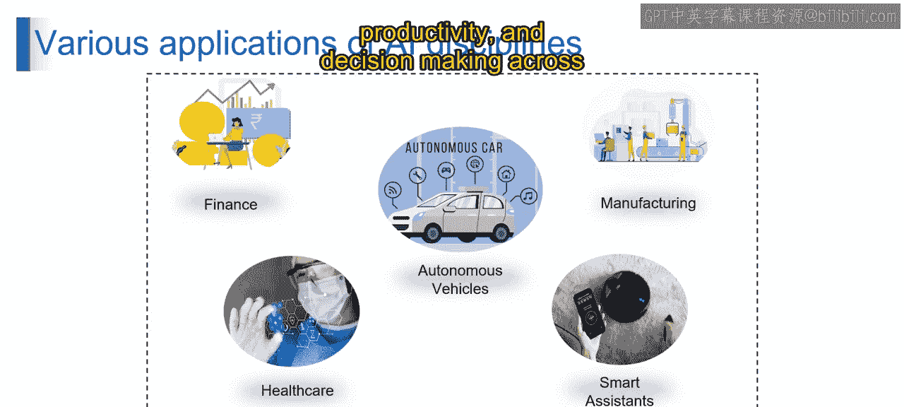
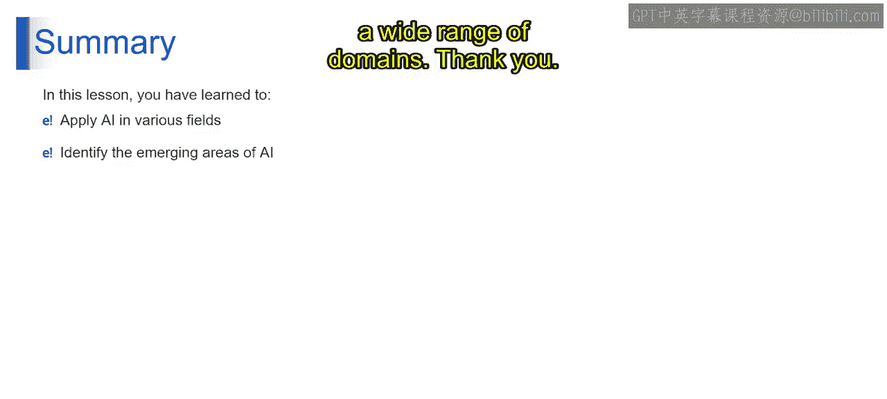

# 第一部分 4：AI学科的各种应用 🚀


在本节课中，我们将探讨人工智能（AI）在不同学科领域中的具体应用。我们将了解AI技术，如机器学习和数据分析，如何被应用于金融、医疗、自动驾驶、制造业和智能助手等多个行业，以解决复杂问题并提升效率。

---

## 金融领域的应用 💰

上一节我们介绍了AI的基本概念，本节中我们来看看AI在金融领域的应用。AI技术，特别是机器学习和大数据分析，被广泛应用于金融行业。

以下是AI在金融中的主要应用场景：

*   **算法交易**：利用机器学习模型分析市场数据，自动执行交易决策。
*   **欺诈检测**：通过分析交易模式，使用算法识别异常和潜在的欺诈行为。
*   **风险评估**：构建模型评估贷款或投资风险，公式可表示为 **风险评分 = f(客户数据, 市场数据)**。
*   **客户关系管理**：使用数据分析来个性化金融服务和产品推荐。

这些应用融合了数学、经济学和大数据等学科，以做出数据驱动的决策并优化金融流程。

---

## 医疗健康领域的应用 🏥



了解了金融应用后，我们转向医疗健康领域。在这里，机器学习、自然语言处理（NLP）和计算机视觉等AI学科发挥着关键作用。

以下是AI在医疗健康中的主要应用方向：

*   **医学影像分析**：计算机视觉算法帮助分析X光、MRI等影像，辅助识别病灶。
*   **疾病诊断**：机器学习模型根据患者数据辅助进行疾病预测与诊断。
*   **个性化治疗规划**：基于患者基因组学和生活习惯数据，制定定制化治疗方案。
*   **药物发现**：利用AI加速新药化合物的筛选和模拟测试过程。
*   **患者监护**：通过可穿戴设备数据，实时监测患者健康状况。

AI技术赋能医疗专业人员做出更精准的诊断，为患者量身定制治疗方案，从而提升整体医疗护理水平。

---

## 自动驾驶领域的应用 🚗

接下来，我们探索AI在自动驾驶领域的应用。该领域深度融合了机器人学、控制理论、计算机视觉和机器学习等多个AI学科。

这些技术使自动驾驶汽车能够感知环境、做出决策、安全导航，并与道路上的其他车辆及行人互动，从而为实现更安全、更高效的交通系统做出贡献。其核心流程可以概括为：

```python
# 第一部分 简化的自动驾驶感知-决策循环
while vehicle_is_running:
    sensor_data = capture_environment() # 计算机视觉感知环境
    processed_data = ml_model_analyze(sensor_data) # 机器学习分析数据
    driving_decision = make_decision(processed_data) # 控制理论做出决策
    execute_decision(driving_decision) # 执行驾驶动作
```

---

## 制造业领域的应用 🏭

在制造业中，AI技术被用于优化生产和维护流程。主要应用包括预测性维护、质量控制、供应链优化和流程自动化。

例如，机器学习算法分析来自设备的传感器数据，预测设备故障，从而防止意外停机。同时，机器人与自动化技术简化了生产流程，提高了生产效率。其预测性维护的核心思想可以用以下公式表示：

**设备故障概率 = g(传感器历史数据， 运行时间， 环境因素)**

---

## 智能助手领域的应用 🤖

最后，我们来看看AI在智能助手方面的应用。虚拟代理和聊天机器人等智能助手，利用了自然语言处理（NLP）、机器学习（ML）和认知心理学等AI学科。



以下是智能助手的主要功能：

*   **回答问题**：理解用户自然语言提问并给出答案。
*   **执行任务**：例如设置提醒、发送信息等。
*   **安排预约**：管理日历和行程。
*   **控制智能家居设备**：通过语音或指令控制联网设备。

这些应用通过与用户交互并提供个性化协助，显著增强了用户的工作效率和生活便利性。

---

## 总结 📚

本节课中，我们一起学习了人工智能在多个领域的广泛应用，包括金融、医疗健康、自动驾驶、制造业和智能助手。这些例子展示了AI各学科如何协同工作，解决不同行业的复杂问题，提升效率、生产力和决策水平。



此外，我们也识别了AI应用的新兴领域，这预示着AI拥有革新产业、应对复杂挑战的巨大潜力。这份理解将帮助你未来在更广泛的领域内，利用AI的能力进行创新和解决问题。