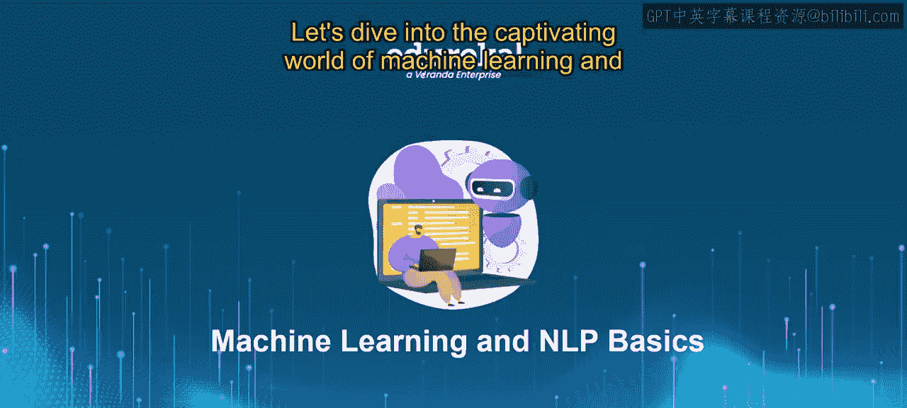
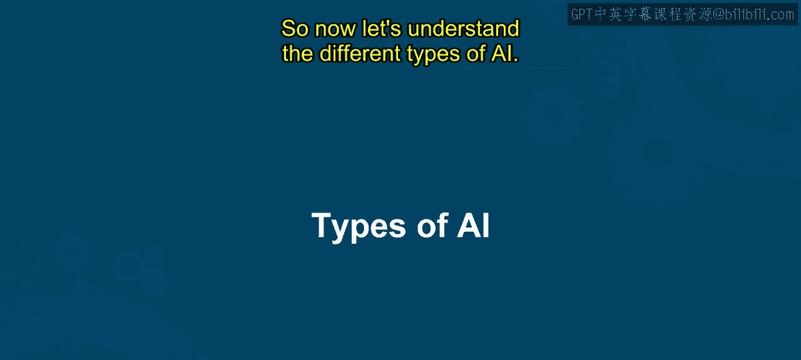
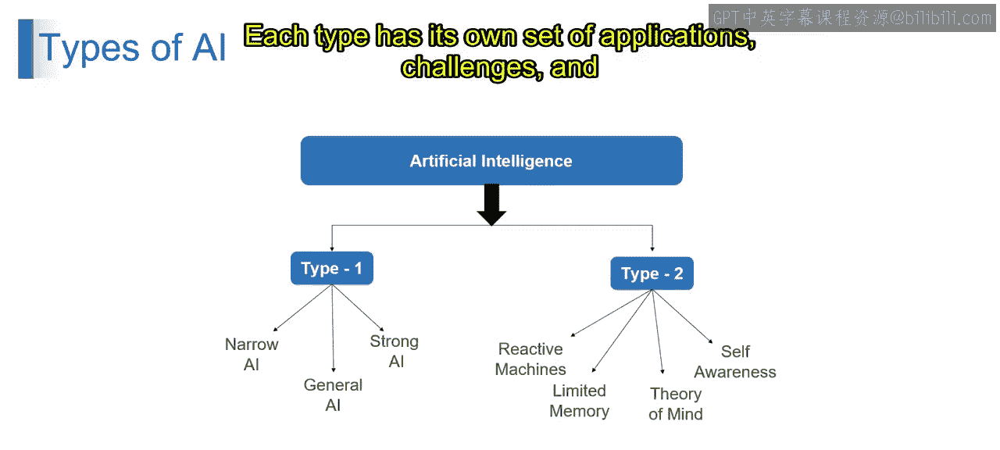

# 第一部分 5：人工智能的类型 🤖

在本节课中，我们将要学习人工智能的不同分类方式。我们将从宏观上了解人工智能的几种主要类型，包括弱人工智能与强人工智能的对比，以及更细致的分类体系。通过本节内容，你将能够识别并解释各类人工智能之间的区别，从而对人工智能的广阔分类建立起全面的理解。

---

## 人工智能的宏观分类

首先，我们来了解人工智能的宏观分类。人工智能主要可以分为两大类。

以下是第一类人工智能的细分：

*   **狭义人工智能**：也称为弱人工智能或专用人工智能。它指的是为特定任务或领域设计和训练的人工智能系统。这些系统擅长执行预定义的任务，但缺乏在其预定范围之外进行泛化或适应新情境的能力。
*   **通用人工智能**：也称为强人工智能或人工通用智能。它旨在复制人类所展现的广泛认知能力。通用人工智能系统将具备跨不同领域理解、学习和应用知识的能力，类似于人类智能。
*   **强人工智能**：指在所有领域和任务中展现出人类水平智能的人工智能系统。这些系统将具备意识、自我意识，以及独立进行推理、理解上下文和参与复杂决策的能力。

以上是关于第一类人工智能的介绍。接下来，我们看看第二类人工智能的分类方式。

---

## 基于能力的细致分类

第二类人工智能基于其能力和特性，可以进一步分为四种类型。

以下是这四种类型的详细介绍：

*   **反应机器**：这类人工智能系统完全基于当前输入进行操作，没有对过去事件的记忆。它们实时对刺激做出反应，但不具备存储或回忆先前交互信息的能力。
*   **有限记忆**：与反应机器不同，具备有限记忆的人工智能系统可以存储和回忆过去的经验，以辅助其决策过程。这些系统拥有短期记忆，使其能够从最近的交互中学习并相应地调整行为。
*   **心智理论**：这指的是人工智能系统理解并归因于自身及他人的心理状态、信念、意图和情感的能力。具备心智理论的人工智能可以推断人类和其他智能体的心理状态，从而实现更复杂的交互与协作。
*   **自我意识**：自我意识的人工智能系统具备认识自身存在、身份和内部状态的能力。这些系统拥有意识和内省感，使其能够反思自己的思想、情感和经历。

---

## 总结与展望

本节课中，我们一起学习了人工智能的不同类型。这些类型代表了从专用任务导向系统到更通用、更类人智能的不同级别的智能、能力和特征。每种类型都有其自身的应用场景、挑战以及对人工智能未来的影响。

接下来的课程将进一步深入探讨这些类型的实际应用与发展。