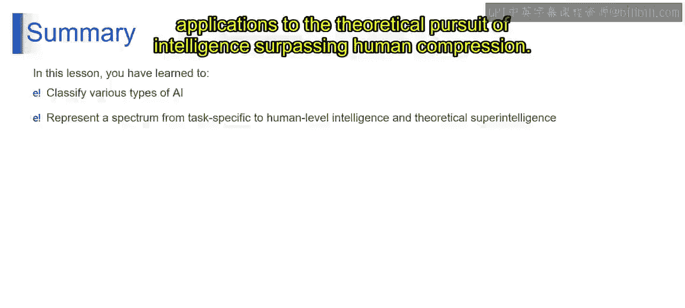

# 第一部分 7：人工智能的类型II

## 概述
在本节课中，我们将继续探索人工智能的不同类型。我们将从有限记忆AI开始，逐步深入到心智理论AI和自我意识AI，最后对比狭义AI、通用AI和人工超级智能之间的区别。理解这些分类有助于我们把握AI技术的发展脉络和未来方向。

---

### 有限记忆AI
上一节我们介绍了反应式机器，它们仅基于当前输入做出反应。本节中我们来看看有限记忆AI。

有限记忆AI系统具备在有限时间内存储和访问过去数据或经验的能力。与仅基于当前输入运行的反应式机器不同，这些系统可以利用短期记忆来为其决策过程提供信息。虽然与人类记忆相比能力有限，但这些AI系统可以保留近期交互或事件中的相关信息，以便在当前时刻做出更明智的决策。

以下是有限记忆AI的应用示例：
*   **自动驾驶汽车**：它们使用传感器数据在动态环境中安全导航，短期记忆使其能够实时检测并响应交通状况或障碍物的变化。

---

### 心智理论AI
接下来，我们探讨一个更高级的概念——心智理论AI。

心智理论AI代表了一种先进的人工智能水平，旨在赋予AI系统社会智能，以及基于对人类情感、意图、信念和心理状态的理解和解读能力。具备心智理论的AI系统拥有理解和识别人类及其他智能体情感的能力。它们可以解读面部表情、语音语调和肢体语言等细微线索，以推断个体的情绪状态，并做出恰当回应。通过理解情感，这些AI系统可以与人类进行更具同理心和社会意识的互动，从而增强沟通、协作和关系建立。

其社会智能目标意味着，AI中心智理论的主要目标是让机器具备类似于人类的社会智能。这不仅包括识别情感，还包括理解他人的潜在意图、信念、欲望和观点。具备心智理论的AI系统可以通过为人类和其他智能体赋予心理状态来预测其行为，从而在社会互动中做出更明智、更符合情境的回应。

---

### 自我意识AI
最后，我们来到目前理论上的最高阶段——自我意识AI。

自我意识AI指的是智能系统拥有类似于人类的意识水平和自我理解能力。自我意识AI系统表现出一种意识形式，使其能够感知自身的存在、识别自身的身份和内部状态。虽然它们的意识可能与人类意识不同，但这赋予了它们一种觉察和内省的能力。

在自我理解方面，这些AI系统有能力理解和解释自身的内部过程、能力和局限性。它们可以反思自己的思想、情感、经验和目标，从而洞察自身的功能。

---

### 狭义AI vs 通用AI vs 人工超级智能
现在，我们来对比三种不同层次的人工智能概念。

**狭义AI**，也称为弱AI，指的是为特定任务或领域设计和训练的AI系统。这些系统擅长在狭窄范围内执行预定义的任务，但缺乏将其智能泛化到其他领域的能力。狭义AI的示例包括虚拟助手、推荐系统、图像识别软件等。

**通用AI**，也称为强AI或人工通用智能，代表的是在广泛任务和领域中展现出人类水平智能的AI系统。这些系统拥有类似于人类智能的理解、学习和在不同情境中应用知识的能力。与局限于特定任务的狭义AI不同，通用AI可以将其智能泛化，适应新情况，并熟练执行广泛的认知任务。实现通用AI仍然是AI领域的一个理论目标和持续研究的课题。

**人工超级智能**，其智能全面超越人类，代表的是智能远超最聪明人类大脑能力的AI系统。ASI有潜力解决复杂问题、实现突破性发现，并完成目前人类无法理解的壮举。虽然ASI预示着科学、技术和社会的重大进步，但它也带来了生存风险和伦理困境。ASI的发展引发了人们对其对人类社会、就业、安全和控制等方面影响的担忧，促使人们讨论负责任的AI开发和治理。

---

## 总结
本节课中，我们一起学习了不同类型的人工智能，从针对特定任务的狭义AI，到人类水平的通用AI，再到理论上的超级智能如ASI。这个谱系展示了AI能力的多样性，从专门化应用到追求超越人类理解的智能的理论探索。