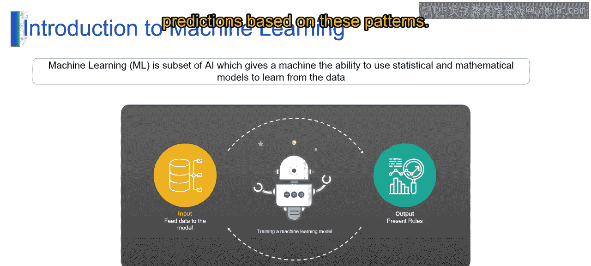

# 第一部分 8：机器学习基础

在本节课中，我们将一起探索机器学习的迷人世界及其基础概念。我们将涵盖机器学习的定义、重要性、技术及应用。课程结束时，你将能够理解机器学习的重要性，定义其涵盖范围，并探索其实际用途。

---

### 什么是机器学习？

机器学习是人工智能的一个子集，其核心在于开发算法和技术，使计算机能够从数据中“学习”或理解信息，并在无需明确编程的情况下，针对特定任务提升其性能。

其本质在于，机器学习算法允许系统根据提供的输入数据识别模式、做出预测或采取行动。机器学习的核心思想是让计算机能够从经验中学习，迭代地完善其理解，并相应地调整其行为。因此，机器学习算法旨在分析海量数据，识别潜在模式，并基于这些模式做出决策或预测。

---

### 机器学习的重要性

机器学习在自动化数据分析、实现预测以及增强跨多个领域的决策过程中扮演着至关重要的角色。你可以将机器学习视为一个强大的工具，它帮助计算机从数据中学习，就像我们从经验中学习一样。

通过分析大量数据，机器学习算法能够识别模式、做出决策或预测，并在无需人工干预的情况下协助做出更明智的决策。例如，机器学习驱动着流媒体平台上的推荐系统，帮助用户根据其偏好发现新内容。

从技术上讲，机器学习算法自动化了从数据中提取洞察的过程，使组织能够高效地分析海量数据。通过利用预测模型，企业可以预测客户行为、预判趋势、优化流程，甚至检测异常或欺诈活动。这种能力为从医疗保健、金融到制造业和市场营销等各行各业带来了效率提升、成本节约和创新。

---

#### 机器学习重要性的具体体现

以下是机器学习重要性的几个关键方面：

**自动化**
机器学习自动化了许多传统上耗时且易受人为错误影响的任务。诸如数据处理、文本过滤和图像识别等任务，都可以通过机器学习算法高效地自动化，从而释放宝贵的人力资源用于更具战略性的工作。

**节省时间**
机器学习显著减少了为复杂问题开发解决方案所需的时间。开发者无需从零开始创建算法，而是可以利用现有的机器学习模型和框架，从而节省大量时间和精力。这种加速的开发过程使组织能够快速部署解决方案并适应不断变化的业务需求。

**计算能力**
强大的计算资源（如图形处理单元，即GPU）的出现，彻底改变了机器学习领域。这些高性能计算平台使研究人员和实践者能够以前所未有的速度在海量数据集上训练复杂的机器学习模型。增强的计算能力促进了更精确、更复杂模型的开发，从而在医疗保健、金融和自动驾驶等多个领域取得了突破。

---

### 总结

本节课中，我们一起学习了机器学习的基础知识。我们了解了机器学习的定义，即让计算机从数据中学习并自主改进的技术。我们探讨了机器学习在自动化、效率提升和决策支持方面的重要性，并看到了它在推荐系统、预测分析等领域的实际应用。理解这些基础概念，是进一步探索生成式人工智能和大型语言模型世界的关键第一步。