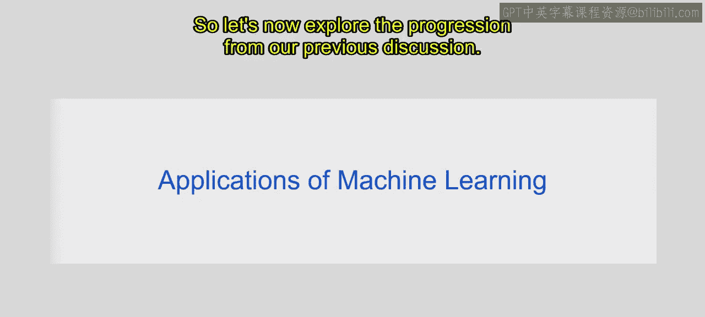
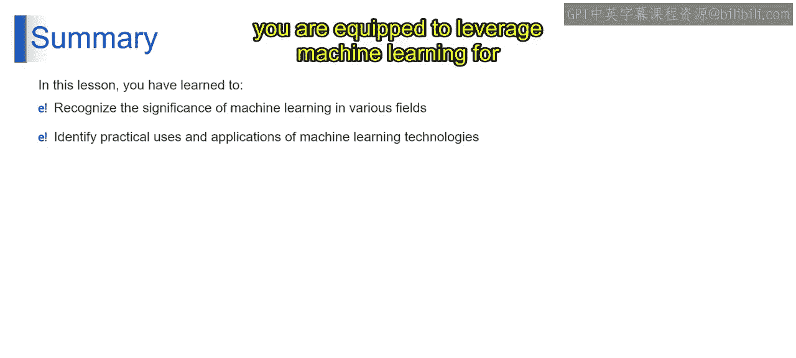
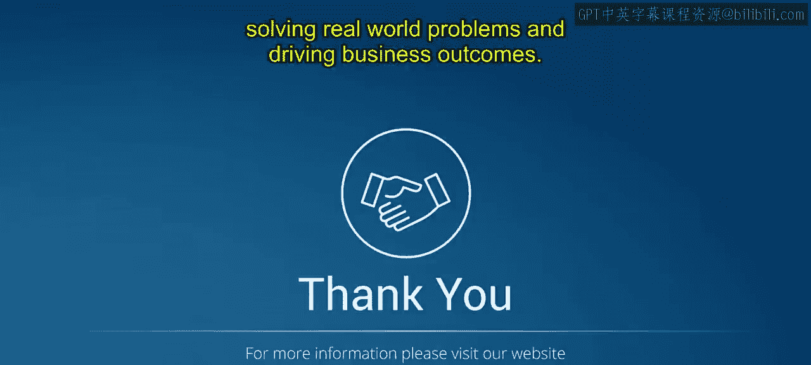

# 第一部分 9：机器学习的应用 🚀

在本节课中，我们将要学习机器学习在各个行业中的具体应用。上一节我们介绍了机器学习的基础概念，本节中我们来看看这些技术如何解决现实世界的问题。

机器学习通过分析数据、识别模式并做出预测或决策，已广泛应用于多个领域。其核心在于利用算法从数据中学习，而无需为每个特定任务进行显式编程。以下是机器学习在不同行业中的一些关键应用。

## 旅行与交通 ✈️

在旅行与交通领域，机器学习优化了定价、运营和客户体验。

以下是该领域的几个应用实例：

*   **动态定价**：机器学习算法分析历史数据、用户行为和市场趋势，动态调整价格，为航空公司、酒店和在线旅行社优化收入。
*   **预测航班延误**：通过分析天气状况、空中交通和历史航班数据等因素，机器学习模型可以预测航班延误的可能性，帮助航空公司和乘客做出明智决策。

## 市场营销与销售 📈

市场营销与销售是机器学习应用最广泛的领域之一，它帮助企业理解客户、预测行为并提升销售效率。

以下是该领域的几个应用实例：

*   **预测客户终身价值**：机器学习算法分析客户数据，预测每位客户的未来价值，帮助企业定制营销策略和客户保留工作。
*   **交叉销售与向上销售**：通过分析购买历史和客户偏好，机器学习模型识别向现有客户交叉销售互补产品或向上销售高端服务的机会。
*   **客户流失预测**：机器学习算法分析客户行为，识别潜在流失的迹象，使企业能够主动解决客户不满，减少客户流失。
*   **数字营销优化**：机器学习模型通过定位相关受众、优化广告内容和预测用户参与度，来优化数字广告活动，最大化营销效果。
*   **个性化折扣提供**：机器学习算法分析客户行为和购买历史，个性化折扣优惠和促销活动，从而提高销售额和客户忠诚度。
*   **需求预测**：这些模型分析历史销售数据、市场趋势和外部因素，预测产品和服务的未来需求，使企业能够优化库存管理和供应链运营。

## 医疗保健 🏥

机器学习在医疗保健领域的应用有助于实现更精准的诊断和个性化治疗。

以下是该领域的几个应用实例：

*   **疾病风险预测**：机器学习模型分析医疗记录、基因数据和诊断图像，预测癌症、糖尿病和心血管疾病等疾病的风险，促进早期干预和个性化治疗计划。
*   **预测药物有效性**：机器学习算法分析患者数据，预测不同药物和治疗方案的有效性，使医疗保健提供者能为个体患者开出最合适的治疗方案。

## 社交媒体与内容 📱

在社交媒体领域，机器学习帮助企业洞察公众舆论和优化内容传播。

以下是该领域的几个应用实例：

*   **情感分析**：机器学习算法分析社交媒体帖子、评论和留言，理解公众对产品、品牌或事件的情感，帮助企业评估客户满意度和品牌声誉。

## 自动化与运输 🤖

机器学习是实现高级自动化的核心技术，正在改变交通和物流行业。

以下是该领域的几个应用实例：

*   **自动驾驶汽车**：机器学习算法处理来自摄像头、雷达和激光雷达的传感器数据，以解读路况、检测障碍物并实时做出驾驶决策，使自动驾驶汽车能够安全有效地导航。
*   **无人驾驶飞机与无人机**：机器学习算法使无人驾驶飞机和无人机能够自主导航空域、避免碰撞并执行监视、检查和包裹递送等任务。

## 金融与保险 💳

在金融与保险行业，机器学习用于风险评估、欺诈检测和业务优化。

以下是该领域的几个应用实例：

*   **保险索赔预测**：机器学习模型分析历史索赔数据和风险因素，预测未来保险索赔的可能性，帮助保险公司评估风险并设定保费。
*   **欺诈与风险检测**：这些机器学习模型或算法分析交易数据和用户行为，检测表明欺诈活动或信用风险的模式，使金融机构能够预防欺诈并降低风险敞口。

本节课中我们一起学习了机器学习在旅行、营销、医疗、社交媒体、自动化及金融等多个领域的实际应用。通过了解这些基础和应用，你将有能力利用机器学习技术解决现实世界的问题并推动业务成果。掌握这些应用场景，是进一步学习生成式人工智能和大型语言模型的重要基础。