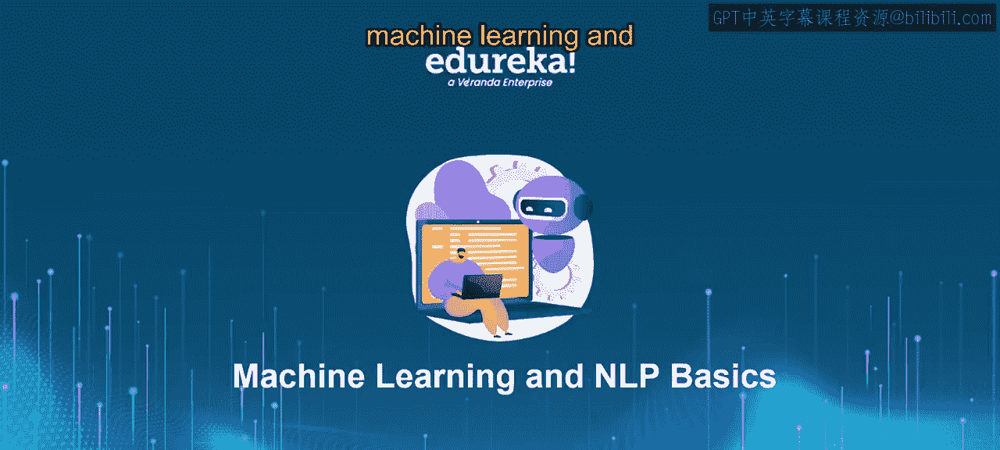
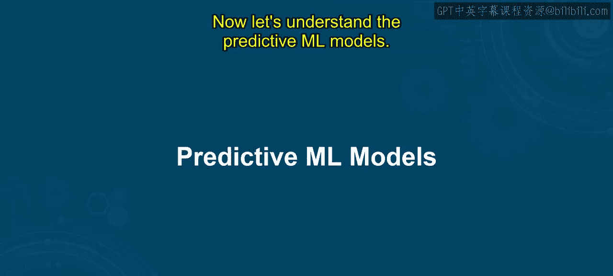
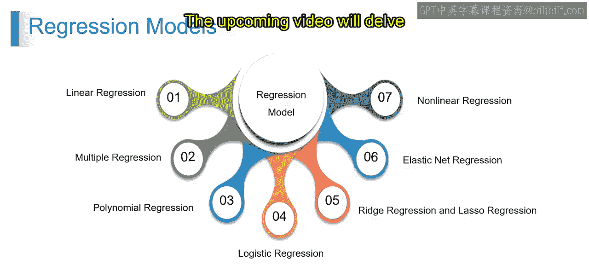

# 第一部分 10：预测性机器学习模型 🧠

在本节课中，我们将一起探索机器学习的世界，并学习其核心概念之一：预测性机器学习模型。我们将了解什么是预测性模型，以及它们的主要类型和用途。

## 什么是预测性机器学习模型？

预测性机器学习模型利用历史数据来预测未来的结果。这意味着它们通过分析数据中的模式，来预测尚未见到的实例。这类模型承担着分类、回归和异常检测等任务，对于各行各业的决策制定、风险评估和自动化至关重要，能帮助组织预测变化、抓住机遇并降低风险。

## 预测性模型的类型

现在，让我们来了解预测性模型的不同类型，主要包括：回归模型、分类模型、时间序列模型和集成方法。

### 回归模型

上一节我们介绍了预测性模型的基本概念，本节中我们来看看回归模型。回归模型用于预测连续的输出结果。

例如，你想预测一套房子的价格。通常，你会根据房屋的面积、卧室数量和地理位置，利用过去的销售数据来进行预测。回归模型就是通过学习输入特征与连续目标值之间的关系来实现预测的，常用方法包括线性回归或多项式回归。

以下是回归模型的一些具体类型：

*   **线性回归**：一种基础方法，通过将一条直线拟合到观测数据，来建模一个或多个输入与一个连续目标之间的关系。例如，根据里程数预测二手车的售价。公式可表示为：`y = β₀ + β₁x + ε`，其中 `y` 是价格，`x` 是里程数。
*   **非线性回归**：扩展了线性回归，通过使用多项式、指数或对数等曲线函数来处理更复杂的关系。例如，根据阳光和温度等因素预测植物生长。
*   **多元回归**：扩展线性回归，通过一个包含多个系数的方程，来建模两个或更多输入如何影响一个连续目标。
*   **多项式回归**：将输入与目标变量之间的关系建模为曲线多项式，从而更灵活地捕捉非线性数据模式。
*   **岭回归与Lasso回归**：通过惩罚大的系数来防止模型过拟合，从而得到更稳定的模型。例如，在具有各种特征的房价预测中，这两种技术通过将系数向零收缩来降低模型复杂度。
*   **弹性网络回归**：结合了岭回归和Lasso回归的技术，以平衡特征选择和系数收缩，克服它们各自的局限性。

### 分类模型

了解了用于预测连续值的回归模型后，我们转向分类模型。分类模型用于预测类别型的结果。

例如，你想将电子邮件分类为“垃圾邮件”或“非垃圾邮件”。分类模型就是基于邮件内容和发送历史等特征，将数据划分到预定义的类别中，如二分类（是垃圾邮件/不是垃圾邮件）或多分类。

以下是分类模型的一些具体类型：

*   **逻辑回归**：尽管名字中有“回归”，但它是一种用于二分类问题的经典方法。（注：视频中提到后续会深入讨论）
*   **朴素贝叶斯**：基于贝叶斯定理，并假设特征之间相互独立。
*   **支持向量机（SVM）**：寻找一个能最好地区分不同类别的超平面。

### 时间序列模型

接下来，我们看看专门用于处理按时间顺序收集数据的时间序列模型。

例如，根据公司历史业绩预测其股票价格。时间序列模型分析随时间收集的数据，通过考虑时间模式（如趋势、季节性）来预测未来值，常用方法包括自回归或移动平均。

### 集成方法

最后，我们介绍集成方法。这类方法通过结合多个基础模型的预测结果来提高预测准确性。

例如，通过结合来自决策树、逻辑回归等多种模型的预测来预测客户流失。集成方法使用随机森林或梯度提升等技术，将多个基础模型（如决策树）的输出组合起来。

以下是集成方法的一些具体类型：

*   **决策树**：一种基础模型，通过一系列规则对数据进行划分。
*   **随机森林**：一种集成方法，它构建多棵决策树，并将它们的预测结果进行汇总（如投票或平均）以做出最终决策。

---

本节课中，我们一起学习了预测性机器学习模型。我们首先了解了预测性模型如何利用历史数据预测未来。然后，我们详细探讨了四种主要类型：用于预测连续值的**回归模型**，用于预测类别的**分类模型**，用于分析时间顺序数据的**时间序列模型**，以及通过组合多个模型来提升性能的**集成方法**。理解这些模型类型是深入学习机器学习和自然语言处理的重要基础。