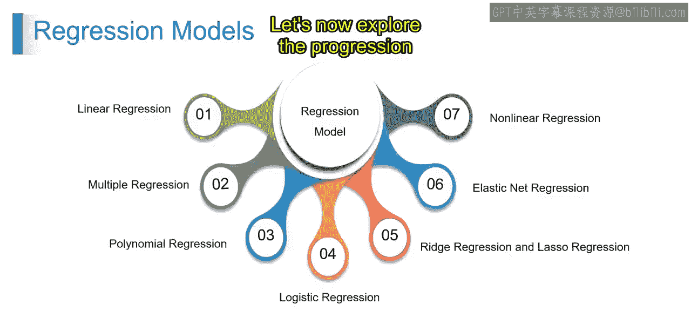
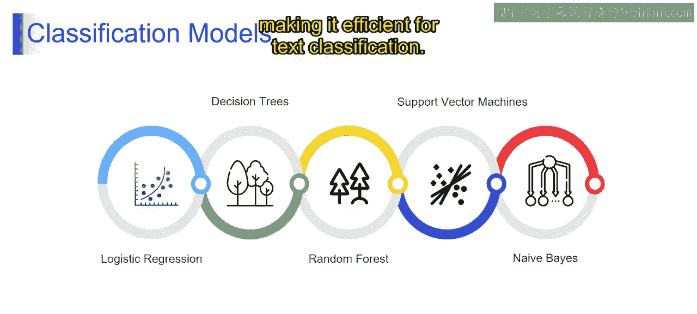
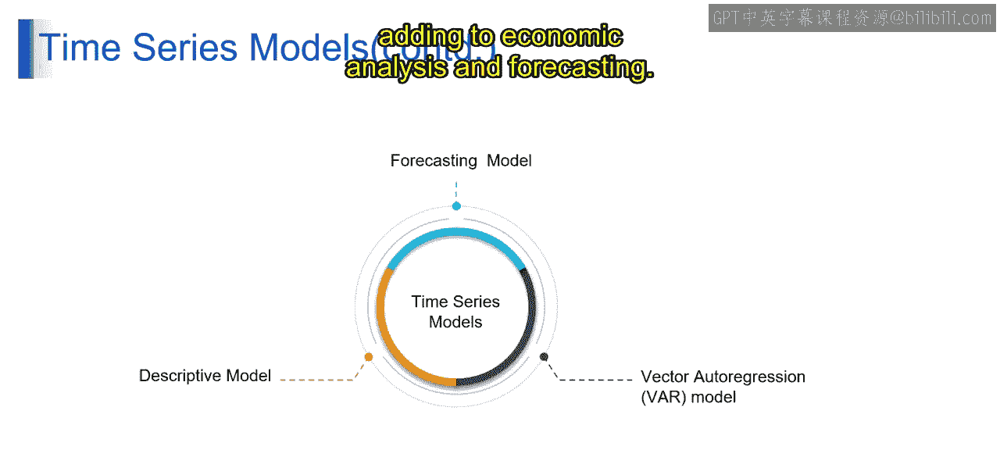
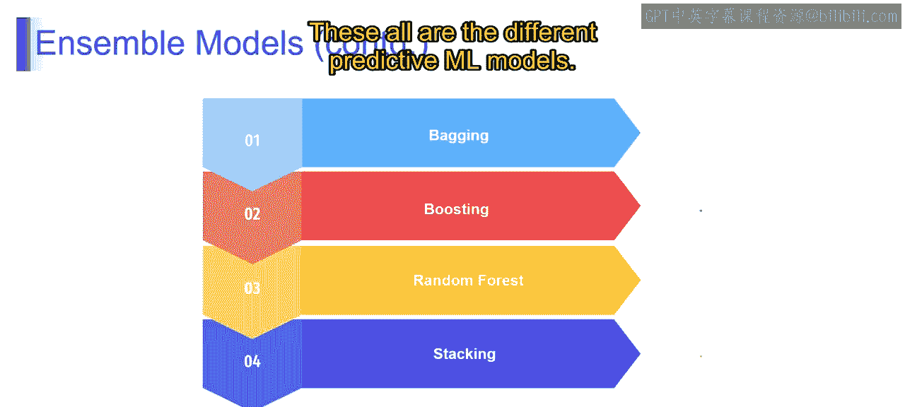
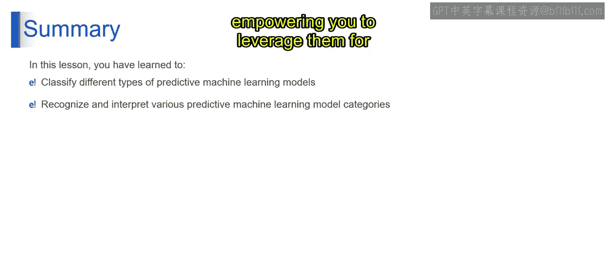

# 第一部分 11：分类与其他模型

在本节课中，我们将要学习机器学习中不同类型的预测模型，特别是分类模型，并了解它们如何从简单的逻辑回归发展到复杂的集成方法。我们还将简要介绍描述性模型和预测模型的其他类别。

上一节我们介绍了机器学习的基础概念，本节中我们来看看具体的模型类型及其应用场景。

## 从逻辑回归到朴素贝叶斯

现在，让我们探索从之前讨论的进展。例如，判断一封电子邮件是否是垃圾邮件。

*   **逻辑回归**：逻辑回归使用输入特征对二元结果的概率进行建模，适用于有两种可能结果的任务。其核心是计算属于某一类的概率：`P(y=1|x) = 1 / (1 + e^-(w·x + b))`。
*   **决策树**：决策树根据特征值将特征空间划分为不同区域，旨在最小化不纯度或最大化信息增益，可用于分类和回归任务。
*   **随机森林**：随机森林构建多个决策树并汇总它们的预测，通过数据和特征采样引入随机性，以减少方差和过拟合。
*   **支持向量机**：SVM在特征空间中寻找最优超平面来分隔不同类别的样本，旨在最小化分类错误。
*   **朴素贝叶斯**：以同样的垃圾邮件分类为例，基于词语出现情况。朴素贝叶斯假设词语之间是独立的（即特征条件独立），从而简化文本分类。它使用贝叶斯定理计算类别概率：`P(类别|特征) ∝ P(类别) * Π P(特征|类别)`，这使其在文本分类中非常高效。

以上是不同类型的预测模型。

## 描述性与预测性模型

接下来，我们继续了解预测性模型，并对比描述性模型。

描述性模型总结和描述数据集内的模式或关系，而不进行未来预测。它们侧重于理解现有数据，并对其结构提供洞察。

以下是描述性模型的一个例子：
> 分析零售店的销售数据，以识别产品类别之间的趋势或相关性。

预测模型则基于历史数据预测未来的值或趋势。它们分析数据内的模式以进行预测，协助企业进行规划和决策。

以下是预测模型的一个例子：
> 预测公司基于时间序列数据的月度股价。

## 时间序列与集成模型

在预测模型中，有一些专门处理序列数据或组合多个模型以提升性能的方法。

*   **向量自回归模型**：VAR模型分析多个时间序列变量之间的动态关系。它们扩展了自回归模型，以处理变量间相互依赖关系的同步分析。例如，使用VAR模型来理解GDP、通货膨胀和失业率随时间的变化如何相互影响，有助于经济分析和预测。
*   **装袋法**：装袋法结合多个模型以提升预测性能。它在不同的数据子集上训练多个基模型（如决策树），并通过**平均**（用于回归）或**多数投票**（用于分类）来汇总它们的预测。例如，在装袋法中，多个决策树在客户交易数据的随机子集上进行训练，以预测欺诈可能性。
*   **提升法**：提升法顺序训练多个弱学习器以形成一个强学习器。它侧重于用后续模型纠正前一个模型的错误，强调被错误分类的实例。
*   **随机森林**：随机森林通过在每个树的训练中使用随机特征子集和自助采样样本，来构建多样化的决策树。它结合所有树的预测作为最终输出，通常能获得更好的准确性和鲁棒性。
*   **堆叠法**：堆叠法使用一个元模型来融合来自不同基模型的预测。它在基模型的预测结果上训练元模型，学习如何有效地组合它们。

以上是所有不同的预测性机器学习模型。

## 总结

本节课中我们一起学习了预测性机器学习模型的不同类别，包括回归、分类、时间序列和集成方法。通过理解这些模型类别，你可以有效地为你的预测分析任务选择和解释合适的模型，从而增强决策制定和问题解决的能力。这些知识为你提供了分类和解释各种预测性机器学习模型的工具，使你能在各个领域的不同应用中利用它们。

谢谢。