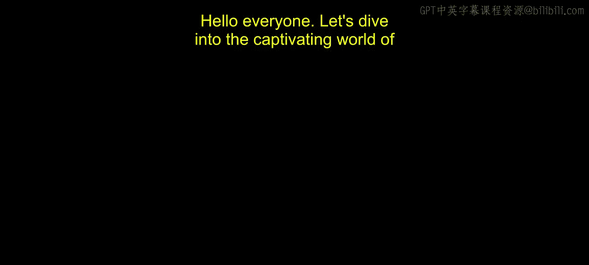
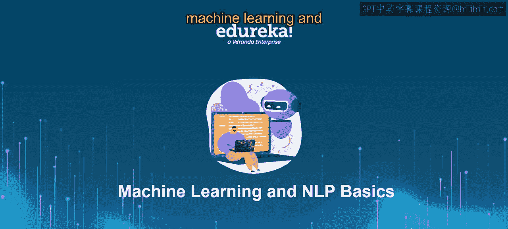
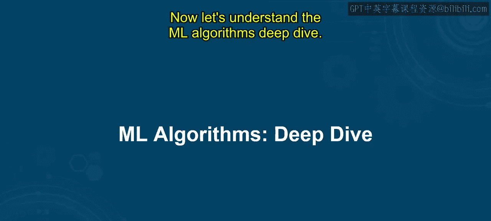
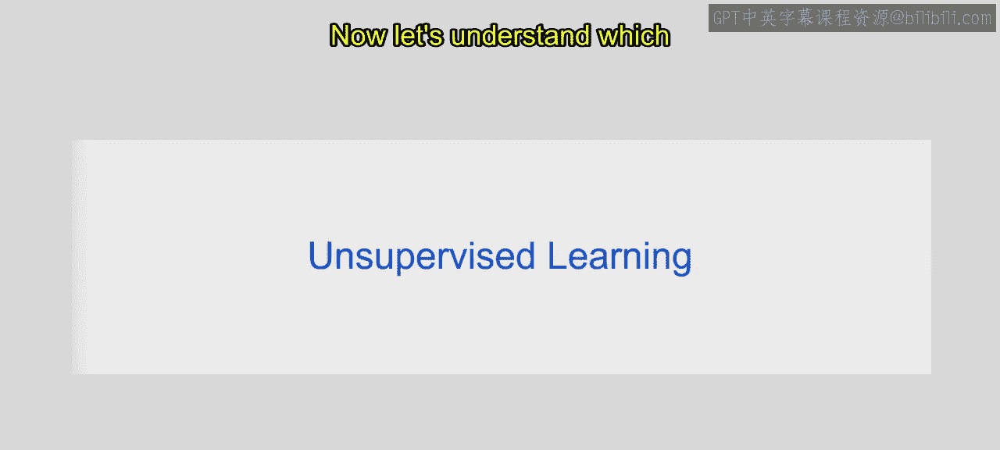
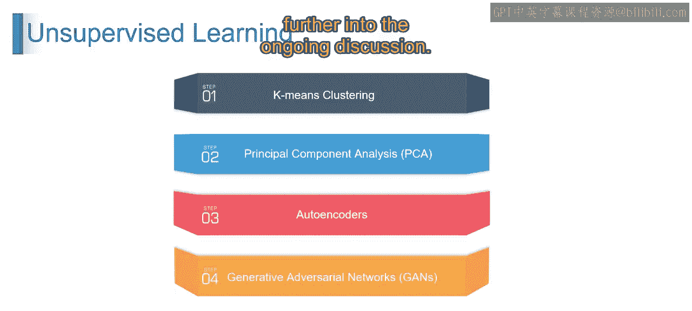

# 第一部分 12：机器学习算法深入探讨 🧠

在本节课中，我们将深入探讨机器学习的核心算法，包括监督学习、无监督学习、半监督学习和强化学习。我们将学习如何有效地选择和运用这些算法，理解不同学习范式的原理与应用，并掌握实现和优化强化学习算法的基本能力。

## 机器学习算法概述

在上一节中，我们了解了机器学习的基础。本节我们将探讨机器学习如何通过训练算法从数据中识别模式，从而实现自主决策。机器学习算法是机器学习和人工智能的核心，它教会计算机从数据中学习，并利用这些知识做出决策。

机器学习算法主要分为四种类型：监督学习、无监督学习、半监督学习和强化学习。接下来，我们将逐一理解这些类型及其工作原理。

## 监督学习

想象一下，你正在教一个孩子识别动物。你向他们展示不同动物的图片，并附上动物的名称，帮助他们学习哪个动物是哪个。例如，你展示一张狗的图片并说“这是狗”，同样地，你展示一张猫的图片并说“这是猫”。你通过多个狗、猫和其他动物的例子重复这个过程。

机器学习中的监督学习以类似的方式工作。你有一个数据集，其中每个例子都与一个标签或你想要算法预测的结果配对。就像用带标签的图片教孩子一样，算法从这些带标签的例子中学习，以更好地理解输入数据和相应输出标签之间的关系。

简单来说，监督学习涉及在带标签的数据上训练算法，以基于输入特征进行预测或决策，就像通过展示带标签的图片教孩子识别动物一样。

正如前面模块提到的，以下所有模型都属于监督学习：

以下是监督学习的主要算法：

*   **线性回归**：基于输入特征，使用一条直线来预测结果。
*   **逻辑回归**：基于输入特征，使用逻辑曲线来预测二元结果。
*   **决策树**：通过根据特征将数据分割成分支来做出决策。
*   **随机森林**：由多个决策树组成的集成模型，用于获得更准确的预测。
*   **支持向量机**：寻找最佳超平面以将数据分隔到不同的类别中。
*   **神经网络**：模仿人脑结构，学习复杂模式以进行预测。

## 无监督学习

无监督学习是一种机器学习类型，算法在没有明确监督或标签的输入数据上进行训练，旨在发现数据中的模式或结构。

现在，让我们了解哪些算法属于无监督学习。

以下是两种主要的无监督学习算法：

*   **K均值聚类**：想象你有一篮子不同形状和颜色的水果。K均值聚类就像根据这些水果在形状和颜色上的相似性将它们分成若干组，而无需事先知道类别。从技术上讲，K均值聚类是一种无监督学习算法，它根据最近的均值将数据划分为K个簇，旨在最小化簇内方差。
*   **主成分分析**：设想一张你想要缩小尺寸但保留其重要特征的高分辨率照片。PCA就像找到照片中变化的主要方向，并用更少的维度来表示它，同时保留其本质。从技术上讲，PCA是一种无监督的降维技术，它识别出数据变化最大的正交轴（称为主成分），从而在保留大部分数据变异性的同时减少数据维度。

## 半监督学习

上一节我们介绍了监督学习和无监督学习。本节中，我们来看看半监督学习，它结合了前两者的特点。

半监督学习是一种机器学习方法，它同时使用少量带标签的数据和大量未带标签的数据进行训练。这种方法在获取带标签数据成本高昂或耗时的情况下特别有用。

## 强化学习

最后，我们来探讨强化学习。这是一种通过试错与环境互动来学习的范式。

强化学习是一种机器学习方法，其中智能体通过执行动作、观察结果和接收奖励（或惩罚）来学习在环境中实现目标的最佳策略。其核心思想是最大化累积奖励。

强化学习的关键组成部分可以用以下公式或伪代码概念来描述：

**核心概念**：智能体在时间 `t`，观察到状态 `s_t`，采取动作 `a_t`，接收到奖励 `r_t`，并转移到新状态 `s_{t+1}`。目标是学习一个策略 `π`，以最大化未来累积奖励（回报）`G_t`。

**回报公式**：
`G_t = R_{t+1} + γ * R_{t+2} + γ^2 * R_{t+3} + ...`
其中 `γ` 是折扣因子（0 ≤ γ ≤ 1），用于权衡当前奖励与未来奖励的重要性。

## 总结

本节课中，我们一起学习了机器学习的四种主要算法类型。我们了解了监督学习如何使用带标签的数据进行预测，无监督学习如何发现未标记数据中的内在结构，半监督学习如何结合少量标签和大量无标签数据，以及强化学习如何通过与环境互动并获得反馈来学习最优策略。理解这些基础算法是进一步探索生成式人工智能和大型语言模型的关键第一步。