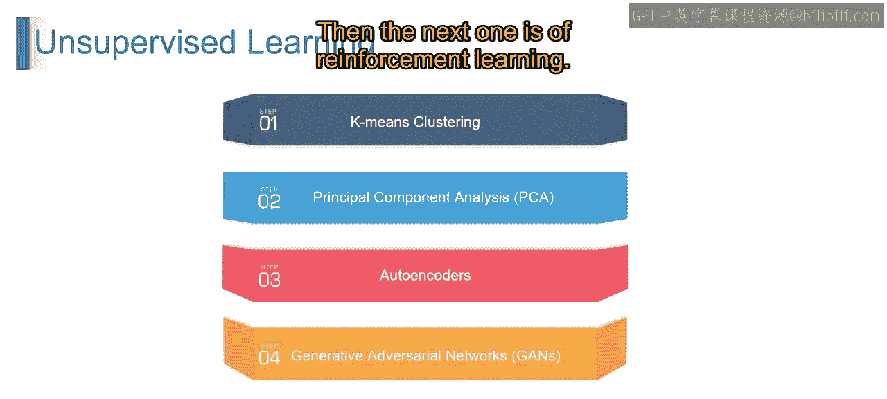
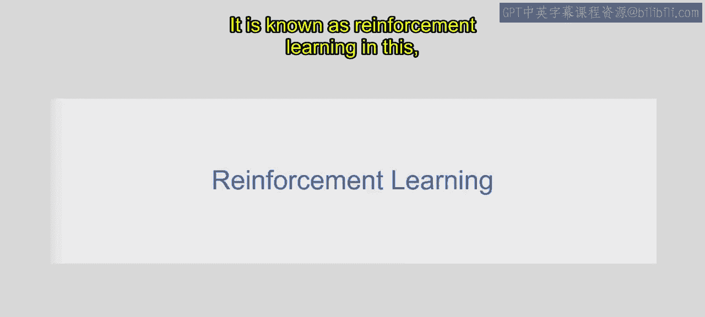
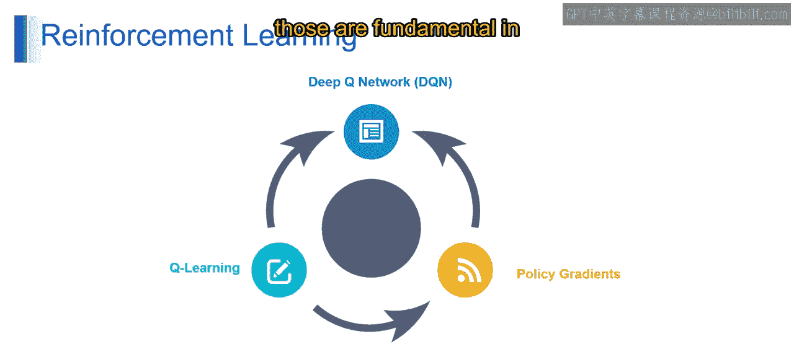
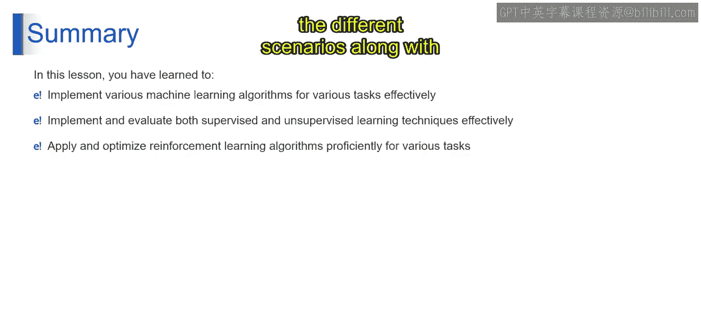

# 第一部分 13：机器学习算法（第二部分）

在本节课中，我们将继续探索机器学习算法，重点介绍自编码器、生成对抗网络和强化学习等高级概念。这些技术是构建现代生成式人工智能系统的基础。

上一节我们介绍了机器学习的基础算法，本节中我们来看看一些更高级的模型，它们能够处理更复杂的任务，如数据生成和智能决策。

## 自编码器

想象一个拼图游戏：你将一张图片打碎成许多小块，然后尝试用这些小块重新拼出原始图像。自编码器的工作原理与此类似，它将数据压缩成一个低维度的表示，然后再从这个表示中重建出原始数据。

从技术上讲，自编码器是一种用于无监督学习和降维的神经网络架构。它通过训练将输入数据编码成一个紧凑的表示（即**编码器**），然后再将其解码回原始形式（即**解码器**），目标是**最小化重建误差**。

以下是自编码器的核心流程：
1.  **编码**：输入数据 `X` 通过编码器网络，被压缩为潜在空间中的低维表示 `Z`。公式可表示为：`Z = encoder(X)`。
2.  **解码**：潜在表示 `Z` 通过解码器网络，被重建为输出数据 `X'`。公式可表示为：`X' = decoder(Z)`。
3.  **损失计算**：系统通过比较原始输入 `X` 和重建输出 `X'` 来计算损失（如均方误差），并反向传播以更新网络参数，目标是使 `X'` 尽可能接近 `X`。

## 生成对抗网络

想象一个伪造者试图制造出与真币无法区分的假币。生成对抗网络就像生成器和判别器之间的一场游戏。生成器不断改进其制造假币的技能以欺骗判别器，而判别器则努力识别真伪。

这意味着，GANs是一种无监督学习框架，由两个神经网络组成：一个**生成器**和一个**判别器**。它们在博弈论的设定下一起训练。生成器学习生成逼真的数据样本，而判别器学习区分真实数据和生成器产生的数据。

以下是GANs的核心组件：
*   **生成器**：接收随机噪声 `z` 作为输入，目标是生成足以乱真的数据 `G(z)`。
*   **判别器**：接收数据（可能是真实数据 `X` 或生成数据 `G(z)`）作为输入，输出一个标量，表示该数据是真实数据的概率 `D(·)`。
*   **对抗训练**：生成器的目标是最大化判别器对其生成数据的误判率，即让 `D(G(z))` 接近1；判别器的目标是准确区分，即让 `D(X)` 接近1且 `D(G(z))` 接近0。这是一个极小极大博弈。

## 强化学习

想象你在教狗一个技巧，比如接球。当它正确执行了期望的动作时，你就给它一块零食作为奖励。如果它没有做到，你可能就不给零食或给予一般性的纠正（惩罚）。随着时间的推移，狗学会了将“接球”这个行为与“获得零食”联系起来，从而调整自己的行为。

机器学习中的强化学习与此完全相似。它是一种智能体通过试错来学习决策的学习类型，接收来自环境的**奖励**或**惩罚**作为反馈。智能体的目标是通过学习在不同情况下采取的最优行动，来最大化长期累积的奖励。这被称为强化学习。

以下是强化学习中几个关键算法：

**深度Q网络**
想象你在玩一款电子游戏，并想训练一个AI来学习如何玩。DQN就像是给AI一个大脑，让它理解游戏环境并做出决策。它通过试错来学习，根据收到的奖励调整自己的行动。

从技术上讲，DQN是一种强化学习算法，它将**Q学习**与**深度神经网络**相结合，以近似**动作价值函数**（即Q函数），从而能够处理更复杂、更高维度的状态空间。其更新公式近似为：
`Q(s, a) = Q(s, a) + α * [r + γ * max_a' Q(s', a') - Q(s, a)]`
其中，神经网络用于拟合 `Q(s, a)`。

**Q学习**
Q学习是一种**无模型**的强化学习算法。它通过迭代地根据观察到的奖励和下一个状态的价值来更新动作价值函数的估计值，从而从马尔可夫决策过程中学习最优的动作选择策略。

**策略梯度**
策略梯度是一类强化学习算法，它直接学习一个**策略函数**，通过沿着从奖励信号计算出的梯度方向更新策略参数，以最大化期望奖励。其核心思想是调整策略，使能获得高奖励的动作被选择的概率增加。

## 总结

本节课中我们一起学习了机器学习中几种重要的高级算法。你掌握了为不同任务有效实施多样化机器学习算法的技能，评估了监督式和无监督式学习技术，并了解了如何在不同场景中熟练应用和优化强化学习算法。

这些技术，特别是生成对抗网络和强化学习，是驱动当今许多生成式人工智能和大型语言模型发展的核心动力。理解它们的工作原理，是深入探索生成式AI世界的关键一步。