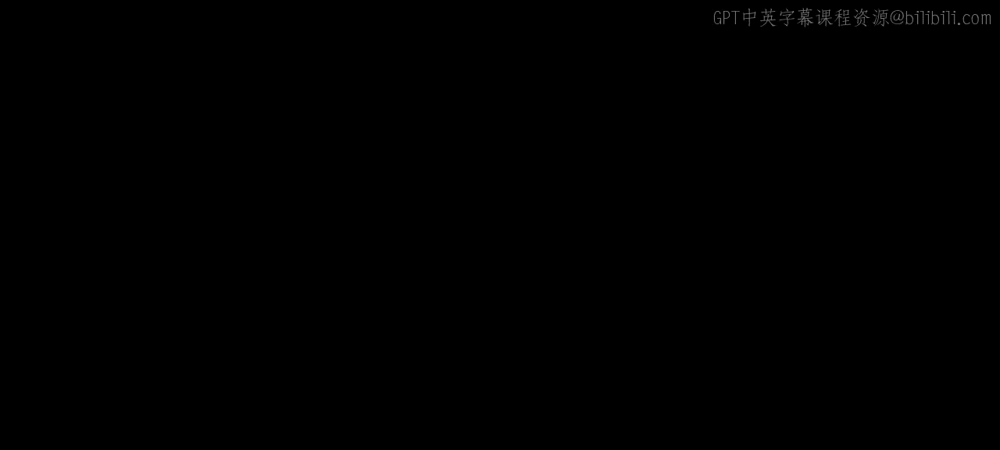
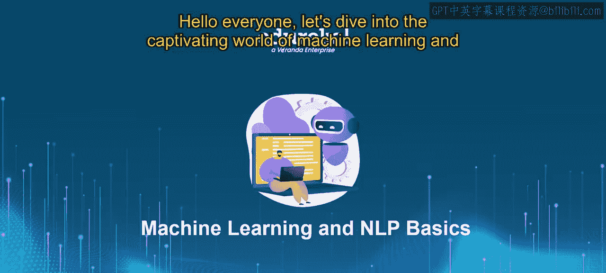
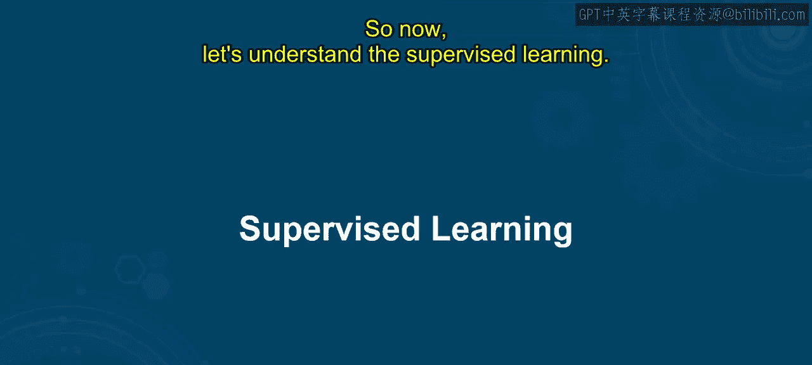
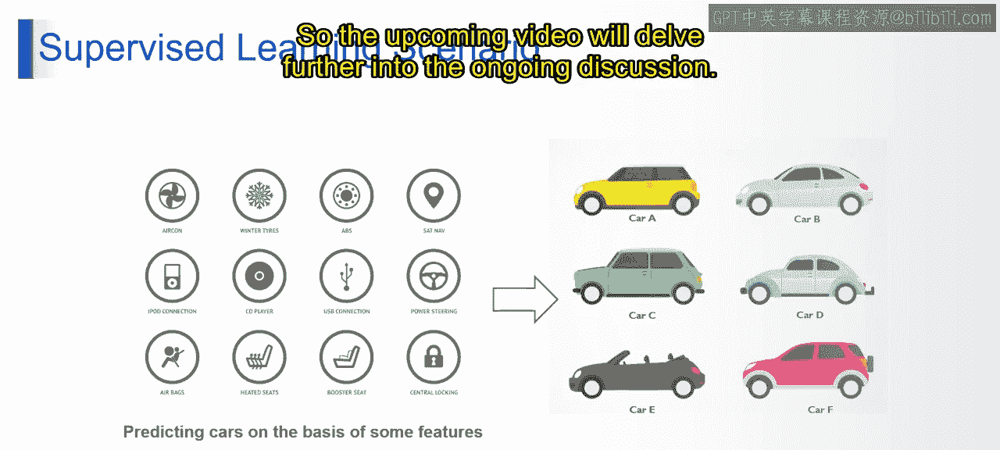

# 第一部分 14：监督机器学习 🧠

在本节课中，我们将学习监督机器学习的基本概念，并了解如何将其应用于电子邮件和新闻分类等实际问题。我们将从核心定义开始，逐步深入到具体应用场景。

## 概述

监督学习是机器学习的一种主要类型，其核心思想是利用带有标签的数据来训练模型，使模型能够学习输入特征与输出标签之间的关系，从而对新的、未见过的数据进行预测或分类。

## 监督学习简介

上一节我们介绍了机器学习的基本范畴，本节中我们来看看其中最重要的一类：监督学习。

想象一下教计算机区分绿色苹果和红色苹果。你首先展示大量苹果的图片，其中一些被标记为“绿色”，另一些被标记为“红色”。计算机从这些例子中学习，理解颜色和形状的差异。一旦训练完成，它就能观察新的苹果图片，并根据从训练数据中学到的知识，预测它是绿色的还是红色的。

从技术上讲，监督学习是一种机器学习类型，算法在由**输入特征**和对应的**输出标签**组成的数据集上进行训练。带标签的训练数据作为示例，指导算法学习输入特征与输出标签之间的关系。模型训练完成后，可以将其学习成果推广，对新的、未见过的数据进行预测或分类。其核心过程是基于训练期间学到的模式，将输入特征映射到输出标签。

这个过程通常涉及以下步骤：
1.  数据收集
2.  数据预处理
3.  模型选择
4.  模型训练
5.  模型评估
6.  预测

## 监督学习的应用场景

理解了基本概念后，我们通过具体例子来看看监督学习如何工作。

监督学习可以应用于根据特定特征预测汽车类型。例如，你可以向算法提供各种汽车的数据，包括**马力**、**尺寸**、**燃油效率**等特征，以及表明汽车类型的标签（如“轿车”、“SUV”或“卡车”）。算法从这些带标签的数据中学习，理解特征与汽车类型之间的关系。一旦训练完成，它就可以根据新车的特征来预测其类型，例如判断一辆具有特定马力和发动机尺寸的汽车可能是轿车、SUV还是卡车。

## 电子邮件与新闻分类系统

现在，让我们将监督学习的概念应用到一个实际系统中：电子邮件和新闻分类。

电子邮件和新闻分类系统利用监督学习技术，自动将收到的电子邮件或新闻文章分类到预定义的类别中。例如，电子邮件可分为“垃圾邮件”或“非垃圾邮件”；新闻文章可分为“体育”、“政治”、“娱乐”等。

以下是该系统的工作流程：

1.  **数据收集**：首先收集一个包含已标记示例的数据集（例如，标记为“垃圾”或“非垃圾”的电子邮件）。
2.  **文本预处理**：对文本数据进行清洗和标准化处理。
3.  **特征提取**：从文本中提取有意义的特征（如关键词、词频）。
4.  **模型训练**：使用带标签的数据训练一个机器学习模型，使其能够识别模式。
5.  **部署与预测**：模型训练完成后，被部署以对新的、传入的数据进行实时分类，从而有效地简化和组织文本信息的过程。

## 总结

本节课中，我们一起学习了监督机器学习。我们了解了其核心定义——通过带标签的数据训练模型以进行预测。我们探讨了它在汽车类型预测中的示例，并详细分析了一个实际应用：电子邮件和新闻分类系统的工作流程。掌握这些基础知识是进一步学习更复杂人工智能模型的重要第一步。