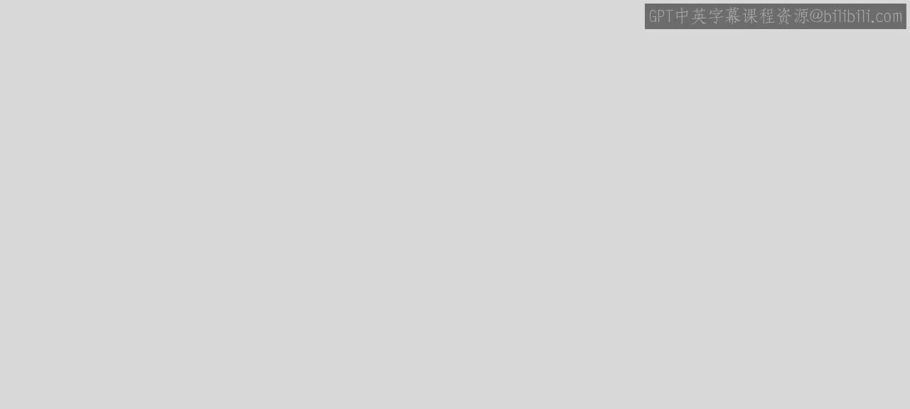
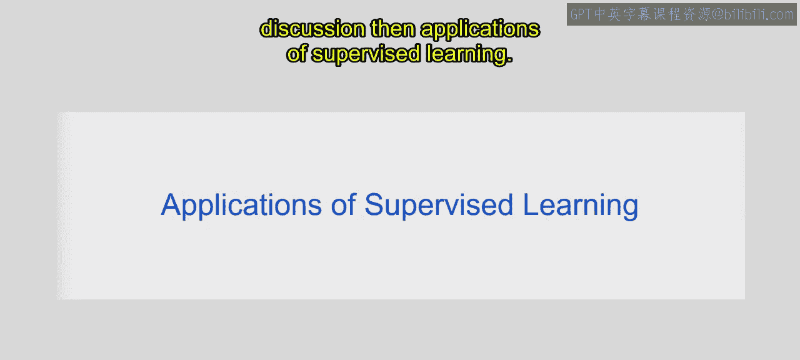
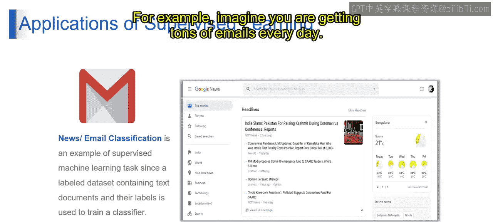
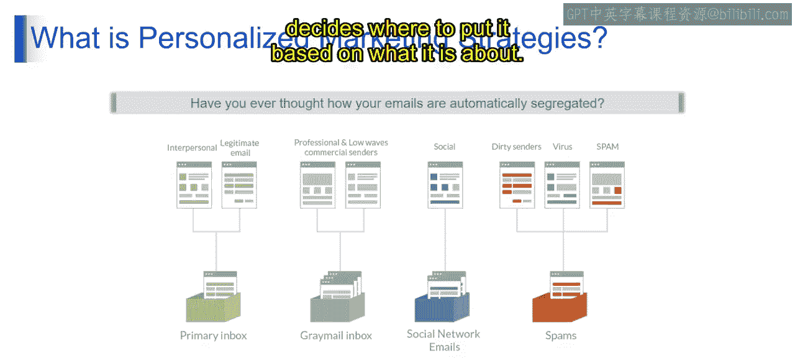
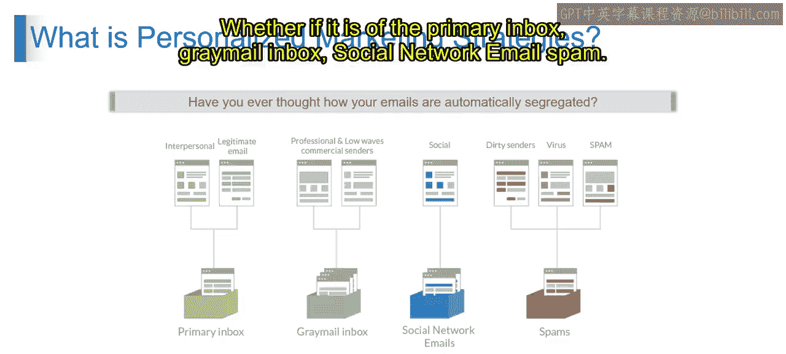
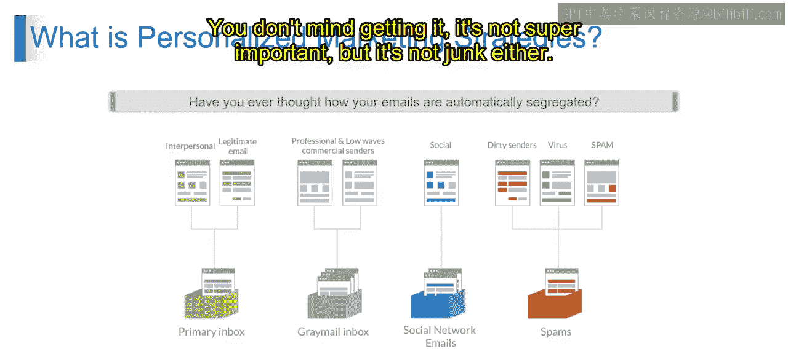
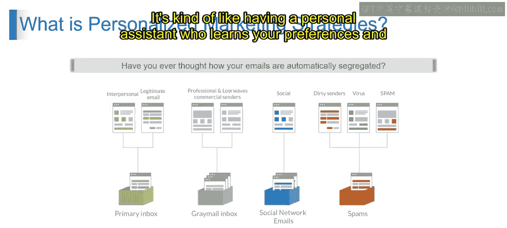
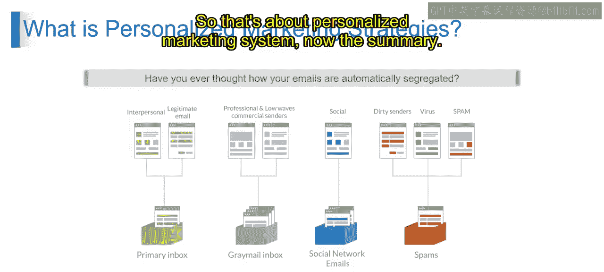
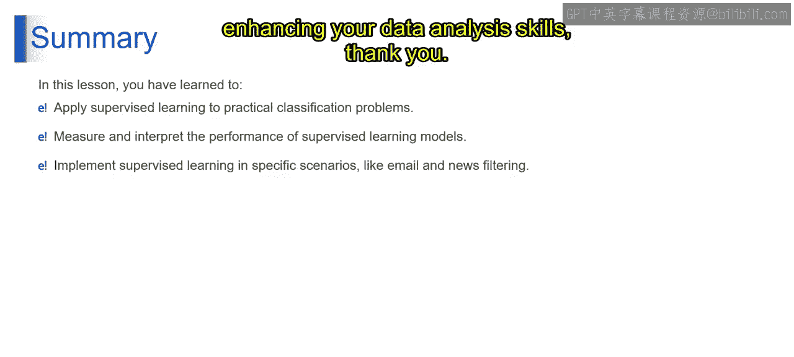

# 第一部分 15：监督学习的应用 🧠

在本节课中，我们将学习监督学习的具体应用，特别是它在文本分类任务（如新闻和邮件分类）中的工作原理。我们将通过一个日常例子——电子邮件收件箱的自动分类——来直观地理解这一过程。

---

上一节我们介绍了监督学习的基本概念，本节中我们来看看它在现实世界中的具体应用。监督学习的应用非常广泛，其中包括新闻或电子邮件分类任务。在这些任务中，监督机器学习模型使用包含文档（如电子邮件）及其对应标签的数据集进行训练。标签指明了文档的类别，例如新闻文章属于体育、政治等类别，或者电子邮件是否为垃圾邮件。模型从这些带标签的数据中学习，从而能够根据新文本的内容，将其分类到预定义的类别中，实现信息的有效组织和检索。

例如，想象一下你每天都会收到大量电子邮件。你如何管理它们呢？我们可以把你的电子邮件收件箱看作一个大型的存储任务。它查看每一封邮件，并根据其内容决定将其归入何处。

以下是你的电子邮件如何被分类的详细过程：

*   **主收件箱**：这里存放着来自朋友、家人、官方信息以及你经常处理的重要商务邮件。它就像是你的VIP区域。
*   **灰度邮件收件箱**：在这里你会找到来自工作联系人或那些偶尔收到的促销邮件。这些邮件不是特别重要，但也不是垃圾邮件。
*   **社交网络文件夹**：你是否收到过来自Facebook、Twitter或LinkedIn的通知邮件？它们就会被归入这里，这就像是你的社交媒体角落。
*   **垃圾邮件**：所有垃圾邮件都会进入这里，包括来自陌生人的奇怪邮件、潜在的病毒邮件、烦人的广告，甚至某些促销邮件。

那么，幕后究竟发生了什么？背后是智能的计算机程序在使用复杂的数学方法来分析每封邮件的内容。它们会查看诸如发件人、邮件中的词汇，甚至你过去对类似邮件的反应等信息。这些程序从所有这些信息中学习，并随着时间的推移，在邮件分类方面变得越来越好。这就像拥有一个了解你偏好的个人助理，帮助你保持收件箱的井井有条，而你无需亲自动手。

通过这种方式，个性化营销策略得以运作。它利用智能技术来理解你的兴趣和行为，然后在正确的时间向你传递正确的信息。这就是个性化营销系统的工作原理。

---

本节课中，我们一起学习了如何利用监督学习进行文本分类任务，并通过电子邮件分类的实例理解了其在真实场景中的应用。这增强了你在数据分析方面的实践技能。