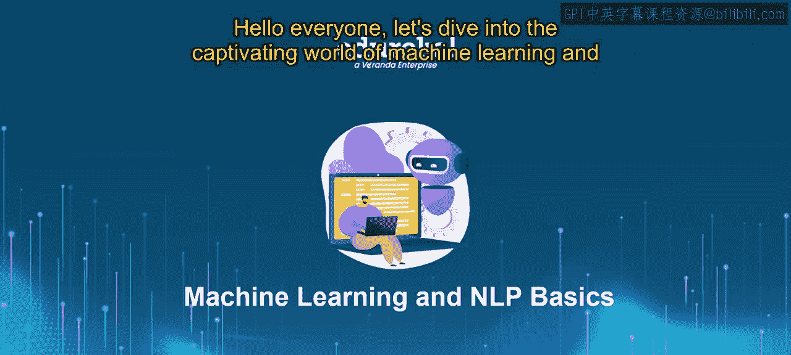
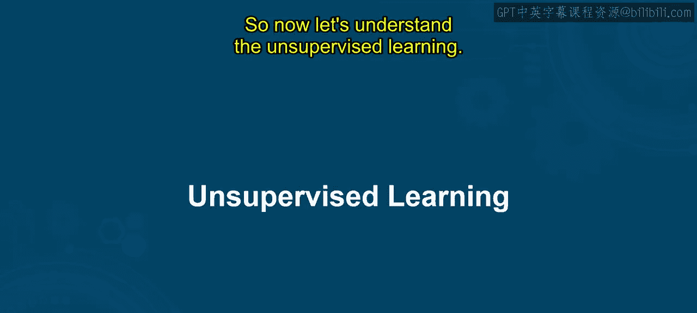
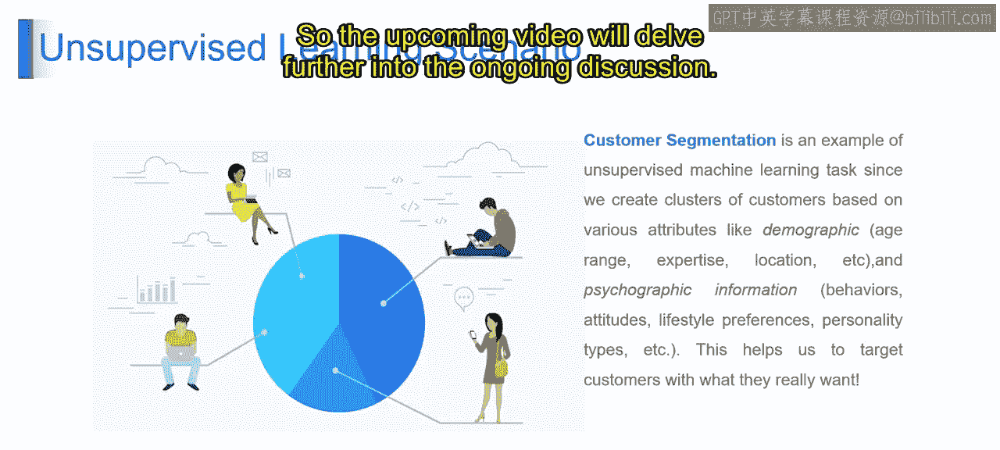

# 第一部分 16：无监督机器学习的市场细分策略 🎯

在本节课中，我们将一起探索机器学习的迷人世界，并学习自然语言处理的基础概念。我们将重点了解**无监督学习**，特别是它在市场细分策略中的应用。课程结束时，你将能够理解并解释市场细分、描述无监督学习的基础知识、区分其与监督学习的不同，并能利用无监督学习来识别市场细分中的客户群体。

---




## 什么是市场细分策略？🤔



想象一下，你正在策划一场派对，并希望将你的朋友们分成更小、更相似的群体，以便规划每个人都会喜欢的活动。这就像**市场细分**——公司根据相似性将客户分组，以更好地理解他们的需求和偏好。

市场细分策略是一个商业概念，涉及将客户划分为更小、更相似的群体。通过使用**无监督学习技术**（如聚类算法），公司可以基于**共享特征**或**行为**（例如购买历史或人口统计数据）自动对客户进行分组，而无需预先定义的标签。这有助于公司定制营销策略，更有效地瞄准特定的客户群体，从而带来更好的客户满意度和业务成果。

例如，想象一个主题公园里的一大群人。有些是老年人，有些是年轻人，有些是儿童，还有其他群体。客户细分就像根据他们的年龄范围将这些人群分组。从技术上讲，客户细分是商业中的一项关键策略，涉及根据共同特征（如年龄、偏好、购买行为）将客户分类。使用无监督学习方法（如聚类算法），我们可以在没有预定义标签的情况下对客户进行分组。

---

## 市场细分如何运作？⚙️

以下是市场细分策略实施的关键步骤：

**数据收集**
首先，公司需要收集客户数据。这些数据可能包括：
*   人口统计数据（如年龄、性别）
*   购买行为（如购买的产品类型、购买频率）
*   与网站的互动（如访问记录）
*   社交媒体参与度
*   任何其他相关信息

**特征提取**
从这些数据中，公司提取有助于区分不同客户的相关特征。例如，年龄、消费习惯和偏好产品可能是细分的重要特征。

**聚类分析**
使用无监督学习技术（如K-Means聚类算法），数据根据所选特征的相似性被分组到不同的**簇**中。每个簇代表一个具有相似特征的客户群体。

**细分解读**
完成聚类后，公司分析每个细分群体的特征，以了解其中客户的独特特质和行为。这有助于识别可以指导营销策略的模式和趋势。

**策略制定**
基于从细分中获得的洞察，公司为每个细分群体制定有针对性的营销策略。这可能包括个性化的促销活动、定制的产品推荐，或旨在与每个细分群体的特定需求和偏好产生共鸣的沟通策略。

**实施与评估**
细分后的营销策略被实施，其效果会随着时间的推移进行监控和评估。公司跟踪关键绩效指标（KPIs），如销售额、客户满意度和参与度指标，以评估其细分工作的影响，并根据需要进行调整。

总的来说，客户细分使公司能够通过将客户划分为有意义的群体并相应地定制营销工作，来更好地理解和接触其多样化的客户群。这最终会带来更高的客户满意度、忠诚度以及业务成功。

---

## 无监督学习基础 🧠

上一节我们介绍了市场细分的具体应用，本节中我们来看看其背后的核心技术——无监督学习。

无监督学习是机器学习的一个分支，其模型在**没有标签**的数据上进行训练。与监督学习不同，它的目标不是预测一个已知的输出，而是发现数据中隐藏的**模式**、**结构**或**分组**。

**核心公式与代码**
一个典型的无监督学习任务是聚类，其目标是将数据点分组，使得同一组（簇）内的点彼此相似，而不同组的点彼此不同。常用的算法是K-Means，其目标是最小化簇内平方和：

`WCSS = Σ Σ ||x - μ_i||²`
其中，`WCSS`是簇内平方和，`x`是簇内的数据点，`μ_i`是第`i`个簇的中心点（质心）。

在Python中，使用`scikit-learn`库可以轻松实现K-Means聚类：
```python
from sklearn.cluster import KMeans
# 第一部分 假设 `customer_data` 是包含客户特征的DataFrame
kmeans = KMeans(n_clusters=5, random_state=42)
customer_segments = kmeans.fit_predict(customer_data)
```

**与监督学习的区别**
以下是监督学习与无监督学习的主要区别：
*   **监督学习**：使用带有标签的数据进行训练，目标是学习从输入到输出的映射关系，用于分类或回归预测。
*   **无监督学习**：使用没有标签的数据进行训练，目标是发现数据内在的结构，用于聚类、降维或关联规则挖掘。

---

## 总结 📝

在本节课中，我们一起学习了：
1.  **市场细分策略**：这是一个将客户划分为相似群体以定制营销的商业过程。
2.  **无监督学习的应用**：我们了解到，聚类等无监督学习技术是实现自动化、高效客户细分的核心工具。
3.  **市场细分流程**：从数据收集、特征提取、聚类分析，到细分解读、策略制定与评估，这是一个完整的闭环。
4.  **无监督学习基础**：我们明确了无监督学习旨在发现数据中的隐藏结构，并与旨在进行预测的监督学习进行了区分。



通过将无监督机器学习应用于市场细分，企业能够更精准地理解和服务于不同客户群体，这是数据驱动决策在现代商业中的一个强大范例。接下来的课程将继续深入探讨相关主题。