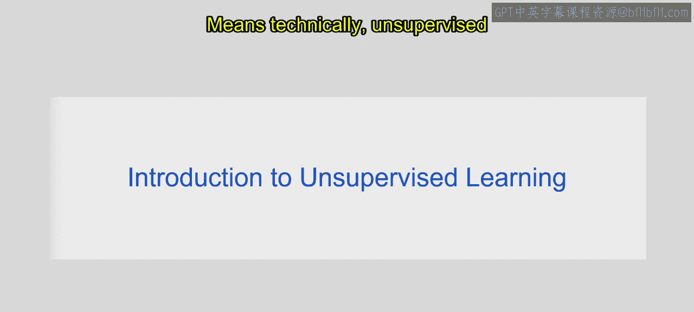
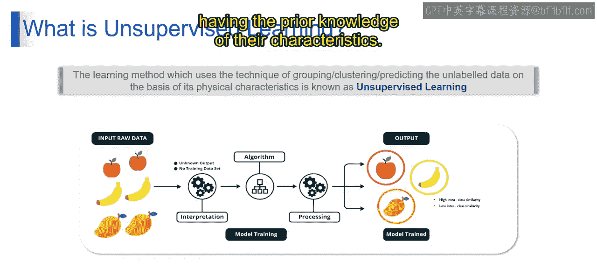
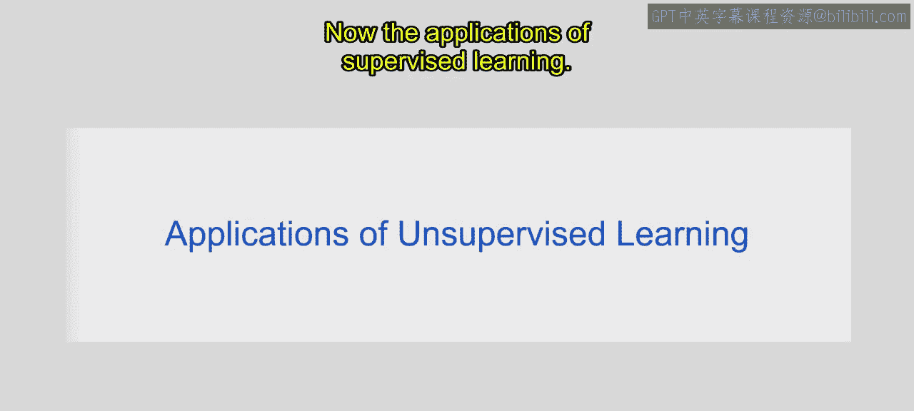
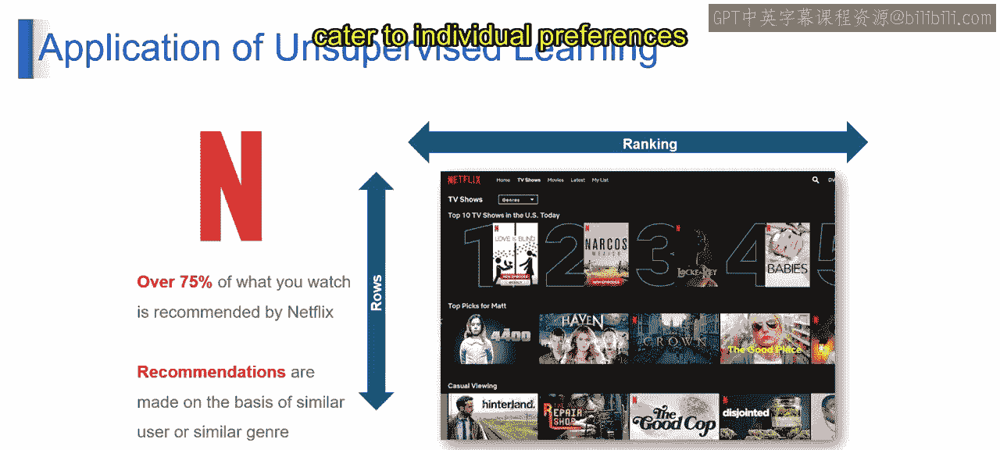
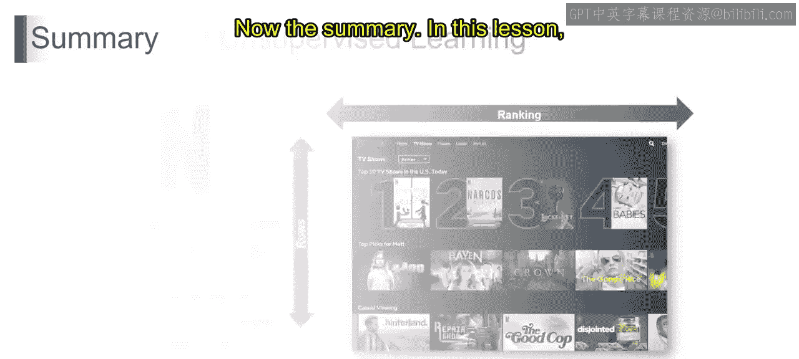
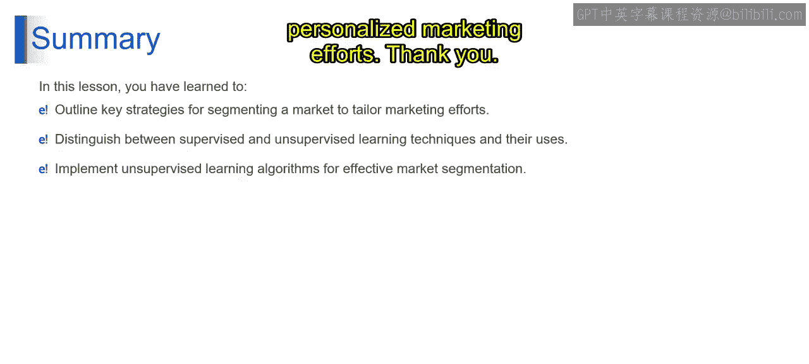

# 第一部分 17：无监督机器学习介绍 🧠

在本节课中，我们将要学习无监督机器学习的基本概念。我们将了解它如何在没有明确指导的情况下，从数据中发现模式和结构，并通过一个简单的例子来理解其工作原理。

---

上一节我们讨论了机器学习的不同范式，本节中我们来看看无监督机器学习。

现在，让我们基于之前讨论的所有因素，来理解无监督机器学习究竟是什么。考虑另一个例子：想象你正在整理一本相册，但不确定如何对照片进行分组。无监督学习就像一种魔法排序——计算机查看所有照片，并自动将相似的照片分组在一起，而无需你告诉它如何操作。例如，它可能将所有海滩照片归入一个文件夹，将所有山脉照片归入另一个文件夹。

从技术上讲，**无监督学习**是一种机器学习类型，其算法能够在没有明确监督或标记示例的情况下，从数据中发现模式和结构。

它通过识别数据点之间的相似性或关系，并将它们分组为簇，或检测底层模式来实现这一点。这使得对复杂数据集进行探索性分析和理解成为可能，而无需预定义的标签，从而促进了诸如聚类、降维和异常检测等任务。

以上就是关于无监督机器学习的基本介绍。

---

现在，让我们通过一个输入原始数据为水果的例子来理解这个过程。在我们的例子中，我们从包含不同类型水果的原始数据开始，我们知道它们是苹果、香蕉和芒果。

但模型无法理解这些，因为它们没有被标记。

接下来是解释阶段。在无监督学习中，没有预定义的输出或标记数据，我们处理的是未标记的数据。因此，算法事先并不知道水果的类别或类型。

然后它将执行下一步：模型训练。我们可以使用无监督学习算法，例如聚类算法，来处理原始数据。该算法分析水果的物理特征，如形状、大小、颜色甚至质地，以识别它们之间的模式或相似性。

接着它将执行处理步骤。算法处理数据，并根据观察到的相似性识别自然的分组或簇。

例如，它可能将圆形和椭圆形的水果归为一个簇，将细长和颗粒状的水果归为另一个簇，依此类推。

基于这种理解，模型将得到训练。在处理数据之后，模型就训练完成了，这意味着它已经学会了在没有明确标签或指导的情况下识别数据中的模式和分组。

最后是输出分离。算法根据每个水果的物理特征，将其分配到相应的簇或组中。这使我们能够理解数据的内在结构，并在没有先验知识的情况下识别相似的项目。

---

现在来看无监督学习的应用。应用包括客户细分、异常检测、图像和文档聚类、市场篮子分析、降维、医疗保健中的聚类，甚至推荐系统。

在我们的例子中，我们展示了Netflix的推荐系统。它具体是如何工作的呢？

以下是其工作原理的步骤：

首先，理解相似用户的推荐。Netflix分析数百万用户的观看历史和偏好，以识别他们行为中的模式和相似性。

例如，如果你喜欢看动作片和纪录片，那么Netflix会推荐其他有相似品味的用户喜欢的影片。这种个性化的推荐方法确保向你展示符合你兴趣和观看习惯的内容。

其次，基于相似类型的推荐。除了考虑个人用户偏好，Netflix还基于普遍相似性推荐内容。

例如，如果你看过几部科幻电影或电视剧，Netflix可能会推荐同一类型的其他作品。这种方法通过向用户介绍他们可能尚未发现但符合其普遍兴趣的内容，拓宽了推荐的范围。

总的来说，Netflix的推荐系统利用无监督学习技术来分析用户行为和内容特征，使其能够提供个性化的推荐，满足个人偏好，并提升整体观看体验。

---

本节课中我们一起学习了无监督机器学习。你掌握了用于目标营销的市场细分策略，并区分了监督学习和无监督学习技术。

此外，你还有效地理解了无监督学习算法在市场细分任务中的应用，从而增强了个性化营销的效果。

感谢学习。