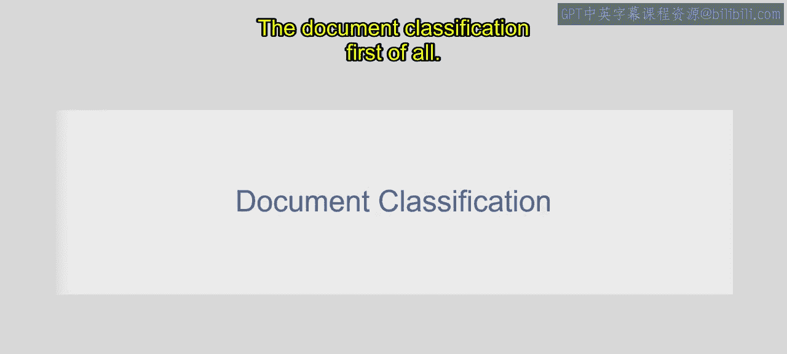
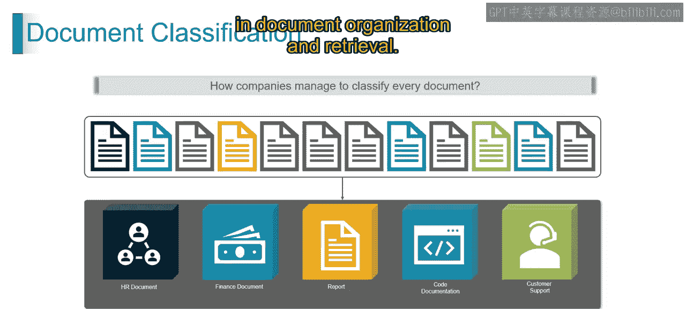
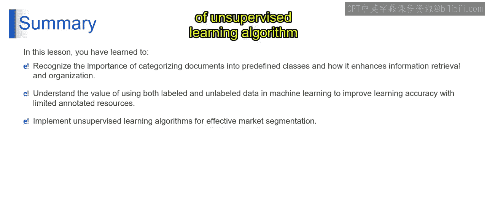

# 第一部分 18：半监督学习 📚

在本节课中，我们将学习机器学习中的一个重要概念——半监督学习，并了解其在文档分类任务中的应用。我们将从文档分类的实例入手，逐步理解半监督学习的原理、优势以及实现过程。

---

## 文档分类简介

想象一下，你正在整理一堆杂乱的文档。其中一部分文档带有标签，指明了其类型，例如“人力资源”、“财务报告”、“核心建议”和“客户支持”。而另一部分文档则没有标签，但它们具有一些颜色标记。

半监督学习就像处理这种混合了有标签和无标签文档的情况。你可以利用有标签的文档来指导对无标签文档的分类。具体来说，有标签的文档为我们提供了明确的类别信息，而无标签的文档虽然缺乏明确的标签，但其包含的宝贵信息（例如颜色）仍有助于对其进行分类。

半监督学习方法的工作原理是：通过结合有标签和无标签的数据，算法能够从有标签数据中学习模式，并推断出无标签数据中的结构和特征（例如颜色）。这使得即使在只有部分文档被标记的情况下，也能实现更准确的文档分类。

分类过程如下：算法分析有标签和无标签文档的内容和特征，以识别相似性和差异性。例如，它可能会考虑书籍的大小和颜色。然后，算法利用从有标签数据中学到的模式，将无标签文档分类到适当的类别中。

在文档分类中应用半监督学习，使公司能够通过利用有标签和无标签数据，高效管理和分类大量文档，从而提高文档组织和检索的准确性和可扩展性。

基于以上理解，现在让我们深入了解半监督学习的具体内容。

---

## 什么是半监督学习？ 🤔

半监督学习就像在学习新事物时，混合使用有标签和无标签的例子。它是一种机器学习方法，算法在结合了有标签和无标签数据的数据集上进行训练。

有标签数据为算法提供了明确的学习示例，而无标签数据则帮助算法发现数据中的模式和结构。通过利用这两种类型的数据，半监督学习算法能够提高其性能，并且与仅使用有标签数据相比，能更好地泛化到新的、未见过的示例。

在我们的例子中：
*   **有标签数据**：图像中一小部分被标记的数据。这部分数据为模型的初始训练提供了基础，并确立了模型应该学习的类别或分类。
*   **无标签测试数据**：图像中大部分未被标记的数据。这部分数据虽然不直接告知模型具体的分类，但仍可用于识别数据内部的模式和关系。

接下来，我们看看训练过程。

---

## 半监督学习的过程

以下是半监督学习的关键步骤：

1.  **初始训练**：首先使用有标签数据对模型进行初始训练。
2.  **生成伪标签**：然后，使用这个初步训练的模型对无标签数据点进行预测。在我们的案例中，这涉及到根据颜色等信息进行预测。这些预测结果被称为“伪标签”。
3.  **模型改进**：接着，将带有伪标签的数据与原始的有标签数据结合起来，进一步训练模型。当有标签数据有限时，这种方法可以提高模型的整体准确性。

因此，半监督学习是一种通过同时利用有标签和无标签数据来获得更好机器学习结果的方法。这在有标签数据获取成本高昂或难以获得的情况下尤其有用。

现在，让我们探讨半监督学习的优势。

---

## 半监督学习的优势

以下是半监督学习的主要优点：

*   **成本效益**：半监督学习减少了对大量有标签数据的需求，而有标签数据的获取通常成本高昂且耗时。通过同时利用有标签和无标签数据，它可以在实现高性能模型的同时，更有效地利用资源。
*   **提高准确性**：将无标签数据纳入学习过程，有助于半监督学习算法揭示数据中潜在的模式和结构，从而产生比单独使用有标签数据更准确的模型。
*   **更好的泛化能力**：通过利用无标签数据获得更广泛的数据理解，半监督学习能更好地泛化到新数据。
*   **灵活性**：它适用于各种数据类型和学习任务，特别适合有标签数据有限的现实场景。
*   **鲁棒性**：它对噪声和异常值表现出鲁棒性，能够筛选出相关信息以进行更可靠的预测。
*   **高效的资源利用**：它通过同时利用有标签和无标签数据，最大化资源效率，减少了对额外标注工作和计算资源的需求。

---

## 总结 📝

在本节课中，我们一起学习了以下内容：

1.  我们发现了将文档分类到预定义类别对于改进信息检索和组织的重要性。
2.  我们学习了在机器学习中同时利用有标签和无标签数据以提升学习准确性的重要性，特别是在标注资源有限的情况下。
3.  我们获得了应用对半监督学习算法的理解，以实现高效分类方法的能力。

通过结合有标签数据的明确指导和从无标签数据中发现的潜在模式，半监督学习为我们处理现实世界中大量未标注数据的问题提供了一个强大而实用的工具。