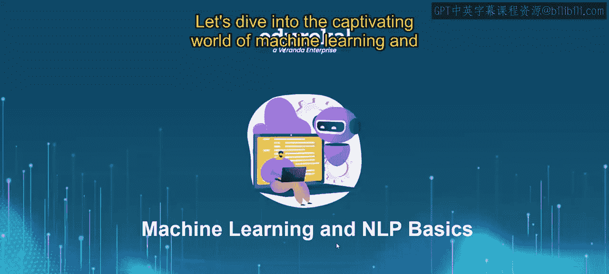
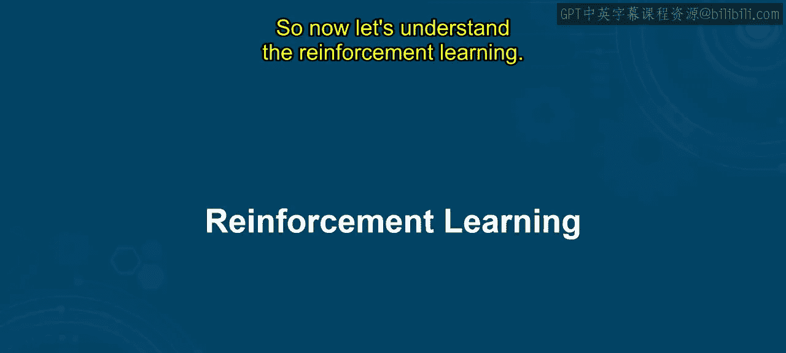
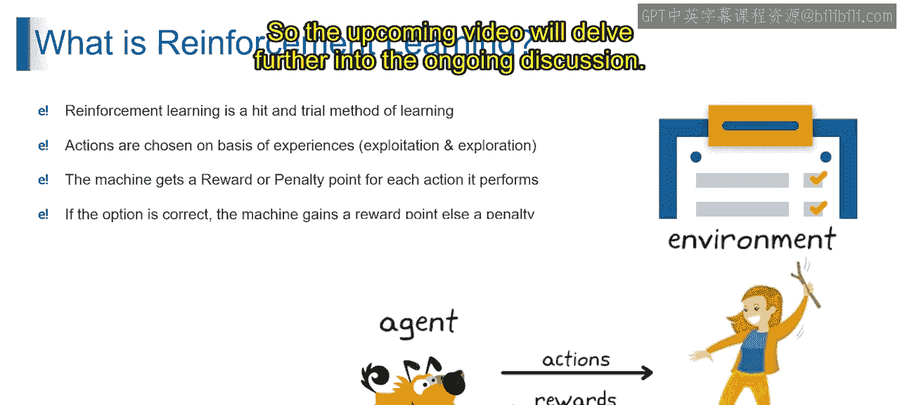

# 第一部分 19：强化学习 🎮

在本节课中，我们将一起探索强化学习这一引人入胜的领域。我们将了解强化学习的基本概念、核心原理及其应用。课程结束时，你将能够理解强化学习的基础知识，并将其应用于决策任务中。

## 强化学习简介

首先，我们通过一个训练自动驾驶汽车的用例来理解强化学习。这个用例的目标是训练一辆自动驾驶汽车，使其能够安全高效地在道路上行驶，而无需依赖预先定义的训练或测试数据。

相反，模型会从其行为的实时后果中学习。

## 工作原理：分步解析

以下是强化学习的分步过程。

以下是具体步骤：

1.  **观察**：汽车通过传感器（如摄像头和激光雷达）感知环境，收集关于道路、交通和障碍物的信息。
2.  **选择动作**：基于从摄像头等设备观察到的数据，汽车使用预定义的策略来选择要执行的动作，例如刹车或转向。
3.  **执行动作**：一旦选定动作，汽车便根据其决策在环境中执行该动作。
4.  **获得奖励或惩罚**：动作完成后，汽车会根据其表现获得奖励或惩罚。例如，安全遵守交通规则会获得奖励，而撞上障碍物则会受到惩罚。
5.  **更新策略**：汽车利用收到的奖励或惩罚来更新其策略，调整其决策过程以改进未来的行动。
6.  **迭代过程**：汽车重复此过程，持续观察、选择动作、执行动作、接收反馈并更新策略，从而随着时间的推移不断学习和改进。

通过以上步骤，强化学习使自动驾驶汽车能够从与环境的交互中学习，逐步提高其决策能力，从而安全高效地导航道路，无需预先定义的训练数据。

## 强化学习的本质

基于对自动驾驶汽车案例的理解，在强化学习中，模型通过试错进行学习，类似于我们从自身经验中学习的方式。它们基于这些经验选择行动，在利用已知策略和探索新可能性之间取得平衡。

## 核心概念

以下是强化学习的几个核心概念：

*   **利用与探索**：模型需要在**利用**过去表现良好的策略和**探索**可能带来更好结果的新行动之间取得平衡。
*   **奖励与惩罚**：每次行动后，模型会根据其表现获得**奖励**或**惩罚**。如果行动带来有利结果，则获得奖励；否则，将受到惩罚。
*   **学习过程**：这是一个试错过程。模型迭代尝试不同的行动，从每个行动的后果中学习。它根据收到的奖励和惩罚随时间调整策略，以最大化其整体表现。

本质上，强化学习使模型能够从经验中学习，根据奖励和惩罚调整行为，并通过反复试验的过程逐步提高其决策能力。

## 总结

本节课中，我们一起学习了强化学习的基本原理。我们通过自动驾驶汽车的案例，了解了强化学习如何通过观察、行动、反馈和策略更新的循环，使机器能够从与环境的交互中自主学习。我们探讨了其核心的“利用与探索”平衡机制，以及“奖励与惩罚”如何驱动模型优化决策。强化学习是一种强大的试错学习方法，为复杂环境下的智能决策提供了基础框架。

接下来的视频将继续深入探讨相关话题。

