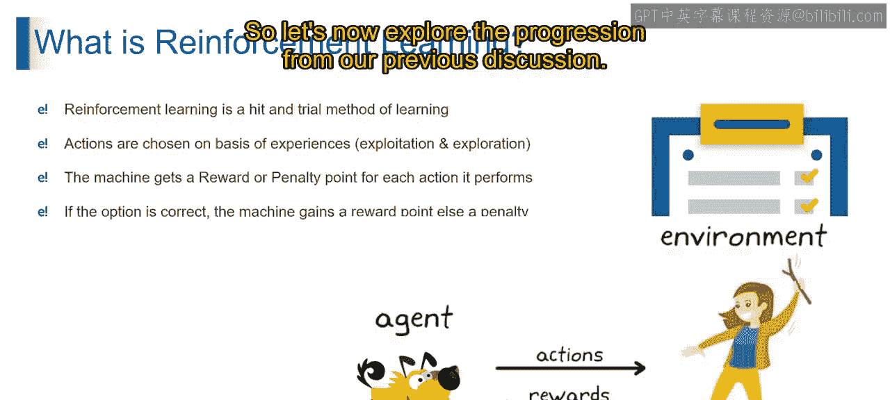
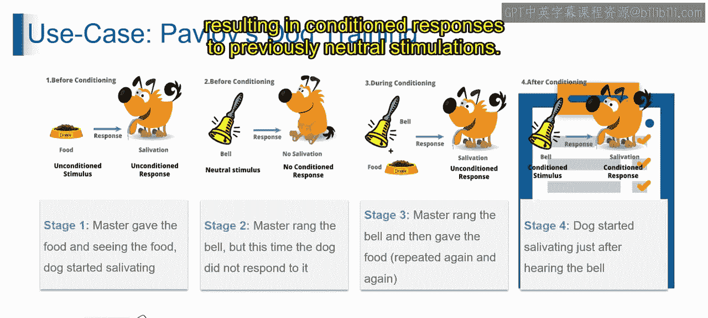
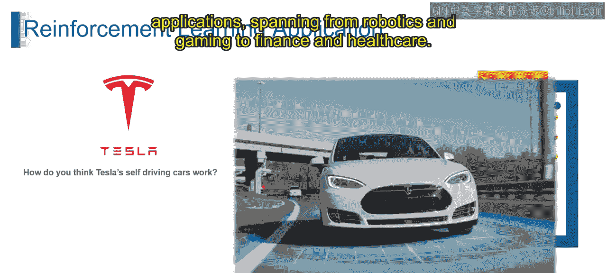
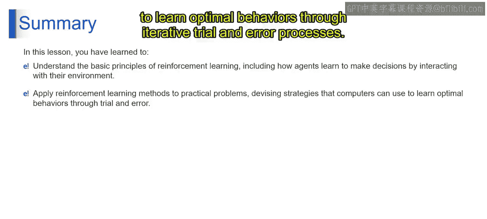

# 第一部分 20：强化学习的用例 🐕

在本节中，我们将探索强化学习的一个经典用例——巴甫洛夫的狗实验，并了解强化学习在现实世界中的广泛应用。

---

## 巴甫洛夫实验：强化学习的经典诠释 🧪

上一节我们介绍了强化学习的基本原理，本节中我们来看看一个著名的行为心理学实验如何完美诠释这些原理。

### 实验阶段分解

以下是巴甫洛夫训练狗的实验过程，它清晰地展示了“刺激-反应-奖励”的学习循环。

**阶段一：无条件刺激与反应**
食物出现时，狗会自然地分泌唾液。这是一种天生的、无需学习的反应。

**阶段二：中性刺激无反应**
巴甫洛夫摇铃（中性刺激），但狗没有分泌唾液。因为铃声本身与食物无关，不具意义。

**阶段三：建立关联**
巴甫洛夫在给狗食物前反复摇铃。经过多次“铃声-食物”配对后，狗开始将铃声与食物联系起来。

**阶段四：条件反射形成**
最终，即使没有食物出现，仅仅听到铃声，狗也会开始分泌唾液。这种习得的反应，展示了铃声（条件刺激）与食物（奖励）之间关联的力量。

### 与强化学习的对应关系

从强化学习的角度分析这个实验：
*   **食物** 充当了**奖励**（正强化），强化了狗的行为。
*   **铃声** 最初是**中性刺激**，没有意义。
*   通过与食物的反复配对，铃声变成了一个**信号**或**条件刺激**，预示着食物的到来。
*   狗通过一个**试错过程**学习，铃声与食物之间的关联随着时间推移和反复的强化（`铃声 -> 食物`）而加强。

**总结来说**：巴甫洛夫的狗训练是强化学习原则的范例，其中动物（或机器）通过反复配对学习与奖励建立关联，从而对先前中性的刺激产生条件反射。

---

## 强化学习的现实世界应用 🚀

理解了基本原理后，我们来看看强化学习技术如何解决各类现实问题。

以下是强化学习的一些主要应用领域：

*   **机器人学**：训练机器人完成复杂任务，如行走、抓取。
*   **游戏对战**：开发能够掌握并精通电子游戏（如围棋、DOTA 2）的AI智能体。
*   **推荐系统**：优化内容或商品推荐，以最大化用户参与度或购买率。
*   **金融**：用于算法交易、投资组合管理和欺诈检测。
*   **医疗保健**：辅助制定个性化治疗方案或新药研发。
*   **资源管理**：优化数据中心能耗、网络流量调度等。
*   **自动驾驶汽车**：例如特斯拉汽车，利用强化学习训练自动驾驶系统在复杂环境（如城市街道和高速公路）中安全高效地导航。其通过与环境交互并从驾驶动作获得的反馈中学习。

总体而言，强化学习为各种现实应用中的自主决策和自适应行为提供了一个强大的框架，其应用范围从机器人、游戏延伸到金融和医疗保健。

---

## 本节总结 📝

在本节课中，我们一起学习了：
1.  通过巴甫洛夫的狗实验，深入理解了**智能体如何通过与环境交互来学习并做出决策**。
2.  掌握了将强化学习技术应用于现实世界挑战的思路，即通过**迭代的试错过程**为计算机提供学习最优行为的策略。

感谢学习。