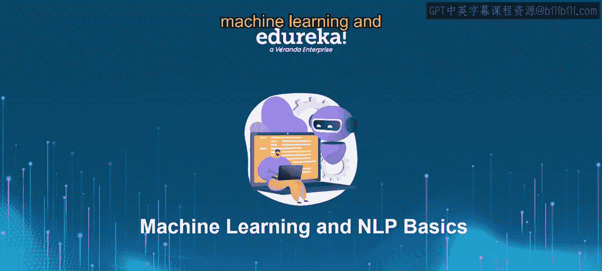
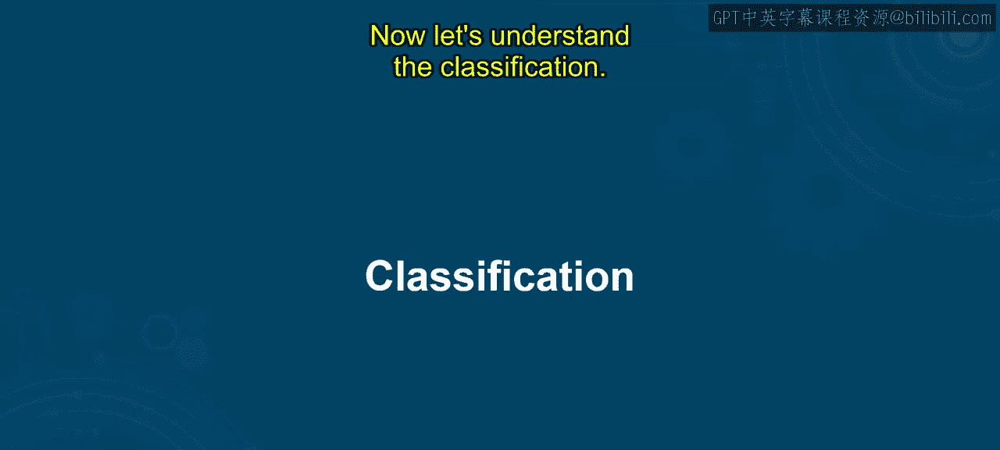
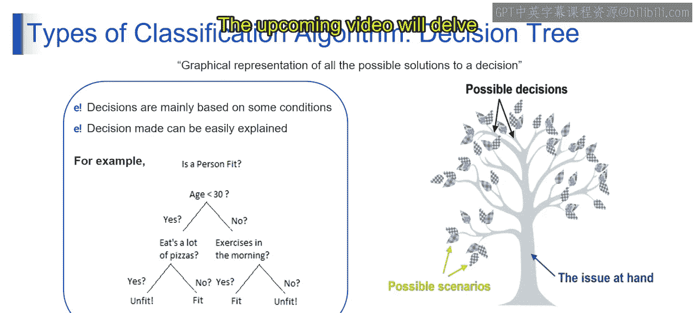

# 第一部分 21：分类算法入门 🧠

在本节课中，我们将一起探索机器学习中一个核心且迷人的领域：分类。我们将了解分类的基本概念、目的，并介绍几种常见的分类算法。通过本课的学习，你将能够理解分类在机器学习中的核心作用，并对不同的分类算法有一个初步的认识。

## 分类简介

想象一下，你正在将垃圾分类到不同的垃圾桶中，这些垃圾桶分别标有塑料、纸张、玻璃和金属。每种类型的垃圾都具有相似的特征：塑料物品通常具有柔韧性，纸张物品是扁平且轻质的，玻璃物品是透明且易碎的，而金属物品则是坚硬且耐用的。通过根据这些共享特征将垃圾物品分组到相应的类别中，你实际上就在执行一个分类任务。

从技术术语上讲，**分类**是一种机器学习任务，其目标是根据数据点的特征，将它们归类到预定义的类别或组别中。就像将垃圾分类到不同的桶里一样，分类算法分析数据点的特征，并将它们分配到适当的类别标签下。这使得机器能够学习数据中的模式和关系，从而能够准确地对新的、未见过的实例进行分类。

## 常见的分类算法

上一节我们介绍了分类的基本概念，本节中我们来看看几种常见的分类算法。以下是几种在机器学习中广泛使用的分类方法：

*   **神经网络**：这是一种深度学习模型，由相互连接的神经元层组成，能够学习数据中的复杂模式。
*   **决策树**：这是一种树状模型，其中每个内部节点代表一个特征，每个分支代表一个决策规则，每个叶节点代表一个类别标签。
*   **朴素贝叶斯分类器**：这是一种概率模型，它使用贝叶斯定理来预测给定输入特征时某个类别的概率，并假设特征之间相互独立。
*   **K最近邻算法**：这是一种非参数的“懒惰学习”算法，它根据数据点在特征空间中其K个最近邻居的多数类别来对该数据点进行分类。
*   **逻辑回归**：这是一种线性分类模型，它使用逻辑函数将预测映射到概率，从而估计一个实例基于其特征属于某个特定类别的概率。

## 算法详解

我们已经了解了分类算法的概览，现在让我们更深入地看看其中两种算法的具体工作原理。

### 逻辑回归

逻辑回归就像画一条线，根据数据点的特征将它们分为两个类别。它适用于我们想要预测的结果是分类的情况，例如“是”或“否”、“垃圾邮件”或“非垃圾邮件”、“通过”或“失败”。

逻辑回归方程用于计算事件发生的概率（例如，一封给定的电子邮件是垃圾邮件的概率）。其公式如下：

**P = 1 / (1 + e^-(B0 + B1*X))**

其中，`P` 是事件发生的概率，`B0` 和 `B1` 是系数，`X` 是特征值。

假设我们想根据某些特征（如特定单词或短语的出现）来预测一封电子邮件是否为垃圾邮件。我们收集了过去电子邮件的相关数据，其中每封邮件都被标记为垃圾邮件（1）或非垃圾邮件（0）。使用逻辑回归，我们可以构建一个模型，根据电子邮件的特征来预测其为垃圾邮件的概率。例如，如果预测概率大于0.5，我们将其分类为垃圾邮件；否则，分类为非垃圾邮件。

### 决策树

决策树就像流程图，它基于一系列条件来帮助做出决策。它以图形格式表示一个决策的所有可能解决方案，使其易于遵循和理解。

以下是决策树的关键组成部分：

*   **决策与解释**：树中的决策节点代表做出决策所依据的条件或问题。每个节点所做的决策可以很容易地解释，因为它们基于简单的条件。
*   **可能的决策**：树中的每个节点代表一个决策点，根据条件或特征做出选择。
*   **可能的场景**：树的分支代表了基于每个节点所做的决策可能出现的不同场景或路径。
*   **处理的问题**：决策树通过系统地探索和分类可能的结果来处理主要问题，从而得出清晰的解决方案或决策。

例如，考虑根据一个人的年龄、饮食习惯和锻炼习惯来确定他是否健康。决策树会根据诸如“年龄是否小于30岁”、“是否吃大量垃圾食品”、“是否在早晨锻炼”等条件进行分支。通过检查这些条件的组合，最终将人分类为“健康”或“不健康”。

## 总结

在本节课中，我们一起学习了机器学习中的分类任务。我们从垃圾分类的类比入手，理解了分类的核心目的是根据特征将数据点归入预定义的类别。随后，我们介绍了神经网络、决策树、朴素贝叶斯、K最近邻和逻辑回归这几种常见的分类算法。最后，我们详细探讨了逻辑回归的数学模型和决策树的工作原理。掌握这些基础知识，是进一步学习更复杂生成式人工智能模型的重要一步。