# 第一部分 22：随机森林算法详解 🌲

在本节课中，我们将要学习随机森林算法。这是一种基于决策树的集成学习方法，通过组合多个决策树的预测结果来提高模型的准确性和稳定性。

---

上一节我们介绍了决策树算法，本节中我们来看看它的一个强大扩展——随机森林。

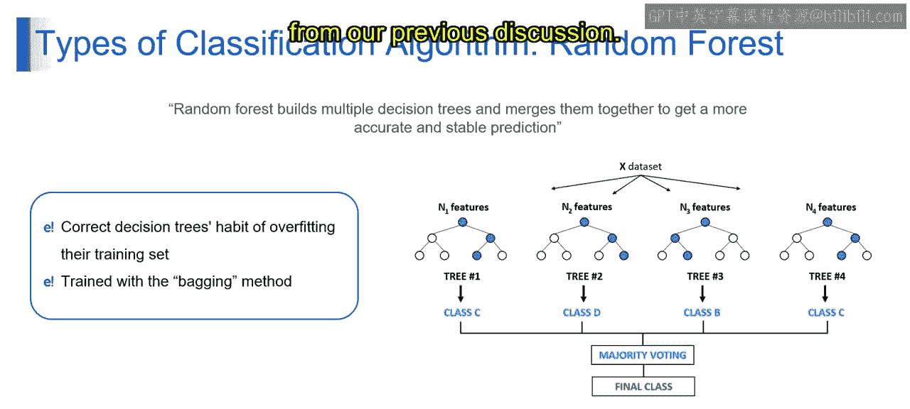

随机森林就像一组决策专家团队，每位专家专注于问题的不同方面，他们通过协作做出集体决策，最终基于多数投票（分类）或平均（回归）得出更准确、更可靠的预测结果。

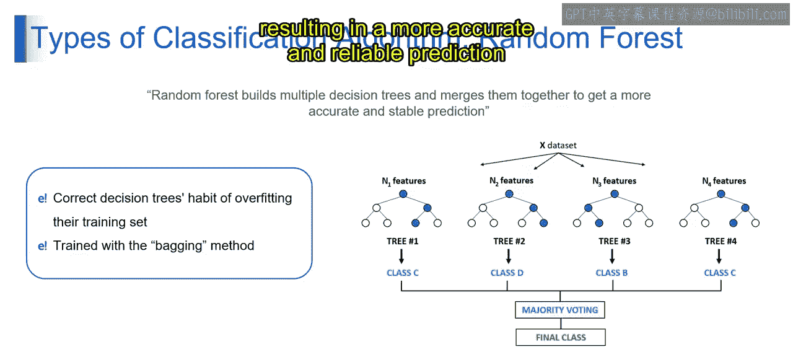

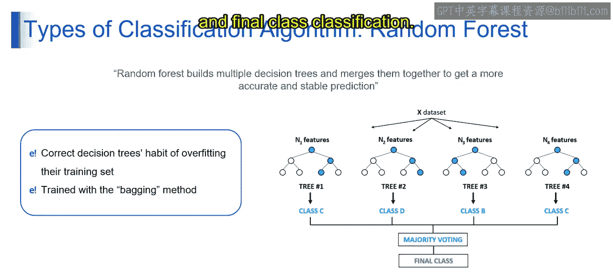

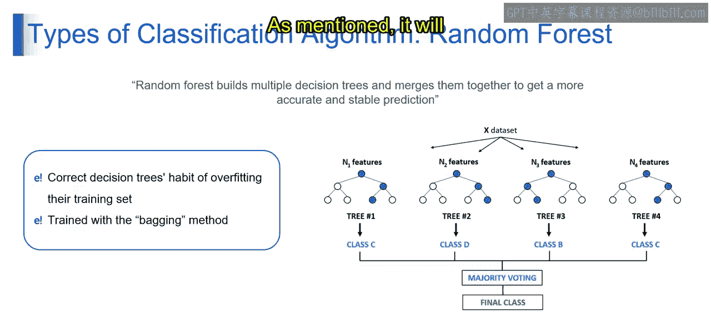

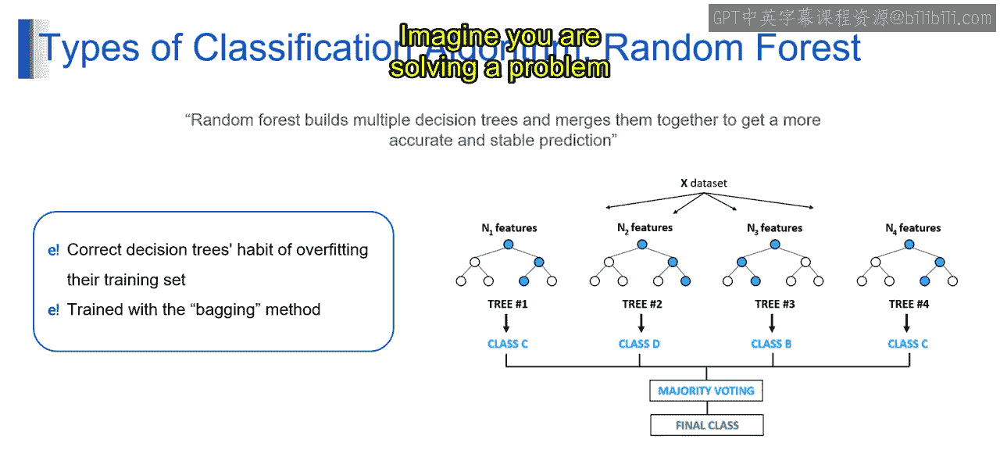

## 工作原理

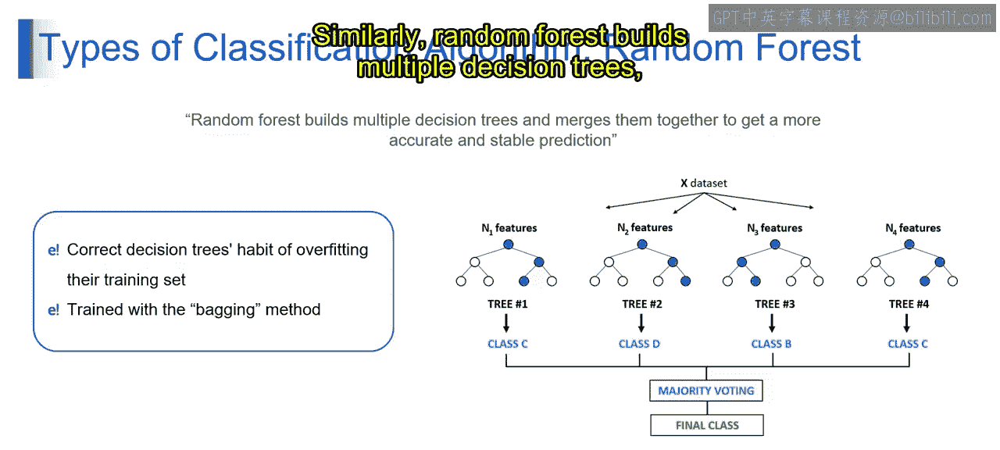

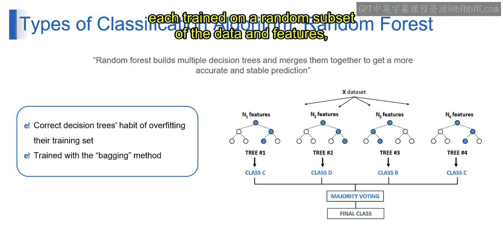

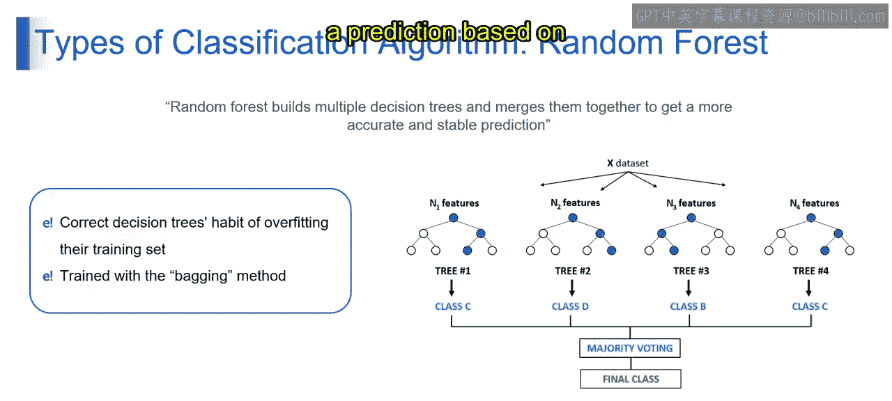

那么随机森林具体是如何工作的呢？它通过构建多个决策树来实现。

想象一下，你在解决一个问题时，会咨询多位不同领域的专家。类似地，随机森林会构建多个决策树，每棵树都在数据和特征的随机子集上进行训练，然后进行集体决策。

以下是随机森林工作的核心步骤：

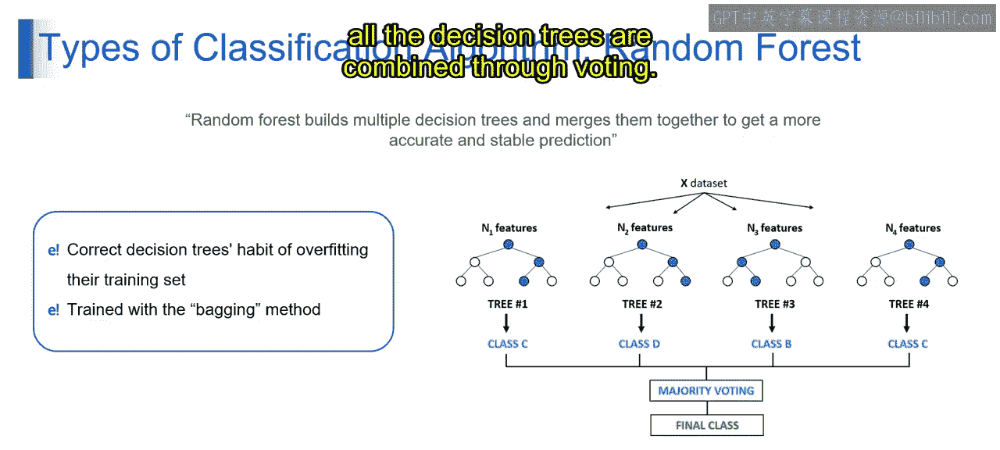

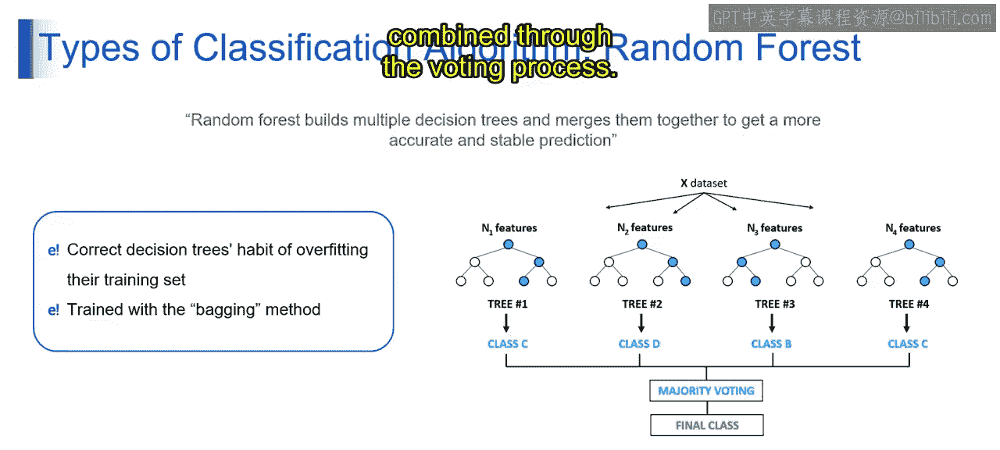

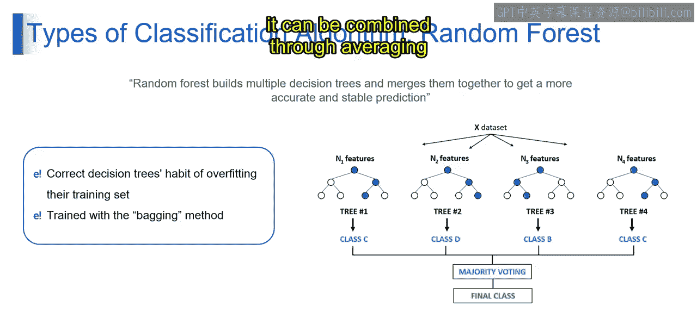

1.  **构建多个决策树**：算法会创建多棵决策树。每棵树使用训练数据的随机子集（通过自助采样法）和特征的随机子集进行训练。这个过程确保了每棵树的差异性。
2.  **独立预测**：每棵决策树根据其看到的数据和特征，独立地对新样本做出预测。
3.  **集成预测结果**：最后，将所有决策树的预测结果进行合并。对于分类问题，采用**投票**机制；对于回归问题，采用**平均**机制，从而得出最终预测。

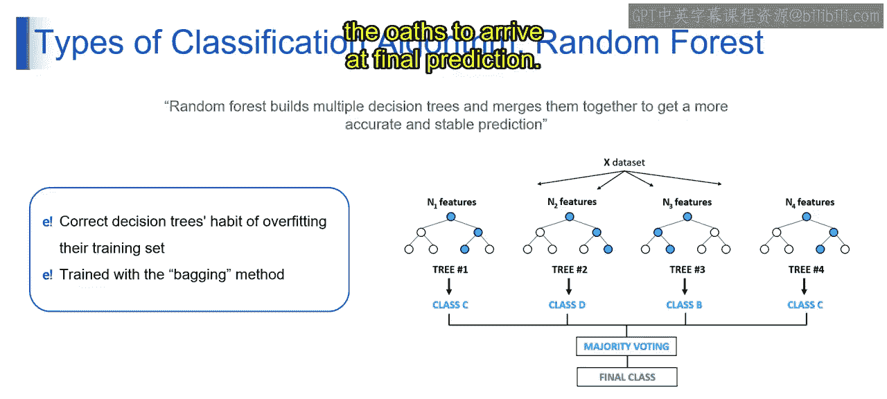

## 核心概念：装袋法

在这个流程中，用到了一个关键概念——**装袋法**。

在随机森林中，装袋法指的是在训练数据的不同子集上训练多个决策树，然后聚合它们的预测结果。这样做可以提高整体模型的准确性，并有效减少过拟合。

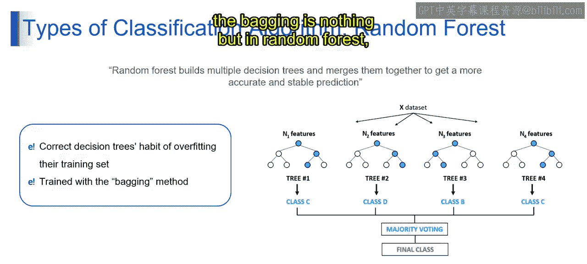

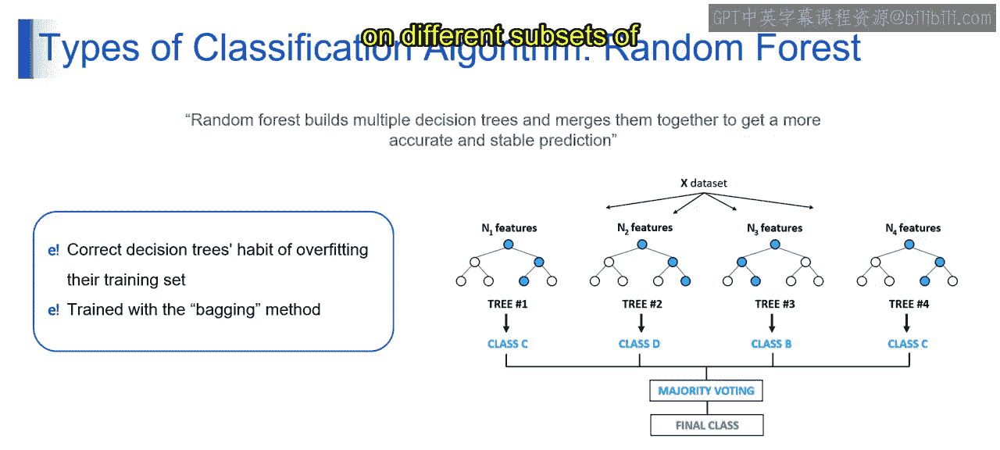

简单来说，随机森林是一种集成学习技术，它在训练过程中构建多个决策树，并输出这些树的**众数**（对于分类问题）或**平均值**（对于回归问题）。

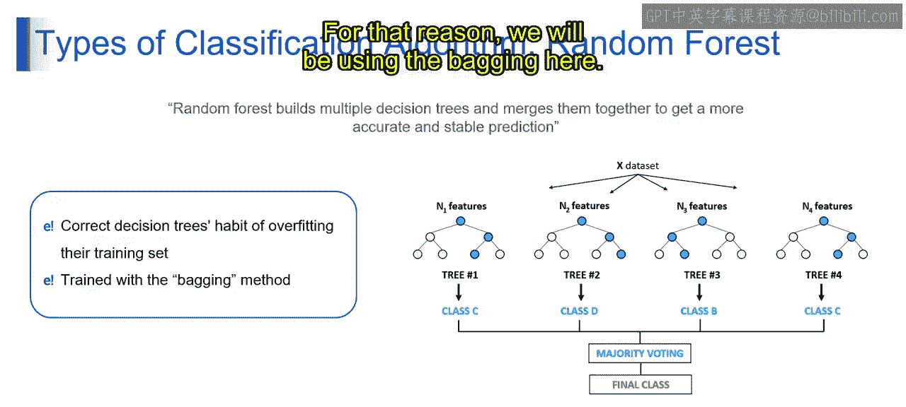

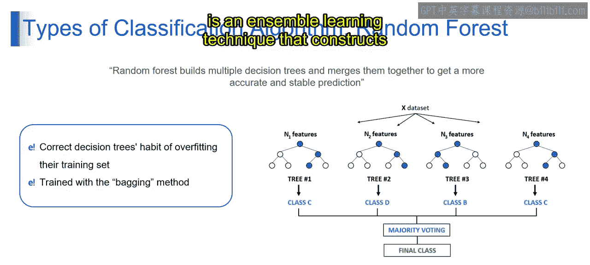

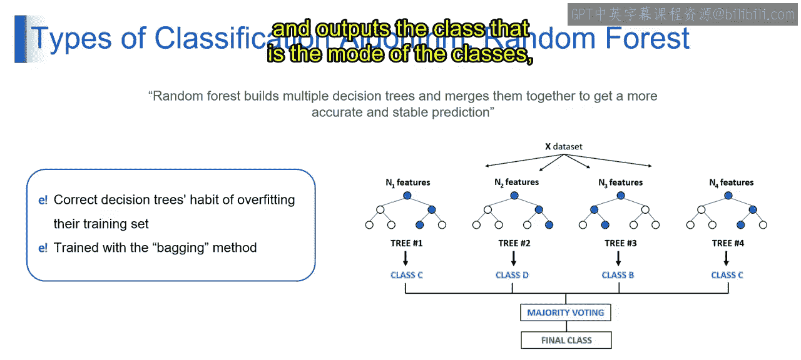

---

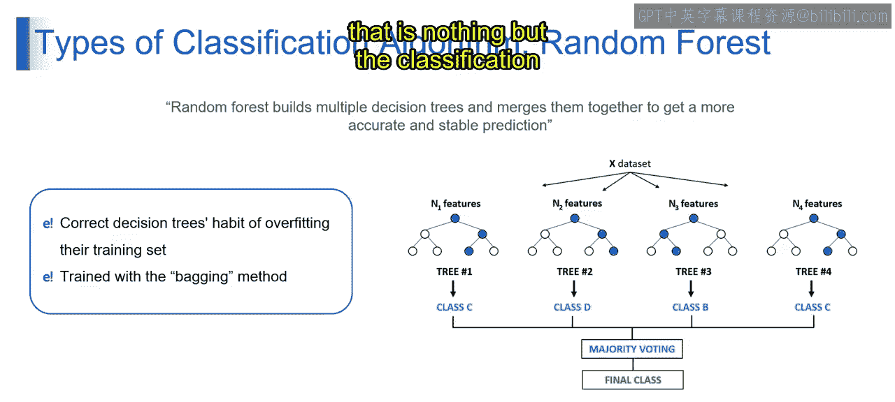

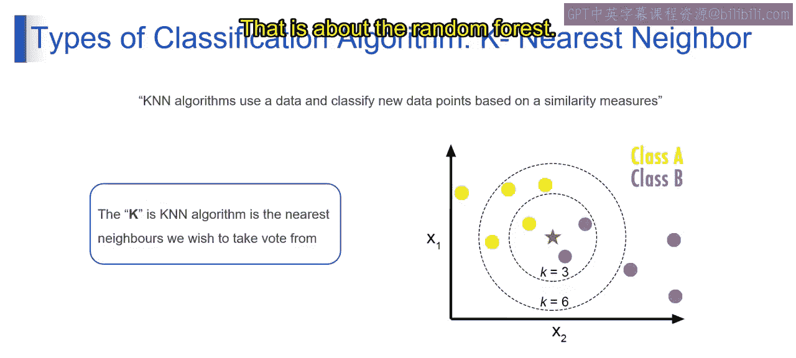

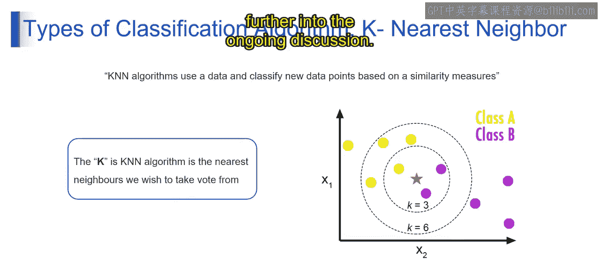

本节课中我们一起学习了随机森林算法。我们了解到，它通过集成多个决策树，利用装袋法和投票/平均机制，显著提升了单一决策树的预测性能和泛化能力。接下来的视频将继续深入探讨相关话题。