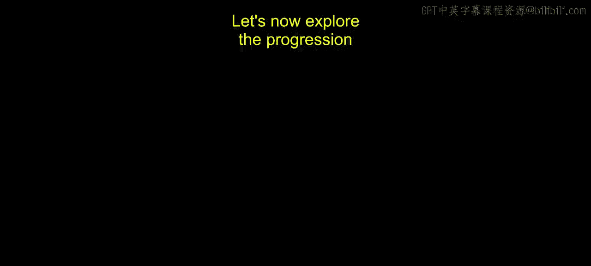
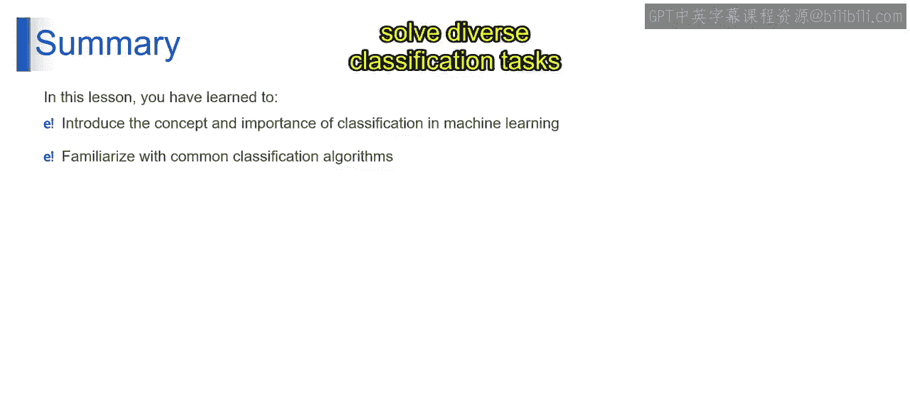

# 第一部分 23：其他类型的分类算法

在本节课中，我们将继续探索机器学习中的分类算法。上一节我们介绍了分类的基本概念和一些基础算法，本节中我们来看看另外两种重要且常用的分类算法：K最近邻算法和朴素贝叶斯算法。这两种算法虽然原理不同，但在实践中都非常有效。

## K最近邻算法

K最近邻算法是一种简单直观的算法。它就像在做出决定前，询问你最近的K个邻居的意见。该算法可用于分类和回归任务。

以下是K最近邻算法的工作原理：

想象你有一个新的数据点需要分类。KNN算法会找到训练数据中与该点最接近的K个邻居。这个“接近”是通过距离度量来计算的，例如欧几里得距离。

*   对于**分类任务**，算法会查看这K个邻居中哪个类别占多数，并将这个多数类别赋予新的数据点。这被称为“多数投票”。
*   对于**回归任务**，算法会计算这K个邻居目标值的平均值，作为新数据点的预测值。

例如，假设你想根据电影的评分、时长等特征来预测其类型。KNN算法会找到特征最相似的K部电影，然后根据这些邻居电影中的多数类型来决定新电影的类型。

K最近邻是一种非参数的“惰性学习”算法，它根据特征空间中K个最近邻居的多数类别来对数据点进行分类。

## 朴素贝叶斯算法

接下来，我们看看朴素贝叶斯算法。这种算法基于事件发生的概率进行预测，它使用了一些简单的假设，是一种直接有效的分类器。

以下是朴素贝叶斯算法的工作原理：

该算法的核心是贝叶斯定理。想象你要计算在某些证据下某个事件发生的概率。贝叶斯定理利用先验知识和新证据来计算这个后验概率。

朴素贝叶斯做了一个关键假设：在给定类别标签的条件下，所有特征之间是相互独立的。尽管这个假设在现实数据中常常不成立，但朴素贝叶斯在实践中仍然表现良好。

其核心公式是贝叶斯定理：

`P(A|B) = [P(B|A) * P(A)] / P(B)`

其中：
*   `P(A|B)` 是给定特征B后，类别A的概率，称为**后验概率**。
*   `P(B|A)` 是给定类别A时，特征B出现的概率，称为**似然**。
*   `P(A)` 是类别A的**先验概率**。
*   `P(B)` 是特征B的**证据**概率。

例如，在根据邮件中的单词来分类邮件是否为垃圾邮件时，朴素贝叶斯会计算在出现某些特定单词的条件下，邮件是垃圾邮件或非垃圾邮件的概率。

朴素贝叶斯分类器是基于概率的模型，它通过假设特征在给定类别下条件独立，来计算给定特征后某个类别的概率，并基于贝叶斯定理进行预测，这使得它在分类任务中高效且可扩展。

## 总结

本节课中我们一起学习了两种重要的分类算法。我们了解了K最近邻算法如何通过“邻居投票”的方式进行分类，以及朴素贝叶斯算法如何基于概率和条件独立性假设进行高效的预测。掌握这些算法，将帮助你更有效地解决多样的分类任务。