# 第一部分 24：分类问题实战演示 🍷

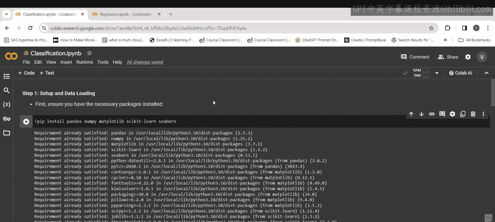

在本节课中，我们将学习分类问题陈述的实践方法。我们将演示构建一个用于葡萄酒质量分类的机器学习模型的过程，评估其性能，并可视化特征的重要性。该模型旨在根据葡萄酒的特征预测其质量是高还是低。

---

上一节我们介绍了分类问题的基本概念，本节中我们来看看如何用代码一步步实现一个分类模型。

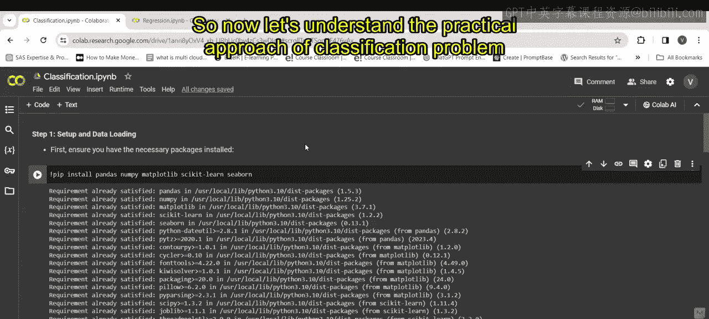

首先，第一步是导入所需的库。

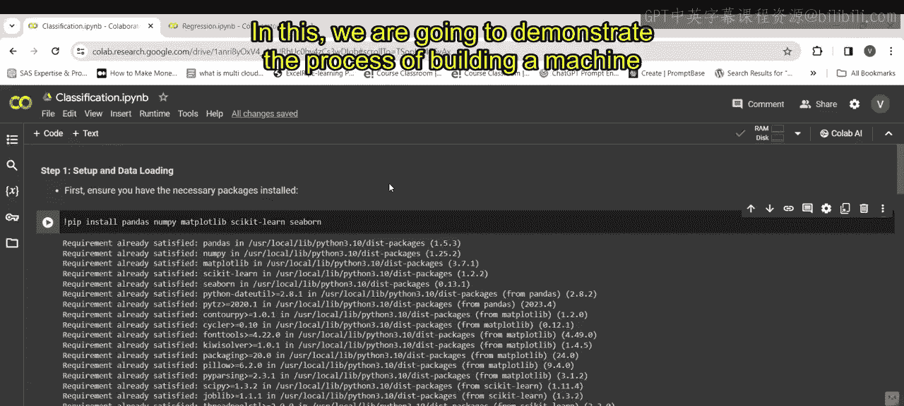

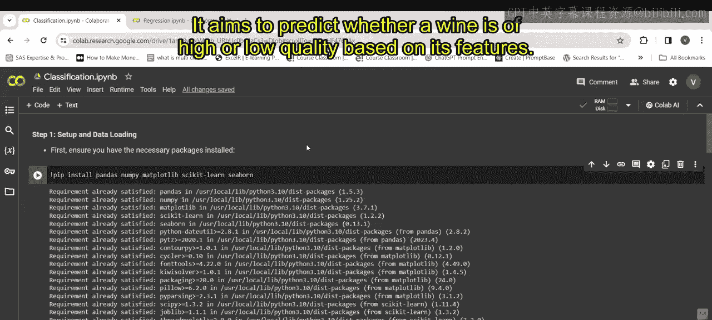

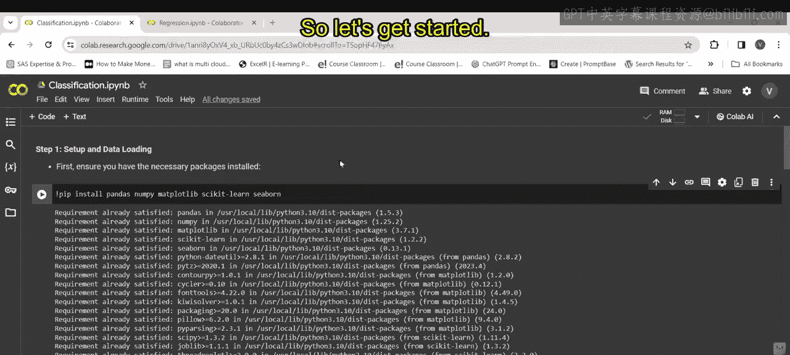

以下是导入所需库的代码：

```python
!pip install pandas numpy matplotlib scikit-learn seaborn
import pandas as pd
import numpy as np
import matplotlib.pyplot as plt
from sklearn.model_selection import train_test_split
from sklearn.ensemble import RandomForestClassifier
from sklearn.metrics import classification_report, confusion_matrix
import seaborn as sns
```

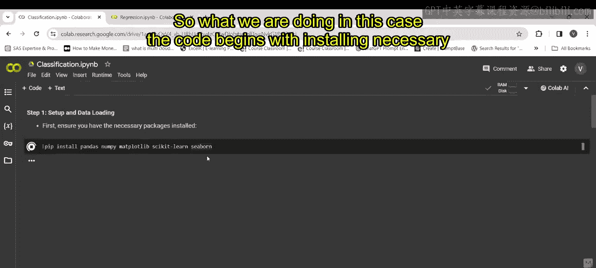

这段代码首先使用 `pip` 命令安装必要的库，如 `pandas`、`numpy`、`matplotlib`、`scikit-learn` 和 `seaborn`。然后，它导入这些库并为 `pandas` 设置了别名 `pd` 以便于使用。

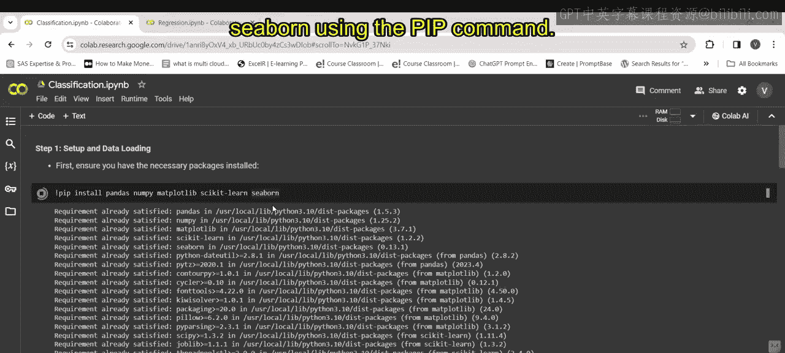

---

数据加载是建模的基础。接下来，我们将从指定URL加载数据集。

以下是加载数据的代码：

```python
url = "https://archive.ics.uci.edu/ml/machine-learning-databases/wine-quality/winequality-white.csv"
data = pd.read_csv(url, sep=';')
```

这段代码定义了一个URL，指向包含白葡萄酒质量数据的CSV文件。`pandas` 的 `read_csv` 函数从这个URL加载数据，并指定数据的分隔符是分号。

---

数据加载完成后，我们需要进行预处理，将原始的质量评分转换为“高”或“低”的二元标签。

以下是数据预处理的代码：

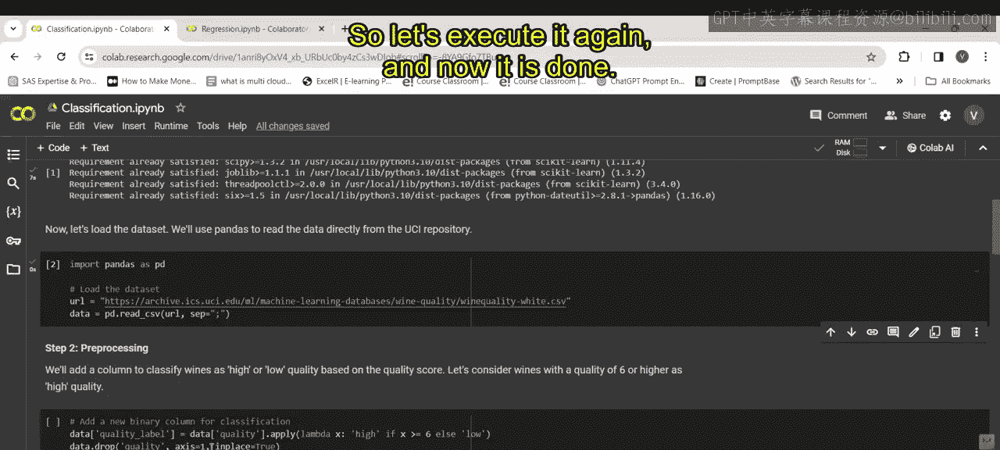

```python
data['quality_label'] = data['quality'].apply(lambda x: 'high' if x >= 6 else 'low')
data.drop('quality', axis=1, inplace=True)
```

第一行代码基于 `quality` 列添加了一个新的二元列 `quality_label`：如果质量评分大于等于6，则标记为“high”，否则标记为“low”。第二行代码随后删除了原始的质量列，因为它不再需要。

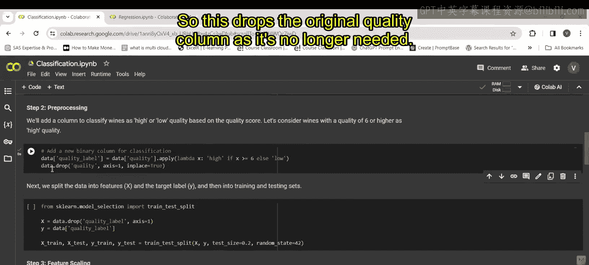

---

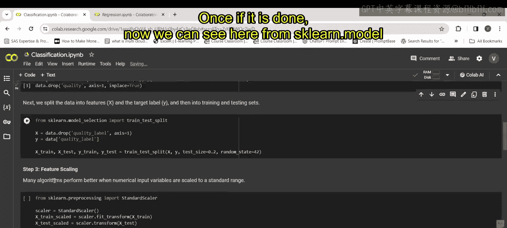

为了训练和评估模型，我们需要将数据集划分为训练集和测试集。

以下是划分数据集的代码：

```python
X = data.drop('quality_label', axis=1)
y = data['quality_label']
X_train, X_test, y_train, y_test = train_test_split(X, y, test_size=0.2, random_state=42)
```

这段代码将所有列（除了 `quality_label`）作为特征赋值给 `X`，将 `quality_label` 列作为目标变量赋值给 `y`。然后，`train_test_split` 函数将数据集以80%训练、20%测试的比例进行划分，`random_state=42` 确保了结果的可重复性。

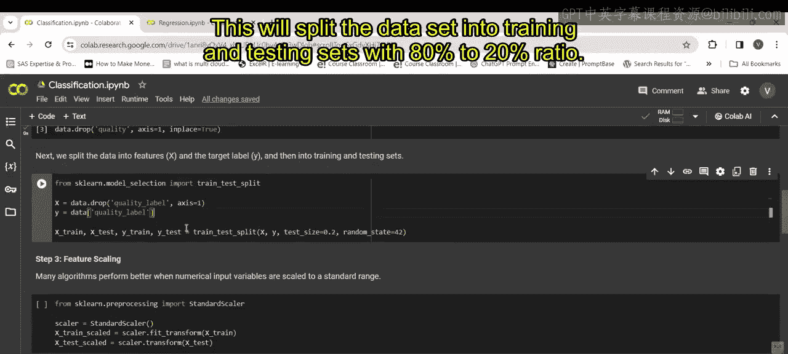

---

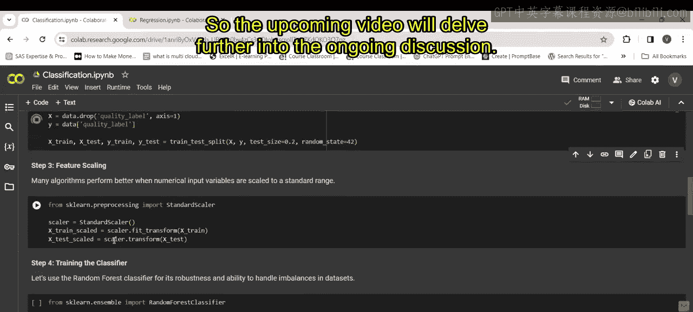

本节课中我们一起学习了分类问题实战演示的初始步骤：导入库、加载数据、进行数据预处理以及划分训练集和测试集。在接下来的课程中，我们将继续深入讨论如何构建和评估分类模型。