# 第一部分 25：特征缩放与分类器训练 🚀

在本节课中，我们将学习机器学习流程中的两个关键步骤：特征缩放与分类器训练。我们将从上一节讨论的数据预处理环节继续，首先对数据进行标准化处理，然后训练一个随机森林分类器模型，并评估其性能。

---

## 从特征缩放开始

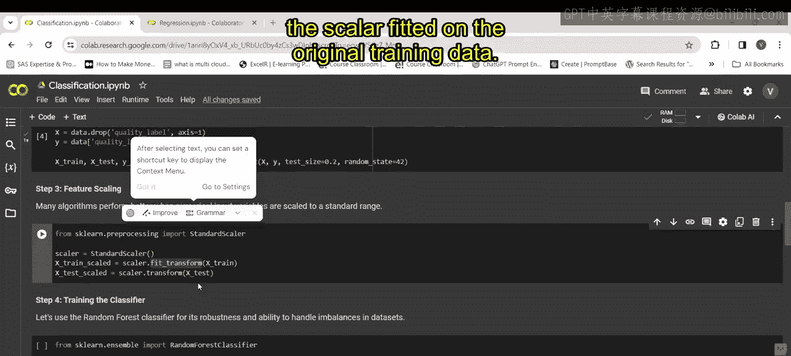

上一节我们介绍了数据预处理，本节中我们来看看如何对特征进行标准化缩放。特征缩放能确保不同量纲的特征对模型的影响处于同一水平，这对于许多机器学习算法至关重要。

以下是执行特征缩放的步骤：

1.  从 `sklearn.preprocessing` 导入 `StandardScaler`。
2.  实例化一个 `StandardScaler` 对象。
3.  使用训练数据拟合（`fit`）该缩放器，并转换（`transform`）训练数据。
4.  使用拟合好的缩放器转换测试数据。

对应的核心代码如下：

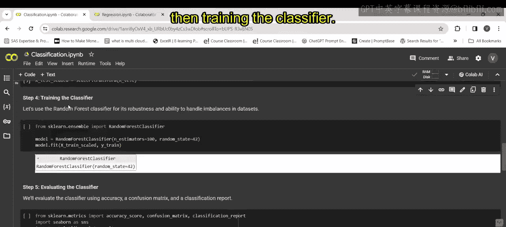

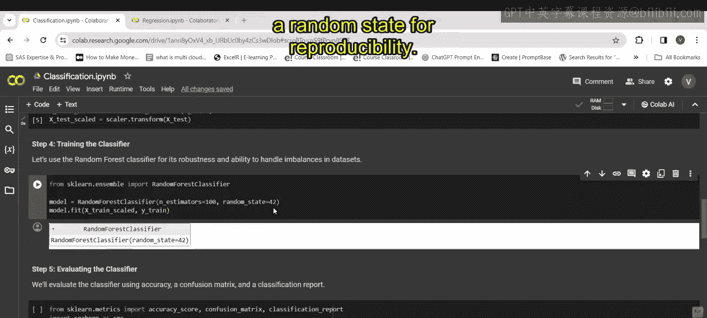

```python
from sklearn.preprocessing import StandardScaler
scaler = StandardScaler()
X_train_scaled = scaler.fit_transform(X_train)
X_test_scaled = scaler.transform(X_test)
```

执行这段代码后，我们的训练和测试特征数据 `X_train` 和 `X_test` 就被标准化为 `X_train_scaled` 和 `X_test_scaled`。

---

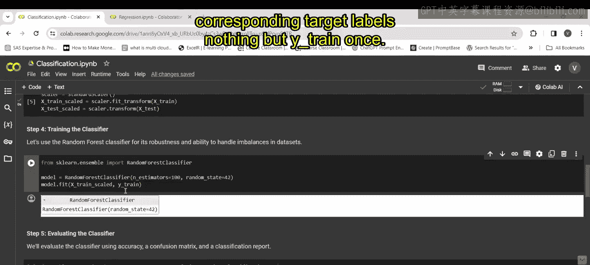

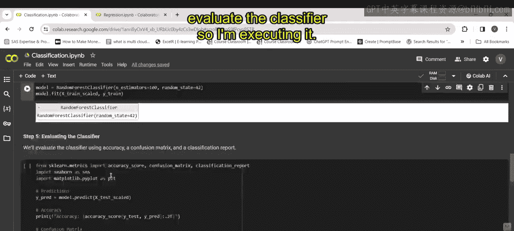

## 训练分类器模型

完成特征缩放后，下一步是训练我们的分类器模型。这里我们选择使用随机森林算法。

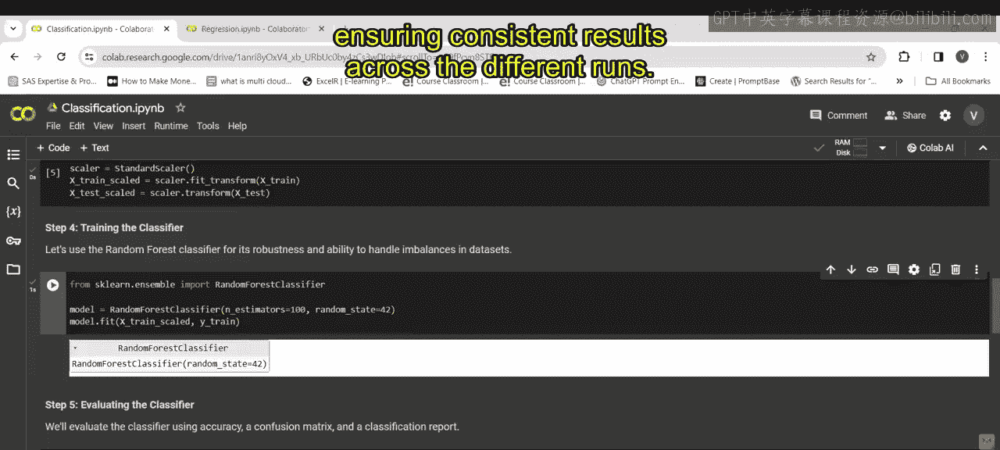

以下是训练分类器的步骤：

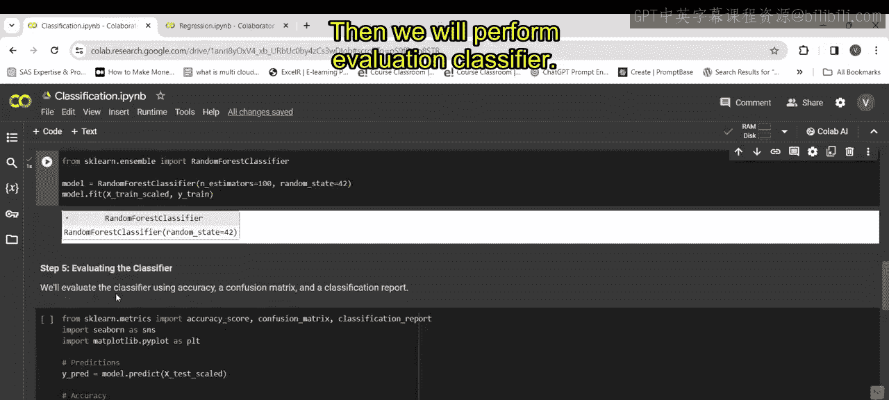

1.  从 `sklearn.ensemble` 导入 `RandomForestClassifier`。
2.  初始化分类器，设置树的数量（`n_estimators`）和随机种子（`random_state`）以确保结果可复现。
3.  使用缩放后的训练数据（`X_train_scaled`）和对应的标签（`y_train`）来训练（`fit`）模型。

对应的核心代码如下：

```python
from sklearn.ensemble import RandomForestClassifier
model = RandomForestClassifier(n_estimators=100, random_state=42)
model.fit(X_train_scaled, y_train)
```

参数 `random_state=42` 固定了随机数生成的种子，这能保证每次运行代码时，模型初始化过程一致，从而得到可复现的结果。

---

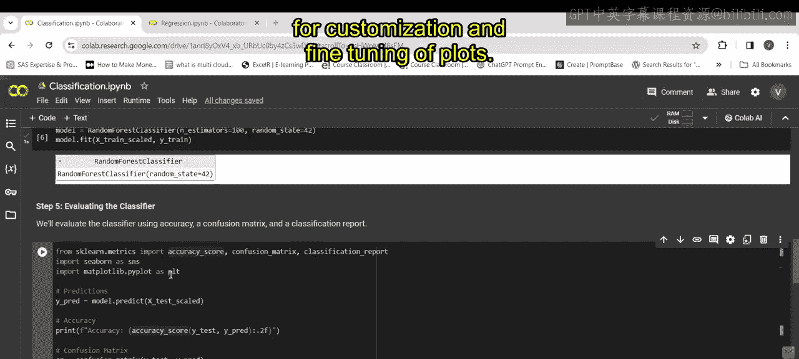

## 评估分类器性能

模型训练完成后，我们需要评估它的表现。我们将使用准确率、混淆矩阵和分类报告等指标。

以下是进行评估的步骤：

1.  从 `sklearn.metrics` 导入评估工具：`accuracy_score`, `confusion_matrix`, `classification_report`。
2.  导入可视化库 `seaborn` 和 `matplotlib` 用于绘图。
3.  使用训练好的模型对缩放后的测试数据（`X_test_scaled`）进行预测（`predict`）。
4.  计算并打印模型在测试集上的准确率。
5.  计算混淆矩阵，它通过表格形式展示预测结果与真实标签的对比情况。

对应的核心代码如下：

```python
from sklearn.metrics import accuracy_score, confusion_matrix, classification_report
import seaborn as sns
import matplotlib.pyplot as plt

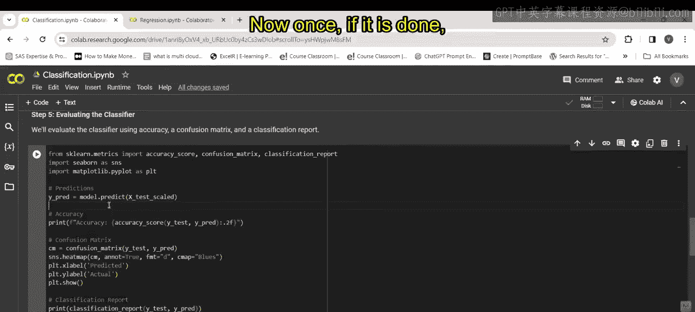

y_pred = model.predict(X_test_scaled)
print(f"模型准确率: {accuracy_score(y_test, y_pred):.2f}")

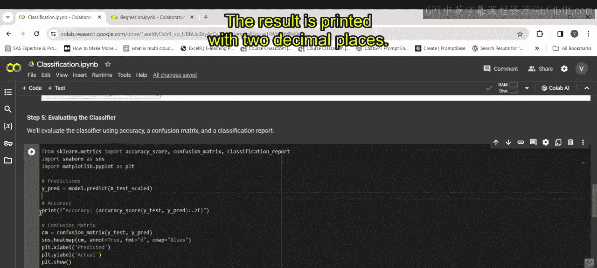

cm = confusion_matrix(y_test, y_pred)
```

混淆矩阵是一个重要的工具，它的每一行代表预测的类别，每一列代表真实的类别。通过分析它，我们可以了解模型在哪些类别上容易混淆。关于混淆矩阵的深入分析将在后续视频中展开。

---

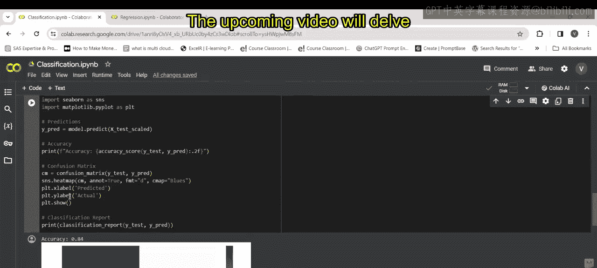

本节课中我们一起学习了机器学习建模流程中的特征缩放与分类器训练。我们首先使用 `StandardScaler` 标准化了数据，然后使用 `RandomForestClassifier` 训练了一个模型，最后通过准确率和混淆矩阵初步评估了模型性能。理解这些步骤是构建有效机器学习模型的基础。