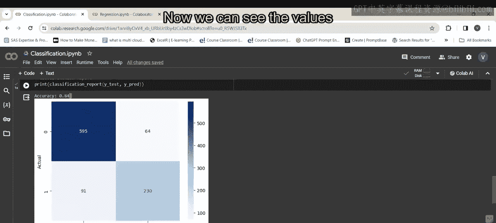
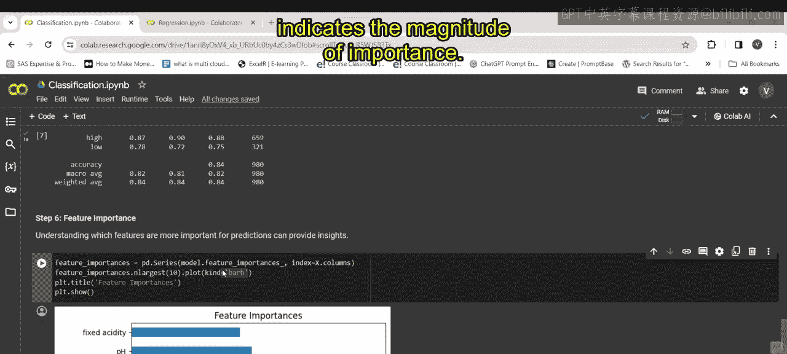
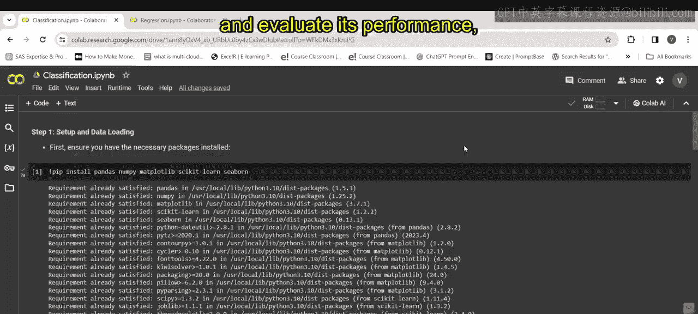
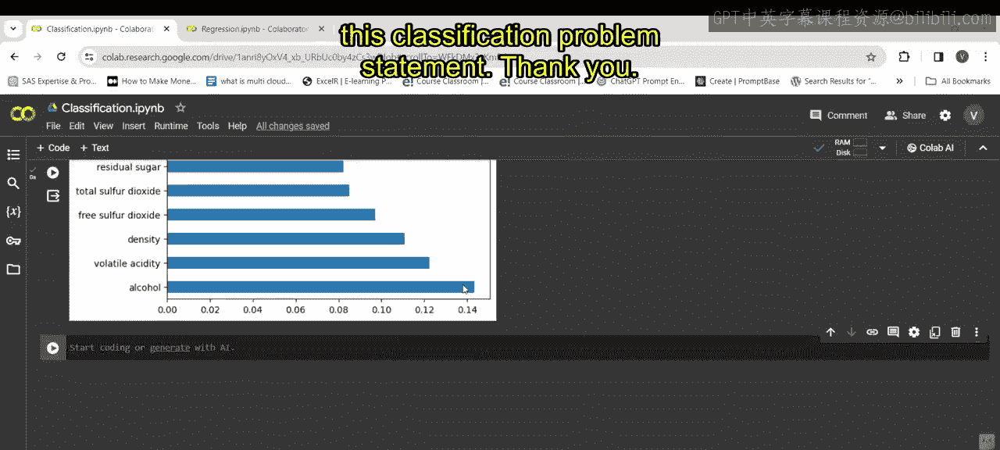

# 第一部分 26：分类报告的可视化 📊

在本节课中，我们将学习如何对分类模型的评估结果进行可视化，特别是混淆矩阵和特征重要性。这些可视化工具能帮助我们更直观地理解模型的性能和行为。

---

上一节我们介绍了如何计算分类模型的评估指标。本节中，我们来看看如何将这些指标，尤其是混淆矩阵，通过热力图进行可视化呈现。

以下代码使用 Seaborn 库创建混淆矩阵的热力图：

```python
sns.heatmap(cm, annot=True, fmt='d')
```

这行代码利用 Seaborn 库的 `heatmap` 函数来可视化混淆矩阵。热力图提供了混淆矩阵的视觉表示，其中每个单元格的颜色深浅代表观测值的数量。参数 `annot=True` 用于在单元格中显示数值，`fmt='d'` 则将数值格式化为整数。

接着，我们设置坐标轴标签：


```python
plt.xlabel('Predicted')
plt.ylabel('Actual')
```


这些代码行设置了热力图的 X 轴和 Y 轴标签，分别表示预测类别和真实类别。

最后，使用 `plt.show()` 显示可视化结果。


执行代码后，我们可以看到混淆矩阵的热力图表示，同时也能看到模型的准确率。


现在，我们可以看到预测值和实际值的具体数值。正如之前讨论的，混淆矩阵展示了真正例、假正例、假反例等。这就是其可视化表示的工作原理。




---

接下来，我们探讨特征重要性。特征重要性可以帮助我们理解哪些特征对模型的预测影响最大。

以下是计算和可视化特征重要性的步骤：

首先，计算特征重要性：

```python
feature_importances = model.feature_importances_
```

这行代码使用训练好的随机森林分类器（即 `model`）的 `feature_importances_` 属性来计算特征重要性。该属性返回一个数组，包含每个特征的重要性分数。

然后，将其转换为 Pandas Series 以便处理：

```python
importances_series = pd.Series(feature_importances, index=X_train.columns)
```

这行代码将重要性数组转换为 Pandas Series，并将特征名称（即 `X_train.columns`）设置为索引。

接着，我们选取最重要的10个特征：

```python
top_10_features = importances_series.nlargest(10)
```

这行代码使用 Pandas Series 的 `nlargest` 函数来获取重要性值最大的前10个特征。

最后，绘制水平条形图来展示这些特征的重要性：




```python
top_10_features.plot(kind='barh')
plt.title('Top 10 Feature Importances')
plt.show()
```

参数 `kind='barh'` 指定创建水平条形图。每个条形代表一个特征的重要性，条形的长度表示重要性的大小。我们为图表添加标题后将其显示出来。

执行这段代码，你将看到输出的图表。这段代码提供了特征重要性的视觉表示。


这使我们能够理解哪些特征对模型的预测有最显著的影响。它有助于特征选择和理解模型的行为。

总而言之，本段代码完成了数据加载、预处理、划分训练集和测试集、构建并训练随机森林分类器、评估性能以及可视化特征重要性的全过程。这就是关于这个分类问题陈述的全部内容。


---





本节课中，我们一起学习了如何通过热力图可视化混淆矩阵，以及如何计算和绘制特征重要性图。这些可视化技术是分析和解释分类模型结果的重要工具。