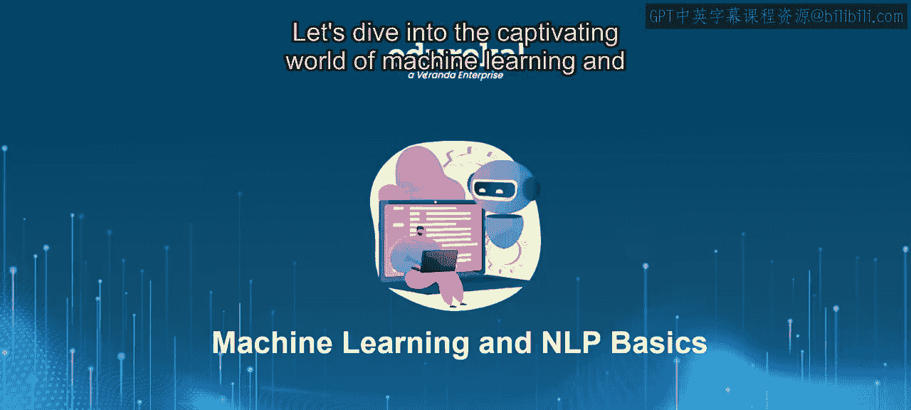
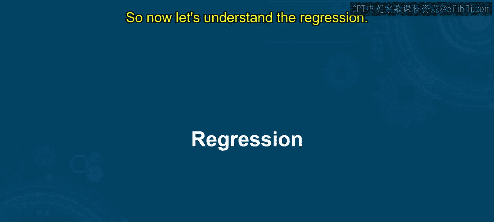
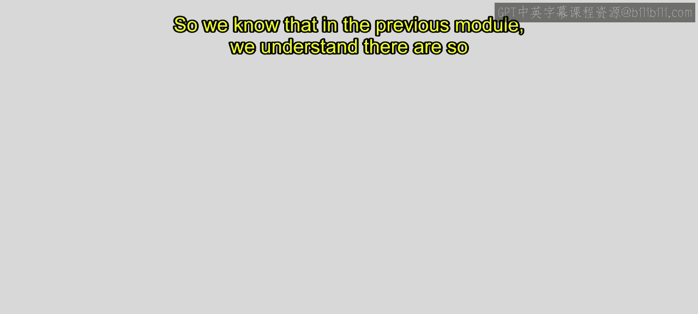
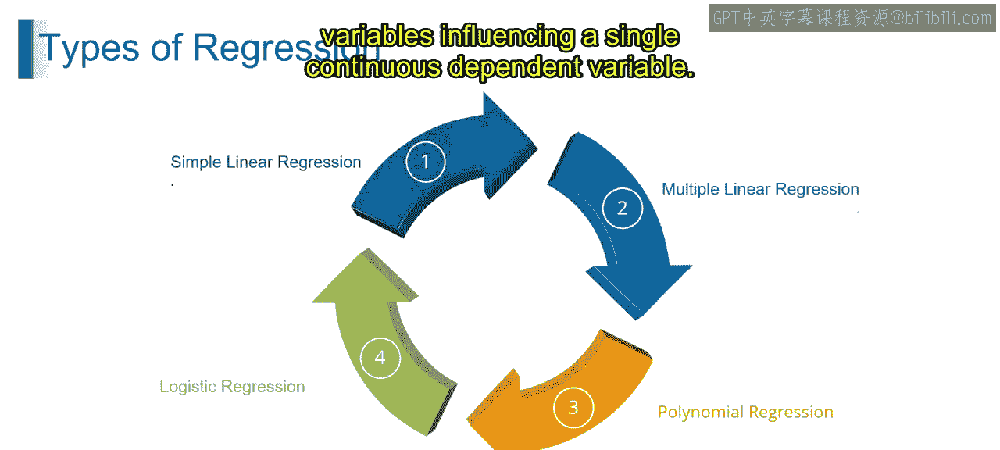

# 第一部分 27：回归分析 📈

在本节课中，我们将学习机器学习中的一个核心概念——回归分析。我们将了解回归的定义、关键概念以及不同类型的回归模型。通过本节内容，你将能够阐述回归在数据分析中的应用，理解支撑回归模型的基本原理，并区分不同的回归技术及其用途。

---

## 什么是回归？

回归是机器学习中用于预测连续结果的一种统计方法。它涉及分析一个因变量与一个或多个自变量之间的关系，以基于自变量的值来估计因变量的值。回归模型被广泛应用于预测、趋势分析以及理解变量间的关系，常见于金融、经济、医疗和工程等领域。

---

## 回归如何工作？

为了理解回归的工作原理，我们以预测房价为例。

*   **确定变量**：在房价预测问题中，房屋的售价是**因变量**，即我们想要预测的结果。房屋的面积、卧室数量、所在区域等是**自变量**，即可能影响售价的因素。
*   **建立关系模型**：回归允许我们为售价与面积或卧室数量之间的关系（即因变量与自变量之间的关系）建立模型。
*   **分析与预测**：通过分析历史房屋数据，我们可以使用回归来估计面积和卧室数量的变化如何影响售价。例如，回归模型可能揭示：平均每增加一间卧室，售价上涨2万美元；每增加一平方英尺面积，售价上涨500美元。一旦模型建立，我们就可以输入新房屋的面积和卧室数量，根据已建立的关系来预测其售价。

这就是一个回归问题的示例。

---

## 回归的关键概念

以下是理解回归所需掌握的核心概念：

*   **预测建模**：指利用数据和统计算法对未来结果进行预测的过程。例如，基于历史数据预测股票价格。
*   **连续输出**：指结果变量可以在一个范围内取任意数值的类型。例如，预测房屋价格，价格可以是任何正数。
*   **线性与非线性**：**线性关系**是指结果变量的变化与预测变量的变化成比例。**非线性关系**则更为复杂，不遵循直线。例如，温度与冰淇淋销量之间的关系可能是非线性的。
*   **系数**：在回归模型中，系数表示自变量与因变量之间关系的强度和方向。它指示当自变量改变一个单位时，因变量会改变多少。公式可表示为：`y = β₀ + β₁x₁ + ... + βₙxₙ + ε`，其中 `β₁` 到 `βₙ` 就是各个自变量的系数。
*   **截距**：截距是指当所有自变量都为0时，因变量的值。在回归模型中，它代表了因变量的基准值。在上面的公式中，`β₀` 就是截距。
*   **误差项**：也称为残差，它表示因变量的观测值与回归模型预测值之间的差异。它捕捉了数据中无法解释的变异性。公式中的 `ε` 代表误差项。
*   **应用场景**：这些概念在现实世界中的应用场景。例如，预测建模在医疗中用于疾病预测，在金融中用于股价预测，在市场营销中用于客户流失预测。

---

## 回归的类型

在之前的模块中，我们了解到回归有多种类型，如线性回归、多项式回归、岭回归、LASSO回归、弹性网络回归、逻辑回归、泊松回归、序数回归和时间序列回归等。本节我们将重点介绍其中几种重要的类型。

上一节我们介绍了回归的基本概念，本节中我们来看看几种主要的回归类型。

以下是几种核心的回归模型：

1.  **简单线性回归**：用于基于一个自变量来预测一个连续的因变量。它假设因变量和自变量之间存在线性关系。其模型公式为：`y = β₀ + β₁x + ε`。
    

2.  **多元线性回归**：将简单线性回归的概念扩展到有多个自变量影响一个连续因变量的情况。其模型公式为：`y = β₀ + β₁x₁ + β₂x₂ + ... + βₙxₙ + ε`。
    

3.  **多项式回归**：用于处理因变量和自变量之间关系为曲线（非线性）的情况。它通过添加自变量的高次项（如平方项、立方项）来拟合数据。公式例如：`y = β₀ + β₁x + β₂x² + ε`。
    

---

## 总结

本节课中，我们一起学习了回归分析。我们首先了解了回归是一种用于预测连续结果的统计方法。接着，通过房价预测的例子，我们探讨了回归如何工作。然后，我们详细介绍了预测建模、连续输出、线性与非线性关系、系数、截距和误差项等关键概念。最后，我们区分了简单线性回归、多元线性回归和多项式回归等几种主要的回归类型。掌握这些基础知识，是进一步学习更复杂机器学习模型的重要一步。